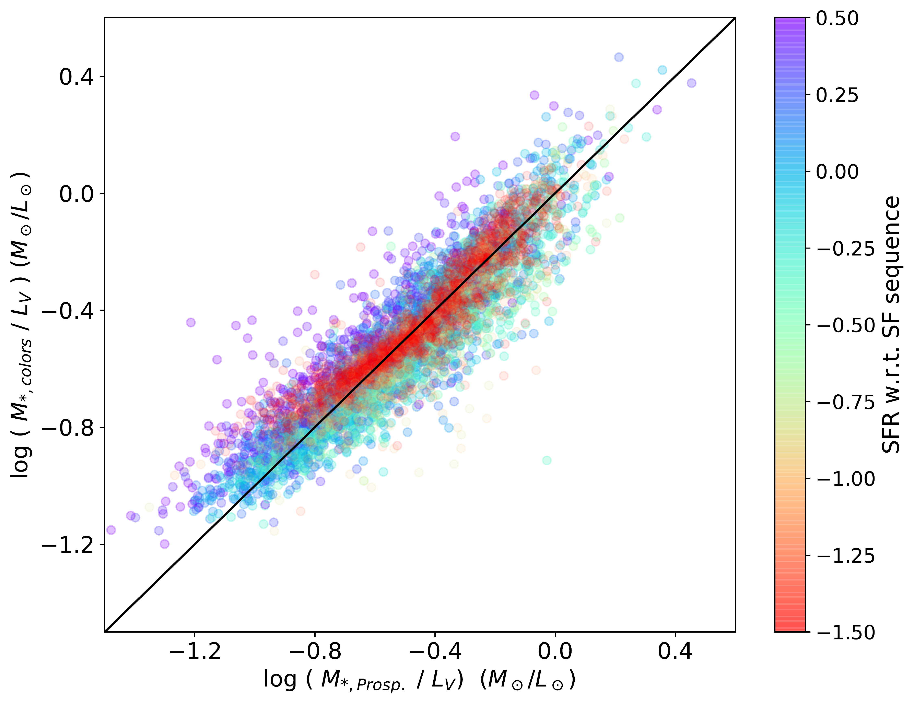

$\newcommand{\ensuremath}{}$
$\newcommand{\xspace}{}$
$\newcommand{\object}[1]{\texttt{#1}}$
$\newcommand{\farcs}{{.}''}$
$\newcommand{\farcm}{{.}'}$
$\newcommand{\arcsec}{''}$
$\newcommand{\arcmin}{'}$
$\newcommand{\ion}[2]{#1#2}$
$\newcommand{\textsc}[1]{\textrm{#1}}$
$\newcommand{\hl}[1]{\textrm{#1}}$
$\newcommand{\footnote}[1]{}$
$\newcommand{\vdag}{(v)^\dagger}$
$\newcommand$
$\newcommand$
$\newcommand{\sigpr}{\sigma'_{\star,\rm{int}}}$
$\newcommand{\sigprsq}{\sigma'^2_{\star,\rm{int}}}$
$\newcommand{\ropt}{R_{0.5\mu\rm{m}}}$
$\newcommand{\rnirtwo}{R_{2.0\mu m}}$
$\newcommand{\rmass}{R_{\rm{M_\star}}}$
$\newcommand{\rmassd}{R_{\rm{M_\star,3D}}}$
$\newcommand{\vsig}{v_{5}/\sigma_{0}}$
$\newcommand{\rnirone}{R_{1.5\mu m}}$
$\newcommand{\thefigure}{\arabic{figure}}$

# Stellar Half-Mass Radii of $0.5<z<2.3$ Galaxies: Comparison with JWST/NIRCam Half-Light Radii

<mark>Appeared on: 2023-07-10</mark> -  _Submitted to ApJ. Comments welcome_

A. v. d. Wel, et al. -- incl., <mark>A. d. Graaff</mark>

**Abstract:** We use CEERS JWST/NIRCam imaging to measure rest-frame near-IR light profiles of $>$ 500 $M_\star>10^{10} M_\odot$ galaxies in the redshift range $0.5<z<2.3$ . We compare the resulting rest-frame 1.5-2 $\mu$ m half-light radii ( $R_{\rm{NIR}}$ ) with stellar half-mass radii ( $\rmass$ ) derived with multi-color light profiles from CANDELS HST imaging. In general agreement with previous work, we find that $R_{\rm{NIR}}$ and $\rmass$ are  up to 40 \% smaller than the rest-frame optical half-light radius $R_{\rm{opt}}$ .The agreement between $R_{\rm{NIR}}$ and $\rmass$ is excellent, with negligible systematic offset ( $<$ 0.03 dex) up to $z=2$ for quiescent galaxies and up to $z=1.5$ for star-forming galaxies. We also deproject the profiles to estimate $\rmassd$ , the radius of a sphere containing 50 \% of the stellar mass.We present the $R-M_\star$ distribution of galaxies at $0.5<z<1.5$ , comparing $R_{\rm{opt}}$ , $\rmass$ and $\rmassd$ .The slope is significantly flatter for $\rmass$ and $\rmassd$ compared to $R_{\rm{opt}}$ , mostly due to downward shifts in size for massive star-forming galaxies, while $\rmass$ and $\rmassd$ do not show markedly different trends.Finally, we show rapid size evolution ( $R\propto (1+z)^{-1.7\pm0.1}$ ) for massive ( $M_\star>10^{11} M_\odot$ ) quiescent galaxies between $z=0.5$ and $z=2.3$ , again comparing $R_{\rm{opt}}$ , $\rmass$ and $\rmassd$ .We conclude that the main tenets of the size evolution narrative established over the past 20 years, based on rest-frame optical light profile analysis, still hold in the era of JWST/NIRCam observations in the rest-frame near-IR.

**Figure 7. -**  Stellar half-mass radius vs. rest-frame optical half-light radius in four redshift bins for quiescent (red) and star-forming (blue) galaxies with total stellar mass $>10^{10} M_\odot$. $\Delta$ is the median offset in dex, with the 16-84\%-ile scatter in parentheses. $\sigma$ is the median formal uncertainty. Offsets in the range $-0.05$ to $-0.17$ show that stellar half-mass radii are generally smaller than the optical radius. The scatter is comparable to the formal uncertainties, which implies that the uncertainties are certainly not underestimated.
 (*fig:rm_ropt*)

**Figure 9. -**  Size-stellar mass distributions for two redshift bins ($0.5<z<1$ at the top; $1<z<1.5$ at the bottom) and three different size proxies: rest-frame optical half-light radius $R_{\rm{opt}}$(_left_; projected stellar half-mass radius $R_{\rm{M_\star,2D}}$(_middle_); deprojected stellar half-mass radius $R_{\rm{M_\star,3D}}$(_bottom_). The solid lines indicate the 16th, 50th and 84th percentiles of the size distribution in 0.2 dex wide bins of $M_\star$(Table \ref{tab:medians}). The dotted lines in the middle and right-hand panels repeat, for reference, the solid lines in the left-hand panels. The color-coding is the star-formation rate relative to the star-forming sequence defined by [Leja, Speagle and Ting (2022)]().
 (*fig:m_r*)

**Figure 2. -**  Comparison of rest-frame $V$-band stellar mass-to-light ratio as inferred from Prospector (x-axis) and our HST color-based proxy (y-axis). Across a 1.5 dex range in $M/L$ the HST color-based $M/L$ estimates agree well with the ground truth as inferred from fits to the full SED. The color-coding is the star-formation rate relative to the star-forming sequence defined by [Leja, Speagle and Ting (2022)]().
 (*fig:ml_ml*)

