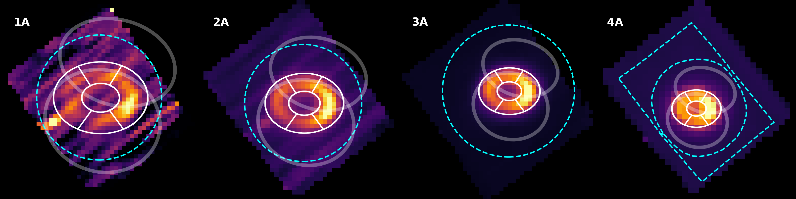
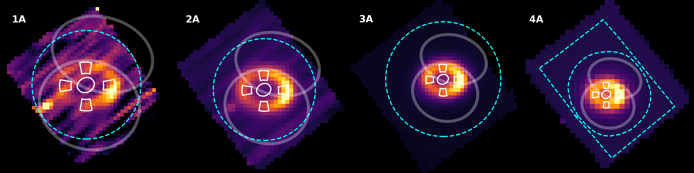
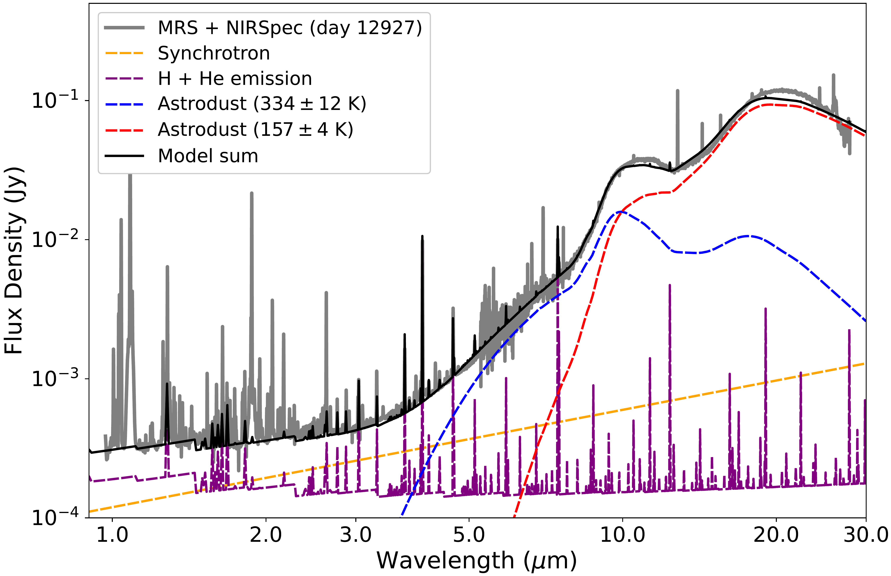
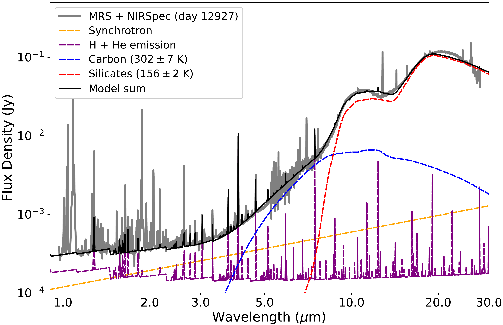
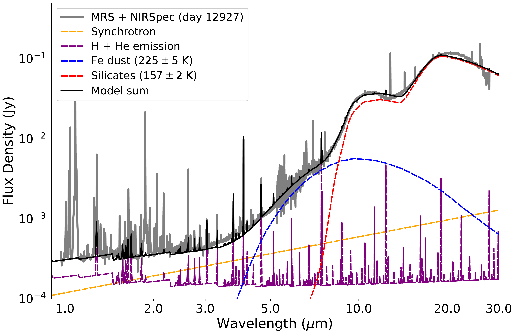
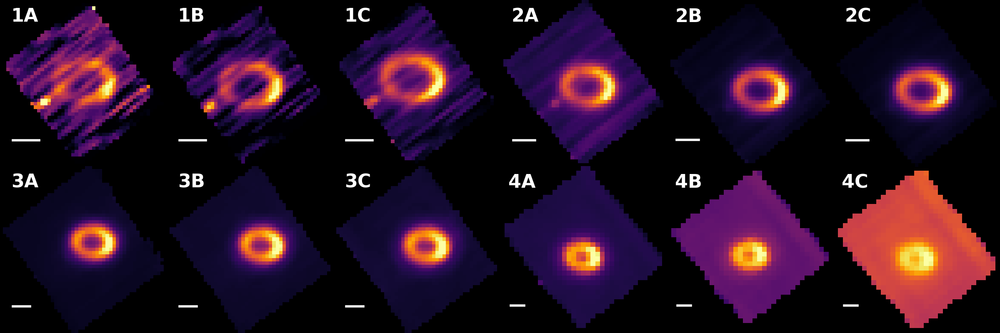

$\newcommand{\ensuremath}{}$
$\newcommand{\xspace}{}$
$\newcommand{\object}[1]{\texttt{#1}}$
$\newcommand{\farcs}{{.}''}$
$\newcommand{\farcm}{{.}'}$
$\newcommand{\arcsec}{''}$
$\newcommand{\arcmin}{'}$
$\newcommand{\ion}[2]{#1#2}$
$\newcommand{\textsc}[1]{\textrm{#1}}$
$\newcommand{\hl}[1]{\textrm{#1}}$
$\newcommand{\footnote}[1]{}$
$\newcommand{\Msun}{ M_\odot  }$
$\newcommand{\dg}{^\circ}$
$\newcommand{\kms}{\rm{km s^{-1}}}$
$\newcommand{\ergcms}{\rm erg~cm^{-2}~s^{-1}}$

# Ejecta, Rings, and Dust in SN 1987A with JWST MIRI/MRS

<mark>Appeared on: 2023-07-14</mark> -  _27 pages, 16 figures, 4 tables. Submitted ApJ_

O. C. Jones, et al. -- incl., <mark>O. Krause</mark>, <mark>M. Güdel</mark>

**Abstract:** Supernova (SN) 1987A is the nearest supernova in $\sim$ 400 years. Using the $* JWST*$ MIRI Medium Resolution Spectrograph, we spatially resolved the ejecta, equatorial ring (ER) and outer rings in the mid-infrared 12,927 days after the explosion.The spectra are rich in line and dust continuum emission, both in the ejecta and the ring.Broad emission lines (280-380 km s $^{-1}$ FWHM) seen from all singly-ionized species originate from the expanding ER, with properties consistent with dense post-shock cooling gas.Narrower emission lines (100-170 km s $^{-1}$ FWHM) are seen from species originating from a more extended lower-density component whose high ionization may have been produced by shocks progressing through the ER, or by the UV radiation pulse associated with the original supernova event.The asymmetric east-west dust emission in the ER has continued to fade, with constant temperature, signifying a reduction in dust mass. Small grains in the ER are preferentially destroyed, with larger grains from the progenitor surviving the transition from SN into SNR.The ER is fit with a single set of optical constants, eliminating the need for a secondary featureless hot dust component.We find several broad ejecta emission lines from [ Ne ${\sc ii}$ ] , [ Ar ${\sc ii}$ ] , [ Fe ${\sc ii}$ ] , and [ Ni ${\sc ii}$ ] . With the exception of [ Fe ${\sc ii}$ ] 25.99 $\mu$ m, these all originate from the ejecta close to the ring and are likely being excited by X-rays from the interaction. The [ Fe ${\sc ii}$ ] 5.34 $\mu$ m to 25.99 $\mu$ m line ratio indicates a temperature of only a few hundred K in the inner core, consistent with being powered by $ ^{44}$ Ti decay.

**Figure 4. -** Top row: The spectra extraction regions for the ER spectra plotted on band A in each channel. The total ER spectrum was extracted from the white elliptical annulus, with the east and west ER extracted from the segments on the left and right. Bottom row: Same as top but for the cardinal point and ejecta spectra. In both rows, the location of the outer rings is shown by the two faded ellipses, the channels 1--3 background inner boundaries are shown by the dashed cyan circles, and the channel 4 background region is shown by the dashed cyan polygon. The `entire' SN 1987A system spectrum was extracted from a region slightly smaller than the inner boundary of the background regions and excluding Star 3. North is up, east is left. (*Fig:spec_extraction_Regions*)

**Figure 11. -** Fits to the MRS and NIRspec data using the two-temperature dust compositions of _astrodust_ ([Hensley and Draine 2023]())  in the top panel, carbon and silicates  ([Draine and Lee 1984]())  in the middle panel, and silicates  ([Draine and Lee 1984]())  and iron dust in the bottom panel. The synchrotron emission (orange line) has been extrapolated from ALMA observations based on the models described in [Cendes, Gaensler and Ng (2018)]() and [Cigan, Matsuura and Gomez (2019)]()(see text for details). The emission from the H and He continuum and lines (purple line) is described in [Larsson, Fransson and Sargent (2023)]().  The best-fit parameters for the dust components are summarized in Table \ref{Table:dusttab}. (*Fig:astrodust_fit*)

**Figure 3. -** Sample slices from our 12 MRS sub-band cubes, with the band labels shown in the top-left. The white lines in each pane represent 1.0 arcsec to highlight the increasing size of the FOV, as well as the decreasing spatial resolution from channels 1 to 4. `Star 3' is visible to the lower left of the ER in bands 1A--2A. North is up, east is left. (*Fig:cube_det_feat*)

