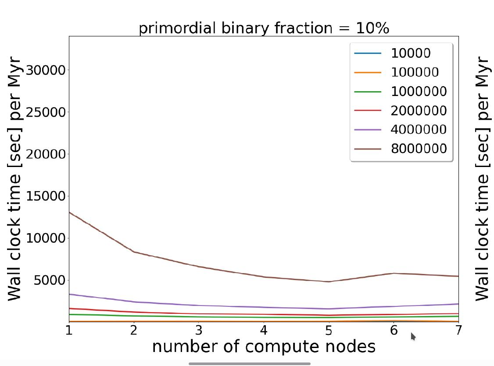
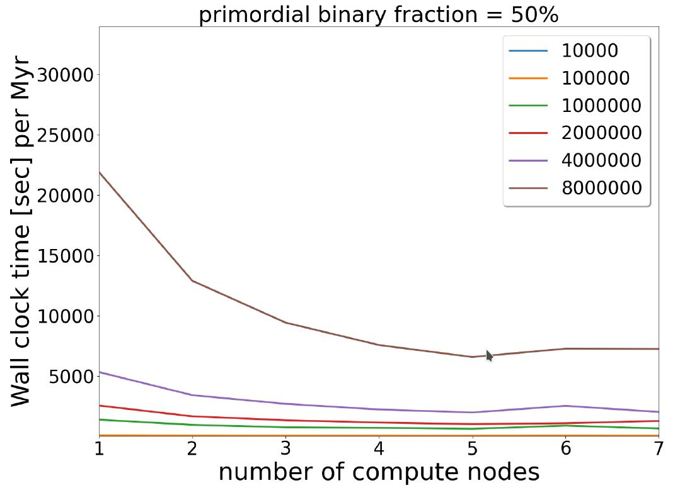
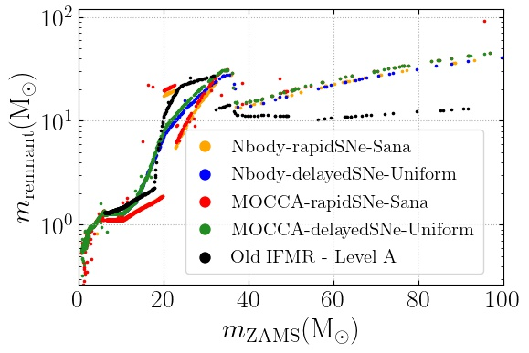
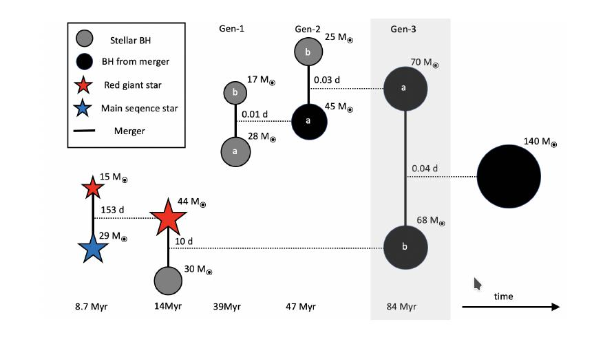

$\newcommand{\ensuremath}{}$
$\newcommand{\xspace}{}$
$\newcommand{\object}[1]{\texttt{#1}}$
$\newcommand{\farcs}{{.}''}$
$\newcommand{\farcm}{{.}'}$
$\newcommand{\arcsec}{''}$
$\newcommand{\arcmin}{'}$
$\newcommand{\ion}[2]{#1#2}$
$\newcommand{\textsc}[1]{\textrm{#1}}$
$\newcommand{\hl}[1]{\textrm{#1}}$
$\newcommand{\footnote}[1]{}$
$\newcommand{\msol}{{\rm M}_\odot}$
$\newcommand{\zsol}{{\rm Z}_\odot}$
$\newcommand{\ltsima}{\; \buildrel < \over \sim \;}$
$\newcommand{\simlt}{\lower.5ex\hbox{\ltsima}}$
$\newcommand{\gtsima}{\; \buildrel > \over \sim \;}$
$\newcommand{\simgt}{\lower.5ex\hbox{\gtsima}}$

# Growth of Seed Black Holes in Galactic Nuclei

<mark>Appeared on: 2023-07-18</mark> -  _Article in Proceedings of NIC Symposium 2022, 14 pages, 5 figures_

R. Spurzem, et al. -- incl., <mark>A. Kamlah</mark>

**Abstract:** The evolution of dense star clusters is followed by direct high-accuracy N-body simulation. The problem is to first order a gravitational N-body problem, but stars evolve due to astrophysics and the more massive ones form black holes or neutron stars as compact remnants at the end of their life. After including updates of stellar evolution of massive stars and for the relativistic treatment of black hole binaries we find the growth of intermediate mass black holes and we show that in star clusters binary black hole mergers in the so-called pair creation supernova (PSN) gap occur easily. Such black hole mergers have been recently observed by the LIGO-Virgo-KAGRA (LVK) collaboration, a network of ground based gravitational wave detectors. 

**Figure 5. -** 
Strong scaling of the novel PeTar code, showing wall clock times obtained on the Juwels-Booster as a function of number of compute nodes.
 (*petar-benchmark*)

**Figure 1. -** 
 Initial-Final mass relation (IFMR) for the escaping compact objects of the MOCCA and Nbody6++GPU (Nbody) simulations. The keys refer to the Nbody-delayedSNe-Uniform, Nbody-rapidSNe-Sana, MOCCA-delayedSNe-Uniform, and MOCCA-rapidSNe-Sana simulations, respectively. They differ by the use of the code (Nbody or MOCCA), and the remnant mass prescription for the stellar mass black holes up to approximately the pair-instability mass gap (see Fryer et al. 2012). The black points show BH masses from another $N$-body simulation with Level A parameters\cite{Belczynski2002}(Plot taken from \citen{Kamlah2022}).
 (*ifmr-mocca-nbody*)

**Figure 2. -** 
Visualization of the formation path towards a ”mass gap” merger (grey region, third generation) of two black holes with mass $70$\msol$$ and $68$\msol$$ developed in one of our N-body simulations. The more massive BH (third generation) grew by two preceding mergers involving black holes (first and second generation). The lower mass BH (third generation) was created in a stellar merger of a red giant with a main sequence star followed by the collision with a stellar mass BH. The masses of the components (in solar masses) and the orbital periods (in days) are indicated at the respective times of the merger (black horizontal lines) after the start of the simulation (Figure from \citen{ArcaSedda2021}).
 (*mass-gap-merger*)

