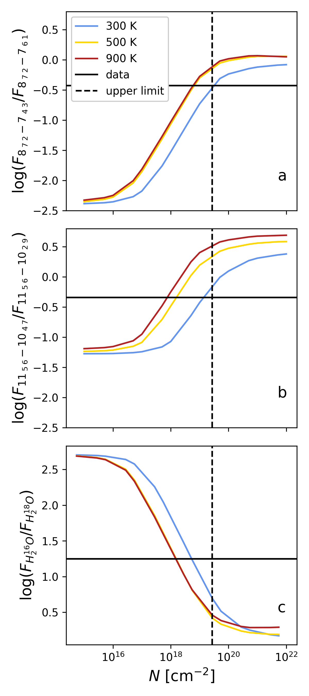
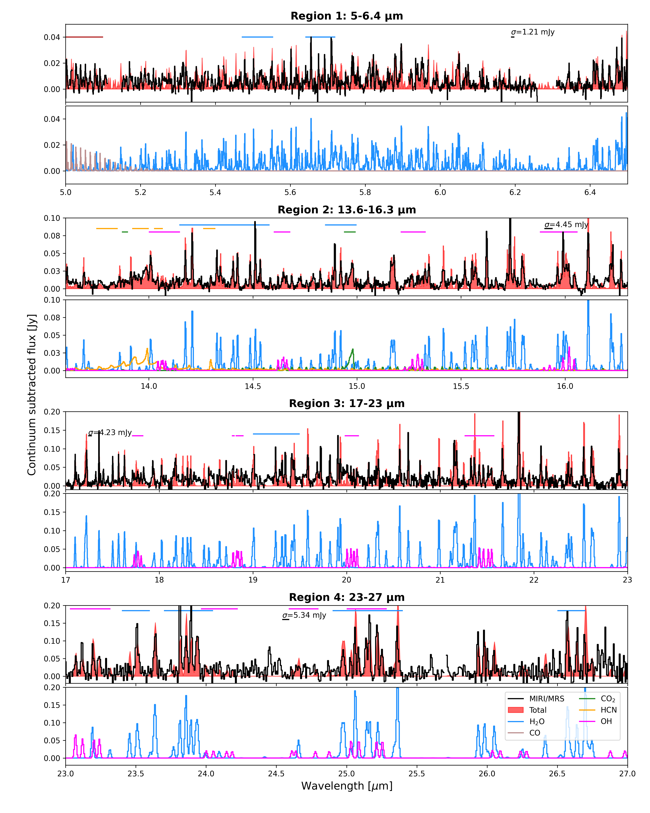
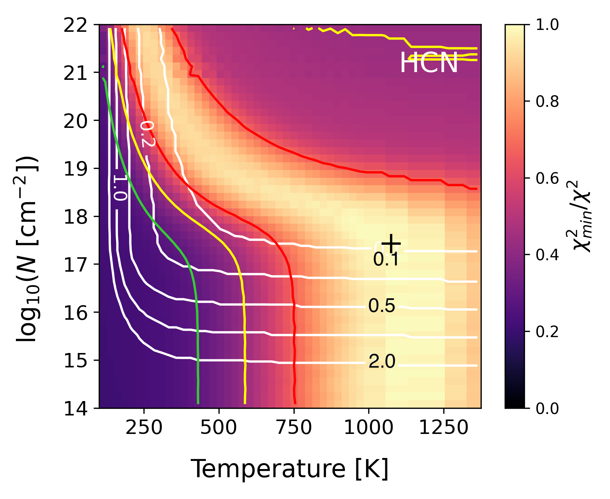
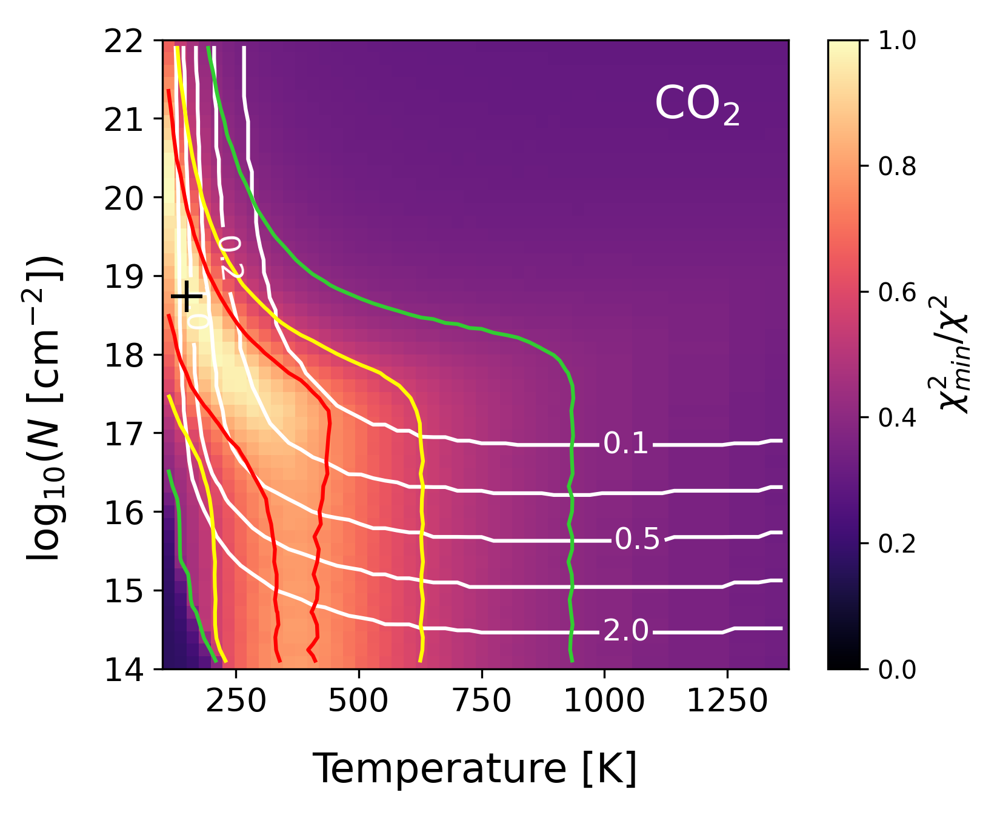
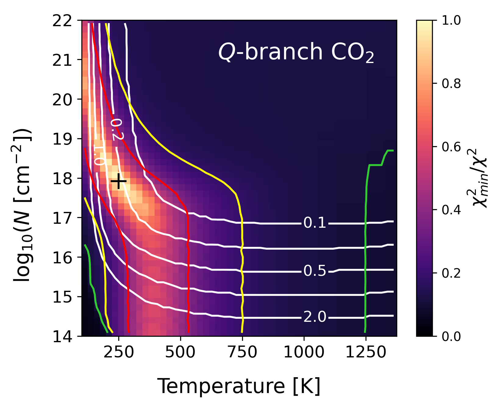

$\newcommand{\ensuremath}{}$
$\newcommand{\xspace}{}$
$\newcommand{\object}[1]{\texttt{#1}}$
$\newcommand{\farcs}{{.}''}$
$\newcommand{\farcm}{{.}'}$
$\newcommand{\arcsec}{''}$
$\newcommand{\arcmin}{'}$
$\newcommand{\ion}[2]{#1#2}$
$\newcommand{\textsc}[1]{\textrm{#1}}$
$\newcommand{\hl}[1]{\textrm{#1}}$
$\newcommand{\footnote}[1]{}$
$\newcommand{\arraystretch}{1.2}$

# MINDS. Abundant water and varying C/O across the disk of Sz 98 as seen by JWST/MIRI

<mark>Appeared on: 2023-07-19</mark> -  _Submitted to A&A on May 25 2023. 18 pages, 11 figures_

D. Gasman, et al. -- incl., <mark>M. Güdel</mark>, <mark>G. Perotti</mark>, <mark>M. Samland</mark>, <mark>J. Bouwman</mark>, <mark>S. Scheithauer</mark>, <mark>J. Schreiber</mark>, <mark>K. Schwarz</mark>

**Abstract:** The Mid-InfraRed Instrument (MIRI) Medium Resolution Spectrometer (MRS) on board the _James Webb_ Space Telescope ( _JWST_ ) allows us to probe the inner regions of protoplanetary disks, where the elevated temperatures result in an active chemistry and where the gas composition may dictate the composition of planets forming in this region. The disk around the classical T Tauri star Sz 98, which has an unusually large dust disk in the millimetre with a compact core, was observed with the MRS, and we examine its spectrum here. We aim to explain the observations and put the disk of Sz 98 in context with other disks, with a focus on the $\ce{H2O}$ emission through both its ro-vibrational and pure rotational emission. Furthermore, we compare our chemical findings with those obtained for the outer disk from Atacama Large Millimeter/submillimeter Array (ALMA) observations. In order to model the molecular features in the spectrum, the continuum was subtracted and local thermodynamic equilibrium (LTE) slab models were fitted. The spectrum was divided into different wavelength regions corresponding to $\ce{H2O}$ lines of different excitation conditions, and the slab model fits were performed individually per region. We confidently detect $\ce{CO}$ , $\ce{H2O}$ , $\ce{OH}$ , $\ce{CO2}$ , and $\ce{HCN}$ in the emitting layers. Despite the plethora of $\ce{H2O}$ -lines, the isotopologue H $_\text{2}^{\text{18}}$ O is not detected. Additionally, no other organics, including $\ce{C2H2}$ , are detected. This indicates that the C/O ratio could be substantially below unity, in contrast with the outer disk. The $\ce{H2O}$ emission traces a large radial disk surface region, as evidenced by the gradually changing excitation temperatures and emitting radii. Additionally, the $\ce{OH}$ and $\ce{CO2}$ emission are relatively weak. It is likely that $\ce{H2O}$ is not significantly photodissociated; either due to self-shielding against the stellar irradiation, or UV-shielding from small dust particles. While $\ce{H2O}$ is prominent and $\ce{OH}$ relatively weak, the line fluxes in the inner disk of Sz 98 are not outliers compared to other disks. The relative emitting strength of the different identified molecular features point towards UV-shielding of $\ce{H2O}$ in the inner disk of Sz 98, with a thin layer of $\ce{OH}$ on top. The majority of the organic molecules are either hidden below the dust continuum, or not present. In general, the inferred composition points to a sub-solar C/O ratio ( $<$ 0.5) in the inner disk, in contrast with the larger than unity C/O ratio in the gas in the outer disk found with ALMA.

**Figure 2. -** Flux ratios of H$_\text{2}^{\text{16}}$O lines of the same upper level in the data compared to slab models (top); and H$_\text{2}^{\text{16}}$O/H$_\text{2}^{\text{18}}$O ratio in the data and slab models (bottom). The properties of the transitions can be found in Table \ref{tab:opacity}. The dotted black vertical line indicates the upper limit of the column density based on the $1\sigma$ level of the spectrum and the non-detection of the H$_\text{2}^{\text{18}}$O line. The column densities on the bottom panel are multiplied by 550 to show the H$_\text{2}^{\text{16}}$O column density. (*fig:water_opacity*)

**Figure 6. -** Slab fits for the four different wavelength ranges. The top and bottom panels per region are the data and total model, and the individual slab models; respectively. Spurious spikes and features from the data reduction have been blanked out (see the list in App. \ref{app:blank}). The horizontal lines indicate the regions used to fit the molecules, or the region where $\sigma$ is estimated after subtracting the slab models. (*fig:spec_ranges*)

**Figure 10. -** $\chi^2$ plots of \ce{HCN} and \ce{CO2} detected in region 2. The red, yellow, and green lines indicate the $1\sigma$, $2\sigma$, and $3\sigma$ confidence contours, respectively. The white contours show the emitting radii in astronomical units (0.1 to 2.0 au). The black cross corresponds to the best fit. The bottom plot shows the map for \ce{CO2} when fitting the $Q$-branch only. (*fig:chi2_region2*)

