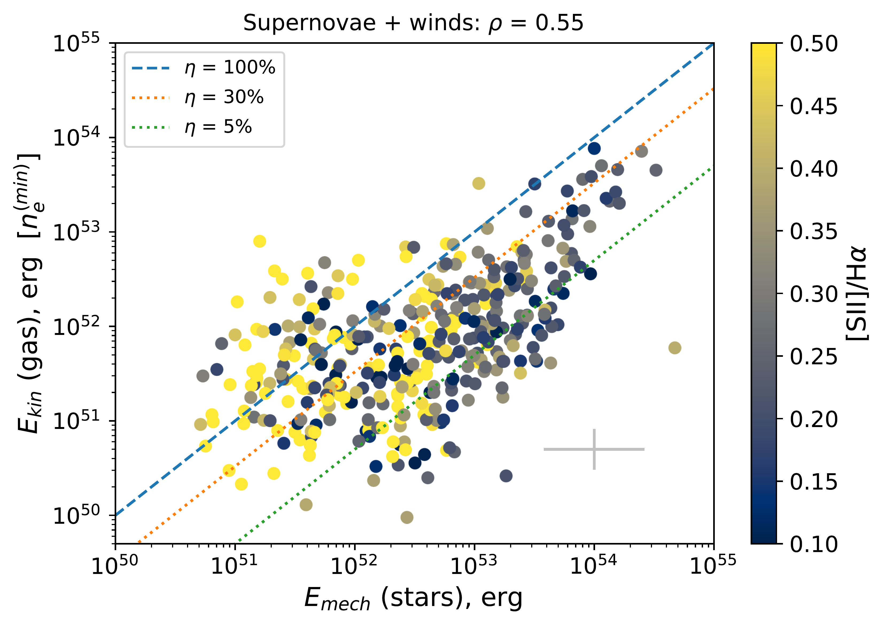
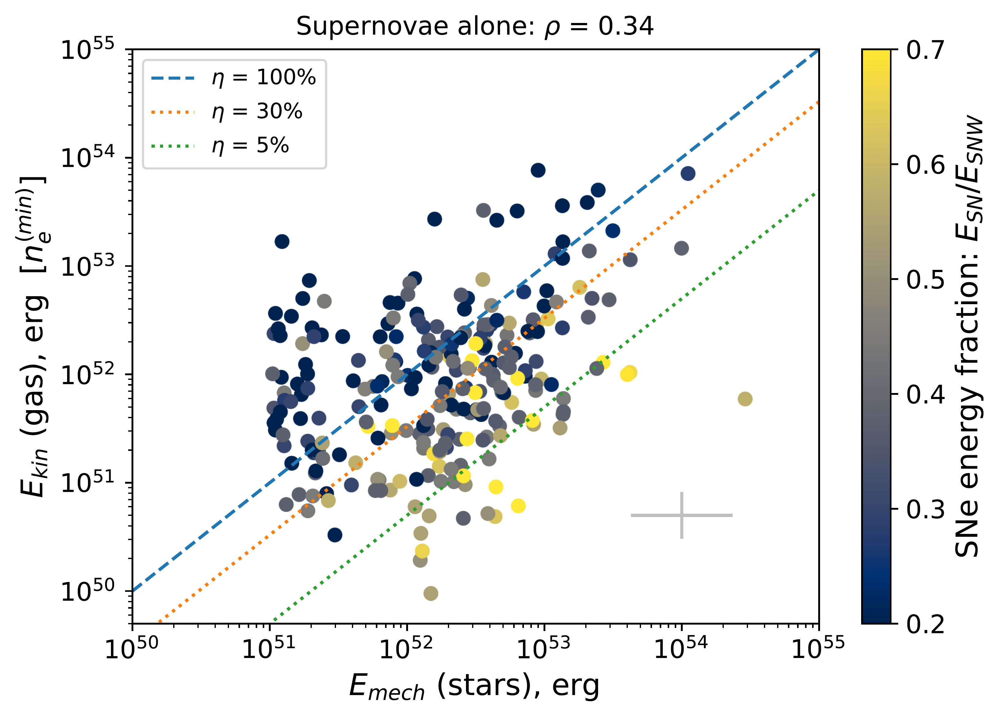
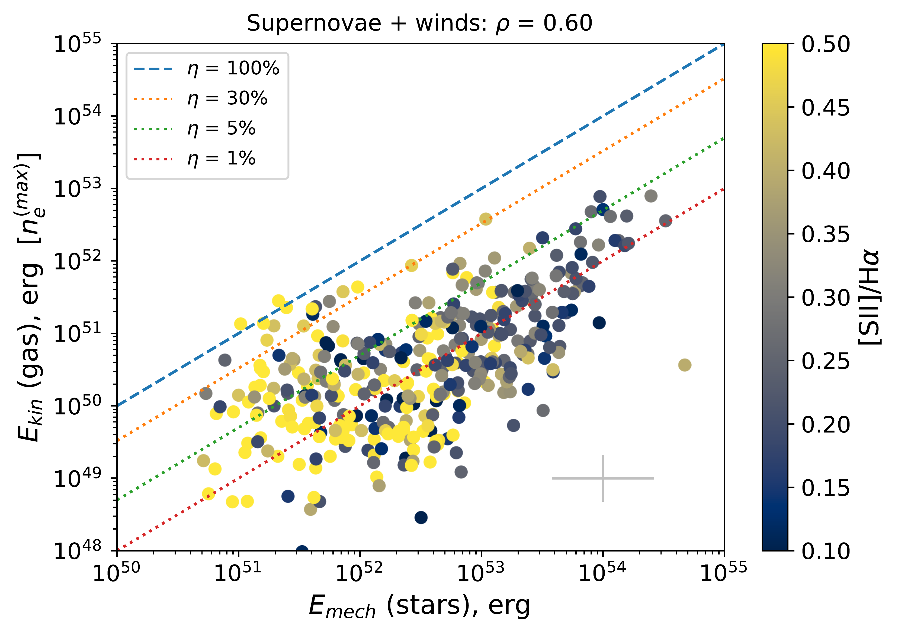
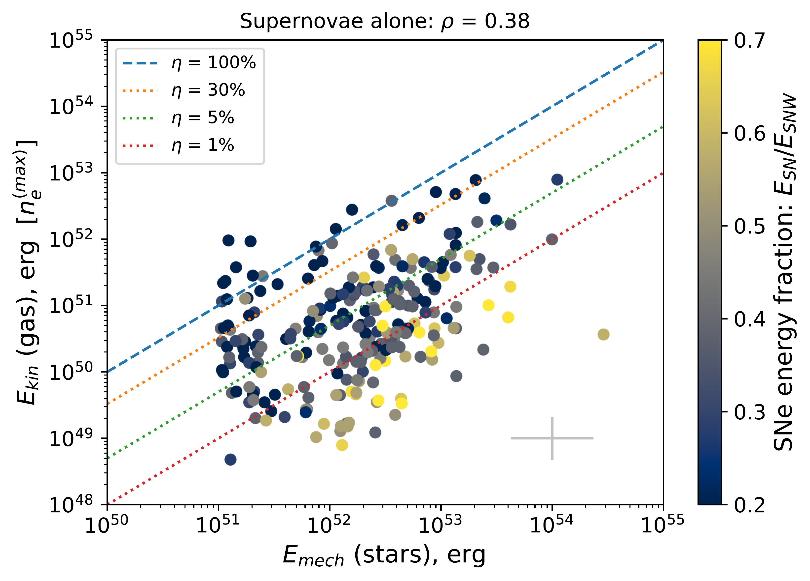
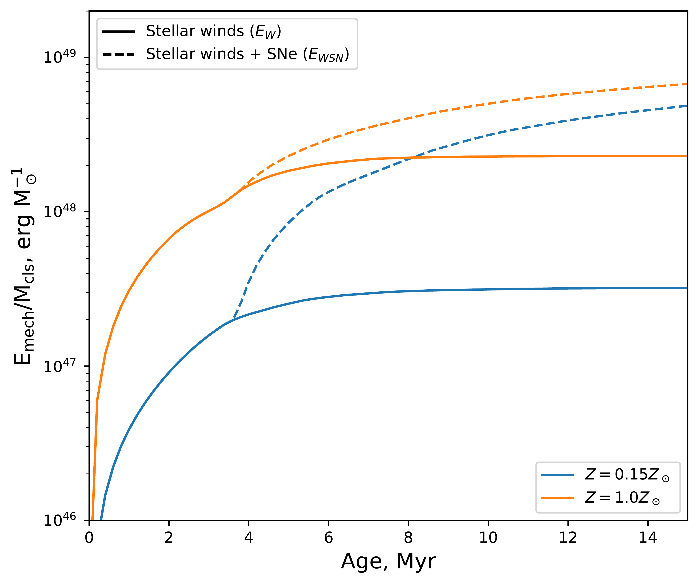

$\newcommand{\ensuremath}{}$
$\newcommand{\xspace}{}$
$\newcommand{\object}[1]{\texttt{#1}}$
$\newcommand{\farcs}{{.}''}$
$\newcommand{\farcm}{{.}'}$
$\newcommand{\arcsec}{''}$
$\newcommand{\arcmin}{'}$
$\newcommand{\ion}[2]{#1#2}$
$\newcommand{\textsc}[1]{\textrm{#1}}$
$\newcommand{\hl}[1]{\textrm{#1}}$
$\newcommand{\footnote}[1]{}$
$\newcommand{\SII}{[S~{\sc ii}]}$
$\newcommand{\OIII}{[O~{\sc iii}]}$
$\newcommand{\NII}{[N~{\sc ii}]}$
$\newcommand{\HII}{H~{\sc ii}}$
$\newcommand{\HeII}{He~{\sc ii}}$
$\newcommand{\HI}{H~{\sc i}}$
$\newcommand{\Ha}{H\alpha}$
$\newcommand{\Hb}{H\beta}$
$\newcommand{\kms}{ \mbox{km} \mbox{s}^{-1}}$
$\newcommand{\ergs}{ \mbox{erg} \mbox{s}^{-1}}$
$\newcommand{\HST}{\textit{HST}}$
$\newcommand{\SIIHa}{[S~{\sc ii}]/H\alpha}$
$\newcommand{\NIIHa}{[N~{\sc ii}]/H\alpha}$
$\newcommand{\OIIIHb}{[O~{\sc iii}]/H\beta}$
$\newcommand{\IS}{I - \sigma}$
$\newcommand{\SBDIG}{\mathrm{\Sigma(H\alpha)_{DIG}}}$
$\newcommand{\sigmaHa}{\sigma(H\alpha)}$
$\newcommand{\nregs}{1484}$
$\newcommand{\nregsnohst}{188}$
$\newcommand{\nsnr}{572}$
$\newcommand{\nregsnooldcls}{364}$
$\newcommand{\nregshaveyoungcls}{264}$
$\newcommand{\nshells}{171}$
$\newcommand{\nabmig}{741}$
$\newcommand{\ncentralpeak}{572}$
$\newcommand{\nregswithcls}{511}$
$\newcommand{\be}{\begin{equation}}$
$\newcommand{\ee}{\end{equation}}$
$\newcommand{\red}{\textcolor{red}}$
$\newcommand{\green}{\textcolor{green}}$
$\begin{document}$
$   \title{Quantifying the energy balance between the turbulent ionised gas and young stars}$
$   \author{Oleg~V.~Egorov$
$          \inst{1}\fnmsep\thanks{\email{oleg.egorov@uni-heidelberg.de}}$
$          \and$
$          Kathryn Kreckel\inst{1}$
$          \and Simon~C.~O.~Glover\inst{2}$
$          \and Brent Groves\inst{3}$
$          \and$
$          Francesco Belfiore\inst{4}$
$          \and$
$          Eric Emsellem\inst{5,6}$
$          \and$
$          Ralf~S.~Klessen\inst{2,7}$
$          \and$
$          Adam K. Leroy\inst{8,9}$
$          \and$
$          Sharon E. Meidt\inst{10}$
$          \and$
$          Sumit K. Sarbadhicary\inst{8,9}$
$          \and$
$          Eva Schinnerer\inst{11}$
$          \and$
$          Elizabeth J. Watkins\inst{1}$
$          \and$
$          Brad C. Whitmore\inst{12}$
$          \and$
$          Ashley T. Barnes\inst{5,13}$
$          \and$
$          Enrico Congiu\inst{14}$
$          \and$
$          Daniel~A.~Dale\inst{15}$
$          \and$
$          Kathryn Grasha\inst{16}\thanks{ARC DECRA Fellow}$
$          \and$
$          Kirsten L. Larson\inst{17}$
$          \and$
$          Janice C. Lee\inst{18,19}$
$          \and$
$          J. Eduardo Méndez-Delgado\inst{1}$
$          \and$
$          David A. Thilker\inst{20}$
$          \and$
$          Thomas G. Williams\inst{21}$
$          }$
$   \institute{Astronomisches Rechen-Institut, Zentrum für Astronomie der Universität Heidelberg, Mönchhofstr. 12-14, D-69120 Heidelberg, Germany$
$   \and$
$   Institüt  für Theoretische Astrophysik, Zentrum für Astronomie der Universität Heidelberg, Albert-Ueberle-Strasse 2, 69120 Heidelberg, Germany$
$   \and$
$   International Centre for Radio Astronomy Research, University of Western Australia, 7 Fairway, Crawley, 6009 WA, Australia$
$   \and$
$   INAF -- Osservatorio Astrofisico di Arcetri, Largo E. Fermi 5, I-50157 Firenze, Italy$
$   \and$
$   European Southern Observatory, Karl-Schwarzschild Stra{\ss}e 2, D-85748 Garching bei München, Germany$
$   \and$
$    Univ Lyon, Univ Lyon1, ENS de Lyon, CNRS, Centre de Recherche Astrophysique de Lyon UMR5574, F-69230 Saint-Genis-Laval France$
$    \and$
$     Interdisziplinäres Zentrum für Wissenschaftliches Rechnen der Universität Heidelberg, Im Neuenheimer Feld 205, D-69120 Heidelberg, Germany$
$     \and$
$   Department of Astronomy, The Ohio State University, 140 West 18th Avenue, Columbus, Ohio 43210, USA$
$    \and$
$    Center for Cosmology and Astroparticle Physics, 191 West Woodruff Avenue, Columbus, OH 43210, USA$
$    \and$
$    Sterrenkundig Observatorium, Universiteit Gent, Krijgslaan 281 S9, B-9000 Gent, Belgium$
$    \and$
$    Max-Planck-Institut für Astronomie, Königstuhl 17, D-69117, Heidelberg, Germany$
$    \and$
$    Space Telescope Science Institute, 3700 San Martin Drive, Baltimore, MD, 21218, USA$
$    \and$
$    Argelander-Institut für Astronomie, Universität Bonn, Auf dem Hügel 71, 53121 Bonn, Germany$
$    \and$
$    European Southern Observatory (ESO), Alonso de Córdova 3107, Casilla 19, Santiago 19001, Chile$
$    \and$
$    Department of Physics \& Astronomy, University of Wyoming, Laramie, WY 82071, USA$
$    \and$
$    Research School of Astronomy and Astrophysics, Australian National University, Canberra, ACT 2611, Australia$
$    \and$
$    AURA for the European Space Agency (ESA), Space Telescope Science Institute, 3700 San Martin Drive, Baltimore, MD 21218, USA$
$    \and$
$    Gemini Observatory/NSF’s NOIRLab, 950 N. Cherry Avenue, Tucson, AZ, USA$
$        \and$
$    Steward Observatory, University of Arizona, 933 N Cherry Ave, Tucson, AZ 85721, USA$
$    \and$
$    Department of Physics \& Astronomy, Bloomberg Center for Physics and Astronomy, Johns Hopkins University, 3400 N. Charles Street, Baltimore, MD 21218$
$    \and$
$    Sub-department of Astrophysics, Department of Physics, University of Oxford, Keble Road, Oxford OX1 3RH, UK$
$             }$
$   \date{Received ????? ??, 2023; accepted ????? ??, ????}$
$  \abstract{Stellar feedback is a key contributor to$
$   the morphology and dynamics of the interstellar medium in star-forming galaxies. In particular, energy and momentum input from massive stars can drive the turbulent motions in the gas, but the dominance and efficiency of this process are unclear. The study of ionised superbubbles enables quantitative constraints to be placed on the energetics of stellar feedback.}{We directly compare the kinetic energy of$
$   expanding superbubbles and the turbulent motions in the interstellar medium with the mechanical energy deposited by massive stars in the form of winds and supernovae. With such a comparison we aim to answer whether the stellar feedback is responsible for$
$   the observed turbulent motions and to quantify the fraction of mechanical energy retained in the superbubbles.}{We investigate the ionised gas morphology, excitation properties, and kinematics in 19 nearby star-forming galaxies from the PHANGS-MUSE survey. Based on the distribution of the flux and velocity dispersion in the \Ha line, we select \nregs regions of locally elevated velocity dispersion (\sigmaHa>45\kms), including at least \nshells expanding superbubbles. We analyse these regions and relate their properties to those of the young stellar associations and star clusters identified in PHANGS-HST data.}{We find a good correlation between the kinetic energy of the ionised gas and the total mechanical energy input from supernovae and stellar winds from the stellar associations. At the same time, the contribution of mechanical energy injected by the supernovae alone is not sufficient to explain the measured kinetic energy of the ionised gas, which implies that pre-supernova feedback in the form of radiation/thermal pressure and winds is necessary. We find that the gas kinetic energy decreases with metallicity for our sample covering Z=0.5-1.0   Z_\odot, reflecting the lower impact of stellar feedback. For the sample of superbubbles, we find that about 40\% of the young stellar associations are preferentially located in their rims.$
$   We also find a slightly higher (by \sim 15\%) fraction of the youngest (1--2.5~Myr) stellar associations in the rims of the superbubbles than in the centres, and the opposite trend for older associations, which implies possible propagation or triggering of star formation.}{Stellar feedback is the dominant source for powering the ionised gas in regions of locally (on 50--500~pc scale) elevated velocity dispersion, with a typical efficiency of 10-20\%. Accounting for pre-supernovae feedback is required to set up the energy balance between gas and stars. }$
$   \keywords{Galaxies: ISM --$
$                ISM: kinematics and dynamics --$
$                ISM: bubbles -- Galaxies: star formation$
$               }$
$   \maketitle$
$\n\end{document}\end{equation}}$
$\newcommand{\ee}{\end{equation}}$
$\newcommand{\red}{\textcolor{red}}$
$\newcommand{\green}{\textcolor{green}}$

# Quantifying the energy balance between the turbulent ionised gas and young stars

<mark>Appeared on: 2023-07-21</mark> -  _31 pages (including 5 pages in appendix), 19 figures, the abstract is abridged; submitted to A&A (in mid May; awaiting report)_

O. V. Egorov, et al. -- incl., <mark>K. Kreckel</mark>, <mark>E. Schinnerer</mark>

**Abstract:** Stellar feedback is a key contributor to   the morphology and dynamics of the interstellar medium in star-forming galaxies. In particular, energy and momentum input from massive stars can drive the turbulent motions in the gas, but the dominance and efficiency of this process are unclear. The study of ionised superbubbles enables quantitative constraints to be placed on the energetics of stellar feedback. We directly compare the kinetic energy of   expanding superbubbles and the turbulent motions in the interstellar medium with the mechanical energy deposited by massive stars in the form of winds and supernovae. With such a comparison we aim to answer whether the stellar feedback is responsible for   the observed turbulent motions and to quantify the fraction of mechanical energy retained in the superbubbles. We investigate the ionised gas morphology, excitation properties, and kinematics in 19 nearby star-forming galaxies from the PHANGS-MUSE survey. Based on the distribution of the flux and velocity dispersion in the $\Ha$ line, we select $\nregs$ regions of locally elevated velocity dispersion ( $\sigmaHa$ $>45\kms$ ), including at least $\nshells$ expanding superbubbles. We analyse these regions and relate their properties to those of the young stellar associations and star clusters identified in PHANGS-HST data. We find a good correlation between the kinetic energy of the ionised gas and the total mechanical energy input from supernovae and stellar winds from the stellar associations. At the same time, the contribution of mechanical energy injected by the supernovae alone is not sufficient to explain the measured kinetic energy of the ionised gas, which implies that pre-supernova feedback in the form of radiation/thermal pressure and winds is necessary. We find that the gas kinetic energy decreases with metallicity for our sample covering $Z=0.5-1.0   Z_\odot$ , reflecting the lower impact of stellar feedback. For the sample of superbubbles, we find that about 40 \% of the young stellar associations are preferentially located in their rims.   We also find a slightly higher (by $\sim 15$ \% ) fraction of the youngest (1--2.5 Myr) stellar associations in the rims of the superbubbles than in the centres, and the opposite trend for older associations, which implies possible propagation or triggering of star formation. Stellar feedback is the dominant source for powering the ionised gas in regions of locally (on 50--500 pc scale) elevated velocity dispersion, with a typical efficiency of $10-20$ \% . Accounting for pre-supernovae feedback is required to set up the energy balance between gas and stars.

**Figure 9. -** Localization of the regions of locally elevated $\Ha$ velocity dispersion (cyan ellipses) in NGC 4254 galaxy identified based on the `intensity -- velocity dispersion' ($\IS$) diagnostics overlaid on the $\Ha$ surface brightness map (left panel) and the classification map (central panel; see text). The $\IS$ diagram is shown on right panel. The black solid line shows the mean value of $\sigmaHa$ in the galaxy, and dashed grey lines show its 1$\sigma$ uncertainty.
    See Fig \ref{fig:isigma_all} for the rest of the PHANGS-MUSE galaxies. (*fig:isigma*)

**Figure 18. -** Dependence of the kinetic energy of ionised gas $E_{kin}$ in the regions of locally elevated velocity dispersion on the total mechanical energy input from the stellar associations in the form of supernovae and stellar winds (left panels), and supernovae only (right panels). Top and bottom panels correspond to the $n_e^{(min)}$ and $n_e^{(max)}$ density measurements (thus representing upper and lower limits of $E_{kin}$, respectively). Median value of logarithmic errors is shown in bottom-right corner of each panel. All regions with errors 2 times larger than presented are excluded from the plots. Colour encodes the $\SII$Ha lines ratio tracing the dominant gas excitation mechanism ($\SII$Ha$>0.4$ is likely produced by shocks; left panels), or the relative contribution of the SNe to the total mechanical energy input according to the starburst99 models for the corresponding mass and age of each cluster. Blue, orange, green and red lines correspond to mechanical stellar feedback energy efficiency $\eta = 100, 30, 5, 1$\%, respectively. Spearman correlation coefficient $\rho$ is given above the plots. (*fig:energies*)

**Figure 3. -** Evolution of the cumulative mechanical energy input to the ISM ($E_{\rm mech}$) normalized by the mass of star cluster ($M_{\rm cls}$)  for different metallicity (traced by different colours) according to starburst99 ([Leitherer, Schaerer and Goldader 1999](), [Leitherer, Ekström and Meynet 2014]())  models. The contribution produced by stellar winds alone is shown by the solid line, while the dashed line corresponds to the impact of both stellar winds and supernovae. (*fig:sb99*)

