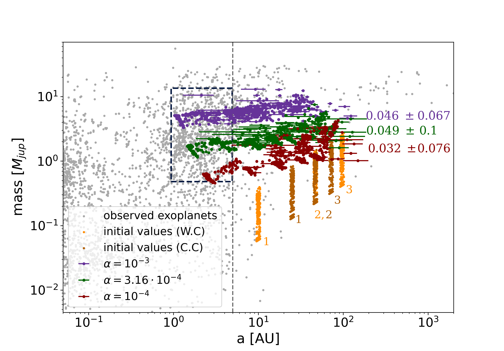
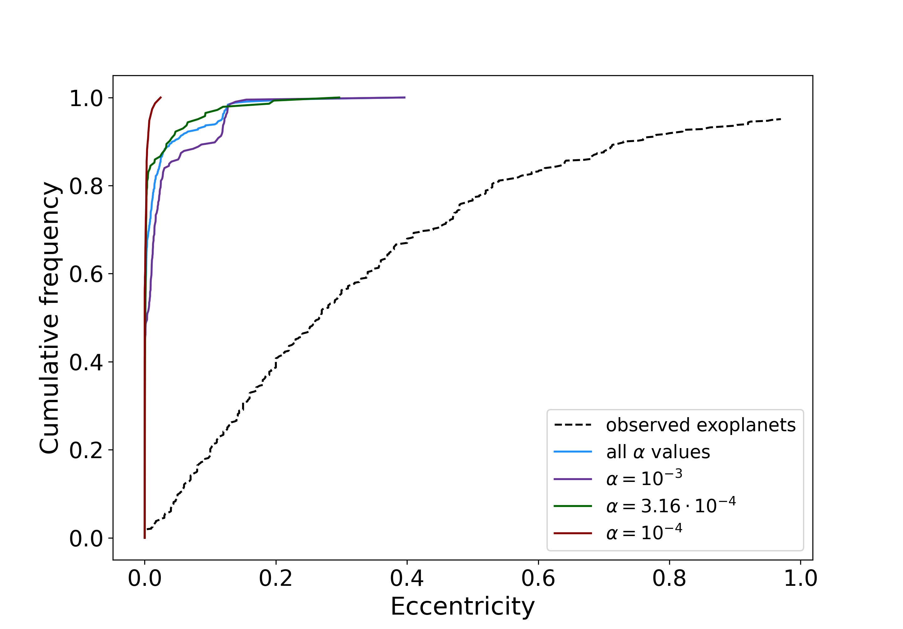
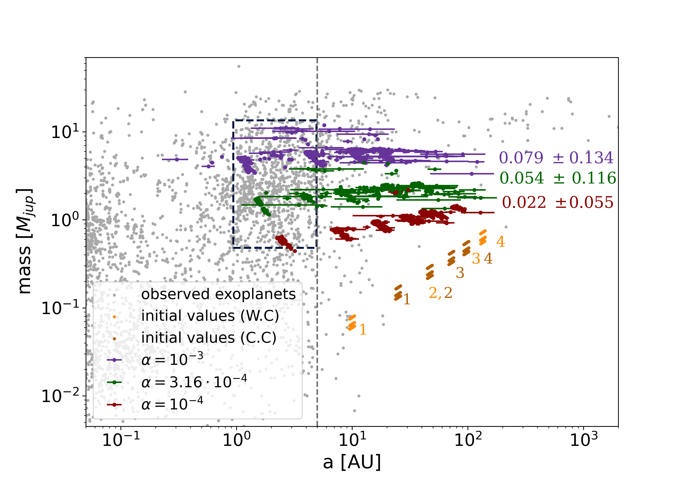
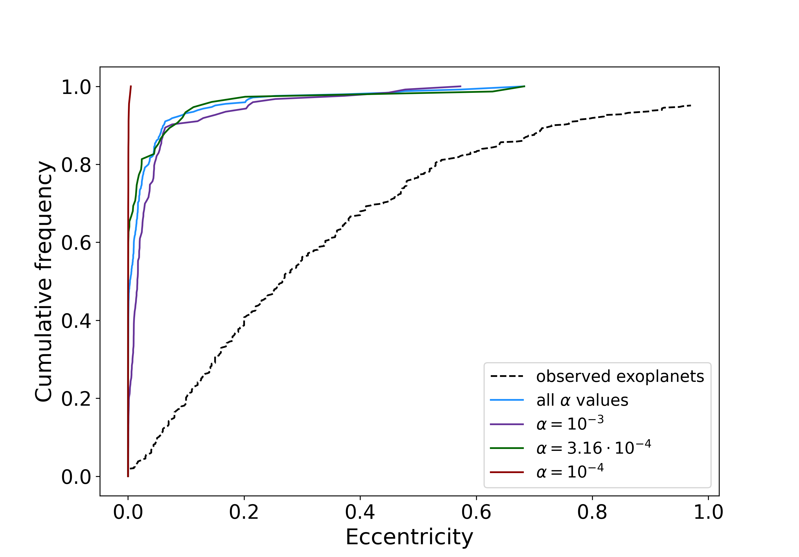
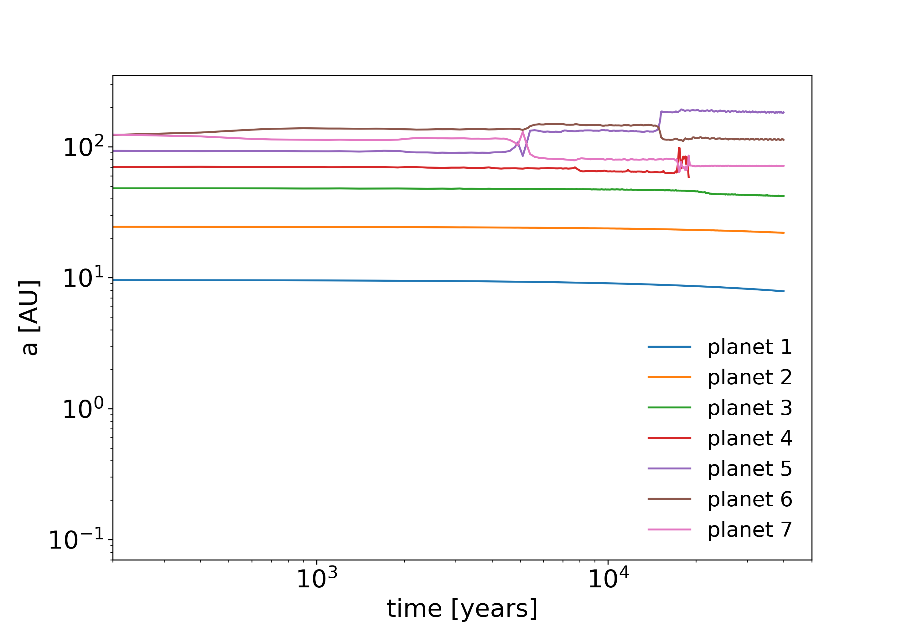
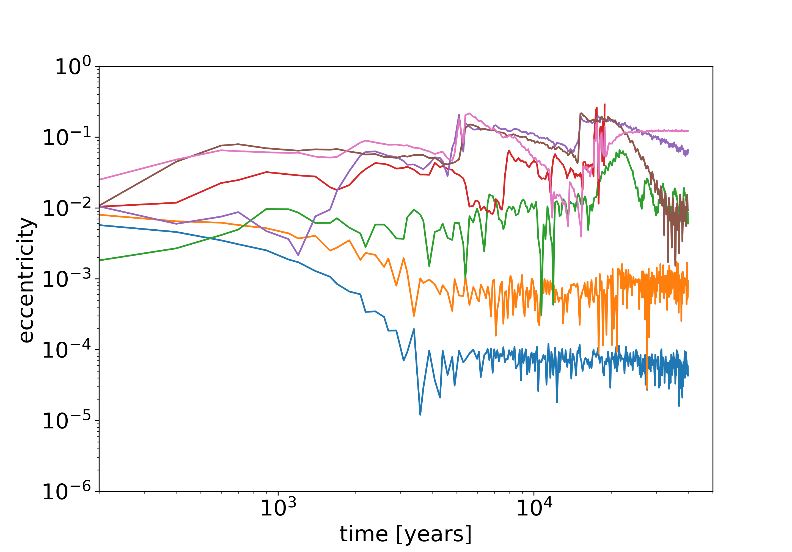

$\newcommand{\ensuremath}{}$
$\newcommand{\xspace}{}$
$\newcommand{\object}[1]{\texttt{#1}}$
$\newcommand{\farcs}{{.}''}$
$\newcommand{\farcm}{{.}'}$
$\newcommand{\arcsec}{''}$
$\newcommand{\arcmin}{'}$
$\newcommand{\ion}[2]{#1#2}$
$\newcommand{\textsc}[1]{\textrm{#1}}$
$\newcommand{\hl}[1]{\textrm{#1}}$
$\newcommand{\footnote}[1]{}$
$\newcommand{\GP}[1]{\textcolor{green}{#1}}$

# Do all gaps in protoplanetary discs host planets?

<mark>Appeared on: 2023-07-24</mark> -  _Accepted for publication in A&A_

<mark>A. Tzouvanou</mark>, <mark>B. Bitsch</mark>, G. Pichierri

**Abstract:** Following the assumption that the disc substructures observed in protoplanetary discs originate from the interaction between the disc and the forming planets embedded therein, we aim to test if these putative planets could represent the progenitors of the currently observed giant exoplanets.  We performed N-body simulations assuming initially three, four, five or seven planets. Our model includes pebble and gas accretion, migration, damping of eccentricities and inclinations, disc-planet interaction and disc evolution. We locate the planets in the positions where the gaps in protoplanetary discs have been observed and we evolve the systems for 100Myr including a few Myr of gas disc evolution, while also testing three values of $\alpha$ viscosity.  For planetary systems with initially three and four planets we find that most of the growing planets lie beyond the RV detection limit of 5AU and only a small fraction of them migrate into the inner region. We also find that these systems have too low final eccentricities to be in agreement with the observed giant planet population.  Systems initially consisting of five or seven planets become unstable after $\approx$ 40Kyr of integration time. This clearly shows that not every gap can host a planet. The general outcome of our simulations - too low eccentricities - is independent of the disc's viscosity and surface density. Further observations could either confirm the existence of an undetected population of wide-orbit giants or exclude the presence of such undetected population to constrain how many planets hide in gaps even further.

**Figure 3. -** The left figure shows the comparison between the observed giant exoplanet population (gray dots) and all the simulations for the three- planet systems. The initial values of these planets are denoted as orange for the case where the planets  located in a wide configuration while brown dots denote planets located in a compact configuration, where the small numbers indicate the position of the first, second, and third planet. Purple, green and red data points symbolize the simulations for the different $\mathrm{\alpha}$, $10^{-3}$, $3.16 \cdot 10^{-4}$ and $10^{-4}$ respectively, whereas the coloured numbers shows the mean value and the standard deviation of the eccentricity for each case for all the simulated three- planet systems. The horizontal lines refers to the perihelion and aphelion of the planet $\mathrm{a(1 \pm e)}$. The black dashed vertical line represents the current Radial Velocity (RV) detection limit at 5 AU. Right figure shows the cumulative frequency of the eccentricity for planets up to 5 AU and mass between $ \mathrm{0.5 \leq mass [\mathrm{M_{Jup}}] \leq 13 }$. We also note that these plots include both cases for the initial mass (fixed and random value).  (*fig:3pl*)

**Figure 4. -** Similar to Fig. \ref{fig:3pl}, but for  systems with initially four planets.  (*fig:4pl*)

**Figure 6. -** Evolution of two different individual systems for the 5 (top) and 7 (bottom) planet system. The plots shows the evolution of the semi-major axis (left) and the eccentricity (right) over time. (*fig:individual_systems*)

