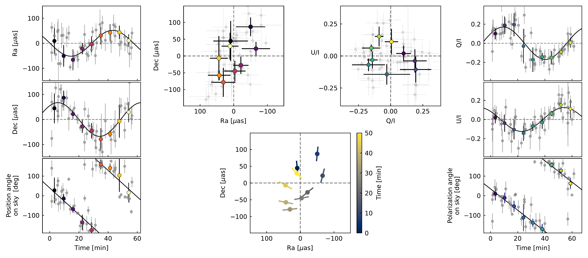
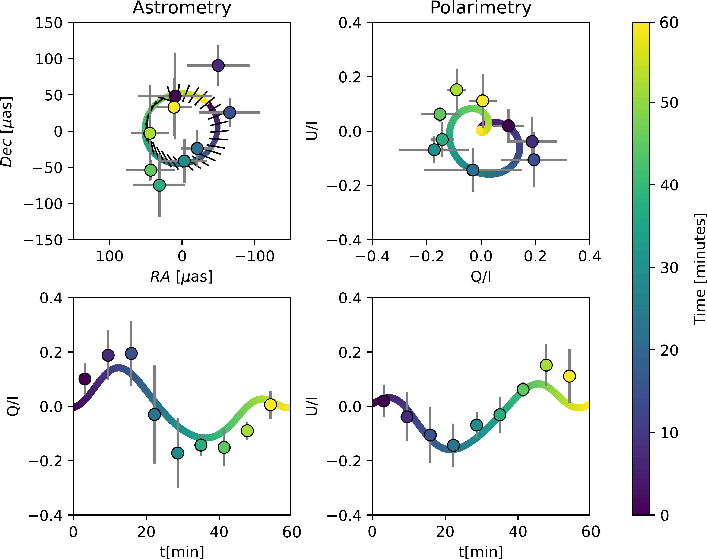
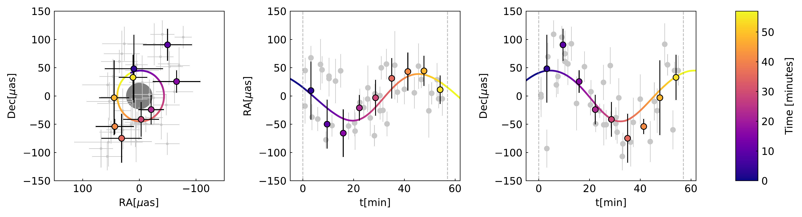

$\newcommand{\ensuremath}{}$
$\newcommand{\xspace}{}$
$\newcommand{\object}[1]{\texttt{#1}}$
$\newcommand{\farcs}{{.}''}$
$\newcommand{\farcm}{{.}'}$
$\newcommand{\arcsec}{''}$
$\newcommand{\arcmin}{'}$
$\newcommand{\ion}[2]{#1#2}$
$\newcommand{\textsc}[1]{\textrm{#1}}$
$\newcommand{\hl}[1]{\textrm{#1}}$
$\newcommand{\footnote}[1]{}$
$\newcommand$

# Polarimetry and Astrometry of NIR Flares as Event Horizon Scale, Dynamical Probes for the Mass of Sgr A*

<mark>Appeared on: 2023-07-25</mark> -  _10 pages, 12 figures. Submitted to A&A_

G. Collaboration, et al. -- incl., <mark>S. Scheithauer</mark>

**Abstract:** We present new astrometric and polarimetric observations of flares from Sgr A* obtained with GRAVITY, the near-infrared interferometer at ESO’s Very Large Telescope Interferometer (VLTI), bringing the total sample of well-covered astrometric flares to four and polarimetric ones to six, where we have for two flares good coverage in both domains. All astrometric flares show clockwise motion in the plane of the sky with a period of around an hour, and the polarization vector rotates by one full loop in the same time. Given the apparent similarities of the flares, we present a common fit, taking into account the absence of strong Doppler boosting peaks in the light curves and the EHT-measured geometry. Our results are consistent with and significantly strengthen our model from 2018: We find that a) the combination of polarization period and measured flare radius of around nine gravitational radii ( $9 R_g \approx 1.5 R_{ISCO}$ , innermost stable circular orbit) is consistent with Keplerian orbital motion of hot spots in the innermost accretion zone. The mass inside the flares’ radius is consistent with the $\SI{4.297e6}{\solarmass}$ measured from stellar orbits at several thousand $R_g$ . This finding and the diameter of the millimeter shadow of Sgr A* thus support a single black hole model. Further, b) the magnetic field configuration is predominantly poloidal (vertical), and the flares’ orbital plane has a moderate inclination with respect to the plane of the sky, as shown by the non-detection of Doppler-boosting and the fact that we observe one polarization loop per astrometric loop. Moreover, c) both the position angle on sky and the required magnetic field strength suggest that the accretion flow is fueled and controlled by the winds of the massive, young stars of the clockwise stellar disk 1-5 $\arcsec$ from Sgr A*, in agreement with recent simulations.

**Figure 9. -** Combined astrometric (left half) and polarimetric (right half) data. The outer left panels show \SI{R.A}, \SI{Dec.} and position angle on sky as a function of time. The full data are shown in gray, the colored points are bins of five minutes, and the color indicates time. The outer right panels show $Q/I$, $U/I$ and polarization angle on sky versus time. Overplotted in the angle plots are slopes of $\SI{6}{◦ee/\minute} = \SI{360}{◦ee/hour}$. The top panels in the middle illustrate the loops on sky (left) and in the $Q-U$ plane (right). The bottom middle panel shows the rotation of the polarization for the corresponding astrometric points -- one polarization rotation per astrometric orbit. The electric field vector rotates clockwise in the plane of the sky, as well as in the $Q-U$ plane.
	 (*fig:averaged_flares*)

**Figure 2. -**  Comparison of the polarization model with $R = 9 R_g$ and $i = \SI{157}{◦ee}$ with the data from Fig. \ref{fig:averaged_flares}.
	 (*fig:polarization_fit*)

**Figure 10. -** Combined fit of the astrometric flare data, taking into account the constraints from polarimetry. Left: On-sky motion. The gray disk corresponds to the shadow size of a Schwarzschild black hole $3 \sqrt{3}R_g$. Middle and right panels: The individual coordinates as a function of time. The gray data points are the full data set and the colored points are bins of five minutes. (*fig:astrometry_fit*)

