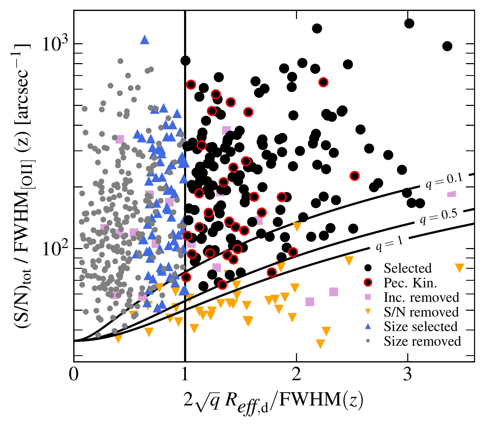
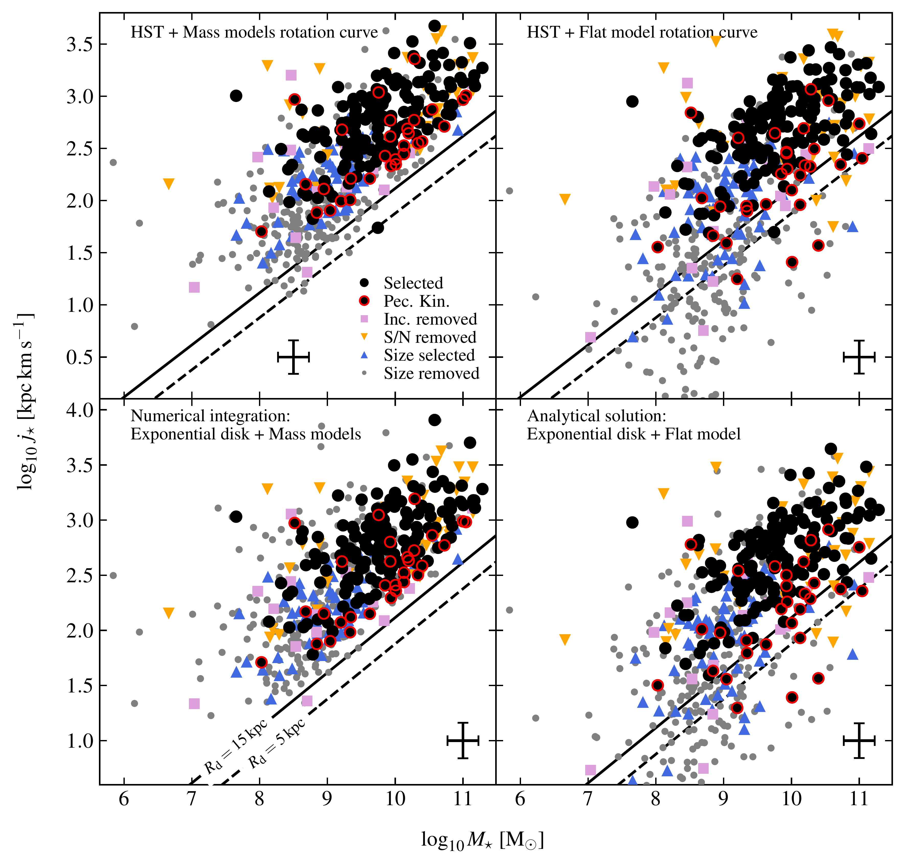
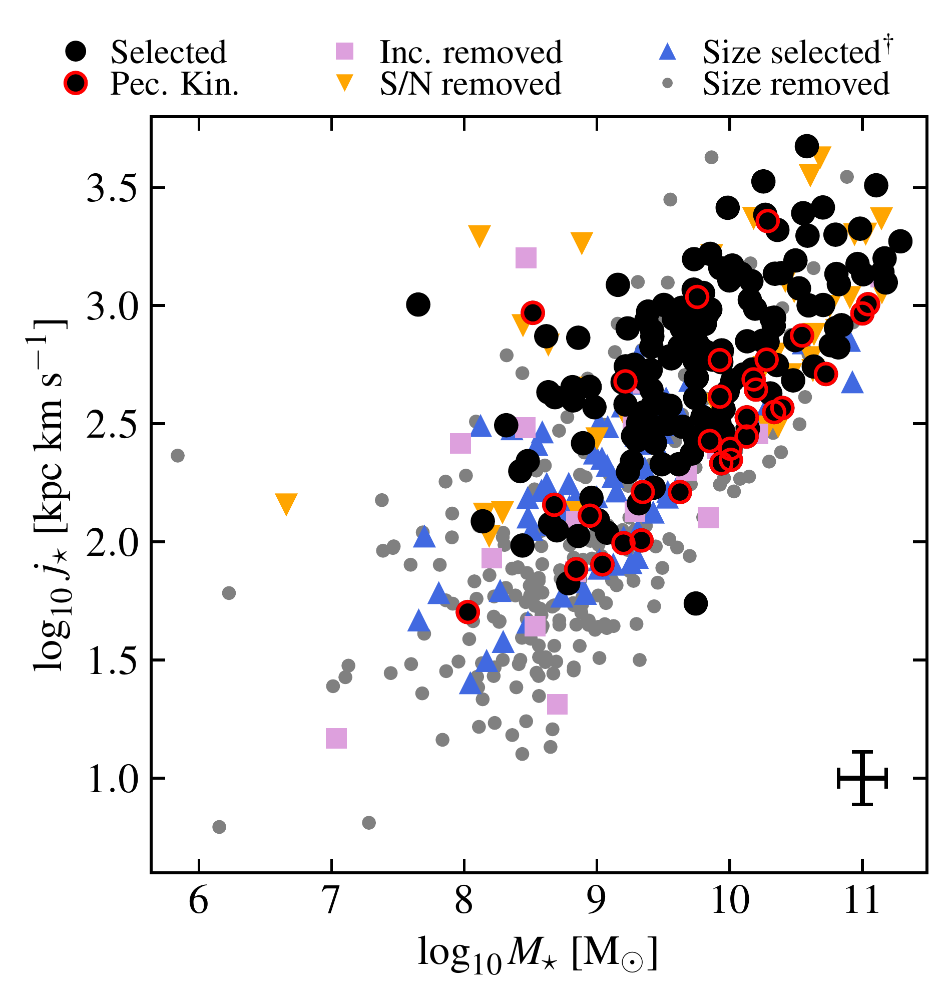

$\newcommand{\ensuremath}{}$
$\newcommand{\xspace}{}$
$\newcommand{\object}[1]{\texttt{#1}}$
$\newcommand{\farcs}{{.}''}$
$\newcommand{\farcm}{{.}'}$
$\newcommand{\arcsec}{''}$
$\newcommand{\arcmin}{'}$
$\newcommand{\ion}[2]{#1#2}$
$\newcommand{\textsc}[1]{\textrm{#1}}$
$\newcommand{\hl}[1]{\textrm{#1}}$
$\newcommand{\footnote}[1]{}$
$\newcommand{\todo}[1]{{\textcolor{red}{#1}}}$
$\newcommand{\OII}{[\ion{O}{ii}]}$
$\newcommand{\OIII}{[\ion{O}{iii}]}$
$\newcommand{\Halpha}{H\alpha}$
$\newcommand{\Halphamath}{{\rm{H}}\alpha}$
$\newcommand{\HST}{\textsc{HST}}$
$\newcommand{\HSTACS}{\textsc{HST-ACS}}$
$\newcommand{\zCOSMOS}{\textsc{zCOSMOS}}$
$\newcommand{\VUDS}{\textsc{VUDS}}$
$\newcommand{\MUSE}{\textsc{MUSE}}$
$\newcommand{\MAGIC}{\textsc{MAGIC}}$
$\newcommand{\COSMOS}{\textsc{Cosmos}}$
$\newcommand{\COSMOStwenty}{\textsc{Cosmos2020}}$
$\newcommand{\COSMOSWall}{\textsc{Cosmos-Wall}}$
$\newcommand{\MUSCATEL}{\textsc{MUSCATEL}}$
$\newcommand{\MUSEWIDE}{\textsc{MUSE-Wide}}$
$\newcommand{\HUDF}{\textsc{MUSE-HUDF}}$
$\newcommand{\HDFS}{\textsc{MUSE-HDFS}}$
$\newcommand{\Galfit}{\textsc{Galfit}}$
$\newcommand{\Cigale}{\textsc{Cigale}}$
$\newcommand{\FAST}{\textsc{FAST}}$
$\newcommand{\MPFIT}{\textsc{MPFIT}}$
$\newcommand{\MPFITEXY}{\textsc{MPFITEXY}}$
$\newcommand{\Ltsfit}{\textsc{LtsFit}}$
$\newcommand{\Mocking}{\textsc{MocKinG}}$
$\newcommand{\Camel}{\textsc{Camel}}$
$\newcommand{\Multinest}{\textsc{MultiNest}}$
$\newcommand{\Lephare}{\textsc{LePhare}}$
$\newcommand{\matplotlib}{\textsc{matplotlib}}$
$\newcommand{\scipy}{\textsc{scipy}}$
$\newcommand{\numpy}{\textsc{numpy}}$
$\newcommand{\astropy}{\textsc{astropy}}$
$\newcommand{\NMAGIC}{2730}$
$\newcommand{\NOIISample}{1142}$
$\newcommand{\NMorphoSample}{890}$
$\newcommand{\NKinematicSample}{571}$
$\newcommand{\Nselection}{182}$
$\newcommand{\NselectionOld}{207}$
$\newcommand{\NselectionFull}{156}$
$\newcommand{\NMSSample}{447}$
$\newcommand{\NTFRSample}{146}$

# Stellar angular momentum of disk galaxies at $z \approx 0.7$ in the $\MAGIC$  survey$\thanks{Table \ref{tab:catalog_CDS} is only available in electronic form at the CDS via anonymous ftp to cdsarc.u-strasbg.fr (130.79.128.5) or via http://cdsweb.u-strasbg.fr/cgi-bin/qcat?J/A+A/}$$\fnmsep$$\thanks{Based on observations made with ESO telescopes at the Paranal Observatory under programs 094.A-0247, 095.A-0118, 096.A-0596, 097.A-0254, 099.A-0246, 100.A-0607, 101.A-0282, 102.A-0327, and 103.A-0563.}$

<mark>Appeared on: 2023-07-26</mark> -  _23 pages, including 5 appendices, 14 figures, accepted version before language correction_

W. Mercier, et al. -- incl., <mark>L. Boogaard</mark>

**Abstract:** At intermediate redshift, galaxy groups/clusters are thought to impact galaxy properties such as their angular momentum. We investigate whether the environment has an impact on the galaxies' stellar angular momentum and identify underlying driving physical mechanisms. We derive robust estimates of the stellar angular momentum using Hubble Space Telescope ( $\HST$ ) images combined with spatially resolved ionised gas kinematics from the Multi-Unit Spectroscopic Explorer ( $\MUSE$ ) for a sample of $\sim 200$ galaxies in groups and in the field at $z \sim 0.7$ drawn from the MAGIC survey. Using various environmental tracers, we study the position of the galaxies in the the angular momentum-stellar mass (Fall) relation as a function of environment. We measure a $\SI{0.12}{dex}$ ( $2\sigma$ significant) depletion of stellar angular momentum for low-mass galaxies ( $M_\star < \SI{e10}{\Msun}$ ) located in groups with respect to the field. Massive galaxies located in dense environments have less angular momentum than expected from the low-mass Fall relation but, without a comparable field sample, we cannot infer whether this effect is mass- or environmentally-driven. Furthermore, these massive galaxies are found in the central parts of the structures and have low systemic velocities.	The observed depletion of angular momentum at low stellar mass does not appear linked with the strength of the over-density around the galaxies but it is strongly correlated with (i) the systemic velocity of the galaxies normalised by the dispersion of their host group and (ii) their ionised gas velocity dispersion. Galaxies in groups appear depleted in angular momentum, especially at low stellar mass. Our results suggest that this depletion might be induced by physical mechanisms that scale with the systemic velocity of the galaxies (e.g. stripping or merging) and that such mechanism might be responsible for enhancing the velocity dispersion of the gas as galaxies lose angular momentum.

**Figure 1. -** Criteria used for the selection of the kinematics sample. The black points represent galaxies selected according to the surface, S/N, and inclination (removing face-on galaxies only) criteria. Removed galaxies are represented as follows and in this specific order: (i) those removed by the inclination criterion (pink squares), (ii) those removed by the S/N criterion among the remaining galaxies (orange downward pointing triangles), (iii) those removed by the surface criterion among the remaining galaxies but that would have been kept by our previous size criterion used in \citet[][blue upward pointing triangles]{mercier_scaling_2022}, and (iv) those removed by the full selection and by our previous size criterion as well (grey dots). We also show galaxies flagged with peculiar kinematics with red contours. The vertical black line shows the surface selection criterion given in Eq. \ref{eq:sample/selection/surface} and the other black lines represent the S/N selection for different disk axis ratios (see Eq.\ref{eq:sample/selection/S/N}). (*fig:sample/selection/selection*)

**Figure 13. -** Fall relation for the kinematics sample using various formalisms. On the top row is shown the angular momentum derived using $\HST$  maps and on the bottom row that derived using an exponential disk model. The leftmost column represents the Fall relation when using the rotation curve derived from the mass modelling and the rightmost column the Fall relation when using a flat model rotation curve (the top-left plot is similar to Fig. \ref{fig:analysis/momentum first plot}). Galaxies selected for the analysis are shown as black points and those flagged with peculiar kinematics with red contours. Other symbols correspond to galaxies removed by the selection (see Fig. \ref{fig:sample/selection/selection} for more details). The typical uncertainty is shown on the bottom of each plot as a black error-bar. The two black lines show the limit of the Fall relation for an exponential disk without DM halo and with two different disk scale lengths of \SI{5}{\kilo\pc}(dashed line) and \SI{15}{\kilo\pc}(plain line, see Eq. \ref{eq:appendix/angular momentum/special/disk/R22}). (*fig:analysis/reliability/Fall relation HST comparison*)

**Figure 2. -** Fall relation for the entire kinematics sample, using bulge-removed $\HST$  images. Galaxies selected from the kinematics sample are represented with black points and other symbols represent galaxies removed by different selection criteria (see Fig. \ref{fig:sample/selection/selection}). Red contours correspond to galaxies flagged with peculiar kinematics. The typical uncertainty (including systematic uncertainties added when fitting the relation) is shown as an error bar on the bottom right corner. $^\dagger$Galaxies removed by the surface criterion defined in Sect. \ref{sec:sample/selection} but that would have been kept by the size selection criterion used in \citet{mercier_scaling_2022}. (*fig:analysis/momentum first plot*)

