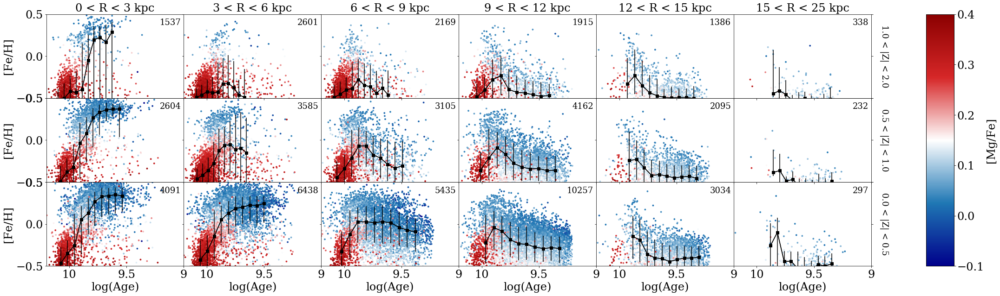
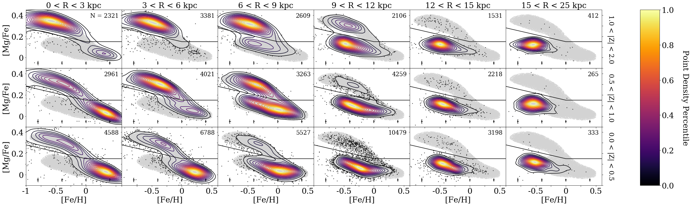
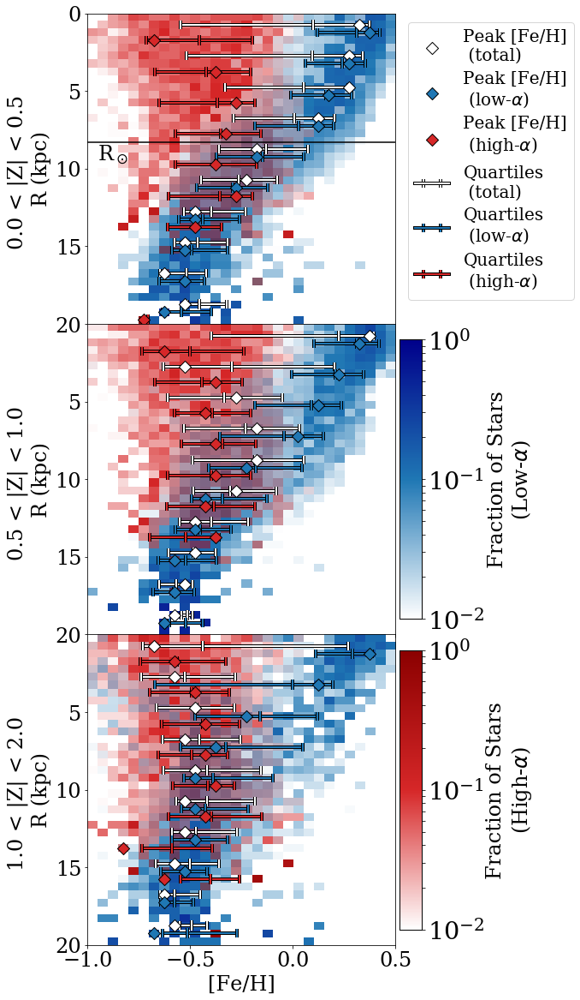

$\newcommand{\ensuremath}{}$
$\newcommand{\xspace}{}$
$\newcommand{\object}[1]{\texttt{#1}}$
$\newcommand{\farcs}{{.}''}$
$\newcommand{\farcm}{{.}'}$
$\newcommand{\arcsec}{''}$
$\newcommand{\arcmin}{'}$
$\newcommand{\ion}[2]{#1#2}$
$\newcommand{\textsc}[1]{\textrm{#1}}$
$\newcommand{\hl}[1]{\textrm{#1}}$
$\newcommand{\footnote}[1]{}$
$\newcommand{\vdag}{(v)^\dagger}$
$\newcommand$
$\newcommand$
$\newcommand$
$\newcommand{\alpham}{[Mg/Fe]}$

# A Tale of Two Disks: Mapping the Milky Way with the Final Data Release of APOGEE

<mark>Appeared on: 2023-07-27</mark> -  _41 pages, 32 figures, accepted to ApJ_

J. Imig, et al. -- incl., <mark>J. Lian</mark>

**Abstract:** We present new maps of the Milky Way disk showing the distribution of metallicity ( ${\feh}$ ), $\alpha$ -element abundances ( ${\alpham}$ ), and stellar age, using a sample of \textcolor{black}{66,496} red giant stars from the final data release (DR17) of the Apache Point Observatory Galactic Evolution Experiment (APOGEE) survey. We measure radial and vertical gradients, quantify the distribution functions for age and metallicity, and explore chemical clock relations across the Milky Way for the low- $\alpha$ disk, high- $\alpha$ disk, and total population independently. The low- $\alpha$ disk exhibits a negative radial metallicity gradient of \textcolor{black}{$-0.06 \pm 0.001$} dex kpc $^{-1}$ , which flattens with distance from the midplane. The high- $\alpha$ disk shows a flat radial gradient in metallicity and age across nearly all locations of the disk. The age and metallicity distribution functions shift from negatively skewed in the inner Galaxy to positively skewed at large radius. Significant bimodality in the ${\alpham}$ - ${\feh}$ plane and in the ${\alpham}$ -age relation persist across the entire disk. The age estimates have typical uncertainties of $\sim0.15$ in $\log$ (age) and may be subject to additional systematic errors, which impose limitations on conclusions drawn from this sample. Nevertheless, these results act as critical constraints on galactic evolution models, constraining which physical processes played a dominant role in the formation of the Milky Way disk. We discuss how radial migration predicts many of the observed trends near the solar neighborhood and in the outer disk, but an additional more dramatic evolution history, such as the multi-infall model or a merger event, is needed to explain the chemical and age bimodality elsewhere in the Galaxy.

**Figure 25. -** The age-metallicity relation across the Milky Way disk. Panels represent different spatial zones, laid out in the same way as Figure \ref{fig:apogee_mhplots}, with rows corresponding to $Z$ and columns increasing in $R$. The number in the top-right corner of each panel is the number of stars in our sample in that spatial bin. The age and metallicity for individual stars is plotted, colored by {$\alpham$} abundance. The running median trend is plotted in black square points to guide the eye, with the vertical bars indicating the standard deviation in {\feh} for bins in log(age). The typical (median) uncertainty for any given point is shown in the top right corner of each panel. (*fig:age_metallicity_relation*)

**Figure 21. -** The distribution of stars in the {$\alpham$} vs. {\feh} plane as a function of $R$ and $|Z|$, as a contour map of point density. Spatial bins move from closest to the Galactic plane (bottom row, 0.0 $<|Z|<$ 0.5 kpc) to farthest above the Galactic plane (top row, 1.0 $<|Z|<$ 2.0 kpc), and from close to the Galactic center (left column, 0.0 $<|R|<$ 3.0 kpc) to farthest out in the disk (right column, 15.0 $<|R|<$ 25.0 kpc). The number in the top-right corner of each panel is the number of stars in our sample in that spatial bin. For reference, the gray background shape and black line is the same in each panel, to highlight how the sequence changes across location in the Galaxy. The black line is the boundary between high- and low-$\alpha$ populations defined in Equation \ref{eq:alpha_split}, and the gray shape is the contour containing 90\% of the points in the full sample. The typical uncertainties in abundance measurements as a function of metallicity are shown as a $\pm1\sigma$ value at the bottom of each panel for reference. (*fig:apogee_mhplots*)

**Figure 14. -** The metallicity distribution function of the Milky Way disk, split into different height bins (panels), from closest to the Galactic plane (top) to farthest beyond (bottom). Each panel shows the fraction of stars at each metallicity {\feh} as a function of Galactocentric radius, further split by color between high-$\alpha$(red) and low-$\alpha$(blue) samples. Every third row is annotated with markings for the peak (or mode) of the distribution (white diamond), as well as the 25th, 50th (median), and 75th percentiles (white tick marks) to highlight the shape of the distribution. (*fig:apogee_MDF_alpha*)

