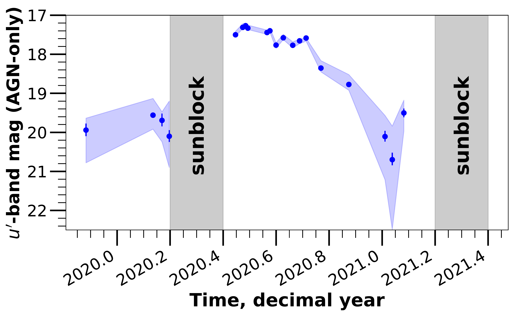
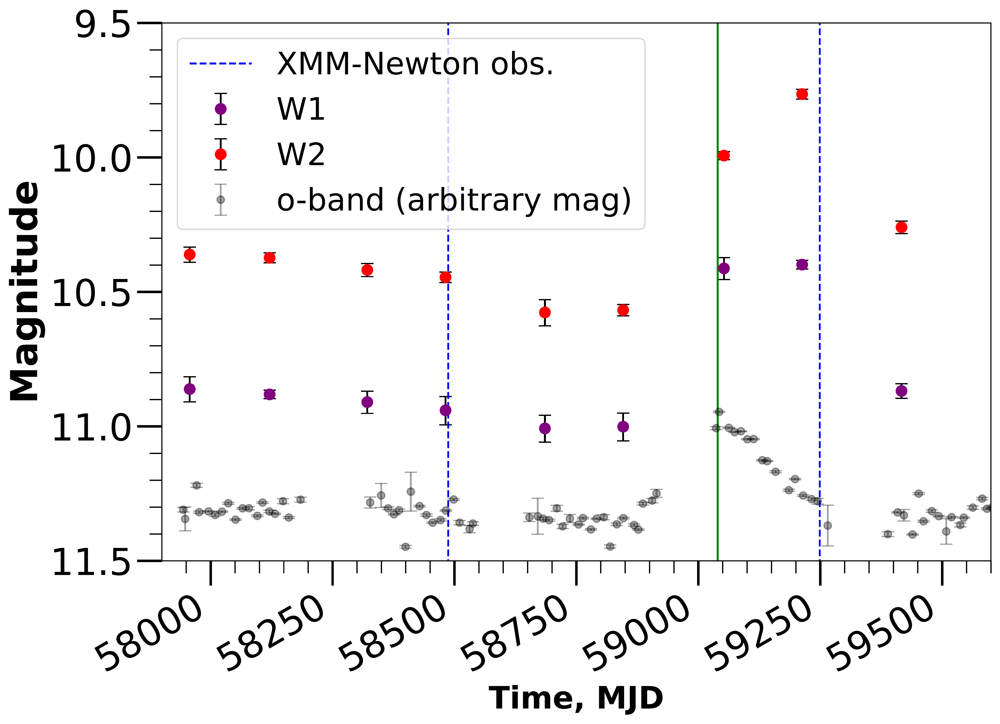
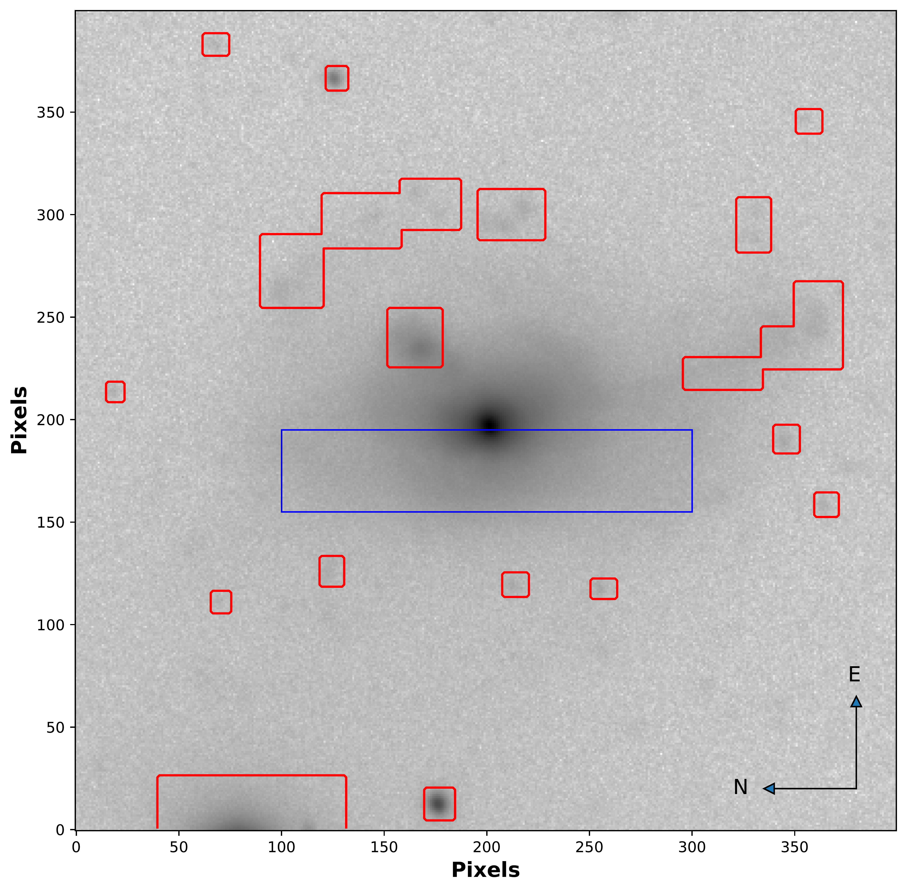

$\newcommand{\ensuremath}{}$
$\newcommand{\xspace}{}$
$\newcommand{\object}[1]{\texttt{#1}}$
$\newcommand{\farcs}{{.}''}$
$\newcommand{\farcm}{{.}'}$
$\newcommand{\arcsec}{''}$
$\newcommand{\arcmin}{'}$
$\newcommand{\ion}[2]{#1#2}$
$\newcommand{\textsc}[1]{\textrm{#1}}$
$\newcommand{\hl}[1]{\textrm{#1}}$
$\newcommand{\footnote}[1]{}$
$\newcommand{\arraystretch}{2}$
$\newcommand{\arraystretch}{1.5}$
$\newcommand{\arraystretch}{2}$
$\newcommand{\arraystretch}{1.3}$
$\newcommand{\arraystretch}{1.3}$

# Still alive and kicking: A significant outburst in changing-look AGN Mrk 1018

<mark>Appeared on: 2023-07-27</mark> -  _Accepted for publication in A&A_

R. Brogan, et al. -- incl., <mark>J. Neumann</mark>, <mark>N. Winkel</mark>

**Abstract:** Changing-look active galactic nuclei (AGN) have been observed to change their optical spectral type. Mrk 1018 is particularly unique: first classified as a type 1.9 Seyfert galaxy, it transitioned to being a type 1 Seyfert galaxy a few years later before returning to its initial classification as a type 1.9 Seyfert galaxy after $\sim$ 30 years. We present the results of a high-cadence optical monitoring programme that caught a major outburst in 2020. Due to sunblock, only the decline could be observed for $\sim$ 200 days. We studied X-ray, UV, optical, and infrared data before and after the outburst to investigate the responses of the AGN structures. We derived a $u'$ -band light curve of the AGN contribution alone. The flux increased by a factor of $\sim$ 13. We confirmed this in other optical bands and determined the shape and speed of the decline in each waveband. The shapes of H $\beta$ and H $\alpha$ were analysed before and after the event. Two _XMM-Newton_ observations (X-ray and UV) from before and after the outburst were also exploited. The outburst is asymmetric, with a swifter rise than decline. The decline is best fit by a linear function, ruling out a tidal disruption event. The optical spectrum shows no change approximately eight months before and 17 months after. The UV flux is increased slightly after the outburst but the X-ray primary flux is unchanged. However, the 6.4 keV Iron line has doubled in strength. Infrared data taken 13 days after the observed optical peak already show an increased emission level as well. Calculating the distance of the broad-line region and inner edge of the torus from the supermassive black hole can explain the multi-wavelength response to the outburst, in particular: i) the unchanged H $\beta$ and H $\alpha$ lines, ii) the unchanged primary X-ray spectral components, iii) the rapid and extended infrared response, as well as iv) the enhanced emission of the reflected 6.4 keV line. The outburst was due to a dramatic and short-lasting change in the intrinsic accretion rate. We discuss different models as potential causes.

**Figure 4. -** Final host-subtracted $u'$-band light curve of the AGN in Mrk 1018. The blue points are the data points with statistical uncertainties shown by error bars and the blue shaded area represents the systematic uncertainty arising from the choice of image used to model the host galaxy component. This outburst is the most significant as yet observed during Mrk 1018's new type 1.9 state. Both sunblock periods are indicated in grey. (*stella_lc*)

**Figure 9. -** _WISE_ IR light curve from MJD 57957 to MJD 59417 (Jul 2017 -- Jul 2021). The ATLAS $o$-band data for the same time period are shown for a visual reference of the rapidness of the IR response. The green line indicates the observed peak of the optical outburst in the ATLAS $o$-band. The blue dashed lines indicate the dates of the two _XMM-Newton_ observations before and after the outburst. (*wiselc*)

**Figure 10. -** Image created by stacking the 20 VIMOS exposures of Mrk 1018 during the faint (type 1.9) phase, shown with a log scale. The pixel scale is $0.205$\arcsec$$, corresponding to 179 \si{pc} per pixel. The red boxes indicate regions that are masked in the fitting process. A subtle light-absorbing structure is marked with a blue box. This is approximated in the fitting by an elongated Sérsic function with a negative intensity.  (*vimos*)

