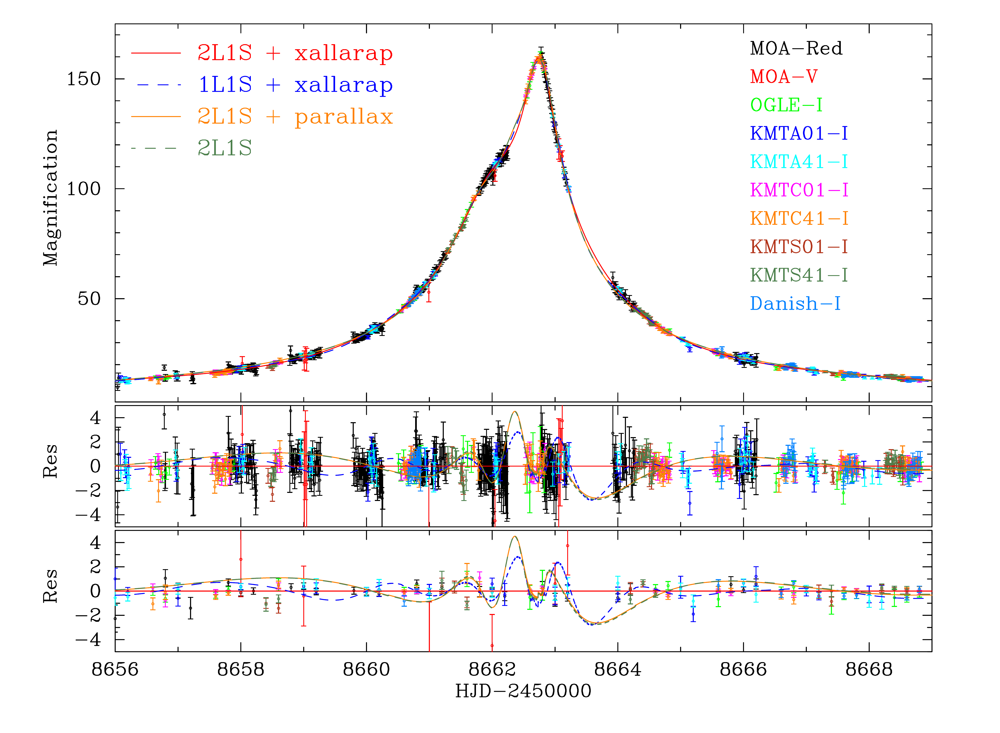
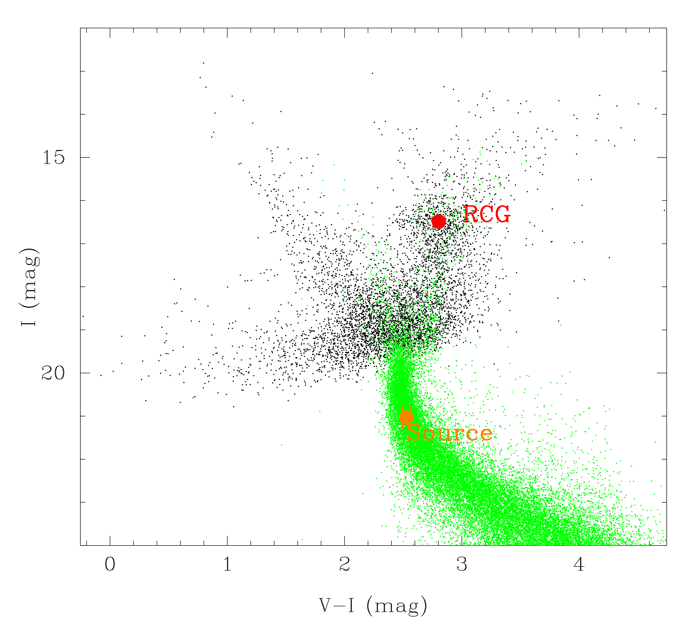
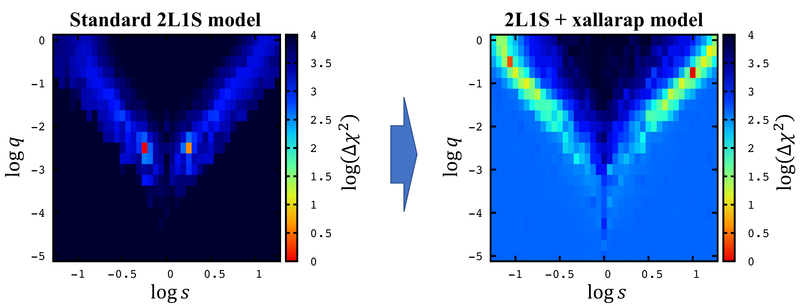

$\newcommand{\ensuremath}{}$
$\newcommand{\xspace}{}$
$\newcommand{\object}[1]{\texttt{#1}}$
$\newcommand{\farcs}{{.}''}$
$\newcommand{\farcm}{{.}'}$
$\newcommand{\arcsec}{''}$
$\newcommand{\arcmin}{'}$
$\newcommand{\ion}[2]{#1#2}$
$\newcommand{\textsc}[1]{\textrm{#1}}$
$\newcommand{\hl}[1]{\textrm{#1}}$
$\newcommand{\footnote}[1]{}$
$\newcommand{\vdag}{(v)^\dagger}$
$\newcommand$
$\newcommand$

# OGLE-2019-BLG-0825: Constraints on the Source System and Effect on Binary-lens Parameters arising from a Five Day Xallarap Effect in a Candidate Planetary Microlensing Event

<mark>Appeared on: 2023-07-27</mark> -  _19 pages, 7 figures, 6 tables. Accepted by AJ_

Y. K. Satoh, et al. -- incl., <mark>A. Gould</mark>

**Abstract:** We present an analysis of microlensing event OGLE-2019-BLG-0825.This event was identified as a planetary candidate by preliminary modeling.We find that significant residuals from the best-fit static binary-lens model exist and a xallarap effect can fit the residuals very well and significantly improves $\chi^2$ values.On the other hand, by including the xallarap effect in our models, we find that binary-lens parameters like mass-ratio, $q$ , and separation, $s$ , cannot be constrained well.However, we also find that the parameters for the source system like the orbital period and semi major axis are consistent between all the models we analyzed.We therefore constrain the properties of the source system better than the properties of the lens system.The source system comprises a G-type main-sequence star orbited by a brown dwarf with a period of $P\sim5$ days.This analysis is the first to demonstrate that the xallarap effect does affect binary-lens parameters in planetary events.It would not be common for the presence or absence of the xallarap effect to affect lens parameters in events with long orbital periods of the source system or events with transits to caustics, but in other cases, such as this event, the xallarap effect can affect binary-lens parameters.

**Figure 3. -** (Top panel) Light curve for OGLE-2019-BLG-0825.
    Error bars are renormalized according to Equation (\ref{eq:error}).
    The red solid, blue dashed, orange solid, and green dashed lines are the best 2L1S + xallarap model, the best 1L1S + xallarap model, the best 2L1S + parallax model and the best standard 2L1S model described in Section \ref{sec:light_curve_modeling}, respectively.
    (Middle panel) Residuals from the best 2L1S + xallarap model.
    (Bottom panel) Residuals from the best 2L1S + xallarap model binned by 0.2 days.
     (*fig:lightcurve*)

**Figure 2. -** 
    Color Magnitude Diagram (CMD, black dots) of the OGLE-$\mathrm{I}\hspace{-1.2pt}\mathrm{I}\hspace{-1.2pt}\mathrm{I}$ stars within $2’$ around OGLE-2019-BLG-0825. The green dots are stars in Baade's window based on Hubble Space Telescope observations \citep{Holtzman+1998}, color- and magnitude-matched at the RCG position. The orange circles represent the positions of the source, and the red dots represent the positions of the RCG centroid within $2’$ around OGLE-2019-BLG-0825.
     (*fig:cmd*)

**Figure 4. -** 
    Map of $\Delta\chi^2$ in each $s–q$ grid from the $(q,s,\alpha)$ grid search for the standard 2L1S model (Left) and for the 2L1S + xallarap model (Right).
    The best fit $\alpha$ is chosen for each grid location, respectively.
    In the map of the standard 2L1S model, we found the best solution at $q\sim10^{-3}$.
    However, for the 2L1S + xallarap map, best solutions at two other local minima appear at $q > 0.1$.
     (*fig:Grid_search*)

