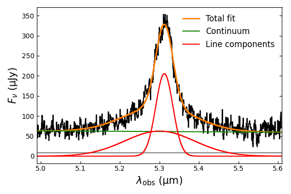
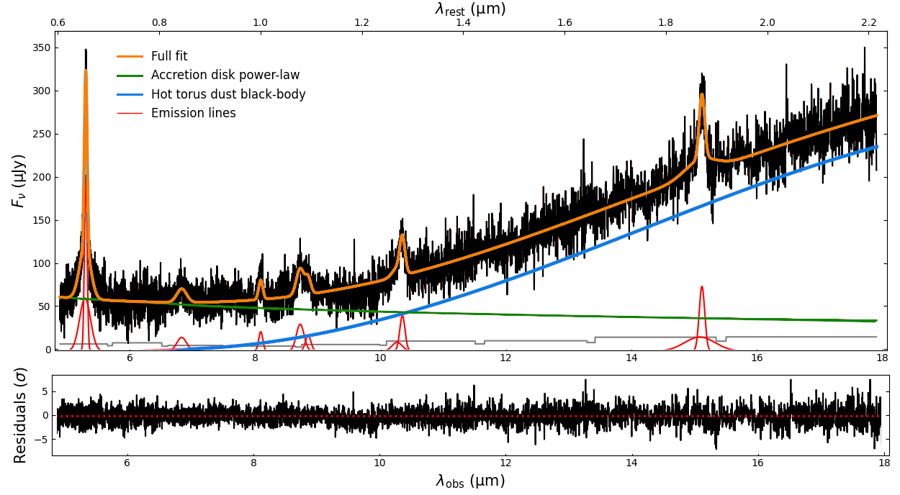
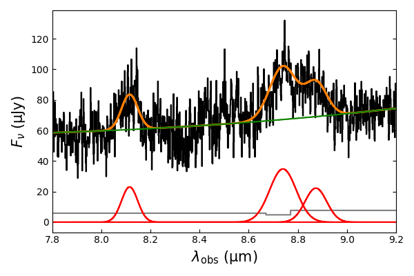

$\newcommand{\ensuremath}{}$
$\newcommand{\xspace}{}$
$\newcommand{\object}[1]{\texttt{#1}}$
$\newcommand{\farcs}{{.}''}$
$\newcommand{\farcm}{{.}'}$
$\newcommand{\arcsec}{''}$
$\newcommand{\arcmin}{'}$
$\newcommand{\ion}[2]{#1#2}$
$\newcommand{\textsc}[1]{\textrm{#1}}$
$\newcommand{\hl}[1]{\textrm{#1}}$
$\newcommand{\footnote}[1]{}$

# First rest-frame infrared spectrum of a $z>7$ quasar: JWST/MRS observations of J1120+0641

<mark>Appeared on: 2023-07-28</mark> -  _19 pages, 10 figures; submitted_

S. E.~I.~Bosman, et al. -- incl., <mark>F. Walter</mark>, <mark>L. Boogaard</mark>, <mark>M. Güdel</mark>

**Abstract:** We present a JWST/MRS spectrum of the quasar J1120+0641 at $z=7.0848$ , the first spectroscopic observation of a reionisation-era quasar in the rest-frame infrared wavelengths ( $0.6 < \lambda_\text{rest} < 3.4 \mu$ m).In the context of the mysterious fast assembly of the first supermassive black holes at $z>7$ , our observations enable for the first time the detection of hot torus dust, the H $\alpha$ emission line, and the Paschen-series broad emission lines in a quasar at $z>7$ , which we compare to samples at $z<6$ for signs of evolution.Hot torus dust is clearly detected as an upturn in the continuum emission at $\lambda_{\text{rest}}\simeq1.3\mu$ m, leading to a black-body temperature of $T_\text{dust} = 1413.5_{-7.4}^{+5.7}$ K. Compared to similarly-luminous quasars at $0<z<6$ , the hot dust in J1120+0641 is somewhat elevated in temperature (top $1\%$ ). The temperature is more typical among $6<z<6.5$ quasars (top $25\%$ ), leading us to postulate a weak evolution in the hot dust temperature at $z>6$ ( $2\sigma$ significance).We measure the black hole mass of J1120+0641 based on the H $\alpha$ Balmer line, $M_{\text{BH}} = 1.52 \pm 0.17 \cdot 10^9 M_\odot$ , which is in good agreement with the previous rest-UV Mg ${II}$ black hole mass measurement.The black hole mass based on the Paschen-series lines is also consistent within uncertainties, indicating that no significant extinction is biasing the $M_\text{BH}$ measurement obtained from the rest-frame UV.By comparing the ratios of the H $\alpha$ , Pa- $\alpha$ and Pa- $\beta$ emission lines to predictions from a simple one-phase Cloudy model, we find that the hydrogen broad lines are consistent with originating in a common broad-line region (BLR) with density $\text{log} N_H/\text{cm}^{-3} \geq 12$ , ionisation parameter $-7<\text{log}  U<-4$ , and extinction E(B--V) $\lesssim0.1$ mag. These BLR parameters are fully consistent with similarly-bright quasars at $0<z<4$ .Overall, we find that both J1120+0641's hot dust torus and hydrogen BLR properties show no significant peculiarity when compared to luminous quasars down to $z=0$ . The quasar accretion structures must have therefore assembled very quickly, as they appear fully `mature' less than $760$ million years after the Big Bang.

**Figure 6. -** Spectrum of the H$\alpha$ broad line (flux in black and uncertainty in grey) with the optimal line model fit (orange), split into the continuum constituting of a power-law and a black-body (green) and the broad emission lines (red). (*fig:ha*)

**Figure 8. -** Full fit to the MIRI-MRS spectrum of J1120+0641 (top, orange) and its residuals (bottom) in units of standard deviations. The coloured lines show the emission coming from the accretion disk (power law, blue), the hot torus dust (black-body radiation, green) and the broad quasar emission lines (red). The residuals show no signs of deviation from the continuum model, nor additional broad emission lines. The gray line is an in Fig. \ref{fig:spec} and the red dashed line indicates the location of zero residuals. See Fig. \ref{fig:spec} for line IDs. (*fig:fit*)

**Figure 3. -** Spectrum of the Pa-$\delta$, He {I} and Pa-$\gamma$ broad lines (in order of increasing wavelength) and the optimal model fit. The legend is the same as in Figure \ref{fig:ha}. (*fig:pg*)

