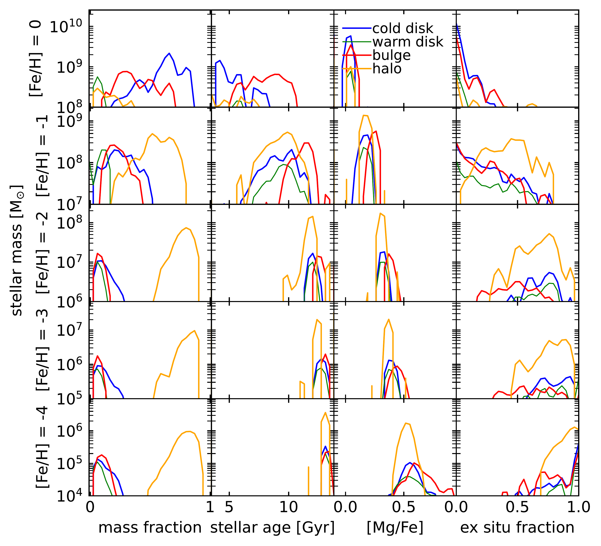
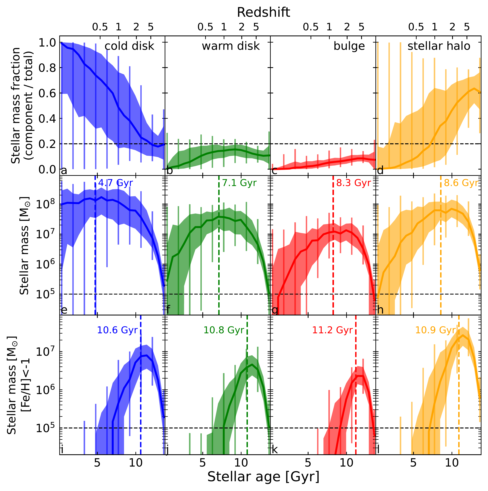
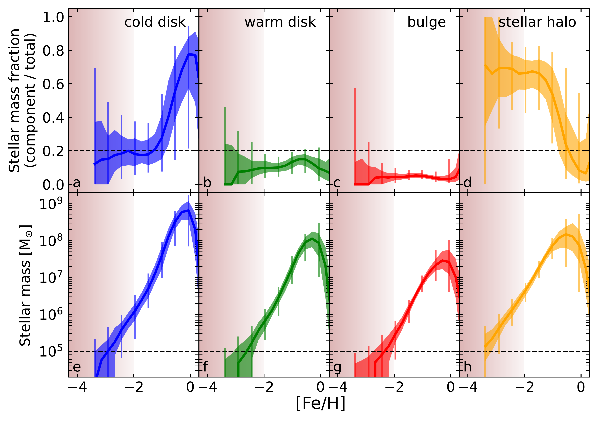

$\newcommand{\ensuremath}{}$
$\newcommand{\xspace}{}$
$\newcommand{\object}[1]{\texttt{#1}}$
$\newcommand{\farcs}{{.}''}$
$\newcommand{\farcm}{{.}'}$
$\newcommand{\arcsec}{''}$
$\newcommand{\arcmin}{'}$
$\newcommand{\ion}[2]{#1#2}$
$\newcommand{\textsc}[1]{\textrm{#1}}$
$\newcommand{\hl}[1]{\textrm{#1}}$
$\newcommand{\footnote}[1]{}$
$\newcommand{\DSR}[1]{\textcolor{red}{#1}}$
$\newcommand{\DSRc}[1]{\textit{\textcolor{red}{#1}}}$
$\newcommand{\DTA}[1]{\textcolor{cyan}{#1}}$
$\newcommand{\ap}[1]{\textcolor{magenta}{#1}}$
$\newcommand{\apn}[1]{\textcolor{red}{#1}}$
$\newcommand{\mb}[1]{\textcolor{green}{#1}}$
$\newcommand{\MS}{\rm{M}_{\odot}}$
$\newcommand{\MH}{\rm{M}_{\rm 200c}}$
$\newcommand{\thebibliography}{\DeclareRobustCommand{\VAN}[3]{##3}\VANthebibliography}$
$\newcommand{\}{blankpage}$

# On the likelihoods of finding very metal-poor (and old) stars in the Milky Way's disc, bulge, and halo

<mark>Appeared on: 2023-07-28</mark> -  _Accepted by MNRAS. 4 figures_

D. Sotillo-Ramos, <mark>M. Bergemann</mark>, J. K. Friske, <mark>A. Pillepich</mark>

**Abstract:** Recent observational studies have uncovered a small number of very metal-poor stars with cold kinematics in the Galactic disc and bulge. However, their origins remain enigmatic. We select a total of 138 Milky Way (MW) analogs from the  TNG50 cosmological simulation based on their $z=0$ properties: disky morphology, stellar mass, and local environment. In order to make more predictive statements for the MW, we further limit the spatial volume coverage of stellar populations in galaxies to that targeted by the upcoming 4MOST high-resolution survey of the Galactic disc and bulge. We find that across all galaxies, $\sim$ 20 per cent of very metal-poor ( ${\rm[Fe/H]} < -2$ ) stars belong to the disk, with some analogs reaching 30 per cent. About 50 $\pm$ 10 per cent of the VMP disc stars are, on average, older than 12.5 Gyr and $\sim$ 70 $\pm$ 10 per cent come from accreted satellites. A large fraction of the VMP stars belong to the halo ( $\sim$ 70) and have a median age of 12 Gyr. Our results with the TNG50 cosmological simulation confirm earlier findings with simulations of fewer individual galaxies, and suggest that the stellar disc of the Milky Way is very likely to host significant amounts of very- and extremely-metal-poor stars that, although mostly of ex situ origin, can also form in situ, reinforcing the idea of the existence of a primordial Galactic disc.

**Figure 4. -**  Mass fraction per component, stellar age, [Mg/Fe] and ex situ fraction distributions, for stellar samples with different values of [Fe/H]. We show the distributions of the median values across all TNG50 138 MW-like galaxies weighted by stellar mass and do not apply a heliocentric cut. (*fig:histograms*)

**Figure 3. -** Same as Fig. 2, but for the distribution of stellar ages in the morphological components. _Top_: Stellar mass fraction per component to total stellar mass. _Middle_: Stellar mass per component. _Bottom_: Mass of MP stars per component. The vertical dashed lines represent the median age of the stars in the component (within the volumetric cut), across all galaxies. (*fig:3*)

**Figure 2. -** Metallicity distributions of stars in TNG50 MW-like galaxies, grouped by their respective morphological component: cold disc, warm disc, bulge and stellar halo, from left to right. The top panels quantify the stellar mass fractions in each component to the total stellar mass; the bottom ones are the metallicity distributions in each morphological component, in stellar mass. The solid lines represent the medians and the shaded areas and error-bars represent inter-per centile ranges across the galaxy sample: 16 to 84 and 2 to 98, respectively. The vertical red shaded bands highlight metallicities [Fe/H]$\leq -2$, i.e., VMP stars. We remind the reader that the distributions are shown for the characteristic observable volume fraction of the Galaxy, as it will be `seen' by the 4MIDABLE-HR survey on 4MOST (see Section \ref{sec:morpho}). Specifically, we apply a volume cut of $5.5$ kpc in heliocentric distance, where the fiducial 'Sun' is placed at $8$ kpc in the simulated galaxy.  (*fig:2*)

