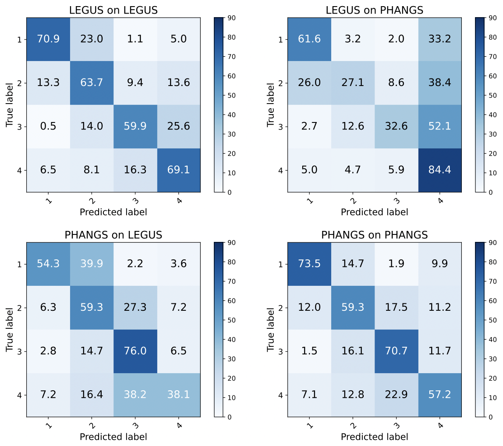
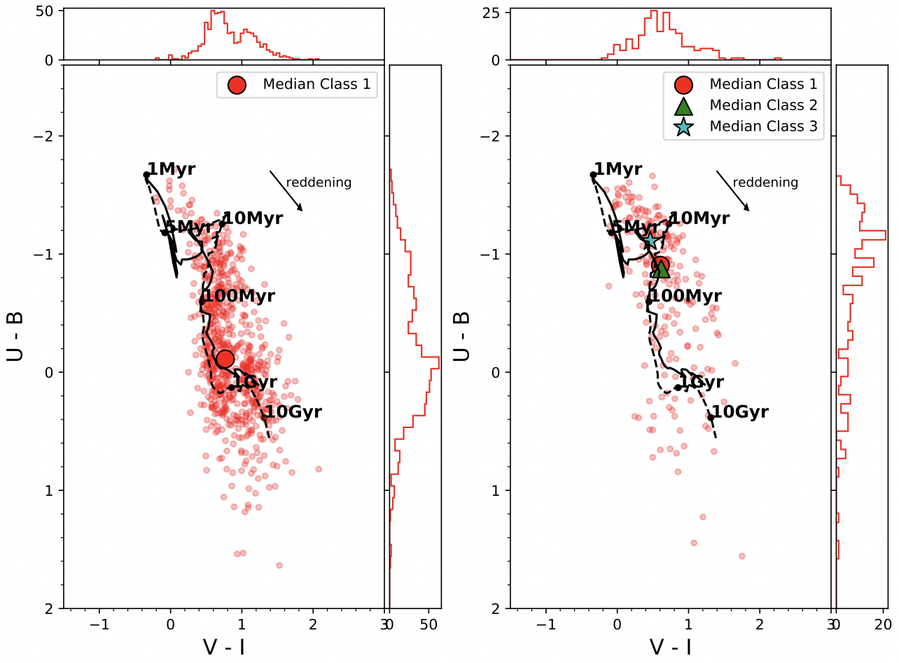
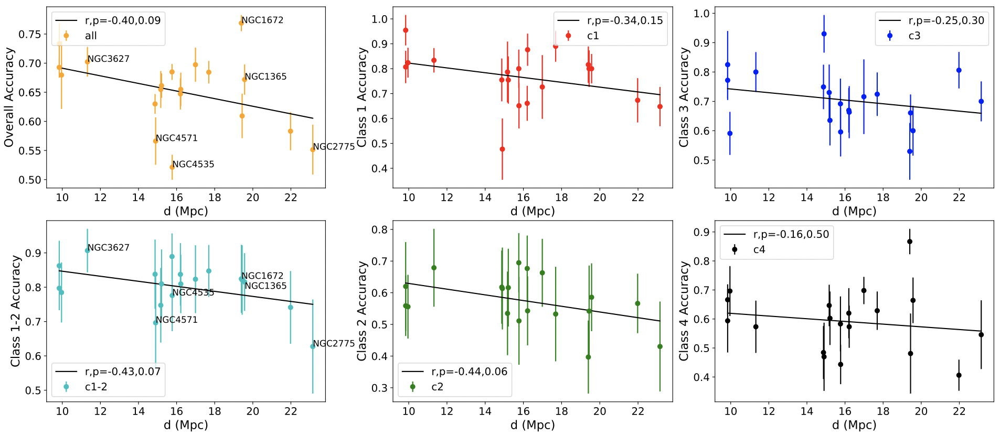

$\newcommand{\ensuremath}{}$
$\newcommand{\xspace}{}$
$\newcommand{\object}[1]{\texttt{#1}}$
$\newcommand{\farcs}{{.}''}$
$\newcommand{\farcm}{{.}'}$
$\newcommand{\arcsec}{''}$
$\newcommand{\arcmin}{'}$
$\newcommand{\ion}[2]{#1#2}$
$\newcommand{\textsc}[1]{\textrm{#1}}$
$\newcommand{\hl}[1]{\textrm{#1}}$
$\newcommand{\footnote}[1]{}$
$\newcommand{\thebibliography}{\DeclareRobustCommand{\VAN}[3]{##3}\VANthebibliography}$

# Star Cluster Classification using Deep Transfer Learning with PHANGS-HST

<mark>Appeared on: 2023-07-31</mark> -  _16 pages, 10 figures_

<mark>S. Hannon</mark>, et al.

**Abstract:** Currently available star cluster catalogues from _HST_ imaging of nearby galaxies heavily rely on visual inspection and classification of candidate clusters. The time-consuming nature of this process has limited the production of reliable catalogues and thus also post-observation analysis. To address this problem, deep transfer learning has recently been used to create neural network models which accurately classify star cluster morphologies at production scale for nearby spiral galaxies ( $D \lesssim 20$ Mpc). Here, we use _HST_ UV-optical imaging of over 20,000 sources in 23 galaxies from the Physics at High Angular Resolution in Nearby GalaxieS (PHANGS) survey to train and evaluate two new sets of models: i) distance-dependent models, based on cluster candidates binned by galaxy distance (9--12 Mpc, 14--18 Mpc, 18--24 Mpc), and ii) distance-independent models, based on the combined sample of candidates from all galaxies. We find that the overall accuracy of both sets of models is comparable to previous automated star cluster classification studies ( $\sim$ 60--80 per cent) and show improvement by a factor of two in classifying asymmetric and multi-peaked clusters from PHANGS-HST. Somewhat surprisingly, while we observe a weak negative correlation between model accuracy and galactic distance, we find that training separate models for the three distance bins does not significantly improve classification accuracy. We also evaluate model accuracy as a function of cluster properties such as brightness, colour, and SED-fit age. Based on the success of these experiments, our models will provide classifications for the full set of PHANGS-HST candidate clusters (N $\sim$ 200,000) for public release.

**Figure 3. -** Comparison of classification accuracies for the LEGUS-based and PHANGS-based modelsComparison of classification accuracies for the LEGUS-based \citep{WEI20} and PHANGS-based models, with the model-determined labels and human-determined labels on the x-axes and y-axes, respectively. The top-left and top-right confusion matrices display the accuracy of the LEGUS-based models in classifying the LEGUS and PHANGS-HST candidate clusters, respectively. The bottom-left and bottom-right matrices display the accuracy of the PHANGS-based models in classifying LEGUS and PHANGS-HST candidates, respectively. While the LEGUS-based and PHANGS-based models classify objects from their respective samples with similar accuracy ($\sim$60-70\%), the LEGUS-based models are notably poor at correctly classifying Class 2 and 3 PHANGS-HST objects. Note that the results presented here are specific to the \texttt{VGG19-BN} models from each study, however, similar results are found for the \texttt{ResNet18} models which are discussed in the text. (*fig:Wei_results*)

**Figure 9. -** ($U-B$) vs. ($V-I$) diagrams comparing clusters for which human and machine learning classifications agree and disagree($U-B$) vs. ($V-I$) plots comparing clusters for which human and machine learning classifications agree (left) and disagree (right). All of the clusters in the validation set that have Class 1 morphologies as determined by a human (BCW) are included as small red circles. The left plot contains the clusters for which the mode class from the 10 VGG19-BN models is also 1, while the right contains the clusters that have a mode Class of 2, 3, or 4. \citet{BRUZUAL03} model tracks (dashed line for $Z=0.02$; solid line for $Z=0.004$) used to fit these clusters are included with time stamps for reference. The median colour for each sample is included as a larger, black-outlined circle, and histograms showing the distributions of colours are shown on each axis. Classification agreement appears to be higher for clusters which share the same colour space as old, globular clusters (e.g. the median colour in the left plot, near the 1 Gyr point), and is lower for objects sharing colour space with younger clusters (e.g., the median colour in the right plot, near the 50 Myr point) which is more consistent with the median colours of BCW Class 2 and 3 objects (denoted by a green triangle and blue star, respectively). (*fig:CC_class1*)

**Figure 6. -** Classification accuracy vs. galactic distanceClassification accuracy vs. galactic distance \citep{ANAND20}. Each of the points in these plots represents the prediction accuracy based on our distance-independent models, averaged together, for objects within a particular galaxy, and the standard deviations in accuracy across the models are indicated by vertical error bars. The top-left plot shows the percent of all objects (i.e. Class 1, 2, 3, and 4) that receive identical model- and human-determined classes. The bottom-left plot shows the percent of clusters that are classified as either Class 1 or 2 by both model and human. The four plots on the right show the percentage of clusters that receive the same model- and human-determined classification for each of the four classes individually. Each plot includes a linear regression model with the Pearson correlation coefficients ($r$) and $p$-values included in the legend for reference. While model accuracy appears to generally decline with galactic distance, the correlation is not statistically significant. (*fig:Acc_v_Distance*)

