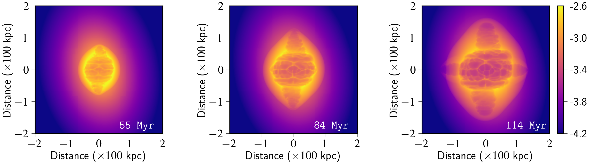
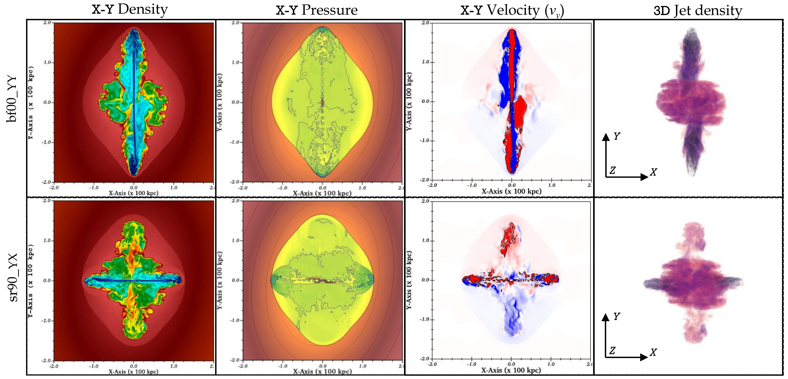

$\newcommand{\ensuremath}{}$
$\newcommand{\xspace}{}$
$\newcommand{\object}[1]{\texttt{#1}}$
$\newcommand{\farcs}{{.}''}$
$\newcommand{\farcm}{{.}'}$
$\newcommand{\arcsec}{''}$
$\newcommand{\arcmin}{'}$
$\newcommand{\ion}[2]{#1#2}$
$\newcommand{\textsc}[1]{\textrm{#1}}$
$\newcommand{\hl}[1]{\textrm{#1}}$
$\newcommand{\footnote}[1]{}$
$\newcommand{\vdag}{(v)^\dagger}$
$\newcommand$
$\newcommand$
$\newcommand{\bvc}[1]{{\color{green}#1}}$

# Deciphering the morphological origins of X-shaped radio galaxies: $\Numerical modeling of Back-flow vs. Jet-reorientation$

<mark>Appeared on: 2023-08-01</mark> -  _Accepted for publication in The Astrophysical Journal Supplement Series (10 Figs, 2 Tables)_

G. Giri, B. Vaidya, <mark>C. Fendt</mark>

**Abstract:** X-shaped Radio Galaxies (XRGs) develop when certain extra-galactic jets deviate from their propagation path.An asymmetric ambient medium (Back-flow model) or complex Active Galactic Nuclei activity (Jet-reorientation model) enforcing the jet direction to deviate may cause such structures.In this context, the present investigation focuses on the modeling of XRGs by performing 3D relativistic magneto-hydrodynamicsimulations. We implement different jet propagation models applying aninitially identical jet-ambient medium configuration to understand distinctive features.This study, the first of its kind, demonstrates that all adopted models produceXRGs with notable properties, thereby challenging the notion of a universal model.Jet reorientation naturally explains several contentious properties of XRGs, including wing alignment alongthe ambient medium's primary axis, development of collimated lobes,and the formation of noticeably longer wings than active lobes.Such XRGs disrupt the cluster medium by generating isotropic shocks and channeling more energythan the Back-flow scenario.Our synthetic thermal X-ray maps of the cluster medium reveal four `clear' elongated cavities associated withthe wing-lobe alignment, regardless of projection effects, though affecting their age estimation.We show depth and geometric alignment of the evolved cavities may qualify as promising characteristics of XRGs, which may be used to disentangle different formation scenarios.

**Figure 3. -** Representation of the evolution of a prominent XRG structure formed in the case `qr{\small \texttt{90}}\rule{2mm}{.5pt}{\small YX}' (fast Jet-reorientation scenario; Table \ref{Tab:Parameters}). The top three rows represent $x-y$ slice of density, pressure and $y$-component velocity distribution of the evolving structure, respectively. The last row showcases the 3D volume rendered plot showing the intricate jetted structure as viewed along the $z$-axis. The corresponding time of evolution is highlighted at the top of each column. The colorbar for the diagrams is kept at the rightmost part and is the same for the associated row, presented in computational unit (multiply unit density ($0.01 {\rm amu cm^{-3}}$), unit pressure ($1.5\times 10^{-5} {\rm dyn cm^{-2}}$) and velocity ($c$) for physical scales). See Section \ref{Sec:Reference case run} for details. (*fig:Dynamical_evolution*)

**Figure 8. -** Thermal X-ray intensity map (in ${\rm log  [erg s^{-1} cm^{-2} sr^{-1}]}$) in the [0.5-5] keV band for model `qr{\small \texttt{90}}\rule{2mm}{.5pt}{\small YX}'.
    The sequence showcases the formation and evolution of X-ray dip regions (cavities) in the midst of the cluster.
    The evolution is complementary to the cocoon geometry (Fig. \ref{fig:Dynamical_evolution}, viewing angle ($0^{\circ},0^{\circ}$)).
    Four distinct elongated cavities are generated, associated with wings and active lobes at 114 Myr, bearing signatures of the reorientation event.
    See Section \ref{Sec:Cavity evolution: Reference case} for details.
     (*fig:Cavity_evolution*)

**Figure 4. -** Representation of structures at 114 Myr that appear similar to the case `qr{\small \texttt{90}}\rule{2mm}{.5pt}{\small YX}' (Fig. \ref{fig:Dynamical_evolution}). The associated simulation names are labeled in the leftmost part of the figure, referring to the Back-flow (top) and slow Jet-reorientation cases (bottom) (Table \ref{Tab:Parameters}). The colorbar for the plots are kept same as in Fig. \ref{fig:Dynamical_evolution}. See Section \ref{Sec:Comparison with other simulated systems} for details and observational relevance. (*fig:Comparison_similar*)

