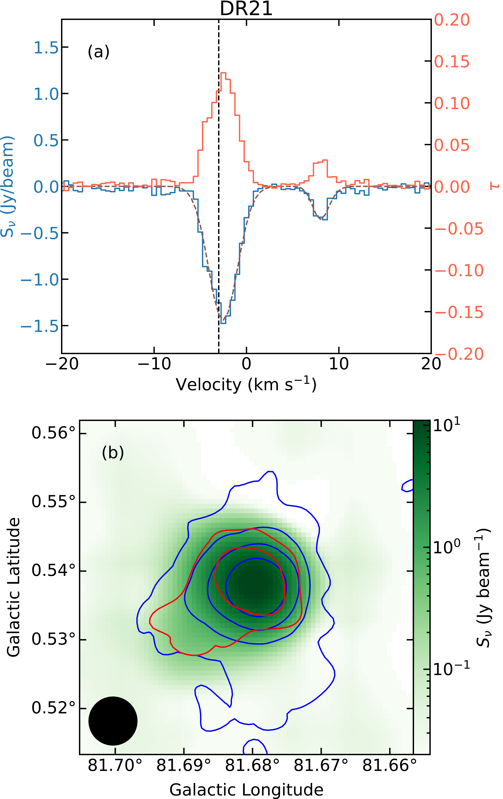
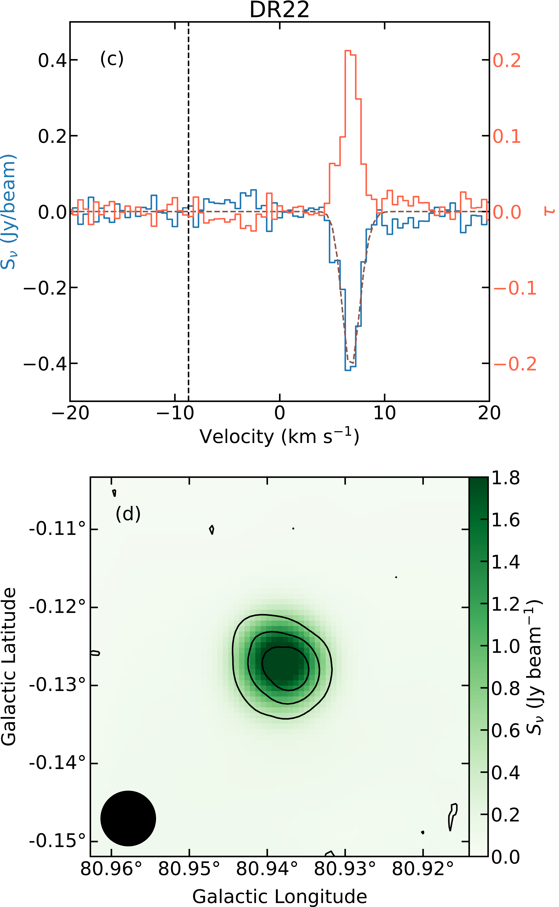
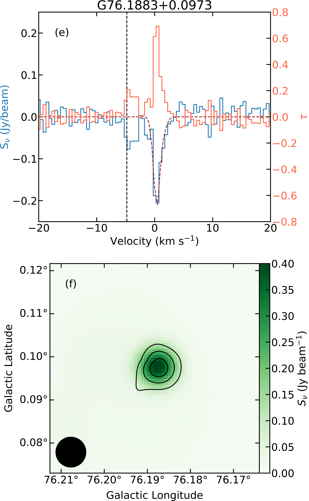
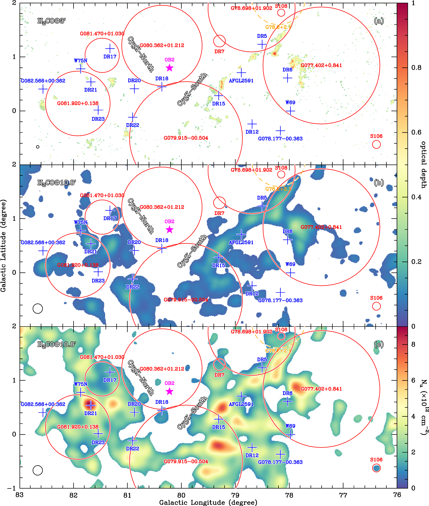

$\newcommand{\ensuremath}{}$
$\newcommand{\xspace}{}$
$\newcommand{\object}[1]{\texttt{#1}}$
$\newcommand{\farcs}{{.}''}$
$\newcommand{\farcm}{{.}'}$
$\newcommand{\arcsec}{''}$
$\newcommand{\arcmin}{'}$
$\newcommand{\ion}[2]{#1#2}$
$\newcommand{\textsc}[1]{\textrm{#1}}$
$\newcommand{\hl}[1]{\textrm{#1}}$
$\newcommand{\footnote}[1]{}$
$\newcommand{\Teff}{T_{\rm{eff}}}$
$\newcommand{\kms}{km s^{-1}}$
$\newcommand{\Wmq}{Wm^{-2}}$
$\newcommand{\ergps}{erg s^{-1}}$
$\newcommand{\mum}{ \mum}$
$\newcommand{◦ee}{^{\circ}}$
$\newcommand{\Msun}{M_{\odot}}$
$\newcommand{\Lsun}{L_{\odot}}$
$\newcommand{\Msunyr}{ M_{\odot}yr^{-1}}$
$\newcommand{\OI}{[O I]}$
$\newcommand{\SII}{[S II]}$
$\newcommand{\NII}{[N II]}$
$\newcommand{\CaII}{Ca II}$
$\newcommand{\HeI}{He I}$
$\newcommand{\LiI}{Li I}$
$\newcommand{\nodata}{...}$
$\newcommand{\accunit}{M_{\odot} yr^{-1}}$
$\newcommand{\rev}{ }$
$\newcommand{\newrev}{ }$
$\newcommand{\newnewrev}{\bf }$
$\newcommand{\fig}{Fig.}$
$\newcommand{\Mjup}{M_{\rm{Jup}}}$
$\newcommand{\Mdotacc}{\dot M_{\rm{acc}}}$
$\newcommand{\gisela}[1]{{\bf \color{black}[#1]}}$

# A global view on star formation: The GLOSTAR Galactic plane survey

<mark>Appeared on: 2023-08-03</mark> -  _27 pages, 23 figures, accepted for publication in A&A_

Y. Gong, et al. -- incl., <mark>H. Beuther</mark>

**Abstract:** Cygnus X is one of the closest and most active high-mass star-forming regions in our Galaxy, making it one of the best laboratories for studying massive star formation. We aim to investigate the properties of molecular gas structures on different linear scales with 4.8 GHz formaldehyde (H $_{2}$ CO) absorption line in Cygnus X. As part of the GLOSTAR Galactic plane survey, we performed large scale (7◦ee $\times$ 3◦ee) simultaneous H $_{2}$ CO (1 $_{1,0}$ --1 $_{1,1}$ ) spectral line and radio continuum imaging observations toward Cygnus X at $\lambda\sim$ 6 cm with the Karl G. Jansky Very Large Array and the Effelsberg-100 m radio telescope. We used auxiliary HI, $^{13}$ CO (1--0), dust continuum, and dust polarization data for our analysis. Our Effelsberg observations reveal widespread H $_{2}$ CO (1 $_{1,0}$ --1 $_{1,1}$ ) absorption with a spatial extent of $\gtrsim$ 50 pc in Cygnus X for the first time. On large scales of 4.4 pc, the relative orientation between local velocity gradient and magnetic field tends to be more parallel at H $_{2}$ column densities of $\gtrsim$ 1.8 $\times 10^{22}$ cm $^{-2}$ . On the smaller scale of 0.17 pc, our VLA+Effelsberg combined data reveal H $_{2}$ CO (1 $_{1,0}$ --1 $_{1,1}$ ) absorption only toward three bright H ${\scriptsize II}$ regions. Our observations demonstrate that H $_{2}$ CO (1 $_{1,0}$ --1 $_{1,1}$ ) is commonly optically thin. Kinematic analysis supports the assertion that molecular clouds generally exhibit supersonic motions on scales of 0.17--4.4 pc. We show a non-negligible contribution of the cosmic microwave background radiation in producing extended absorption features in Cygnus X. Our observations suggest that H $_{2}$ CO ( $1_{1,0}-1_{1,1}$ ) can trace molecular gas with H $_{2}$ column densities of $\gtrsim 5 \times 10^{21}$ cm $^{-2}$ (i.e., $A_{\rm V} \gtrsim 5$ ). The ortho-H $_{2}$ CO fractional abundance with respect to H $_{2}$ has a mean value of 7.0 $\times 10^{-10}$ .A comparison of velocity dispersions on different linear scales suggests that the dominant $-3$  $\kms$ velocity component in the prominent DR21 region has nearly identical velocity dispersions on scales of 0.17--4.4 pc, which deviates from the expected behavior of classic turbulence.

**Figure 10. -** {(a) Effelsberg 4.89 GHz radio continuum emission overlaid with the peak absorption contours of H$_{2}$CO (1$_{1,0}$--1$_{1,1}$). The corresponding HPBW of H$_{2}$CO (1$_{1,0}$--1$_{1,1}$) is 3$\arcmin$. The color bar represents the flux densities of the radio continuum emission. The H$_{2}$CO absorption contours start from $-$0.5 K (5$\sigma$), and decrease by 0.5 K. The developed H{\scriptsize II} regions from [Anderson, Bania and Balser (2014)]() are marked with red solid circles, while SNR G78.2+2.1 is indicated by the orange dashed circle. Blue crosses represent the radio continuum sources and active star-forming objects, and the purple star represents the massive star cluster, Cygnus OB2. (b) Similar to Fig. \ref{Fig:peak-abs}a but the corresponding HPBW of H$_{2}$CO (1$_{1,0}$--1$_{1,1}$) is 10$\rlap{.}$\arcmin8. The H$_{2}$CO absorption contours start from $-$0.08 K (4$\sigma$), and decrease by 0.06 K. In both panels, the beam size is shown in the lower left corner.} (*Fig:peak-abs*)

**Figure 15. -** {_Top_: Observed H$_{2}$CO (1$_{1,0}$--1$_{1,1}$) spectra of DR21 (a), DR22 (c), and G76.1883+0.0973 (e) overlaid on the fit results indicated by the brown dashed lines. The derived optical depth spectra are shown by the red lines. In panels (a), (c), (e), the black dashed vertical lines represent the LSR velocities of the H{\scriptsize II} regions obtained from the radio recombination line measurements (Khan et al. in prep). _Bottom_: VLA+Effelsberg 4.9 GHz radio continuum emission of DR21 (b), DR22 (d), and G76.1883+0.0973 (f) overlaid with the H$_{2}$CO (1$_{1,0}$--1$_{1,1}$) absorption contours. For DR21, the blue and red contours represent the H$_{2}$CO (1$_{1,0}$--1$_{1,1}$) absorption peak for the $-$3 $\kms$ and 8 $\kms$ components, respectively. The contours start at $-$0.1 Jy beam$^{-1}$ (5$\sigma$), with each subsequent contour being twice the previous one. For DR22 and G76.1883+0.0973, the contours start at $-$0.1 Jy beam$^{-1}$ (5$\sigma$) and decrease by 0.04 Jy beam$^{-1}$. The synthesized beam is shown in the lower left corner of each panel. All the continuum and spectral line data are from the combination of the VLA D configuration and the Effelsberg single-dish observations.} (*Fig:vla-image*)

**Figure 11. -** {(a) Distribution of the peak optical depth of the H$_{2}$CO (1$_{1,0}$--1$_{1,1}$) line. The HPBW of the H$_{2}$CO image is 3$\arcmin$. The color bar represents the peak optical depth. The H{\scriptsize II} regions from [Anderson, Bania and Balser (2014)]() are marked with red solid circles, while SNR G78.2+2.1 is indicated by an orange dashed circle. The blue crosses represent the radio continuum sources and active star-forming objects, and the purple star represents the massive star cluster, Cygnus OB2. (b) Similar to Fig. \ref{Fig:peaktau}a but the  HPBW of the H$_{2}$CO (1$_{1,0}$--1$_{1,1}$) image is 10$\rlap{.}$\arcmin8. (c) Similar to Fig. \ref{Fig:peaktau}b but for the H$_{2}$CO column density in the 1$_{1,0}$ level.
In all panels, the beam size is shown in the lower left corner.} (*Fig:peaktau*)

