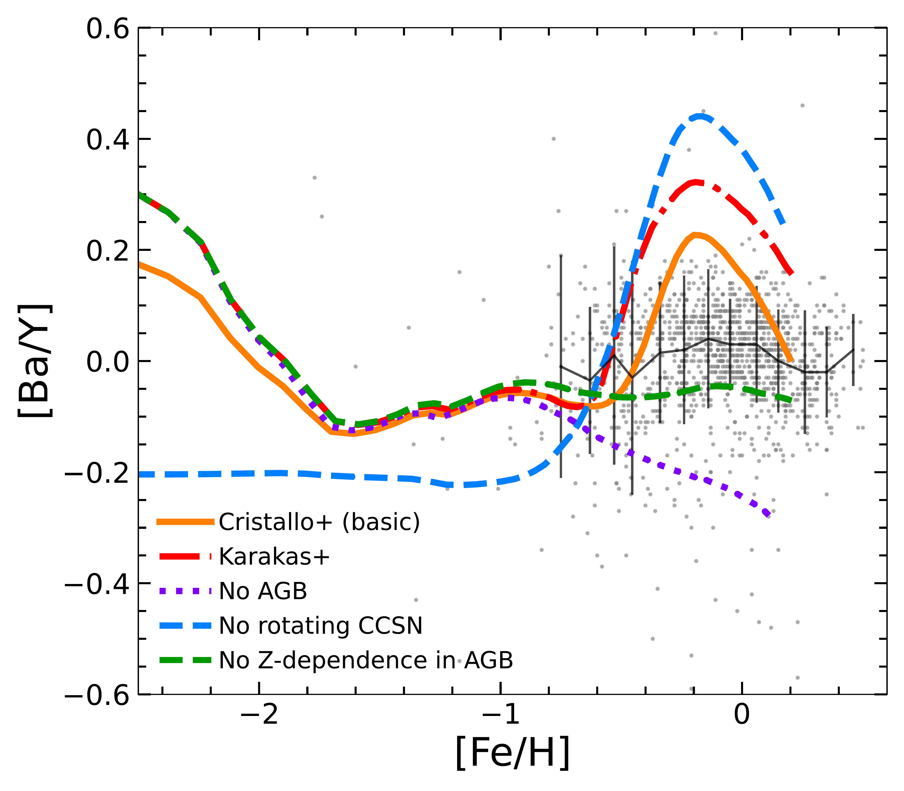
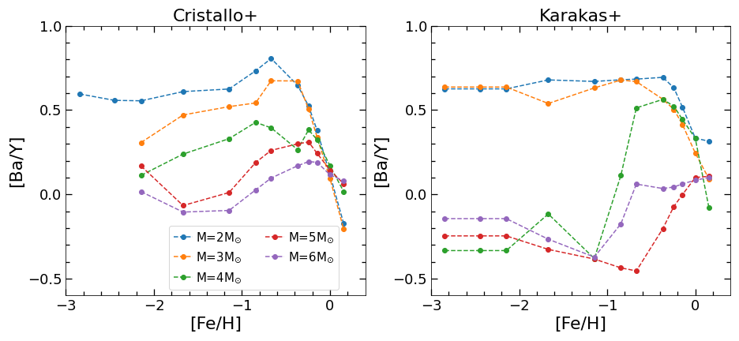
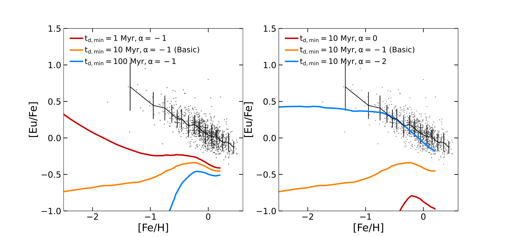

$\newcommand{\ensuremath}{}$
$\newcommand{\xspace}{}$
$\newcommand{\object}[1]{\texttt{#1}}$
$\newcommand{\farcs}{{.}''}$
$\newcommand{\farcm}{{.}'}$
$\newcommand{\arcsec}{''}$
$\newcommand{\arcmin}{'}$
$\newcommand{\ion}[2]{#1#2}$
$\newcommand{\textsc}[1]{\textrm{#1}}$
$\newcommand{\hl}[1]{\textrm{#1}}$
$\newcommand{\footnote}[1]{}$
$\newcommand{\keywords}[1]$
$\newcommand{\jl}{\textcolor{orange}}$
$\newcommand{\mb}{\textcolor{red}}$
$\newcommand{\as}{\textcolor{pink}}$

# Observational constraints on the origin of the elements. VI. Origin and evolution of neutron-capture elements as probed by the Gaia-ESO survey

<mark>Appeared on: 2023-08-03</mark> -  _14 pages, 11 figures, accepted by MNRAS_

<mark>J. Lian</mark>, et al. -- incl., <mark>N. Storm</mark>, <mark>G. Guiglion</mark>, <mark>M. Bergemann</mark>

**Abstract:** Most heavy elements beyond the iron peak are synthesized via neutron capture processes . The nature of the ${astrophysical}$ sites of neutron capture processes ${is}$ still very unclear.In this work we explore the observational constraints of the chemical abundances of s-process and r-process elements on the sites of neutron-capture processes by applying ${Galactic}$ chemical evolution (GCE) models to the data from Gaia-ESO ${large spectroscopic stellar}$ survey. For the r-process, the [ Eu/Fe ] - [ Fe/H ] distribution suggests a short delay time of the site that produces Eu. Other independent observations (e.g., NS-NS binaries), however, suggest a significant fraction of long delayed ( $>1$ Gyr) neutron star mergers (NSM). When assuming NSM as the only r-process sites, these two observational constraints are inconsistent at above 1 $\sigma$ level. Including short delayed r-process sites like ${magneto-rotational}$ supernova can resolve this inconsistency. For the s-process, we find a weak metallicity dependence of ${the}$ [ Ba/Y ] ratio,  which traces the s-process efficiency. Our GCE model with up-to-date yields of AGB stars qualitatively reproduces this metallicity dependence, ${but the model predicts a much higher [Ba/Y] ratio compared to the data.}$ This mismatch suggests that the s-process efficiency of low mass AGB stars in the current AGB nucleosynthesis ${models could be}$ overestimated.

**Figure 4. -** Relative abundance ratio between heavy {(Ba) and light (Y)} s-process elements as a function of [Fe/H]. Four GCE models with three test models deviating from the basic model in three aspects are included, one without rotating CCSN (blue dashed), one without AGB contribution (purple dotted), and one with AGB yields from Karakas et al. (magenta dash-dotted). (*ls-hs-omega*)

**Figure 8. -** Heavy-to-light s-process abundance ratio ([hs/ls]) parameterized by the ratio [Ba/Y] in AGB yields from \citet{cristallo2015}(left panel) and Karakas et al. (right panel). Different masses of AGB stars are shown in different colours. {See text}. (*ls-hs-agb*)

**Figure 9. -** [Eu/Fe]-[Fe/H] evolution predicted by GCE models with NSM as the only sites of r-process. NSM DTD is characterised by the maximum delay time ($\tau_{\rm max}$) and the slope of power-law DTD ($\alpha$). Different NSM DTDs with different $\tau_{\rm max}$(left) and $\alpha$(right) are assumed as illustrated in the legend. (*eufe-feh-nsm-omega*)

