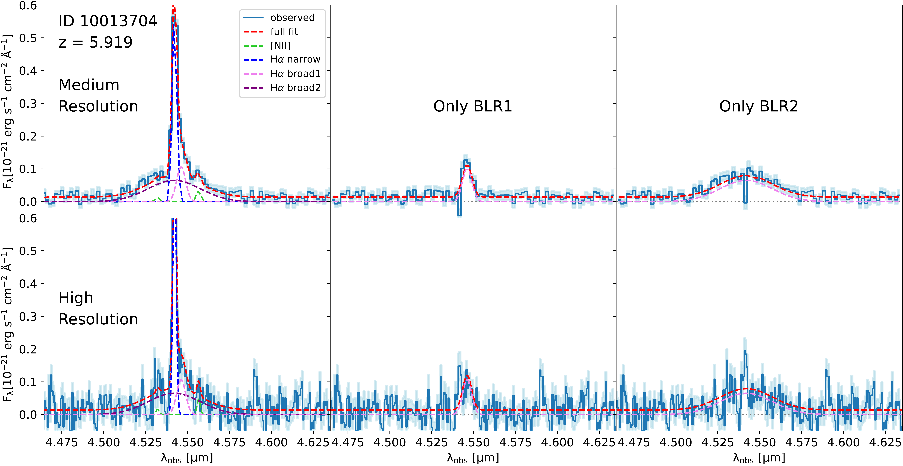
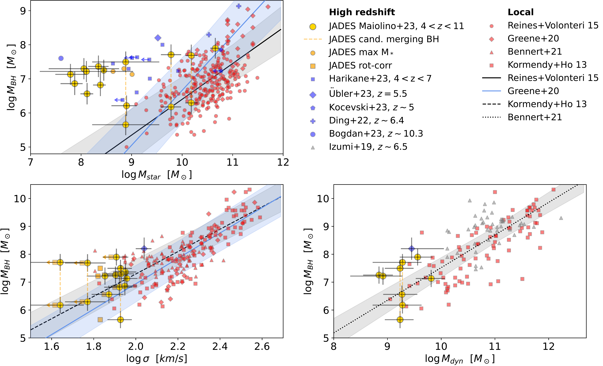
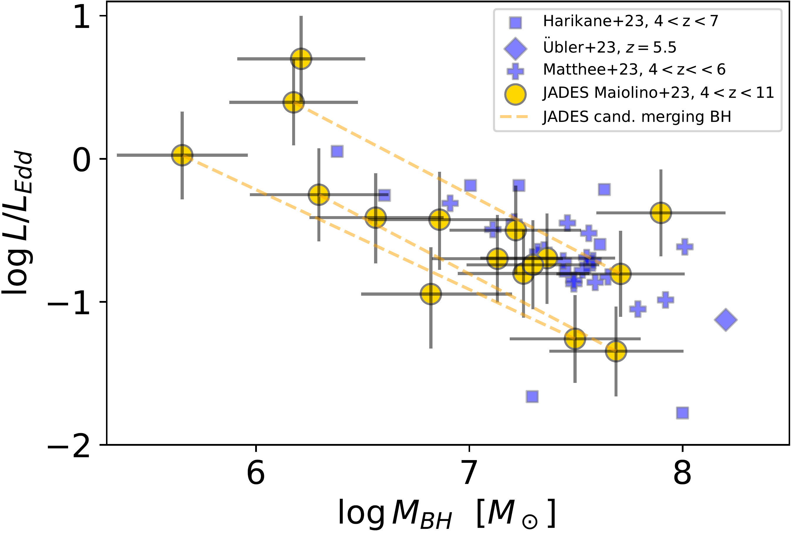

$\newcommand{\ensuremath}{}$
$\newcommand{\xspace}{}$
$\newcommand{\object}[1]{\texttt{#1}}$
$\newcommand{\farcs}{{.}''}$
$\newcommand{\farcm}{{.}'}$
$\newcommand{\arcsec}{''}$
$\newcommand{\arcmin}{'}$
$\newcommand{\ion}[2]{#1#2}$
$\newcommand{\textsc}[1]{\textrm{#1}}$
$\newcommand{\hl}[1]{\textrm{#1}}$
$\newcommand{\footnote}[1]{}$
$\newcommand{\todo}[1]{\textcolor{orange}{[to do: #1]}}$
$\newcommand$
$\newcommand$
$\newcommand$
$\newcommand$
$\newcommand$
$\newcommand$
$\newcommand$
$\newcommand$
$\newcommand$
$\newcommand$
$\newcommand$
$\newcommand$
$\newcommand$
$\newcommand$
$\newcommand$
$\newcommand$
$\newcommand$
$\newcommand$
$\newcommand$
$\newcommand$
$\newcommand$
$\newcommand$
$\newcommand$
$\newcommand$
$\newcommand$
$\newcommand$
$\newcommand$
$\newcommand$
$\newcommand$
$\newcommand$
$\newcommand$
$\newcommand$
$\newcommand$
$\newcommand$
$\newcommand$
$\newcommand$
$\newcommand$
$\newcommand$
$\newcommand$
$\newcommand$
$\newcommand$
$\newcommand$
$\newcommand$
$\newcommand$
$\newcommand$
$\newcommand$
$\newcommand$
$\newcommand$
$\newcommand$
$\newcommand$
$\newcommand$
$\newcommand$
$\newcommand$
$\newcommand$
$\newcommand$
$\newcommand$
$\newcommand$
$\newcommand$
$\newcommand$
$\newcommand$
$\newcommand$
$\newcommand{\kms}{\ensuremath{\mathrm{km s^{-1}}}\xspace}$
$\newcommand{Å}{\oldAA\xspace}$

# JADES. The diverse population of infant Black Holes at 4$<$z$<$11: merging, tiny, poor, but mighty

<mark>Appeared on: 2023-08-03</mark> -  _Submitted to A&A, 25 pages, 13 figures, 4 tables_

R. Maiolino, et al. -- incl., <mark>A. d. Graaff</mark>

**Abstract:** Spectroscopy with the James Webb Space Telescope has opened the possibility to identify moderate luminosity Active Galactic Nuclei (AGN) in the early Universe, at and beyond the epoch of reionization, complementing previous surveys of much more luminous (and much rarer) quasars. We present 12 new AGN at 4 $<$ z $<$ 7 in the JADES survey (in addition to the previously identified AGN in GN-z11 at z=10.6) revealed through the detection of a Broad Line Region as seen in the Balmer emission lines. The depth of JADES, together with the use of three different spectral resolutions,  enables us to probe a lower mass regime relative to previous studies. In a few cases we find evidence for two broad components of  H $\alpha$ , which suggests that these could be candidate merging black holes (BHs). The inferred BH masses range between $\rm 8\times 10^7  M_\odot$ down to $\rm 4\times 10^5  M_\odot$ , interestingly probing the regime expected for Direct Collapse Black Holes. The inferred AGN bolometric luminosities ( $\sim 10^{44}-10^{45}$ erg/s) imply accretion rates that are $< 0.5$ times the Eddington rate in most cases. However, small BHs, with $\rm M_{BH} \sim 10^6 M_\odot$ , tend to accrete at Eddington or super-Eddington rates. These BHs at z $\sim$ 4-11 are over-massive relative to their host galaxies stellar masses when compared to the local $\rm M_{BH}-M_{star}$ relation. However, we find that these early BH tend to be more consistent with the local relation between $\rm M_{BH}$ and velocity dispersion, as well as between $\rm M_{BH}$ and dynamical mass, suggesting that these are more fundamental and universal relations. On the BPT excitation-diagnostic diagram these AGN are located in the region that is that is locally occupied by star-forming galaxies, implying that they would be missed by the standard classification techniques if they did not display broad lines. Their location on the diagram is consistent with what expected for AGN hosted in metal poor galaxies ( $\rm Z \sim 0.1-0.2 Z_\odot$ ).The fraction of broad line AGN with $\rm L_{AGN}>10^{44} erg/s$ among galaxies in the redshift range $4<z<6$ is about 10 \% , suggesting that the contribution of AGN $_ and_$ their hosts to the reionization of the Universe is $>$ 10 \% .

**Figure 3. -** 
Spectra around H$\alpha$ of ID 10013704, the highest redshift AGN showing indication for a dual BLR.
The top and bottom panels show the medium and high resolution spectra, respectively. The line coding is the same as in Fig. \ref{fig:spectra}, but in this case the violet dashed line shows the intermediate broad component that is needed to  reproduce the observed profile. The central and rightmost panels show the spectrum from which the narrow components, as well as one of the two broad components have been removed, to better highlight the significance of the other broad component.
 (*fig:clara_gemma*)

**Figure 7. -** 
BH mass as a function of host galaxy properties, specifically: stellar mass (top-left),  velocity dispersion (bottom-left), dynamical mass (bottom-right). The JADES results presented in this work are shown with large golden circles. Orange dashed vertical lines connect candidate merging BHs. Blue symbols indicate measurements from other JWST surveys at high-z, as indicated in the legend (only detections at $>3\sigma$ are shown). Gray triangles are measurements of high-z QSOs using ALMA data.  Small red symbols show the distribution of local galaxies as indicated in the legend; straight lines show the local relation fits (with shaded regions providing the scatter and slope uncertainty).
In the top-left panel small orange circles show the  maximum stellar masses estimated for a few JADES AGN (see text), while in the bottom-left panel small squares indicate the effect of correcting for rotation velocity broadening within the slit.
 (*fig:mbh_host*)

**Figure 1. -** 
Distribution of black hole masses and Eddington ratios (L/L$_{\rm Edd}$) for the broad line AGN in JADES (large golden circles). The orange dashed lines connect candidate dual AGN. We also show the results from other JWST surveys with blue symbols (see legend). Note that the apparent anticorrelation is probably spurious, as the BH mass is at the denominator of the Y-axis quantity. The plot has simply the purpose of visually illustrating the distribution of the two quantities.
 (*fig:mbh_ledd*)

