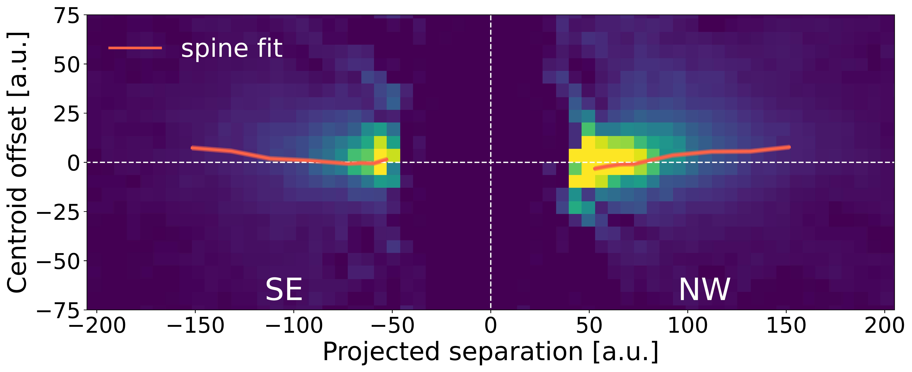
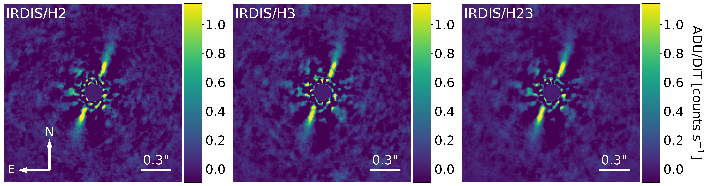

$\newcommand{\ensuremath}{}$
$\newcommand{\xspace}{}$
$\newcommand{\object}[1]{\texttt{#1}}$
$\newcommand{\farcs}{{.}''}$
$\newcommand{\farcm}{{.}'}$
$\newcommand{\arcsec}{''}$
$\newcommand{\arcmin}{'}$
$\newcommand{\ion}[2]{#1#2}$
$\newcommand{\textsc}[1]{\textrm{#1}}$
$\newcommand{\hl}[1]{\textrm{#1}}$
$\newcommand{\footnote}[1]{}$
$\newcommand{\bpic}[1]{\upbeta Pictoris}$
$\newcommand{\HD}[1]{HD 110058}$
$\newcommand{\micron}[1]{ \upmum}$
$\newcommand{\rev}[1]{#1}$

# An inner warp discovered in the disk around $\HD$  using VLT/SPHERE$\thanks{Based on observations made with ESO telescopes at the Paranal Observatory under programmes 095.C-0389(A) and ID 095.C-0607(A)}$ and HST/STIS$\thanks{Based on observations made with the STIS instrument aboard HST under program GO-15218 supported by NASA}$

<mark>Appeared on: 2023-08-11</mark> -  _17 pages, 15 figures, 3 tables; accepted for publication in A&A_

S. Stasevic, et al. -- incl., <mark>J. Olofsson</mark>, <mark>C. Desgrange</mark>, <mark>E. Matthews</mark>

**Abstract:** An edge-on debris disk was detected in 2015 around the young, nearby A0V star $\HD$ . The disk showed features resembling those seen in the disk of $\bpic$ that could indicate the presence of a perturbing planetary-mass companion in the system. We investigated new and archival scattered light images of the disk in order to characterise its morphology and spectrum. In particular, we analysed the disk's warp to constrain the properties of possible planetary perturbers. Using data from two VLT/SPHERE observations taken with the Integral Field Spectrograph (IFS) and near InfraRed Dual-band Imager and Spectrograph (IRDIS), we obtained high-contrast images of the edge-on disk. Additionally, we used archival data from HST/STIS with a poorer inner-working angle but a higher sensitivity to detect the outer parts of the disk. We measured the morphology of the disk by analysing vertical profiles along the length of the disk to extract the centroid spine position and vertical height. We extracted the surface brightness and reflectance spectrum of the disk. We detect the disk between 20 au (with SPHERE) and 150 au (with STIS), at a position angle of $159.6^\circ \pm 0.6^\circ$ . Analysis of the spine shows an asymmetry between the two sides of the disk, with a $3.4^\circ \pm 0.9^\circ$ warp between $\sim$ 20 au and 60 au. The disk is marginally vertically resolved in scattered light, with a vertical aspect ratio of $9.3 \pm 0.7\%$ at 45 au. The extracted reflectance spectrum is featureless, flat between 0.95 $\micron$ and 1.1 $\micron$ , and red from 1.1 $\micron$ to 1.65 $\micron$ . The outer parts of the disk are also asymmetric with a tilt between the two sides compatible with a disk made of forward-scattering particles and seen not perfectly edge-on, suggesting an inclination of $<84^\circ$ . The presence of an undetected planetary-mass companion on an inclined orbit with respect to the disk could explain the warp. The misalignment of the inner parts of the disk with respect to the outer disk suggests a warp that has not yet propagated to the outer parts of the disk, favouring the scenario of an inner perturber as the origin of the warp.

**Figure 2. -** STIS observation of $\HD$ , the image rotated to have the disk horizontal, with the position of the brightest pixels (spine) overlaid in orange. The disk PA is $159.6^\circ$. (*fig:STIS_spine*)

**Figure 3. -** ADI-PCA reductions of HD110058 IFS data using 5 PCs for the Y, J, and H band, and combined YJH data, with centroid spine position overlaid (orange). The spine measured on the STIS data in the FOV is overlaid in white. The H band image contains only the 2015-04-03 observation, while the rest combine both epochs. Images are rotated by $70.4^\circ$ clockwise. (*fig:Spine*)

**Figure 14. -** RDI-PCA reduction of 2015-04-12 IRDIS data using 125 PCs for the H2 (left), H3 (centre), and combined H23 (right) channels. (*fig:RDI_img*)

