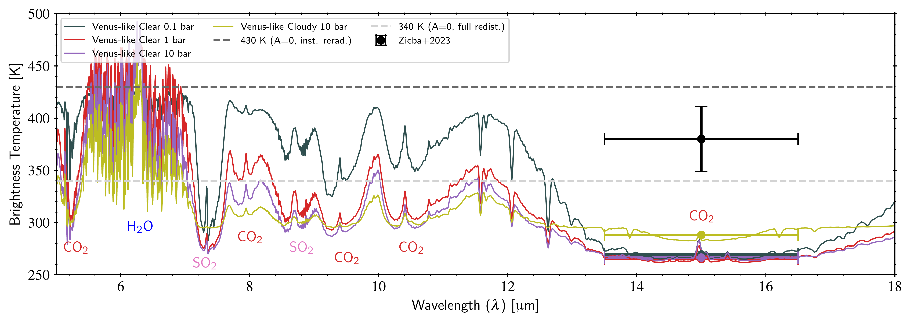
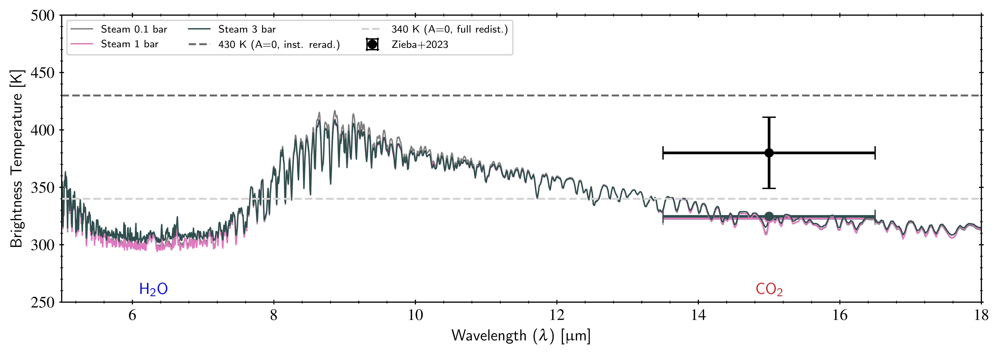
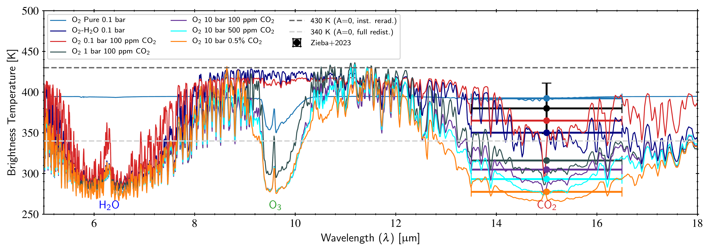
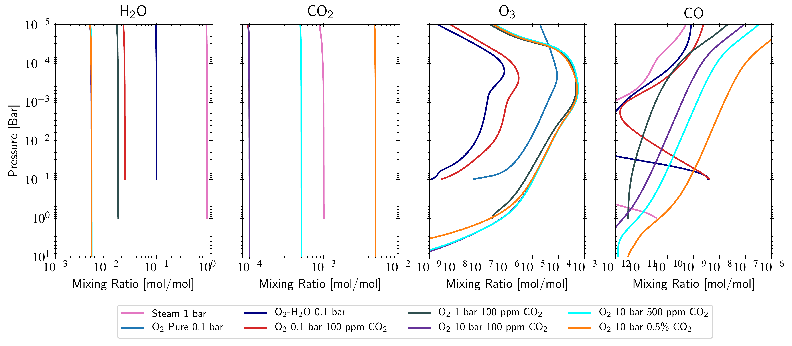
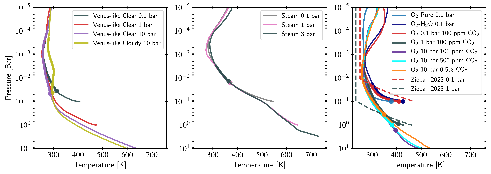

$\newcommand{\ensuremath}{}$
$\newcommand{\xspace}{}$
$\newcommand{\object}[1]{\texttt{#1}}$
$\newcommand{\farcs}{{.}''}$
$\newcommand{\farcm}{{.}'}$
$\newcommand{\arcsec}{''}$
$\newcommand{\arcmin}{'}$
$\newcommand{\ion}[2]{#1#2}$
$\newcommand{\textsc}[1]{\textrm{#1}}$
$\newcommand{\hl}[1]{\textrm{#1}}$
$\newcommand{\footnote}[1]{}$
$\newcommand{\um}{\upmum}$

# Potential Atmospheric Compositions of TRAPPIST-1 c constrained by JWST/MIRI Observations at 15$\um$ 

<mark>Appeared on: 2023-08-14</mark> -  _15 pages, accepted to APJL_

A. P. Lincowski, et al. -- incl., <mark>S. Zieba</mark>, <mark>L. Kreidberg</mark>

**Abstract:** The first JWST observations of TRAPPIST-1 c showed a secondary eclipse depth of 421 $\pm94$ ppm at 15 $\um$ , ${which is consistent with a bare rock surface or a thin, \ce{O2}-dominated, low \ce{CO2} atmosphere  ([ and Zieba 2023]()) .}$ Here, we further explore potential atmospheres for TRAPPIST-1 c by comparing the observed secondary eclipse depth to synthetic spectra of a broader range of plausible environments. ${ To self-consistently incorporate the impact of photochemistry and atmospheric composition on atmospheric thermal structure and predicted eclipse depth, we use a two-column climate model coupled to a photochemical model, and simulate \ce{O2}-dominated, Venus-like, and steam atmospheres.}$ We find that a broader suite of plausible atmospheric compositions are also consistent with the data.  For lower pressure atmospheres (0.1 bar), our $\ce{O2}$ - $\ce{CO2}$ atmospheres produce eclipse depths within 1 $\sigma$ of the data, consistent with the modeling results of [ and Zieba (2023)]() . ${However, for higher-pressure atmospheres, }$ our models produce different temperature-pressure profiles and are less pessimistic, with 1--10 bar $\ce{O2}$ , 100 ppm $\ce{CO2}$ models within 2.0--2.2 $\sigma$ of the measured secondary eclipse depth, and up to 0.5 \% $\ce{CO2}$ within 2.9 $\sigma$ . ${Venus-like atmospheres are still unlikely.}$ For thin $\ce{O2}$ atmospheres of 0.1 bar with a low abundance of $\ce{CO2}$ ( $\sim$ 100 ppm), up to 10 \% water vapor can be present and still provide an eclipse depth within 1 $\sigma$ of the data. ${We compared the TRAPPIST-1 c data to modeled steam atmospheres of $\leq$ 3 bar, which are 1.7--1.8$\sigma$ from the data and not conclusively ruled out. More data will be required to discriminate between possible atmospheres, or to more definitively support the bare rock hypothesis.}$

**Figure 2. -** Brightness temperature spectra for the dayside hemisphere of all modeled environments, with points corresponding to the model spectra convolved to the F1500W filter band over the band's wavelength extent (horizontal error bars show the FWHM of the filter band). We also plot lines for 340 K (blackbody, no atmosphere, full heat redistribution), and 430 K (blackbody, no atmosphere, no heat redistribution), along with the data point measured by [ and Zieba (2023)](), which has a brightness temperature equivalent to $380\pm31$ K. _Top:_ Venus-like modeled environments. _{Middle_:} steam environments. _Bottom:_\ce{O2}-dominated environments. The Venuses are between 2.6--3.1$\sigma$ from the measured eclipse depth and the steam atmospheres are within {1.7--1.8$\sigma$} of the measured eclipse depth. The clear-sky Venuses all exhibit similar \ce{CO2} bands between 0.1--10 bar. The steam environments spanning 0.1--3 bar are nearly identical across the MIR spectrum. The \ce{O2}-dominated environments, with varying amounts of \ce{CO2}, exhibit the largest range in their spectra, and those of $\geq1$ bar also exhibit strong ozone features. For reference, the F1500W brightness temperature values from [ and Zieba (2023)]() for their best-fit desiccated \ce{O2}-\ce{CO2} atmosphere is 395 K, and their best-fit bare rock surface is 420 K. (*fig:eclipse_venus*)

**Figure 5. -** Global mixing ratio profiles for modeled steam (1 bar) and \ce{O2} atmospheres. \ce{H2O} and \ce{CO2} maintain evenly mixed profiles for each case. Ozone and CO are photochemically generated. As discussed in the main text, some of the cases do have CO outgassing, as seen here in the profiles.  (*fig:mixes*)

**Figure 1. -** Day-side hemisphere temperature structures for all modeled atmospheres: Venus-like (left panel), steam atmospheres (middle panel) and \ce{O2}-\ce{CO2} atmospheres (right panel). {For our modeled atmospheres, we have used a thicker line to show the layers over which the 15 $\um$  band reached optical depth of 1 (indicating the effective emission layer), for each model atmosphere. The thick dots indicate the lowest layer probed in the 15 $\um$  band.} In the right panel, we also included two example temperature-pressure profiles from [ and Zieba (2023)]() for 0.1 and 1 bar \ce{O2}-dominated atmospheres, each with 100 ppm \ce{CO2}. A wide variety of temperature profiles are possible for TRAPPIST-1 c under different atmospheric compositions. Although surface temperatures differ widely, note the similarities in {emission temperatures/pressures probed} for similar atmospheric compositions.  (*fig:atms*)

