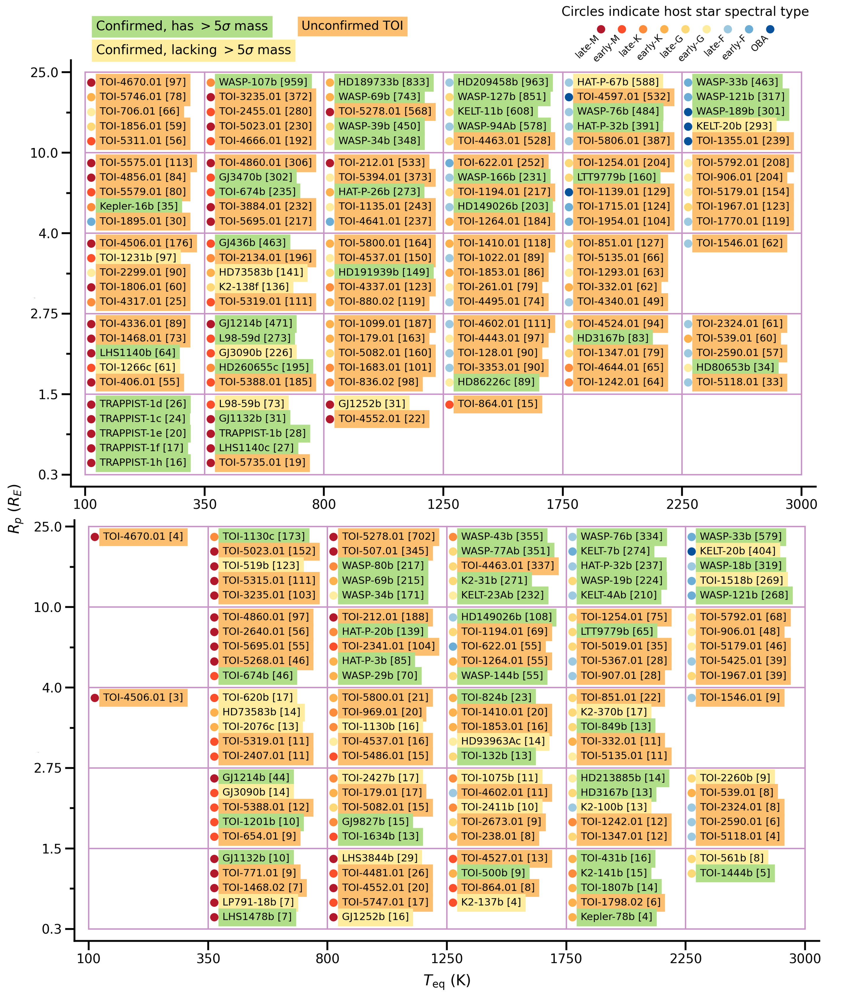
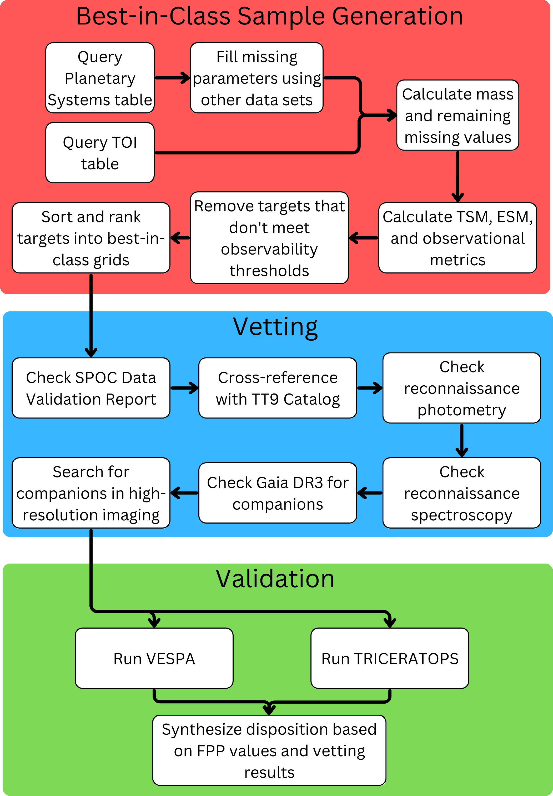
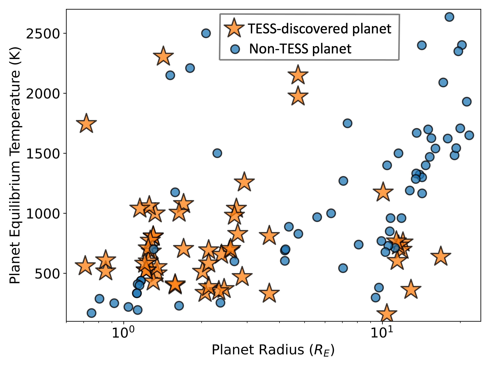

$\newcommand{\ensuremath}{}$
$\newcommand{\xspace}{}$
$\newcommand{\object}[1]{\texttt{#1}}$
$\newcommand{\farcs}{{.}''}$
$\newcommand{\farcm}{{.}'}$
$\newcommand{\arcsec}{''}$
$\newcommand{\arcmin}{'}$
$\newcommand{\ion}[2]{#1#2}$
$\newcommand{\textsc}[1]{\textrm{#1}}$
$\newcommand{\hl}[1]{\textrm{#1}}$
$\newcommand{\footnote}[1]{}$
$\newcommand{\vdag}{(v)^\dagger}$
$\newcommand$
$\newcommand$
$\newcommand$
$\newcommand$
$\newcommand$
$\newcommand$
$\newcommand$
$\newcommand$
$\newcommand$
$\newcommand$
$\newcommand$
$\newcommand$
$\newcommand$

# Identification of the Top TESS Objects of Interest for Atmospheric Characterization of Transiting Exoplanets with JWST

<mark>Appeared on: 2023-08-21</mark> -  _Submitted to AJ. Machine-readable versions of Tables 2 and 3 are included. 40 pages, 7 figures, 3 tables_

B. J. Hord, et al. -- incl., <mark>T. Mikal-Evans</mark>

**Abstract:** JWST has ushered in an era of unprecedented ability to characterize exoplanetary atmospheres. While there are over 5,000 confirmed planets, more than 4,000 TESS planet candidates are still unconfirmed and many of the best planets for atmospheric characterization may remain to be identified. We present a sample of TESS planets and planet candidates that we identify as "best-in-class" for transmission and emission spectroscopy with JWST. These targets are sorted into bins across equilibrium temperature $T_{\mathrm{eq}}$ and planetary radius $R{_\mathrm{p}}$ and are ranked by transmission and emission spectroscopy metric (TSM and ESM, respectively) within each bin. In forming our target sample, we perform cuts for expected signal size and stellar brightness, to remove sub-optimal targets for JWST. Of the 194 targets in the resulting sample, 103 are unconfirmed TESS planet candidates, also known as TESS Objects of Interest (TOIs). We perform vetting and statistical validation analyses on these 103 targets to determine which are likely planets and which are likely false positives, incorporating ground-based follow-up from the TESS Follow-up Observation Program (TFOP) to aid the vetting and validation process. We statistically validate $\vp$ TOIs, marginally validate $\marginal$ TOIs to varying levels of confidence, deem $\falsep$ TOIs likely false positives, and leave the dispositions for $\inconclusive$ TOIs as inconclusive. $\confirmed$ of the 103 TOIs were confirmed independently over the course of our analysis. We provide our final best-in-class sample as a community resource for future JWST proposals and observations. We intend for this work to motivate formal confirmation and mass measurements of each validated planet and encourage more detailed analysis of individual targets by the community.

**Figure 2. -** Our best-in-class targets for transmission (_top_) and emission (_bottom_) spectroscopy as of November 3, 2022 sorted by equilibrium temperature, $T_{\rm eq}$, and planetary radius, $R_{\rm p}$. Target names are shown with the respective spectroscopy metrics (ESM or TSM) in brackets next to the name. Targets are sorted within each cell by spectroscopy metric in descending order. Approximate stellar type of the host star is denoted by the colored circle to the left of each name, determined by the reported effective temperature. Targets are color-coded by mass status: green targets are confirmed planets with mass measurements $>$5$\sigma$, yellow targets are confirmed planets with mass measurements $<$5$\sigma$, and orange targets are unconfirmed \acp{TOI}. (*fig:original_grids*)

**Figure 3. -** A schematic outline of our analysis procedure. From the initial query of the Exoplanet Archive and generation of the best-in-class sample, each target went through every step of the procedure to check for factors that could indicate a false positive to arrive at a final disposition. Not every vetting step applied to every target due to lack of follow-up, so each vetting step was applied when possible but skipped when not. (*fig:vetting_procedure*)

**Figure 1. -** All of the \ac{JWST} exoplanet targets that are approved for transmission or emission spectroscopy observations in Cycles 1 and 2 across planetary equilibrium temperature and radius. Yellow stars represent approved \ac{JWST} targets that were discovered by \acs{TESS} while those represented by blue circles represent planets not discovered by \acs{TESS}. As evidenced by the plot, \acs{TESS}-discovered planets constitute a large proportion of approved \ac{JWST} Cycle 1 and 2 targets for transmission or emission spectroscopy and cover a wide range of parameter space. (*fig:jwst_tess_targets*)

