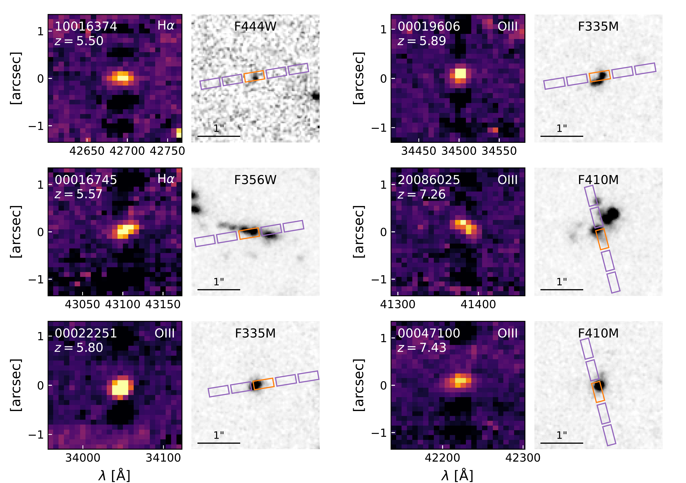
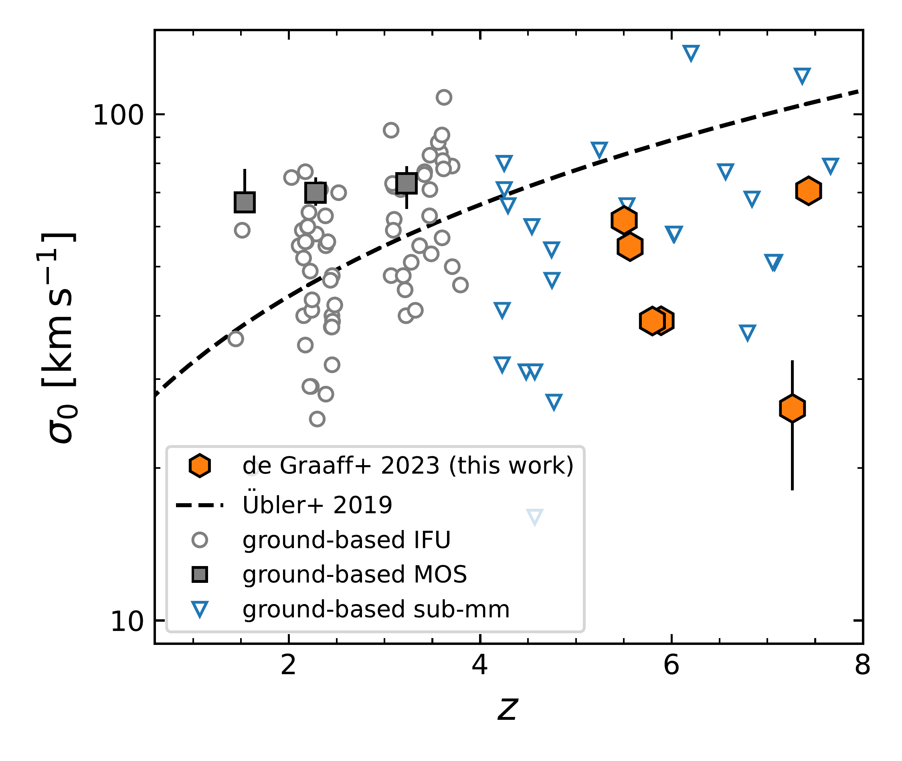
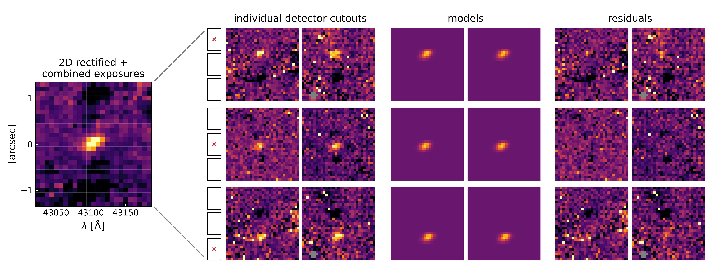

$\newcommand{\ensuremath}{}$
$\newcommand{\xspace}{}$
$\newcommand{\object}[1]{\texttt{#1}}$
$\newcommand{\farcs}{{.}''}$
$\newcommand{\farcm}{{.}'}$
$\newcommand{\arcsec}{''}$
$\newcommand{\arcmin}{'}$
$\newcommand{\ion}[2]{#1#2}$
$\newcommand{\textsc}[1]{\textrm{#1}}$
$\newcommand{\hl}[1]{\textrm{#1}}$
$\newcommand{\footnote}[1]{}$
$\newcommand{\kms}{\rm km s^{-1}}$
$\newcommand{\Msun}{\rm M_\odot}$
$\newcommand{\re}{r_{\rm e}}$
$\newcommand{\rt}{r_{\rm t}}$
$\newcommand{\va}{v_{\rm a}}$
$\newcommand{\vc}{v_{\rm circ}}$
$\newcommand{\vdisp}{\sigma_0}$
$\newcommand{\Mdyn}{M_{\rm dyn}}$
$\newcommand{\Mgas}{M_{\rm gas}}$
$\newcommand{\Mbar}{M_{\rm bar}}$
$\newcommand{\micron}{\rm \mu m}$
$\newcommand{\arraystretch}{1.3}$
$\newcommand{\arraystretch}{1.3}$
$\newcommand{\arraystretch}{1.3}$

# Ionised gas kinematics and dynamical masses of $z\gtrsim6$ galaxies from JADES/NIRSpec high-resolution spectroscopy   

<mark>Appeared on: 2023-08-22</mark> -  _Software for JWST/NIRSpec MSA modelling (slit losses, 1D LSFs and 2D model fitting) publicly available at this https URL_

<mark>A. d. Graaff</mark>, et al. -- incl., <mark>H.-W. Rix</mark>

**Abstract:** We explore the kinematic gas properties of six $5.5<z<7.4$ galaxies in the JWST Advanced Deep Extragalactic Survey (JADES), using high-resolution JWST/NIRSpec multi-object spectroscopy of the rest-frame optical emission lines [ O ${\sc iii}$ ] and H $\alpha$ . The objects are small and of low stellar mass ( $\sim 1 $ kpc; $M_*\sim10^{7-9} \Msun$ ), less massive than any galaxy studied kinematically at $z>1$ thus far. The cold gas masses implied by the observed star formation rates are $\sim 10\times$ larger than the stellar masses. We find that their ionised gas is spatially resolved by JWST,  with evidence for broadened lines and spatial velocity gradients. Using a simple thin-disc model, we fit these data with a novel forward modelling software that accounts for the complex geometry, point spread function, and pixellation of the NIRSpec instrument. We find the sample to include both rotation- and dispersion-dominated structures, as we detect velocity gradients of $v(\re)\approx100-150 \kms$ , and find velocity dispersions of $\vdisp\approx 30-70 \kms$ that are comparable to those at cosmic noon. The dynamical masses implied by these models ( $\Mdyn\sim10^{9-10} \Msun$ ) are larger than the stellar masses by up to a factor 40, and larger than the total baryonic mass (gas + stars) by a factor of $\sim 3$ . Qualitatively, this result is robust even if the observed velocity gradients reflect ongoing mergers rather than rotating discs.  Unless the observed emission line kinematics is dominated by outflows, this implies that the centres of these galaxies are dark-matter dominated or that star formation is $3\times$ less efficient, leading to higher inferred gas masses.

**Figure 6. -** Sample of six spatially-resolved high-redshift objects in JADES. Left panels show cutouts of the emission lines in the 2D rectified and combined spectra obtained with the high-resolution G395H grating. Negatives in the cutouts are the result of the background subtraction method used. Right panels show NIRCam image cutouts for each object (JADES, FRESCO), for the band that most closely resembles the emission line morphology (Section $\re$f{sec:nircam}). The 3-shutter slits and 3-point nodding pattern used result in an effective area of 5 shutters: the shutter encompassing the source is shown in orange, and the shutters used for background subtraction are shown in purple.   (*fig:sample_overview*)

**Figure 1. -** Velocity dispersion of the ionised gas as a function of redshift. The dashed line shows the fit from [Übler, Genzel and Wisnioski (2019)]() for ionised gas at $0.6<z<2.6$ extrapolated to higher redshifts, while circles show results from a selection of ground-based IFU surveys in the near-infrared  ([Turner, Cirasuolo and Harrison 2017](), [Renzini and Mancini 2018]())  and squares the results from ground-based near-infrared MOS data \citep[the resolved and aligned sample of][]{Price2020}. Blue triangles show results from various studies with ALMA, which measure the kinematics of the cold gas for massive, dusty star-forming galaxies  ([Neeleman, et. al 2020](), [Rizzo, Vegetti and Powell 2020](), [Fraternali, Karim and Magnelli 2021](), [Lelli and Fraternali 2021](), [Rizzo, et. al 2021](), [Herrera-Camus and Price 2022](), [Parlanti, Carniani and Pallottini 2023]()) . The high-redshift objects observed with JWST are dynamically approximately equally turbulent to the observations of more massive galaxies at cosmic noon, and do not follow the trend of increasing $\vdisp$ with redshift observed at $z<4$. (*fig:vdisp*)

**Figure 8. -** Example of the fitting procedure for object JADES-NS-00016745 (Fig. $\re$f{fig:sample_overview}). Although the final combination of all exposures (left) was used for our initial visual inspection and sample selection, the pixels in this spectrum are highly correlated. Instead of using this combined spectrum, we simultaneously fit to all individual exposures obtained. In the case of JADES-NS-00016745 two exposures were taken per nodding position, resulting in six independent measurements for one 3-point nodding pattern with NIRSpec. To combat the undersampled PSF of NIRSpec, we perform our modelling in the detector plane, propagating parametric models to the exact same location on the detector as the observed data. The likelihood is then computed from the combination of all residual images. Pixels flagged by the reduction pipeline as affected by cosmic rays are masked and shown in grey.  (*fig:method*)

