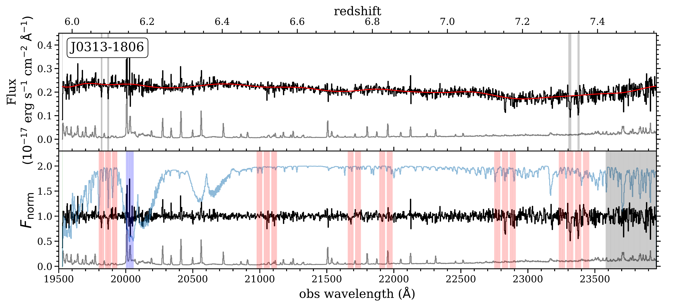
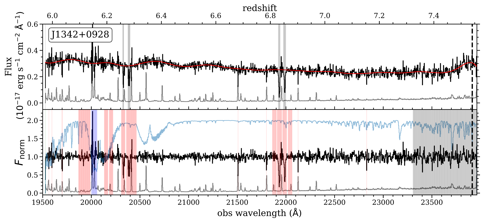
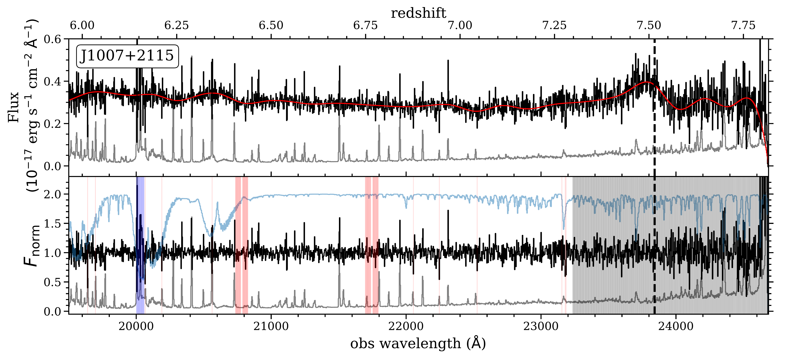
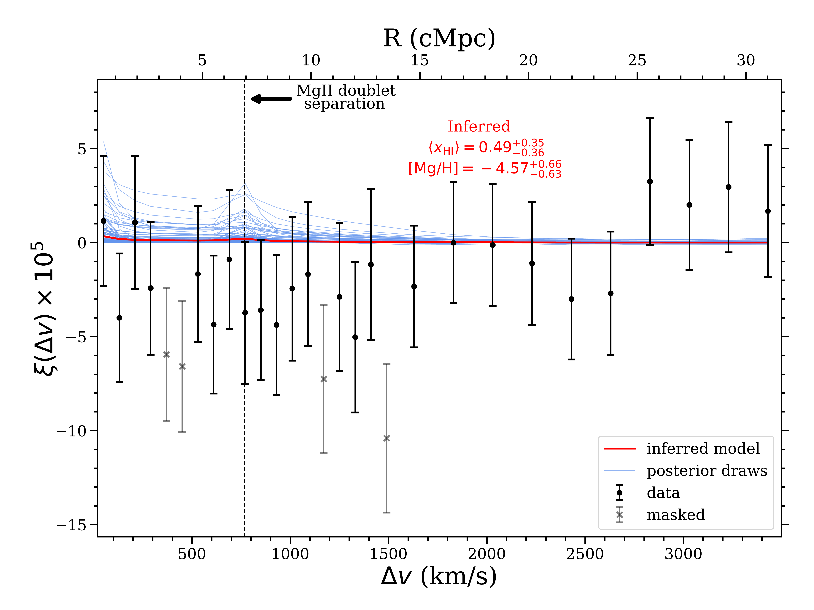
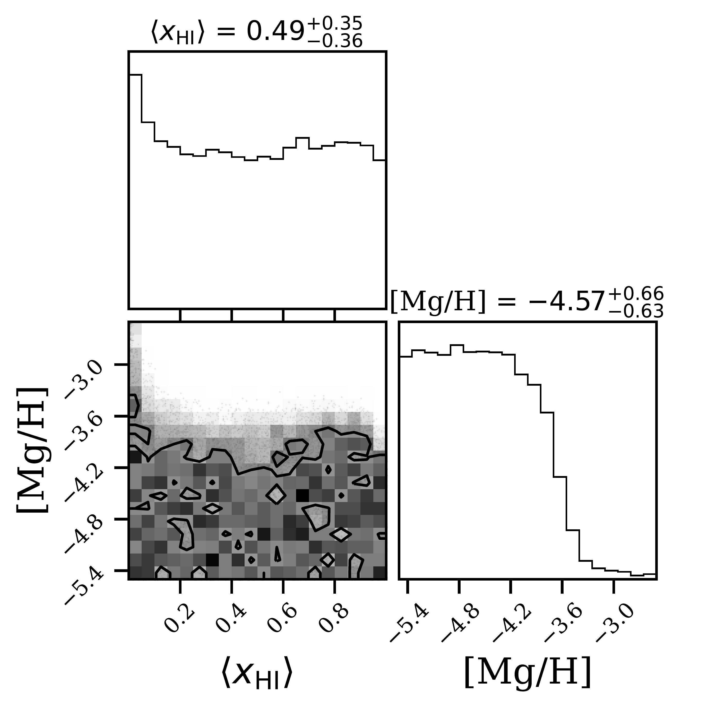
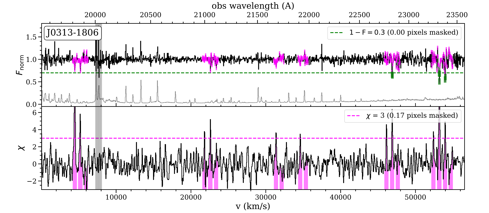
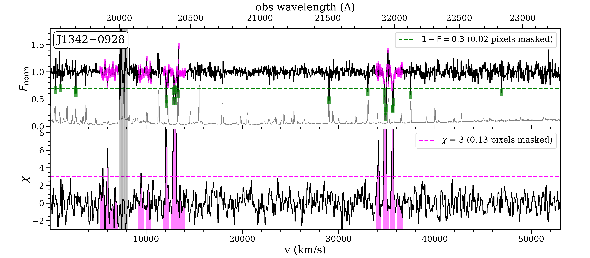
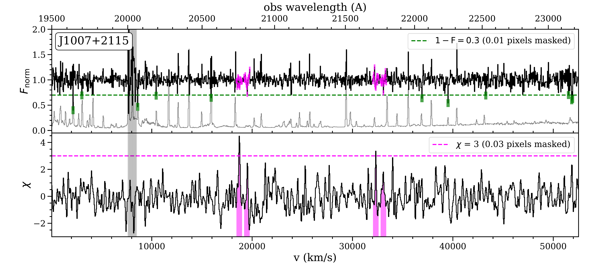

$\newcommand{\ensuremath}{}$
$\newcommand{\xspace}{}$
$\newcommand{\object}[1]{\texttt{#1}}$
$\newcommand{\farcs}{{.}''}$
$\newcommand{\farcm}{{.}'}$
$\newcommand{\arcsec}{''}$
$\newcommand{\arcmin}{'}$
$\newcommand{\ion}[2]{#1#2}$
$\newcommand{\textsc}[1]{\textrm{#1}}$
$\newcommand{\hl}[1]{\textrm{#1}}$
$\newcommand{\footnote}[1]{}$
$\newcommand{\actaa}{\rm Acta. Astr.}$
$\newcommand{\apj}{\rm ApJ}$
$\newcommand{\apjl}{\rm ApJL}$
$\newcommand{\apjs}{\rm ApJS}$
$\newcommand{\aj}{\rm AJ}$
$\newcommand{\jcap}{\rm JCAP}$
$\newcommand{\mnras}{\rm MNRAS}$
$\newcommand{\nat}{\rm Nature}$
$\newcommand{\pasj}{\rm PASJ}$
$\newcommand{\pasp}{\rm PASP}$
$\newcommand{\pasa}{\rm PASA}$
$\newcommand{\aap}{\rm AAP}$
$\newcommand{\araa}{\rm ARA\&A}$
$\newcommand{\na}{\rm New Astronomy}$
$\newcommand{\nar}{\rm New Astronomy Review}$
$\newcommand{\prl}{\rm PRL}$
$\newcommand{\prd}{\rm PRD}$
$\newcommand{\apss}{\rm Ap\&SS}$
$\newcommand{\physrep}{\rm Physics Reports}$
$\newcommand{\rmxaa}{\rm RMXAA}$
$\newcommand{\lya}{Ly\alpha}$
$\newcommand{\hcmpc}{h^{-1} \mbox{ cMpc}}$
$\newcommand{\mgii}{\ion{Mg}{\uppercase{II}}}$
$\newcommand{\qsoa}{J0313-1806}$
$\newcommand{\qsob}{J1342+0928}$
$\newcommand{\qsoc}{J0252-0503}$
$\newcommand{\qsod}{J0038-1527}$

# First measurement of the $\ion{Mg}{\uppercase{II}}$ forest correlation function in the Epoch of Reionization

<mark>Appeared on: 2023-08-24</mark> -  _Submitted to MNRAS; 23 pages, 21 figures, 1 table_

S. S. Tie, et al. -- incl., <mark>E. Bañados</mark>

**Abstract:** In the process of producing the roughly three ionizing photons per atom required to reionize the IGM, the same massive stars explode and eject metals into their surroundings, enriching the Universe to $Z\sim 10^{-3} Z_{\odot}$ . While the overly sensitive Ly $\alpha$ transition makes Gunn-Peterson absorption of background quasar light an ineffective probe of reionization at $z > 6$ , strong low-ionization transitions like the $\ion{Mg}{II}$ $\lambda 2796,2804$ Å  doublet will give rise to a detectable `metal-line forest', if metals pollute the neutral IGM. We measure the auto-correlation of the $\ion{Mg}{II}$ forest transmission using a sample of ten ground based $z \geq 6.80$ quasar spectra probing the redshift range $5.96 < z_{\rm \ion{Mg}{II}} < 7.42$ ( $z_{\rm \ion{Mg}{II}, median} = 6.47$ ).  The correlation function exhibits strong small-scale clustering and a pronounced peak at the doublet velocity  ( $\Delta v = 768 {\rm km s^{-1}}$ ) arisingfrom strong absorbers in the CGM of galaxies. After these strong absorbers are identified and masked the signal is consistent with noise. Our measurements are compared to a suite of models generated by combining a large hydrodynamical simulation with a semi-numerical reionization topology, assuming a simple uniform enrichment model.  We obtain a 95 \% credibility upper limit of $[{\rm Mg/H}] <-3.73$ at $z_{\rm \ion{Mg}{II},median} = 6.47$ , assuming uninformative priors on [ Mg/H ] and the IGM neutral fraction $x_{\rm{\ion{H}{I}}}$ .Splitting the data into low- $z$ ( $5.96 < z_{\rm \ion{Mg}{II}} < 6.47$ ; $z_{\rm \ion{Mg}{II},median} = 6.235$ ) and high- $z$ ( $6.47 < z_{\rm \ion{Mg}{II}} < 7.42$ ; $z_{\rm \ion{Mg}{II},median} = 6.72$ ) subsamples again yields null-detections and  95 \% upper limits of $[{\rm Mg/H}] <-3.75$ and $[{\rm Mg/H}] <-3.45$ , respectively.  These first measurements set the stage for an approved JWST Cycle 2 program (GO 3526) targeting a similar number of quasars that will be an order of magnitude more sensitive, making the $\ion{Mg}{II}$ forest an emerging powerful tool to deliver precision constraints on the reionization and enrichment history of the Universe.

**Figure 3. -** Three example spectra from our dataset, J0313$-$1806 (top), J1342$+$0928 (middle), and J1007$+$2115 (bottom). In the top panels of each quasar, the red line  is the fitted quasar continuum, the faint black line is the spectral noise, and the shaded regions indicate masks obtained from \texttt{PypeIt} reduction and from visually-detected strong absorbers, which are applied before continuum fitting. The bottom panel of each quasar shows the continuum-normalized spectrum. Also shown is the telluric spectrum in blue. The multi-colored shaded regions indicate masks due to \texttt{PypeIt} reduction (if available, in green), proximity to quasars and where $z > z_{\rm{QSO}}$(gray), low SNR due to telluric absorption (blue), and detected CGM absorbers (red; see \S 4), where we use the unshaded regions for the correlation function measurement and inference. The vertical dashed lines indicate the quasar redshift. (*specj0313*)

**Figure 13. -** Results from our MCMC analyses in the all-$z$ redshift bin ($z_{\rm{$\ion${Mg}{II},med}} = 6.469$). _Left:_ Correlation function measured from our dataset compared with 200 random draws (blue lines) and the mean inferred model (red line) from the MCMC posterior distribution. The black points are measurements from our dataset, where we have masked the gray points before running the MCMC sampling (see Appendix A). The error bars are computed from the diagonal elements of the covariance matrix of the inferred model. _Right:_ Corner plot from MCMC sampling of the posterior distribution. The 95\% C.L. upper limit on [Mg/H] is $-3.73$. (*allz-mcmc*)

**Figure 8. -** Identified and subsequently masked CGM absorbers from J0313$-$1806 (top), J1342$+$0928 (middle), and J1007$+$2115 (bottom), where we have cut off regions of the spectra within the quasar proximity zone and beyond the quasar redshift. For each quasar, the top panel shows the continuum-normalized spectrum and the bottom panel shows the $\chi$ significance spectrum. The green and magenta horizontal lines indicate the thresholds for the $1 - \rm{F}$ and $\chi$ cuts, respectively (note that we additionally mask pixels $\pm 300$ km/s around pixels with $\chi > 3$). Pixels that are masked by the respective cuts are colored similarly. Gray shaded regions are regions of telluric absorptions. Our masking procedure results in a number of weak and strong absorber candidates, while recovering known strong absorbers. (*masked-all-qso*)

