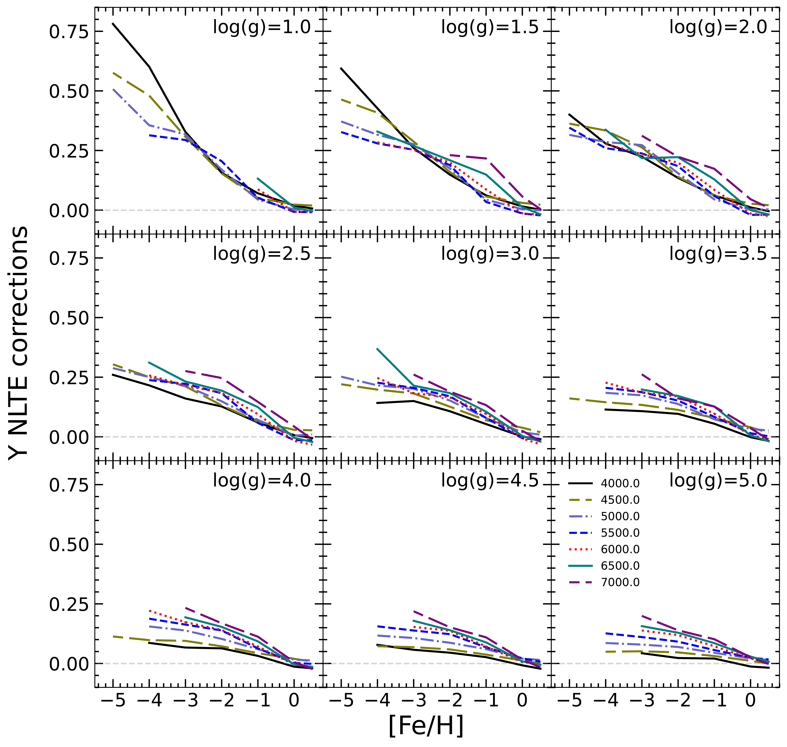
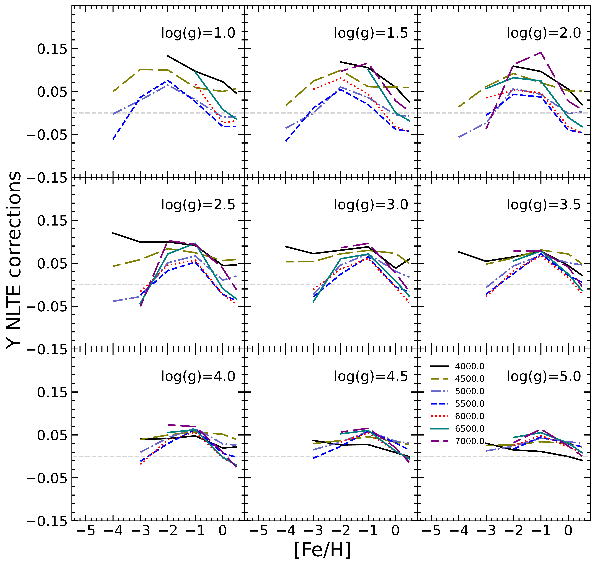
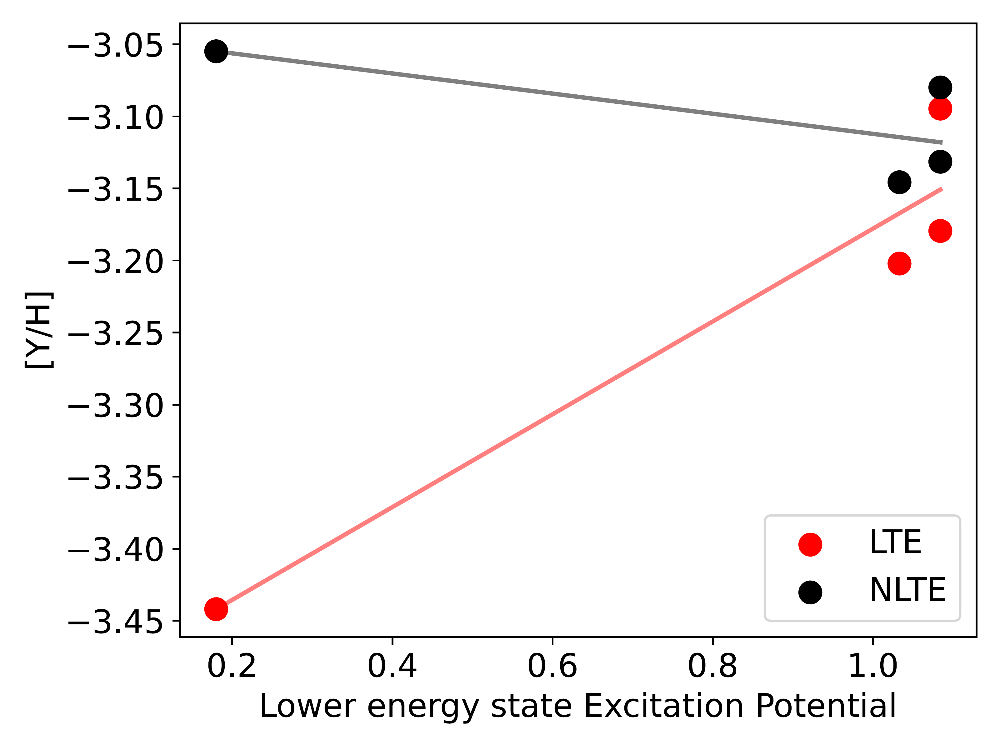
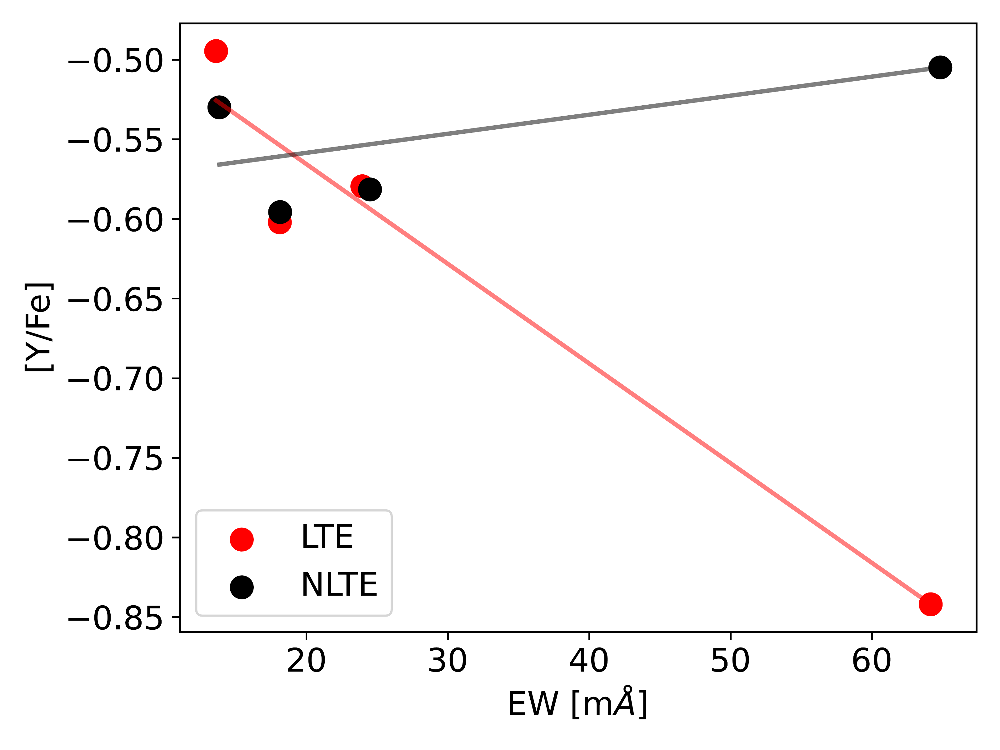
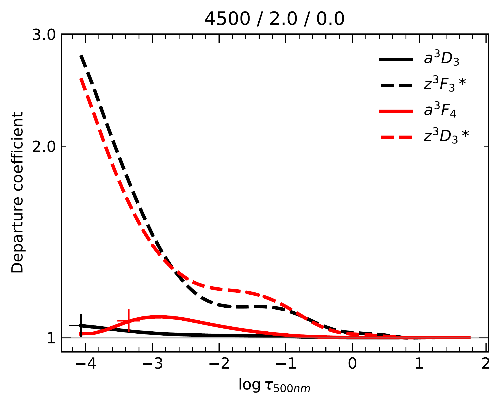
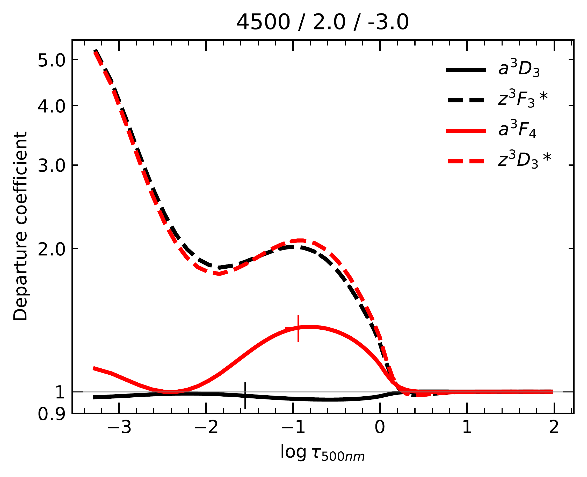
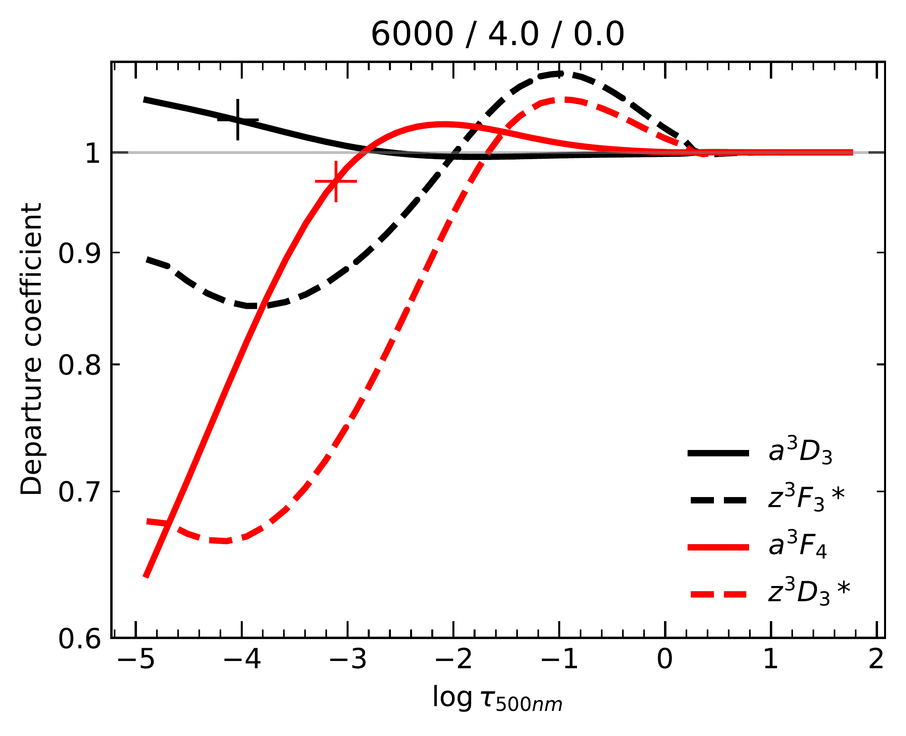
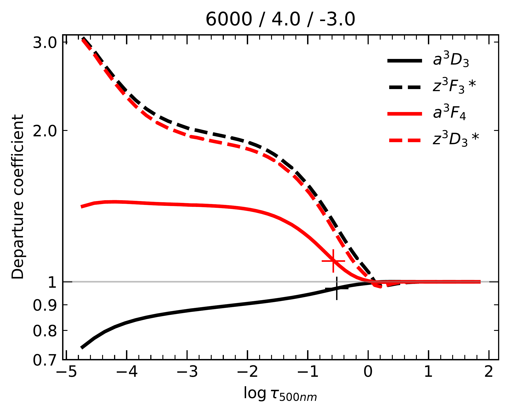

$\newcommand{\ensuremath}{}$
$\newcommand{\xspace}{}$
$\newcommand{\object}[1]{\texttt{#1}}$
$\newcommand{\farcs}{{.}''}$
$\newcommand{\farcm}{{.}'}$
$\newcommand{\arcsec}{''}$
$\newcommand{\arcmin}{'}$
$\newcommand{\ion}[2]{#1#2}$
$\newcommand{\textsc}[1]{\textrm{#1}}$
$\newcommand{\hl}[1]{\textrm{#1}}$
$\newcommand{\footnote}[1]{}$
$\newcommand{\teff}{T_{\rm eff}}$
$\newcommand{\logg}{\log g}$
$\newcommand{\vmic}{\xi_{\rm t}}$
$\newcommand{\vmac}{V_{\rm mac}}$
$\newcommand{\EW}{W_{\lambda}}$
$\newcommand{\mA}{{\rm mÅ}}$
$\newcommand{\Elow}{E_{\rm low}}$
$\newcommand{\Eup}{E_{\rm up}}$
$\newcommand{\SH}{S\!_{\rm H}}$
$\newcommand{\footnoterule}$
$\newcommand{\footnoterule}$

# Observational constraints on the origin of the elements. VII. NLTE analysis of Y II lines in spectra of cool stars and implications for Y as a Galactic chemical clock

<mark>Appeared on: 2023-08-24</mark> -  _12 pages, 10 figures, accepted by MNRAS_

<mark>N. Storm</mark>, <mark>M. Bergemann</mark>

**Abstract:** $\noindent$ Yttrium (Y), a key s-process element, is commonly used in nucleosynthesis studies and as a Galactic chemical clock when combined with magnesium (Mg). We study the applicability of the previously assumed LTE line formation assumption in Y abundance studies of main-sequence and red giant stars, and probe the impact of NLTE effects on the [ Y/Mg ] ratio, a proposed stellar age indicator. We derive stellar parameters, ages, and NLTE abundances of Fe, Mg, and Y for 48 solar analogue stars from high-resolution  spectra acquired within the Gaia-ESO survey. For Y, we present a new NLTE atomic model. We determine a solar NLTE abundance of A(Y) $_{\rm NLTE}=2.12\pm0.04$ dex, $0.04$ dex higher than LTE. NLTE effects on Y abundance are modest for optical Y II lines, which are frequently used in Sun-like stars diagnostics. NLTE has a small impact on the [ Y/Mg ] ratio in such stars. For metal-poor red giants, NLTE effects on Y II lines are substantial, potentially exceeding $+0.5$ dex. For the Gaia/4MOST/WEAVE benchmark star, HD 122563, we find the NLTE abundance ratio of [ Y/Fe ] $_{\rm NLTE}=-0.55\pm0.04$ dex with consistent abundances obtained from different Y II lines. NLTE has a differential effect on Y abundance diagnostics in late-type stars. They notably affect Y II lines in red giants and very metal-poor stars, which are typical Galactic enrichment tracers of neutron-capture elements. For main-sequence stars, NLTE effects on optical diagnostic Y II lines remain minimal across metallicities. This affirms the [ Y/Mg ] ratio's reliability as a cosmochronometer for Sun-like stars.

**Figure 9. -** Average NLTE corrections for the low-EP (multiplets 7,8,6) and medium-EP (multiplets 21, 23) Y II lines plotted against metallicity [Fe/H] of the model atmospheres. We adopt $\vmic = 2$ km/s and $\vmic = 1$ km/s for the models with log(g)$ \leq 3.5$ dex and log(g)$ > 3.5$ dex respectively. (*fig:nltecor*)

**Figure 5. -** Y abundances for HD 122563 ([Y/H] on the left and [Y/Fe] on the right) plotted as a function of lower energy state EP or EW. The red and black points represent respectively fitted LTE and NLTE abundances. Best-fit lines going through the low-EP line 3832.89 are also plotted in relevant colours. (*fig:yfe_yh_elow*)

**Figure 10. -** {Departure coefficients as a function of model atmosphere's optical depth for a red giant model on top ($\teff = 4500$ K, $\logg = 2.0$ dex for [Fe/H] = -3 and 0, respectively left and right plots) and a main-sequence on the bottom ($\teff = 4500$ K, $\logg = 2.0$ dex for [Fe/H] = -3 and 0, respectively left and right plots). Low-EP line (3832 Å) levels (a $^3$$D_3$ and z $^3$$F_3$*) are depicted in black and medium-EP line (4883 Å) levels (a $^3$$F_4$ and z $^3$$D_3$*) in red, with solid and dashed lines representing lower and upper levels, respectively. Vertical lines indicate line core at $\log \tau = 0$ for both low-EP (black) and medium-EP (red) lines.} (*fig:depcoef_rg*)

