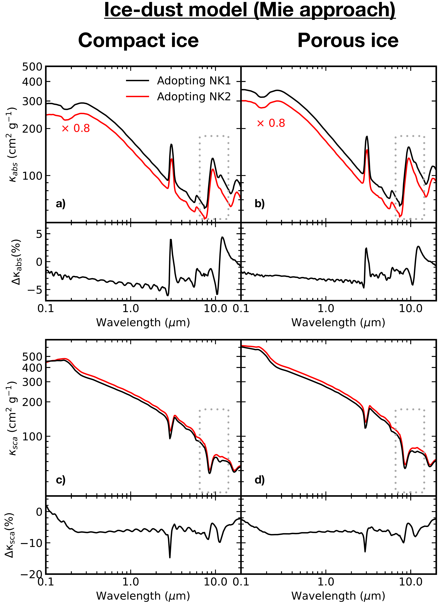
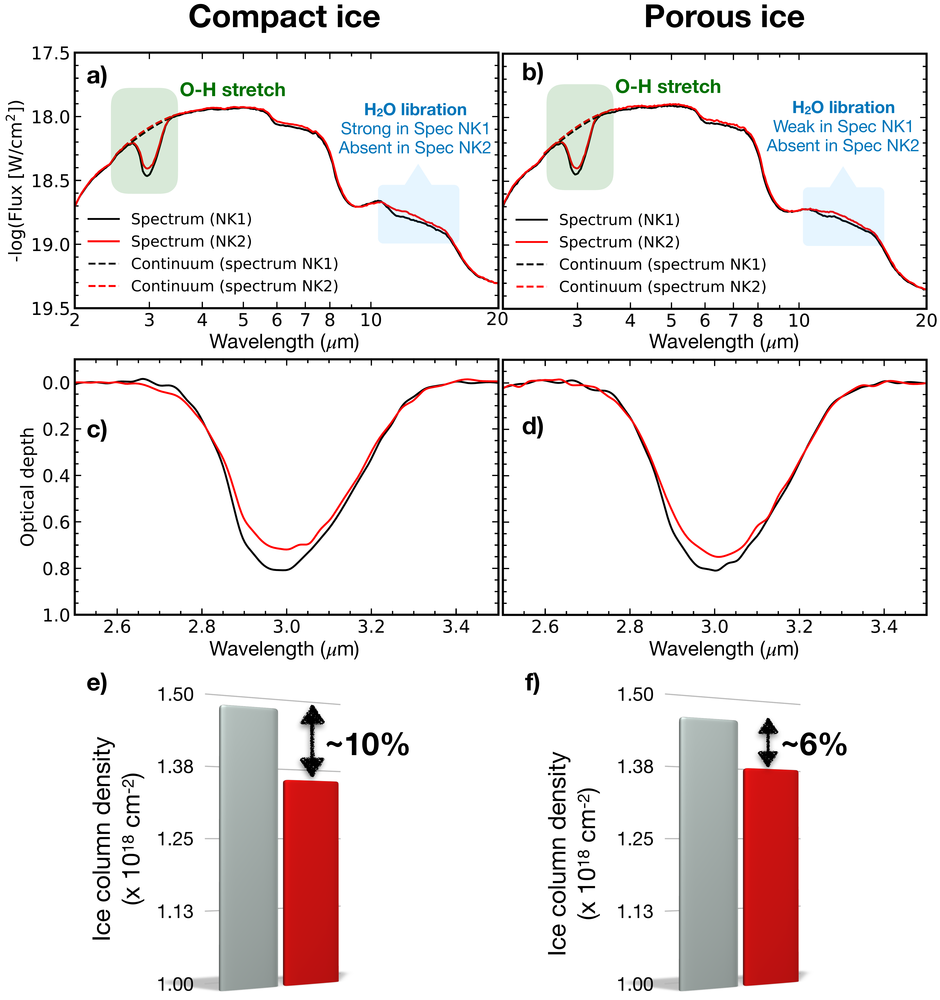

$\newcommand{\ensuremath}{}$
$\newcommand{\xspace}{}$
$\newcommand{\object}[1]{\texttt{#1}}$
$\newcommand{\farcs}{{.}''}$
$\newcommand{\farcm}{{.}'}$
$\newcommand{\arcsec}{''}$
$\newcommand{\arcmin}{'}$
$\newcommand{\ion}[2]{#1#2}$
$\newcommand{\textsc}[1]{\textrm{#1}}$
$\newcommand{\hl}[1]{\textrm{#1}}$
$\newcommand{\footnote}[1]{}$
$\newcommand{\arraystretch}{1.5}$
$\newcommand{\arraystretch}{1.5}$
$\newcommand{\arraystretch}{1.5}$

# Water ice: temperature-dependent refractive indexes and their astrophysical implications

<mark>Appeared on: 2023-08-25</mark> -  _Accepted for publication in A&A, 12 pages, 15 figures_

W. R. M. Rocha, et al. -- incl., <mark>J. He</mark>

**Abstract:** Inter- and circumstellar ices are largely composed of frozen water. Therefore, it is important to derive fundamental parameters for $H_2$ O ice such as absorption and scattering opacities for which accurate complex refractive indexes are needed. The primary goal of the work presented here is to derive ice-grain opacities based on accurate $H_2$ O ice complex refractive indexes at low temperatures and to assess the impact this has on the derivation of ice column densities and porosity in space. We use the \texttt{optool} code to derive ice-grain scattering and absorption opacity values based on new and previously reported mid-IR complex refractive index measurements of $H_2$ O ice, primarily in its amorphous form, but not exclusively. Next, we use those opacities in the \texttt{RADMC-3D} code to run a radiative transfer simulation of a protostellar envelope containing $H_2$ O ice, which is then used to calculate water ice column densities. We find that the real refractive index in the mid-IR of $H_2$ O ice at 30 K is $\sim$ 14 \% lower than previously reported in the literature. This has a direct impact on the ice column densities derived from the simulations of embedded protostars. Additionally, we find that ice porosity plays a significant role in the opacity of icy grains and that the $H_2$ O libration mode can be used as a diagnostic tool to constrain the porosity level. Finally, the refractive indexes presented here allow us to estimate a grain size detection limit of 18 $\mu$ m based on the 3 $\mu$ m band whereas the 6 $\mu$ m band allows tracing grain sizes larger than 20 $\mu$ m. Based on radiative transfer simulations using new mid-IR refractive indexes, we conclude that $H_2$ O ice leads to more absorption of infrared light than previously estimated. This implies that the 3 and 6 $\mu$ m bands remain detectable in icy grains with sizes larger than 10 $\mu$ m. Finally, we propose that also the $H_2$ O ice libration band can be used as a diagnostic tool to constrain the porosity level of the interstellar ice, in addition to the OH dangling bond, which is now routinely used for this purpose.

**Figure 3. -** Absorption (upper panels) and scattering (lower panels)  opacities of ice-dust grains assuming compact (left) and porous ices (right). Lines in black are the opacities assuming the water ice refractive index derived in this paper, i.e., assuming $n_{700nm} = 1.16$(NK1), whereas curves in red show the opacities calculated using $n_{700nm} = 1.32$(NK2). The small panels below the large ones show the variation between the two opacities in percentage values. A small offset is performed on the absorption opacities for better readability. No offset is applied to the scattering opacity. The rectangular regions indicated by the grey dotted boxes are zoomed-in in Figure \ref{opac_mie_zoom}. (*opac_mie*)

**Figure 15. -** Wavelength-dependent refractive index of $H_2$O ice at different temperatures. Panels _ a_ and _ b_ show the real and imaginary parts of the complex refractive index in a broad-range perspective (0.3$-$20 $\mu$m). Panels _ c$-$h_ show zoom-ins of selected wavelengths in panels _ a_ and _ b_ indicated by the hatched areas. (*nkallT*)

**Figure 8. -** Effects of opacity values derived for grains under the DHS approach by assuming the NK1 and NK2 values. Panel $a$ shows the synthetic protostellar spectrum with $H_2$O ice and silicate absorption bands calculated from opacity models based on NK1 (black) and NK2 (red) refractive index values. The black and red and dashed lines over the 3 $\mu$m feature are the continuum. The blue box around 13 $\mu$m highlights the absence of the $H_2$O libration band in the spectrum derived from NK2 values. Panel $b$ displays the same as panel $a$ but for porous ice. Panels $c$ and $d$ present the $H_2$O ice column density derived from the optical depth spectrum using compact and porous ices, respectively. Finally, Panels $e$ and $f$ compare the ice column densities from both cases (grey: NK1; red: NK2). (*Nice*)

