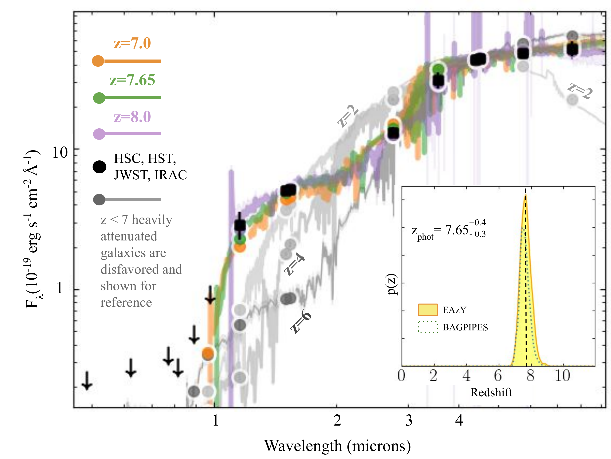
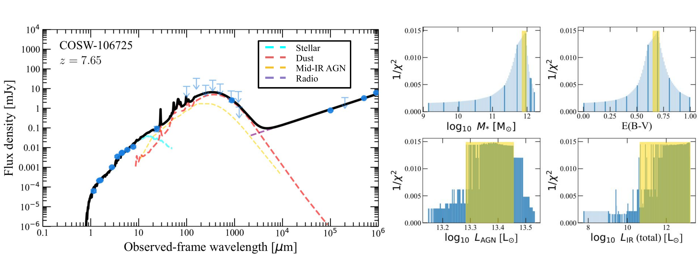
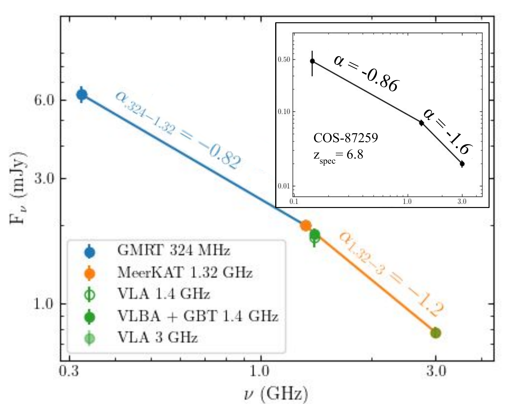

$\newcommand{\ensuremath}{}$
$\newcommand{\xspace}{}$
$\newcommand{\object}[1]{\texttt{#1}}$
$\newcommand{\farcs}{{.}''}$
$\newcommand{\farcm}{{.}'}$
$\newcommand{\arcsec}{''}$
$\newcommand{\arcmin}{'}$
$\newcommand{\ion}[2]{#1#2}$
$\newcommand{\textsc}[1]{\textrm{#1}}$
$\newcommand{\hl}[1]{\textrm{#1}}$
$\newcommand{\footnote}[1]{}$
$\newcommand{\vdag}{(v)^\dagger}$
$\newcommand$
$\newcommand$

# Uncovering a Massive z$\sim$7.65 Galaxy Hosting a Heavily Obscured Radio-Loud QSO Candidate in COSMOS-Web

<mark>Appeared on: 2023-08-25</mark> -  _Submitted to ApJL, Comments welcome_

E. Lambrides, et al. -- incl., <mark>K. Jahnke</mark>

**Abstract:** In this letter, we report the discovery of the highest redshift, heavily obscured, radio-loud QSO candidate selected using JWST NIRCam/MIRI, mid-IR, sub-mm, and radio imaging in the COSMOS-Web field. Using multi-frequency radio observations and mid-IR photometry, we identify a powerful, radio-loud (RL), growing supermassive black hole (SMBH) with significant spectral steepening of the radio SED ( $f_{1.32 \mathrm{GHz}} \sim 2$ mJy, $q_{24\micron} = -1.1$ , $\alpha_{1.32-3\mathrm{GHz}}=-1.2$ , $\Delta \alpha = -0.4$ ). In conjunction with ALMA, deep ground-based observations, ancillary space-based data, and the unprecedented resolution and sensitivity of JWST, we find no evidence of QSO contribution to the UV/optical/NIR data and thus infer heavy amounts of obscuration (N $_{\mathrm{H}} > 10^{23}$ cm $^{-2}$ ). Using the wealth of deep UV to sub-mm photometric data, we report a singular solution photo-z of $z_\mathrm{phot}$ = 7.65 $^{+0.4}_{-0.3}$ and estimate an extremely massive host-galaxy ( $\log M_{\star} = 11.92 \pm 0.06 \mathrm{M}_{\odot}$ ). This source represents the furthest known obscured RL QSO candidate, and its level of obscuration aligns with the most representative but observationally scarce population of QSOs at these epochs.

**Figure 3. -** Results from fitting the optical, NIR and MIR with {*\texttt{EAzY*py}}. Non-detections with 27 mag upper limits: HSC $g$, HSC $r$, HSC $i$, HSC $z$, HST _F814W_, HSC $y$. $>3 \sigma$ detections: JWST _F115W_, JWST _F150W_, HST _F160W_, JWST _F277W_, IRAC Channel 1, JWST _F444W_, IRAC Channel 2, IRAC Channel 3, JWST MIRI 7.7 \micron. The redshift is constrained to $z = 7.65^{+0.4}_{-0.3}$ fit with combinations of SSP template from  ([Bruzual and Charlot 2003]()) . Inset: We show the p(z) via EAzY and BAG (*fig:photoz*)

**Figure 4. -** _Left Panel:_ Optical-IR-radio SED fitting with BC03 stellar  ([Bruzual and Charlot 2003]()) , mid-IR AGN  ([Mullaney, et. al 2011]()) , Draine \& Li dust  ([Draine and Li 2007]())  and power-law radio templates (using the MICHI2 code;  ([Liu, Daddi and Schinnerer 2021]()) ). The black line indicates the composite best-fit model and the blue symbols are photometric data points, with upper limits shown as downward arrows. The stellar, mid-IR AGN, dust, and radio components are indicated by the cyan, yellow, red, and magenta dashed lines, respectively.
    _Right panels:_ The 1/$\chi^2$ distributions from the fitting for the four parameters: stellar mass, dust attenuation $E(B-V)$, QSO component's luminosity integrated over 10-1000 $\mu$m, and dust component's luminosity integrated over 8-1000 $\mu$m. The yellow highlighted regions correspond to the 95\% confidence intervals. (*fig:Opt-IR-radio SED*)

**Figure 1. -** Radio SED: All fluxes and associated errors are listed in Table \ref{tab:phot}. We measure the spectral slope between two sets of radio frequencies (blue line, orange line) and find significant spectral steepening indicative of high-$z$ RL QSO  ([Saxena, Jagannathan and Röttgering 2018](), [Endsley, Stark and Lyu 2022](), [Broderick, Drouart and Seymour 2022]()) . In the upper-right corner inset, we show the radio SED for the z$_{spec}=6.8$ heavily obscured RL AGN from  ([Endsley, Stark and Lyu 2022]())  for reference. (*fig:radio_sed*)

