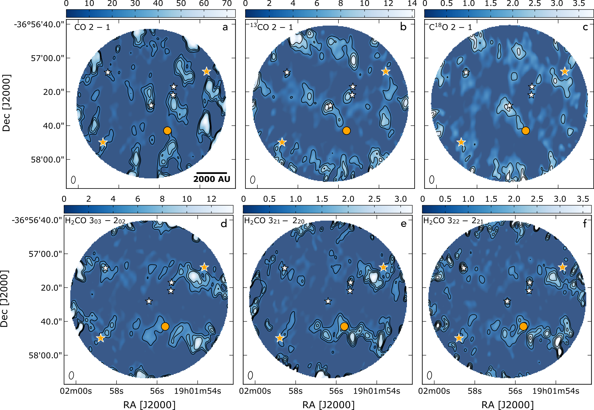
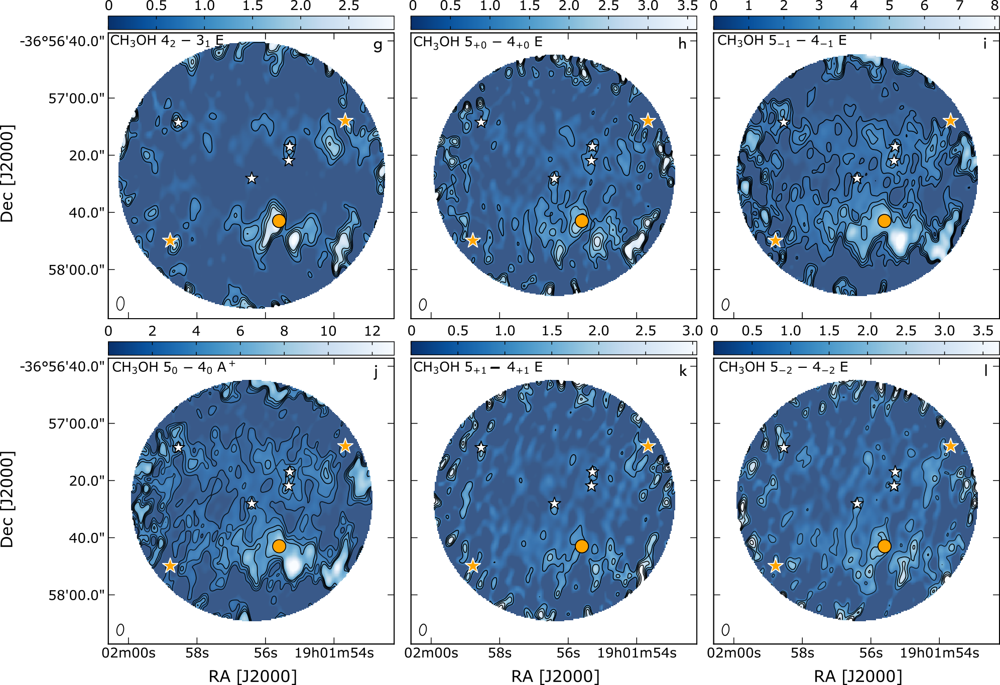
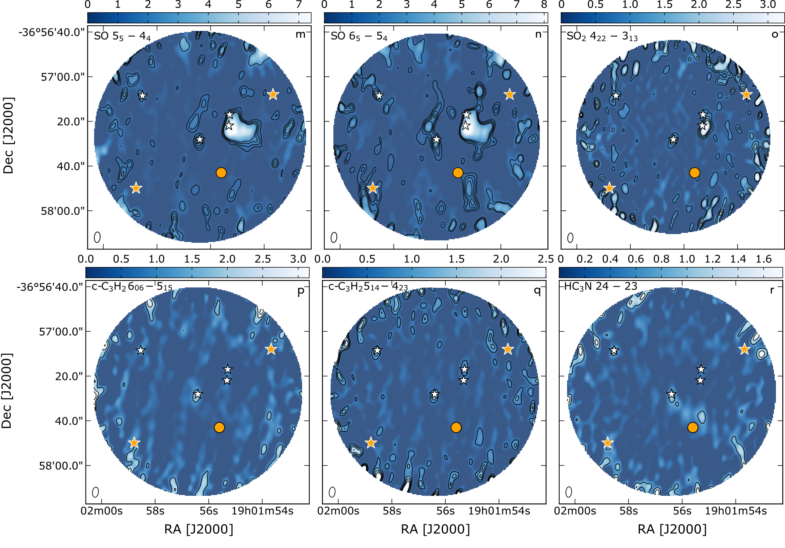
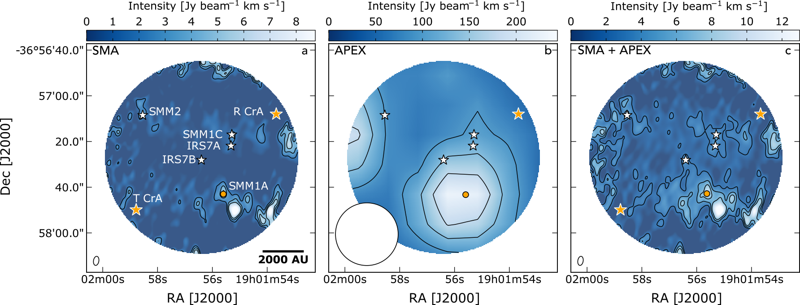

$\newcommand{\ensuremath}{}$
$\newcommand{\xspace}{}$
$\newcommand{\object}[1]{\texttt{#1}}$
$\newcommand{\farcs}{{.}''}$
$\newcommand{\farcm}{{.}'}$
$\newcommand{\arcsec}{''}$
$\newcommand{\arcmin}{'}$
$\newcommand{\ion}[2]{#1#2}$
$\newcommand{\textsc}[1]{\textrm{#1}}$
$\newcommand{\hl}[1]{\textrm{#1}}$
$\newcommand{\footnote}[1]{}$
$\newcommand{\change}[1]{#1}$
$\newcommand{\arraystretch}{1.4}$
$\newcommand{\arraystretch}{1.6}$
$\newcommand{\arraystretch}{1.8}$
$\newcommand{\arraystretch}{1.6}$
$\newcommand{\arraystretch}{1.3}$
$\newcommand{\arraystretch}{1.8}$

# Linking ice and gas in the Coronet cluster in Corona Australis

<mark>Appeared on: 2023-08-29</mark> -  _20 pages, 17 figures, accepted for publication in Astronomy & Astrophysics_

<mark>G. Perotti</mark>, et al.

**Abstract:** During the journey from the cloud to the disc, the chemical composition of the protostellar envelope material can be either preserved or processed to varying degrees depending on the surrounding physical environment. This works aims to constrain the interplay of solid (ice) and gaseous methanol ($CH_3$ OH) in the outer regions of protostellar envelopes located in the Coronet cluster in Corona Australis (CrA), and assess the importance of irradiation by the Herbig Ae/Be star R CrA. $CH_3$ OH is a prime test-case as it predominantly forms as a consequence of the solid-gas interplay (hydrogenation of condensed CO molecules onto the grain surfaces) and it  plays an important role in future complex molecular processing. We present 1.3 mm Submillimeter Array (SMA) and Atacama Pathfinder Experiment (APEX) observations towards the envelopes of four low-mass protostars in the Coronet. Eighteen molecular transitions of seven species are identified. We calculate $CH_3$ OH gas-to-ice ratios in this strongly irradiated cluster and compare them with ratios determined towards protostars located in less irradiated regions such as the Serpens SVS 4 cluster in Serpens Main and the Barnard 35A cloud in the $\lambda$ Orionis region. The $CH_3$ OH gas-to-ice ratios in the Coronet vary by one order of magnitude (from 1.2 $\times$ 10 $^{-4}$ to 3.1 $\times$ 10 $^{-3}$ ) which is similar to less irradiated regions as found in previous studies. We find that the $CH_3$ OH gas-to-ice ratios estimated in these three regions are remarkably similar despite the different UV radiation field intensities and formation histories. This result suggests that the overall $CH_3$ OH chemistry in the outer regions of low-mass envelopes is relatively independent of variations in the physical conditions and hence that it is set during the prestellar stage.

**Figure 9. -** Primary beam corrected integrated intensity maps in Jy beam$^{-1}$km s$^{-1}$ for the different species detected with the SMA. In each plot contours start at 5$\sigma$ and continue in intervals of 5$\sigma$, except for panel a-c for which contours start at 10$\sigma$ and continue in intervals of 10$\sigma$. Shown are (a) CO $J=2-1$($\sigma$= 0.96 Jy beam$^{-1}$km s$^{-1}$), (b) $^{13}$CO $J=2-1$($\sigma$= 0.32 Jy beam$^{-1}$km s$^{-1}$), (b) C$^{18}$O $J=2-1$($\sigma$= 0.13 Jy beam$^{-1}$km s$^{-1}$),  (d) $H_2$CO 3$_{03}-$2$_{02}$($\sigma$= 0.23 mJy beam$^{-1}$km s$^{-1}$), (e) $H_2$CO 3$_{21}-$2$_{20}$($\sigma$= 88 mJy beam$^{-1}$km s$^{-1}$), (f) $H_2$CO 3$_{22}-$2$_{21}$($\sigma$= 0.14 mJy beam$^{-1}$km s$^{-1}$). The circular field-of-view corresponds to the SMA primary beam. The size of the synthesised beam is shown in the lower left corner of each image. The white and orange stars and the orange circle mark the position of the Coronet cluster members as in Fig. \ref{rgb_rcra}. (*mom_zero_part1*)

**Figure 10. -** Same as Figure \ref{mom_zero_part1}. Primary beam corrected integrated intensity maps in Jy beam$^{-1}$km s$^{-1}$ for: (g) $CH_3$OH $4_2-$$3_1$($\sigma$= 88 mJy beam$^{-1}$km s$^{-1}$), (h) $CH_3$OH 5$_{+0}-$4$_{+0}$ E ($\sigma$= 0.12 Jy beam$^{-1}$km s$^{-1}$), (i) $CH_3$OH 5$_{-1}-$4$_{-1}$ E ($\sigma$=0.13 Jy beam$^{-1}$km s$^{-1}$), (j) $CH_3$OH 5$_{0}-$4$_{0}$ A$^{+}$($\sigma$= 0.17 Jy beam$^{-1}$km s$^{-1}$), (k) $CH_3$OH 5$_{+1}-$4$_{+1}$ E ($\sigma$= 0.13 Jy beam$^{-1}$km s$^{-1}$), and (l) $CH_3$OH 5$_{-2}-$4$_{-2}$ E ($\sigma$= 0.15 mJy beam$^{-1}$km s$^{-1}$) detected by the SMA (panel g), and in the combined SMA and APEX data (panels h-l).Same as Figure \ref{mom_zero_part1}. Primary beam corrected integrated intensity maps in Jy beam$^{-1}$km s$^{-1}$ for : (m) SO $5_5-4_4$($\sigma$= 0.12 Jy beam$^{-1}$km s$^{-1}$), (n) SO $6_5-5_4$($\sigma$= 0.13 Jy beam$^{-1}$km s$^{-1}$), (o) $SO_2$ 4$_{22}-3_{13}$($\sigma$= 0.15 Jy beam$^{-1}$km s$^{-1}$), (p) $c$-$C_3$$H_2$ 6$_{06}-$5$_{15}$($\sigma$= 0.13 Jy beam$^{-1}$km s$^{-1}$), (q) $c$-$C_3$$H_2$ 5$_{14}-$4$_{23}$($\sigma$= 0.11 Jy beam$^{-1}$km s$^{-1}$), and (r) $HC_3$N $J=24-23$($\sigma$= 71 mJy beam$^{-1}$km s$^{-1}$) detected by the SMA. (*mom_zero_part2*)

**Figure 7. -** Primary beam corrected integrated intensity maps for $CH_3$OH $J=5_0 - 4_0$ A$^+$ transition ($E_\mathrm{u}=34.8 $K) at 241.791 GHz detected by the SMA (a), by the APEX telescope (b), and in the combined interferometric SMA and single-dish APEX data (c). All lines are integrated between 6 and 12.5 km s$^{-1}$. Contours start at 5$\sigma$($\sigma_\mathrm{SMA}$= 0.16 Jy beam$^{-1}$km s$^{-1}$, $\sigma_\mathrm{APEX}$= 2 Jy beam$^{-1}$km s$^{-1}$, $\sigma_\mathrm{SMA+APEX}$= 0.17 Jy beam$^{-1}$km s$^{-1}$) and follow in steps of 5$\sigma$. The circular field-of-view corresponds to the primary beam of the SMA observations. The synthesised beams are displayed in white in the bottom left corner of each panel. (*mom0_meth*)

