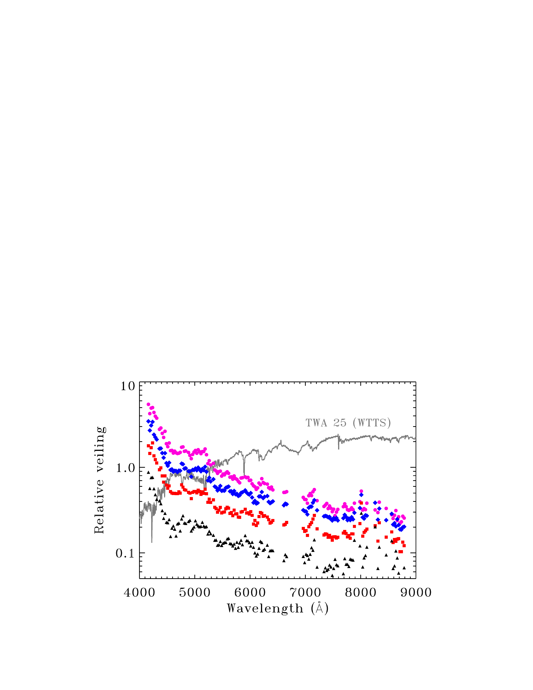
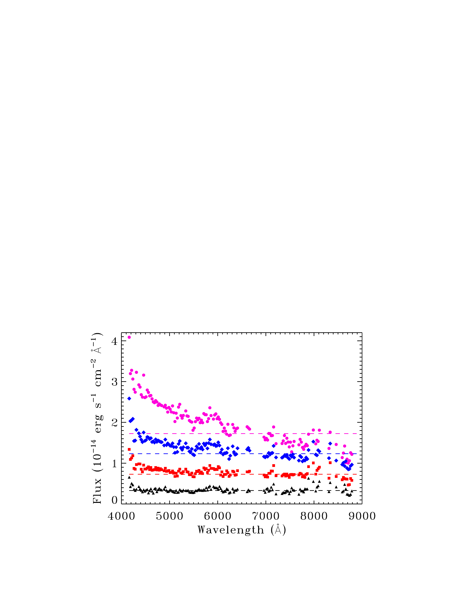
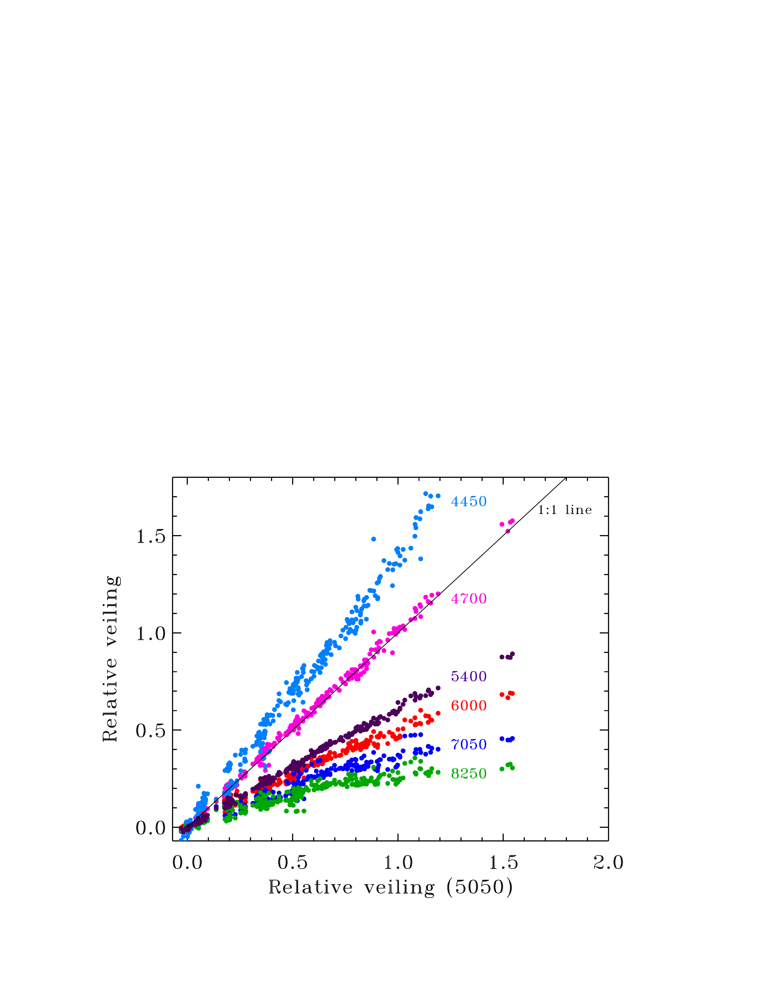
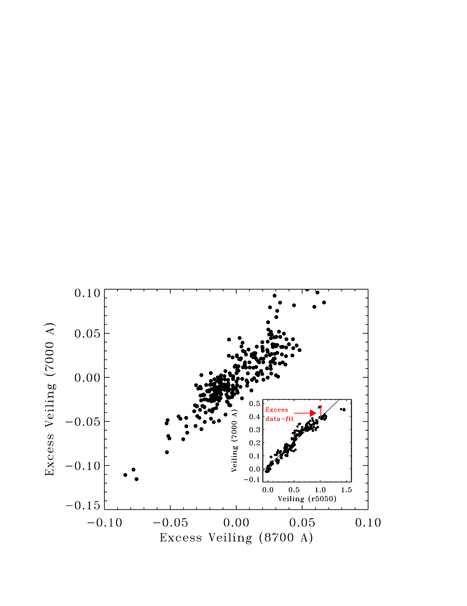
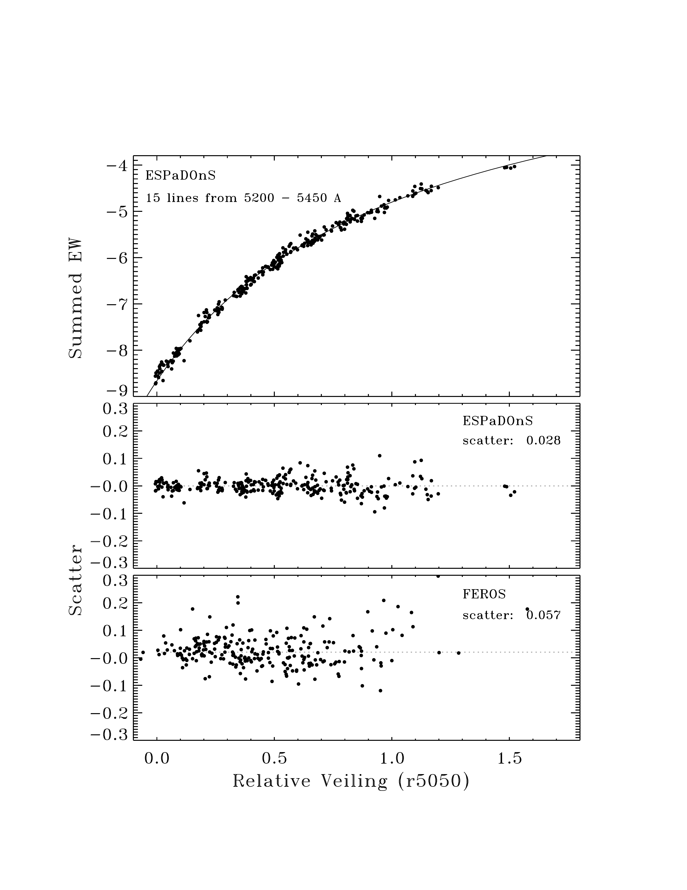
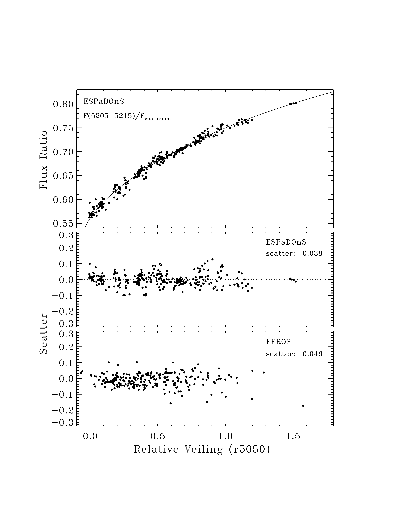
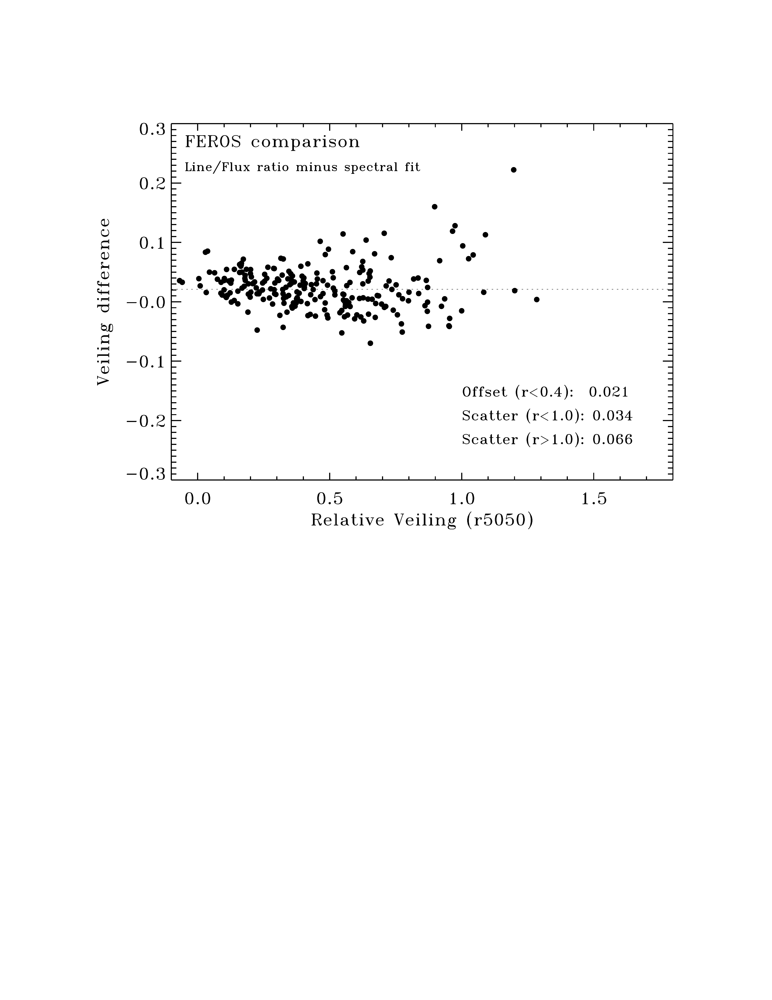

$\newcommand{\ensuremath}{}$
$\newcommand{\xspace}{}$
$\newcommand{\object}[1]{\texttt{#1}}$
$\newcommand{\farcs}{{.}''}$
$\newcommand{\farcm}{{.}'}$
$\newcommand{\arcsec}{''}$
$\newcommand{\arcmin}{'}$
$\newcommand{\ion}[2]{#1#2}$
$\newcommand{\textsc}[1]{\textrm{#1}}$
$\newcommand{\hl}[1]{\textrm{#1}}$
$\newcommand{\footnote}[1]{}$
$\newcommand{\feng}[1]$
$\newcommand{\paola}[1]$
$\newcommand{\uat}[2]{\href{http://vocabs.ands.org.au/repository/api/lda/aas/the-unified-astronomy-thesaurus/current/resource.html?uri=http://astrothesaurus.org/uat/#1}{#2 (#1)}}$
$\newcommand{\Msol}{\hbox{M_{\odot}}}$
$\newcommand{\Lya}{\hbox{Ly\alpha}}$
$\newcommand{\Lyb}{\hbox{Ly\beta}}$
$\newcommand{\Jup}{\hbox{J^\prime}}$
$\newcommand{\Jlo}{\hbox{J^{\prime\prime}}}$
$\newcommand{\Vup}{\hbox{v^\prime}}$
$\newcommand{\Vlo}{\hbox{v^{\prime\prime}}}$
$\newcommand{\Elo}{\hbox{E^{\prime\prime}}}$
$\newcommand{\kms}{\hbox{km s^{-1}}}$
$\newcommand{\erg}{\hbox{erg cm^{-2} s^{-1}}}$
$\newcommand{\erga}{\hbox{erg cm^{-2} s^{-1} Å^{-1}}}$
$\newcommand{\mdotyr}{\hbox{M_\odot yr^{-1}}}$
$\newcommand{\mdot}{\hbox{\dot{M}}}$
$\newcommand{\IUE}{\textit{IUE}}$
$\newcommand{\Chandra}{\textit{Chandra}}$
$\newcommand{\HST}{\textit{HST}}$
$\newcommand{\STIS}{STIS}$
$\newcommand{\FUSE}{\textit{FUSE}}$
$\newcommand{\IDL}{IDL}$
$\newcommand{\vsini}{\hbox{v \sin i}}$
$\newcommand{\ycmod}[1]{\textcolor{olive}{ #1}}$

# Twenty-Five Years of Accretion onto the Classical T Tauri Star TW Hya

<mark>Appeared on: 2023-08-29</mark> -  _Accepted by ApJ. 31 pages_

G. J. H. (沈雷歌), et al. -- incl., <mark>R. Launhardt</mark>

**Abstract:** Accretion plays a central role in the physics that governs the evolution and dispersal of protoplanetary disks.  The primary goal of this paper is to analyze the stability over time of the mass accretion rate onto TW Hya, the nearest accreting solar-mass young star.  We measure veiling across the optical spectrum in 1169 archival high-resolution spectra of TW Hya, obtained from 1998--2022.  The veiling is then converted to accretion rate using 26 flux-calibrated spectra that cover the Balmer jump.  The accretion rate measured from the excess continuum has an average of $2.51\times10^{-9}$ M $_\odot$ yr $^{-1}$ and a Gaussian distribution with a FWHM of 0.22 dex.  This accretion rate may be underestimated by a factor of up to 1.5 because of uncertainty in the bolometric correction and another factor of 1.7 because of excluding the fraction of accretion energy that escapes in lines, especially Ly $\alpha$ .The accretion luminosities are well correlated with He line luminosities but poorly correlated with H $\alpha$ and H $\beta$ luminosity.The accretion rate is always flickering over hours but on longer timescales has been stable over 25 years.This level of variability is consistent with previous measurements for most, but not all, accreting young stars.

**Figure 10. -** Veiling spectra for strong (pink circles, average relative veiling $r_{5050}=1.52$), above average (blue diamonds, $r_{5050}=0.95$), below average (red squares, $r_{5050}=0.52$), and weak (black triangles, $r_{5050}=0.21$) veiling epochs measured in ESPaDOnS spectra.  The left panel shows the relative veiling measurement, with features in the veiling spectrum caused by the shape of the photospheric template, TWA 25.  The right panel shows the veiling spectrum multiplied by TWA 25.  The spectra with moderate accretion are flat from 4000--9000 Å, while the strongest accretion spectrum has a bluer slope (increasing flux with decreasing wavelength). (*fig:veilspec*)

**Figure 7. -** _ Left:_ The relative veiling (veiling relative to the low-veiling spectrum of TW Hya) in six wavelength regions (y-axis) compared to the veiling from 5000-5100 Å (x-axis), as measured from ESPaDOnS spectra.  Each veiling measurement plotted here is the average of 4--8 different 25 Å spectral regions around the labeled wavelength.  The line shows a 1:1 relationship and not a fit. The veiling at bluer wavelengths is generally higher than the veiling at red wavelengths, with exceptions. The veiling at 4700 Å is similar to that at 5050 Å because of similar photospheric fluxes.
_ Right:_ Correlated differences between measured and expected veiling at long wavelengths.  The inset shows the correlation between veiling at 7000 Å and 5000-5100 Å. The excess veiling is calculated by fitting a line to the $r_{\lambda}$-$r_{5050}$ relationship (as seen on the left panel) and then subtracting each point from that line.  The main plot shows this excess veiling at 7000 Å versus that at 8700 Å.  When the veiling at 7000 Å is higher than expected, the veiling at 8700 Å is also higher than expected.
The correlation between excess veiling at 7000 and 8700 Å demonstrates that the scatter in the correlations between veiling measurements is real and not due to signal-to-noise or other statistical uncertainties. (*fig:veilcomp*)

**Figure 8. -** _ Top Left:_ The relationship between the equivalent width of coadded lines (one set shown here for lines from 5250--5400 Å) versus veiling, established from ESPaDOnS spectra and with residuals in ESPaDOnS and FEROS spectra shown below.  _ Top Right:_  Similar plots as on the left for the flux ratio for a spectral dip around 5205--5215 Å compared with a continuum region.  In both cases, we calculate a best-fit relationship between equivalent width (or flux ratios) and veiling with ESPaDOnS.  We then apply those relationships to FEROS spectra.  The bottom panels on the left and right show the scatter between the veiling calculated from these relationships and the veiling measured from comparing the FEROS spectrum to a low-veiling FEROS template.
 _ Bottom:_  The final comparison of veiling obtained from the combination of line equivalent widths and flux ratios to the veiling from a low-veiling FEROS template.  All FEROS spectra are shifted by $\sim 0.02$ to place them on the same scale as the ESPaDOnS veiling measuremenets.
   The scatter of $0.013+0.045 \times r5050$(with a minimum error of 0.02) is applied as an uncertainty to all spectra where veiling is measured from line equivalent widths and flux ratios. (*fig:eqwtoveil*)

