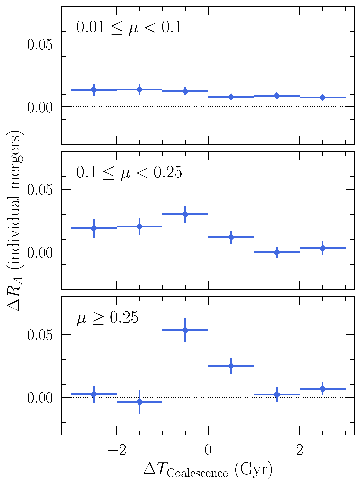
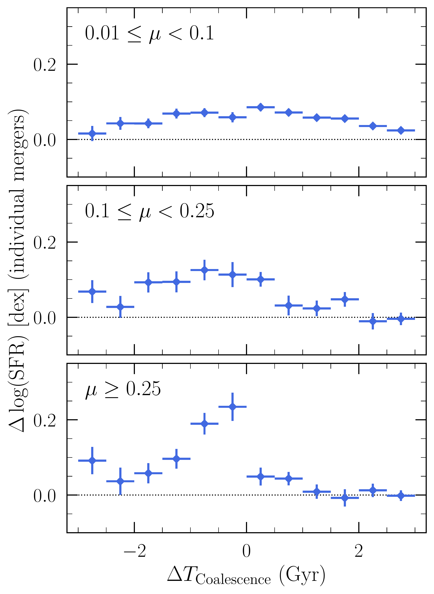
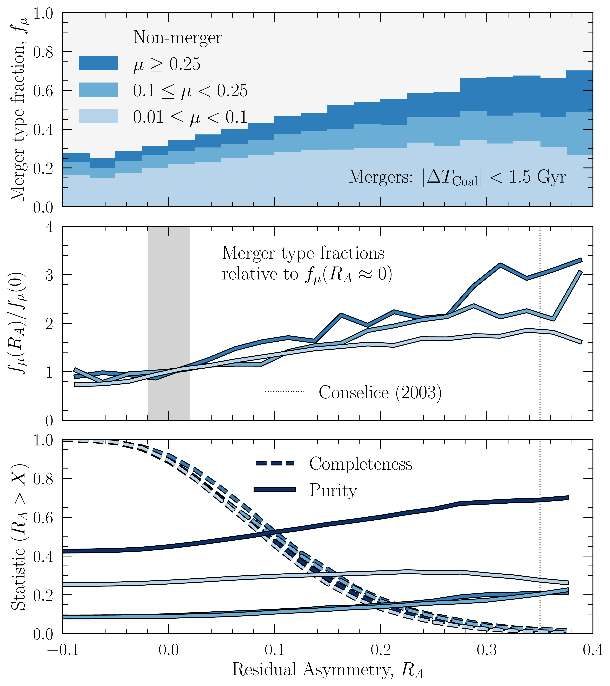
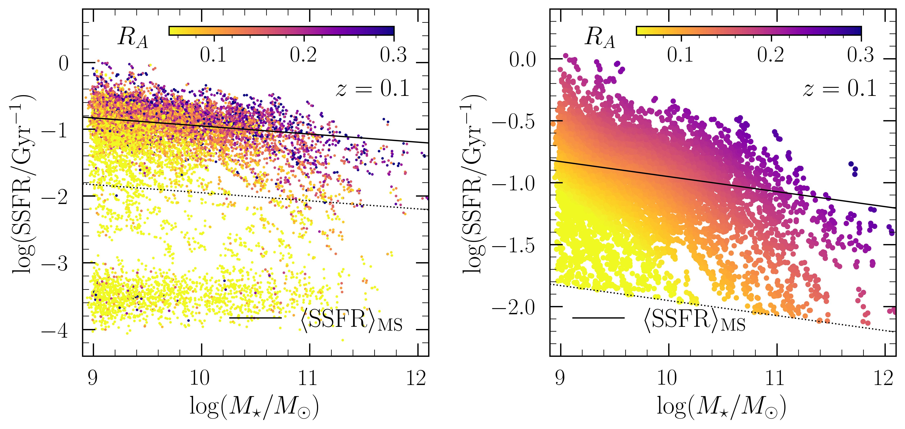

$\newcommand{\ensuremath}{}$
$\newcommand{\xspace}{}$
$\newcommand{\object}[1]{\texttt{#1}}$
$\newcommand{\farcs}{{.}''}$
$\newcommand{\farcm}{{.}'}$
$\newcommand{\arcsec}{''}$
$\newcommand{\arcmin}{'}$
$\newcommand{\ion}[2]{#1#2}$
$\newcommand{\textsc}[1]{\textrm{#1}}$
$\newcommand{\hl}[1]{\textrm{#1}}$
$\newcommand{\footnote}[1]{}$
$\newcommand{\gimtwod}{\textsc{gim2d}}$
$\newcommand{\sersic}{sérsic}$
$\newcommand{\Sersic}{Sérsic}$
$\newcommand{\sextractor}{\textsc{SExtractor}}$
$\newcommand{\thebibliography}{\DeclareRobustCommand{\VAN}[3]{##3}\VANthebibliography}$
$\newcommand{\}{nuprocess}$
$\newcommand{\}{nodata}$
$\newcommand{ ◦ee}{^{\circ}}$
$\newcommand{\}{Msolar}$
$\newcommand{\}{alphafe}$
$\newcommand{\}{na}$
$\newcommand{\}{HI}$
$\newcommand{\}{sion}$
$\newcommand{\}{vninety}$
$\newcommand{\}{Lbol}$
$\newcommand{\}{Mstar}$
$\newcommand{\}{logMstar}$
$\newcommand{\}{logRimp}$
$\newcommand{\}{logLbol}$
$\newcommand{\}{logsSFR}$
$\newcommand{\}{kms}$
$\newcommand{\}{zabs}$
$\newcommand{\}{zem}$
$\newcommand{\}{Rimp}$
$\newcommand{\}{Rvir}$
$\newcommand{\}{deltaEW}$
$\newcommand{\}{RadRat}$
$\newcommand{\}{mnfe}$
$\newcommand{\}{Mgeqw}$
$\newcommand{\}{Feeqw}$
$\newcommand{\}{fracMgFe}$
$\newcommand{\}{omegaDLA}$
$\newcommand{\}{ndla}$
$\newcommand{\}{npdla}$
$\newcommand{\}{nlpdla}$
$\newcommand{\}{nxpdla}$
$\newcommand{\}{nmdla}$
$\newcommand{\}{nlmdla}$
$\newcommand{\}{nxmdla}$
$\newcommand{\}{CosmoZ}$
$\newcommand{\}{fNX}$
$\newcommand{\}{rifs}$
$\newcommand{\}{realsim}$
$\newcommand{\}{tpost}$
$\newcommand{\}{dtc}$
$\newcommand{\}{dtcoal}$
$\newcommand{\}{skirt}$
$\newcommand{\}{deltasfms}$
$\newcommand{\}{dlogsfms}$
$\newcommand{\}{fgas}$
$\newcommand{\}{mstar}$
$\newcommand{\}{logsfr}$
$\newcommand{\}{dlogsfr}$
$\newcommand{\}{logssfr}$
$\newcommand{\}{dra}$
$\newcommand{\}{dsfr}$
$\newcommand{\}{dtcoffset}$
$\newcommand{\}{dtcoaloffset}$
$\newcommand{\}{dsfms}$

# IllustrisTNG in the HSC-SSP: image data release and the major role of mini mergers as drivers of asymmetry and star formation

<mark>Appeared on: 2023-08-30</mark> -  _32 pages; 18 figures; submitted to MNRAS; Image data available via the TNG website: www.tng-project.org/bottrell23_

C. Bottrell, et al. -- incl., <mark>A. Pillepich</mark>, <mark>L. Eisert</mark>

**Abstract:** At fixed galaxy stellar mass, there is a clear observational connection between structural asymmetry and offset from the star forming main sequence, $\dsfms$ . Herein, we use the TNG50 simulation to investigate the relative roles of major mergers (stellar mass ratios $\mu\geq0.25$ ), minor ( $0.1 \leq \mu < 0.25$ ), and mini mergers ( $0.01 \leq \mu < 0.1$ ) in driving this connection amongst star forming galaxies (SFGs). We use dust radiative transfer post-processing with SKIRT to make a large, public collection of synthetic Hyper Suprime-Cam Subaru Strategic Program (HSC-SSP) images of simulated TNG galaxies over $0.1\leq z \leq 0.7$ with $\logMstar\geq9$ ( $\sim750$ k images). Using their instantaneous SFRs, known merger histories/forecasts, and HSC-SSP asymmetries, we show (1) that TNG50 SFGs qualitatively reproduce the observed trend between $\dsfms$ and asymmetry and (2) a strikingly similar trend emerges between $\dsfms$ and the time-to-coalescence for mini mergers. Controlling for redshift, stellar mass, environment, and gas fraction, we show that individual mini merger events yield small enhancements in SFRs and asymmetries that are sustained on long timescales (at least $\sim3$ Gyr after coalescence, on average) -- in contrast to major/minor merger remnants which peak at much greater amplitudes but are consistent with controls only $\sim1$ Gyr after coalescence. Integrating the boosts in SFRs and asymmetries driven by $\mu\geq0.01$ mergers since $z=0.7$ in TNG50 SFGs, we show that mini mergers are responsible for (i) $55$ per cent of all merger-driven star formation and (ii) $70$ per cent of merger-driven asymmetric structure. Due to their relative frequency and prolonged boost timescales, mini mergers dominate over their minor and major counterparts in driving star formation and asymmetry in SFGs.

**Figure 16. -** $\dra$ vs $\dtcoal$ in individual mergersResidual asymmetry enhancements, $\dra$, and SFR enhancements, $\dlogsfr$, in individual mergers compared to non-merging controls as a function of merger $\dtcoal$ in TNG50. Galaxies are considered individual mergers if they have *exactly* one coalescence event within $|\dtcoal|<3$ Gyr and no other mergers from other mass ratio range. Each individual merger is matched to a control which has no coalescence event satisfying $|\dtcoal|<3$ Gyr (see Section \ref{sec:iso_selection}). Mini mergers exhibit statistically enhanced asymmetries and SFRs across the full range in $\dtcoal$. The peak enhancement amplitude in asymmetry and SFR increases with mass ratio. However, the enhancements in minor and major mergers are short-lived after coalescence. The asymmetries of individual minor and major merger remnants are consistent with their controls for $\dtcoal>1$ Gyr. In contrast, mini mergers yield long-lasting, modest asymmetry enhancements. Similarly, the longevity of SFR enhancement declines with increasing mass ratio. The SFRs of individual minor and major merger remnants are consistent with their controls for  $\dtcoal>2$ Gyr and $\dtcoal>1$ Gyr, respectively. *Individual* mini mergers in TNG50 drive statistically significant changes to galaxy morphologies and SFRs. Mini mergers are not piggybacking on the enhancements driven by minor and major mergers. (*fig:iso_merg*)

**Figure 3. -** $R_A$ by merger typeStatistics of merging SFGs near coalescence, $| \dtcoal |<1.5$ Gyr, as a function of HSC residual asymmetry for $z\leq 0.3$. *Upper panel*: The merger fraction in each bin, $f_\mu$, split into major, minor, and mini regimes. The unshaded area shows the fraction of SFGs that have no $\mu\geq0.01$ merger within $1.5$ Gyr. Compared to minor and major mergers combined, mini mergers dominate for $R_A<0.3$. $68$ per cent of galaxies at $R_A>0.3$ are close to a merger -- of which $47$ per cent are mini mergers with no major or minor merger within $1.5$ Gyr. $32$ per cent of galaxies with asymmetries $R_A>0.3$ are non-mergers. *Middle panel*: Merger type fractions relative to $f_\mu(R_A\approx0)$(grey band). The fraction of high-$\mu$ mergers increases more rapidly with $R_A$ than low-$\mu$ mergers. *Lower panel*: Completeness and purity curves as a function of asymmetry threshold, $R_A>X$. Dark lines show statistics for all $\mu>0.01$ mergers. (*fig:ra_mergers*)

**Figure 11. -** SFMS and Residual AsymmetryStar-forming main sequence (SFMS) fitting, star forming galaxy (SFG) selection, and the relationship between SFMS offset and galaxy residual asymmetries for TNG50 galaxies at $z=0.1$. The left panel shows the full sample of 12,088 galaxies ($3,047$ galaxies $\times 4$ sightlines). The solid black line shows the linear fit to the SFMS described in Section \ref{sec:sfms} and in Table \ref{tab:sfms}. The dotted line shows $\dsfms = \log(\mathrm{SSFR}) - \langle \log(\mathrm{SSFR})\rangle_{\mathrm{MS}} = -1$ dex. We define SFGs as those above this line. Each galaxy is coloured by its residual asymmetry, $R_A$(measured after removal of the best-fitting Sérsic model). For visual purposes, an artificial $0.05$ dex scatter in SFR and $M_{\star}$ is introduced such that different orientations of the same intrinsic galaxy are not directly atop each other. The right panel shows 2D locally weighted regression in $R_A$ for the star-forming sample (LOESS: \citealt{1988Cleveland2DLoess,2013MNRAS.432.1862C}). The trend between $\dsfms$ and $R_A$ is qualitatively similar to that shown by \cite{2021ApJ...923..205Y}. (*fig:sfms_ra*)

