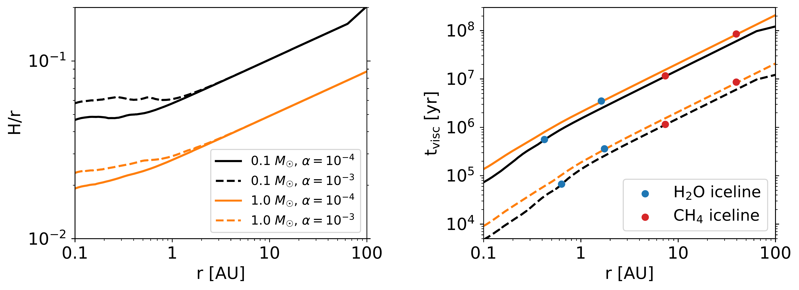
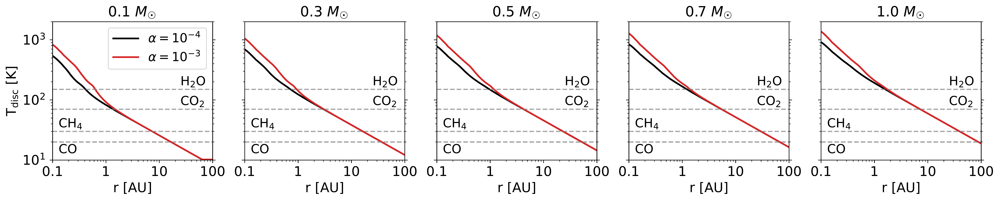

$\newcommand{\ensuremath}{}$
$\newcommand{\xspace}{}$
$\newcommand{\object}[1]{\texttt{#1}}$
$\newcommand{\farcs}{{.}''}$
$\newcommand{\farcm}{{.}'}$
$\newcommand{\arcsec}{''}$
$\newcommand{\arcmin}{'}$
$\newcommand{\ion}[2]{#1#2}$
$\newcommand{\textsc}[1]{\textrm{#1}}$
$\newcommand{\hl}[1]{\textrm{#1}}$
$\newcommand{\footnote}[1]{}$

# Close-in ice lines and the super-stellar C/O ratio in discs around very low-mass stars

<mark>Appeared on: 2023-08-30</mark> -  _Accepted for publication in A&A_

<mark>J. Mah</mark>, B. Bitsch, I. Pascucci, T. Henning

**Abstract:** The origin of the elevated C/O ratios in discs around late M dwarfs compared to discs around solar-type stars is not well understood. Here we endeavour to reproduce the observed differences in the disc C/O ratios as a function of stellar mass using a viscosity-driven disc evolution model and study the corresponding atmospheric composition of planets that grow inside the water-ice line in these discs. We carried out simulations using a coupled disc evolution and planet formation code that includes pebble drift and evaporation. We used a chemical partitioning model for the dust composition in the disc midplane. Inside the water-ice line, the disc's C/O ratio initially decreases to sub-stellar due to the inward drift and evaporation of water-ice-rich pebbles before increasing again to super-stellar values due to the inward diffusion of carbon-rich vapour. We show that this process is more efficient for very low-mass stars compared to solar-type stars due to the closer-in ice lines and shorter disc viscous timescales. In high-viscosity discs, the transition from sub-stellar to super-stellar takes place faster due to the fast inward advection of carbon-rich gas. Our results suggest that planets accreting their atmospheres early (when the disc C/O is still sub-stellar) will have low atmospheric C/O ratios, while planets that accrete their atmospheres late (when the disc C/O has become super-stellar) can obtain high C/O ratios. Our model predictions are consistent with observations, under the assumption that all stars have the same metallicity and chemical composition, and that the vertical mixing timescales in the inner disc are much shorter than the radial advection timescales. This further strengthens the case for considering stellar abundances alongside disc evolution in future studies that aim to link planet (atmospheric) composition to disc composition.

**Figure 1. -** Temporal evolution of the gas disc C/O ratio (normalised to the stellar value) as a function of distance from the star, stellar mass (left to right), and disc viscosity (top and bottom rows). Ice lines are marked by vertical dashed white lines, and solid black lines indicate an absolute C/O ratio of 1. The carbon line is absent in the top leftmost panel because it is located inside 0.1 AU. Outside the CO ice line ($T_{\rm disc} \leq 20 {\rm K}$; white region in the subplots), all chemical species are assumed to be frozen in the solid phase. (*fig:discCO_C60_5ms*)

**Figure 5. -** Comparison of disc properties for a disc around an M dwarf and a solar-type star in our model. _ Left_: Aspect ratio of a disc around a $0.1 M_{\odot}$ star (black lines) and a disc around a $1.0 M_{\odot}$ star (orange lines) for low (solid lines) and high (dashed lines) disc viscosities. _ Right_: Viscous accretion timescale of the discs as a function of radial distance, stellar mass, and disc viscosity. Solid circles indicate the location of the water-ice (blue) and $CH_4$-ice (red) lines in each disc. (*fig:disc_tvisc*)

**Figure 3. -** Disc midplane temperature profile as a function of stellar mass and disc viscosity. The condensation temperatures of carbon- and oxygen-bearing species in the disc are marked with dashed grey lines. (*fig:disc_temp*)

