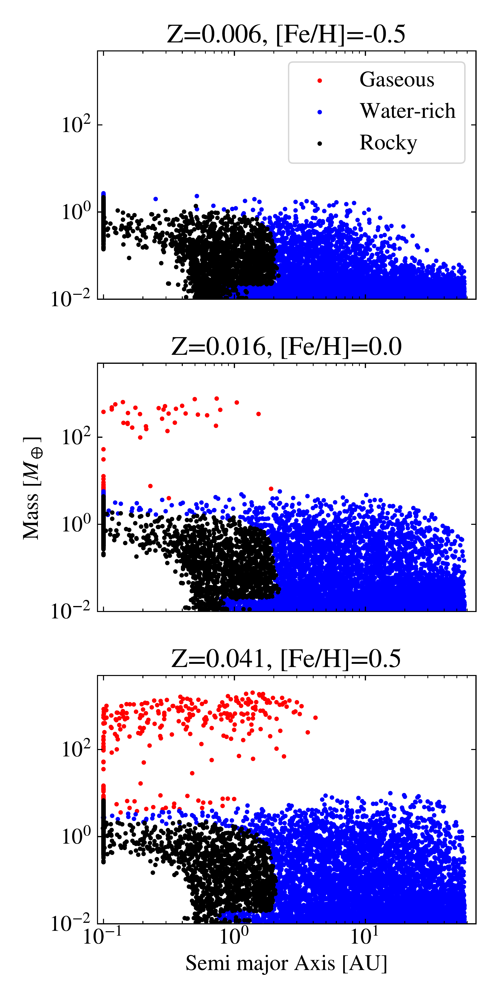
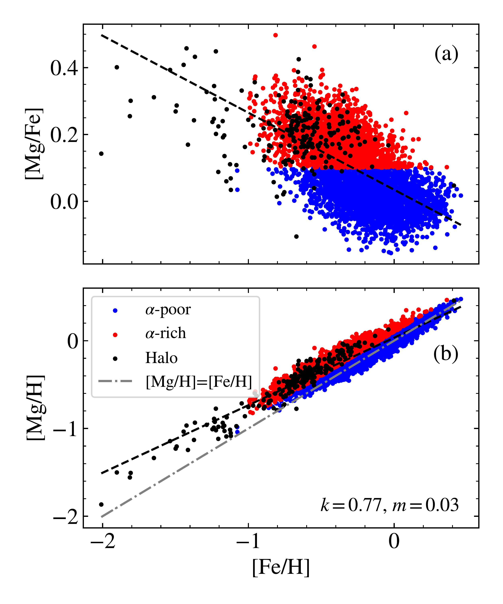
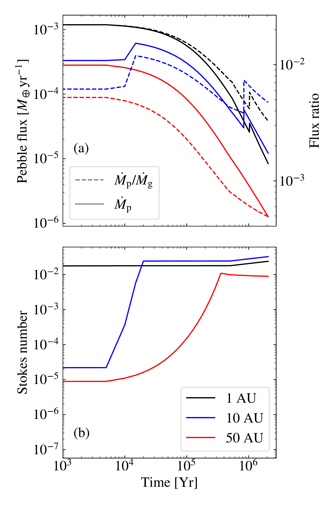

$\newcommand{\ensuremath}{}$
$\newcommand{\xspace}{}$
$\newcommand{\object}[1]{\texttt{#1}}$
$\newcommand{\farcs}{{.}''}$
$\newcommand{\farcm}{{.}'}$
$\newcommand{\arcsec}{''}$
$\newcommand{\arcmin}{'}$
$\newcommand{\ion}[2]{#1#2}$
$\newcommand{\textsc}[1]{\textrm{#1}}$
$\newcommand{\hl}[1]{\textrm{#1}}$
$\newcommand{\footnote}[1]{}$
$\newcommand{\maps}{M\&PS}$
$\newcommand{\feh}{\text{[Fe/H]}}$
$\newcommand{\abs}[1]{\left\lvert #1 \right\rvert}$
$\newcommand{\enstatite}{\text{MgSiO}_{3}}$
$\newcommand{\forsterite}{\text{Mg}_2\text{SiO}_4}$
$\newcommand{\water}{\text{H}_2\text{O}}$
$\newcommand{\fayalite}{\text{Fe}_2\text{SiO}_4}$
$\newcommand{\magnetite}{\text{Fe}_3\text{O}_4}$
$\newcommand{\St}{{\rm St}}$
$\newcommand{\AU}{{\rm AU}}$
$\newcommand{\pluseq}{\mathrel{{+}{=}}}$
$\newcommand{\minuseq}{\mathrel{{-}{=}}}$
$\newcommand{\gas}{{\rm (g)}}$
$\newcommand{\solid}{{\rm (s)}}$
$\newcommand{\vf}{v_{\rm f}}$
$\newcommand{\msun}{\ensuremath{\rm M_\odot}}$
$\newcommand{\teff}{\ensuremath{T_{\rm eff}}}$
$\newcommand{\logg}{\ensuremath{\log{g}}}$
$\newcommand{\mb}{\textcolor{red}}$

# Planet formation throughout the Milky Way:

<mark>Appeared on: 2023-08-31</mark> -  _21 pages, 16 figures, accepted in A&A_

J. Nielsen, et al. -- incl., <mark>M. Bergemann</mark>, <mark>P. Eitner</mark>

**Abstract:** As stellar compositions evolve over time in the Milky Way, so will the resulting planet populations. In order to place planet formation in the context of Galactic chemical evolution, we make use of a large ( $N = 5 325$ ) stellar sample representing the thin and thick discs, defined chemically, and the halo, and we simulate planet formation by pebble accretion around these stars. We build a chemical model of their protoplanetary discs, taking into account the relevant chemical transitions between vapour and refractory minerals, in order to track the resulting compositions of formed planets.We find that the masses of our synthetic planets increase on average with increasing stellar metallicity [ Fe/H ] and that giant planets and super-Earths are most common around thin-disc ( $\alpha$ -poor) stars since these stars have an overall higher budget of solid particles. Giant planets are found to be very rare ( $\lesssim$ 1 \% ) around thick-disc ( $\alpha$ -rich) stars and nearly non-existent around halo stars. This indicates that the planet population is more diverse for more metal-rich stars in the thin disc. Water-rich planets are less common around low-metallicity stars since their low metallicity prohibits efficient growth beyond the water ice line. If we allow water to oxidise iron in the protoplanetary disc, this results in decreasing core mass fractions with increasing [ Fe/H ] . Excluding iron oxidation from our condensation model instead results in higher core mass fractions, in better agreement with the core-mass fraction of Earth, that increase with increasing [ Fe/H ] . Our work demonstrates how the Galactic chemical evolution and stellar parameters, such as stellar mass and chemical composition, can shape the resulting planet population.

**Figure 8. -** Resulting planet population for three solar-mass stars of varying composition. At low metallicity, it is difficult to form any planets beyond a few AU in the protoplanetary disc, so very few water-rich planets above 1 $M_\oplus$ form in that case. For solar metallicity and above (middle and bottom panels), we start to form water-rich planets up to around a few $M_\oplus$ far out in the disc. We note that due to our abundance scaling of the remaining elements, the middle panel has a slightly higher metallicity of 0.016 for solar [Fe/H] compared to the solar metallicity of 0.014. (*fig:MR_all*)

**Figure 1. -** Stellar abundances for our stellar sample where we have colour-coded the stars belonging to each population. **(a):**[Mg/Fe] as a function of [Fe/H]. **(b):**[Mg/H] as a function of [Fe/H] for the same stars as in the top panel. We also show the linear fit between [Mg/H] and [Fe/H] for each population which was used to determine all the other elements except for He. The fit slope ($k$) and intercept ($m$) for the full sample are shown in the bottom right. In both panels, the dashed black line shows the fit when considering the entire stellar sample. (*fig:mgfe_mgh_feh*)

**Figure 4. -** The evolution of the dust over time in the protoplanetary disc. The different colours represent different distances to the star. **(a):** Pebble flux and flux ratio as a function of time around a star with solar mass and composition. The fragmentation velocity here was set to 2 m/s. The flux ratio starts at a moderately high value of $\sim$0.015 but decreases rapidly after $\sim10^5$ years. The sharp increase in pebble flux and flux ratio at 1 Myr is caused by the $CO_2$ iceline which is traveling inwards due to the decreasing luminosity of the star. **(b):** Stokes number as a function of time for the same distances as in the top panel. The Stokes number increases fast in the inner region of the disc, growing to 0.02 before 10$^3$ years. The size of the dust is mostly regulated by fragmentation either due to turbulence or differential radial drift. Only in the outermost regions of the disc is the growth of the dust slow enough for the Stokes number to be drift-limited. (*fig:pebble_flux*)

