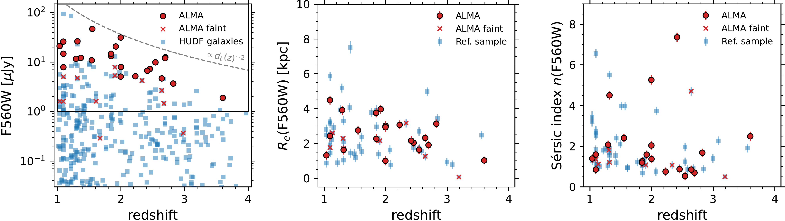
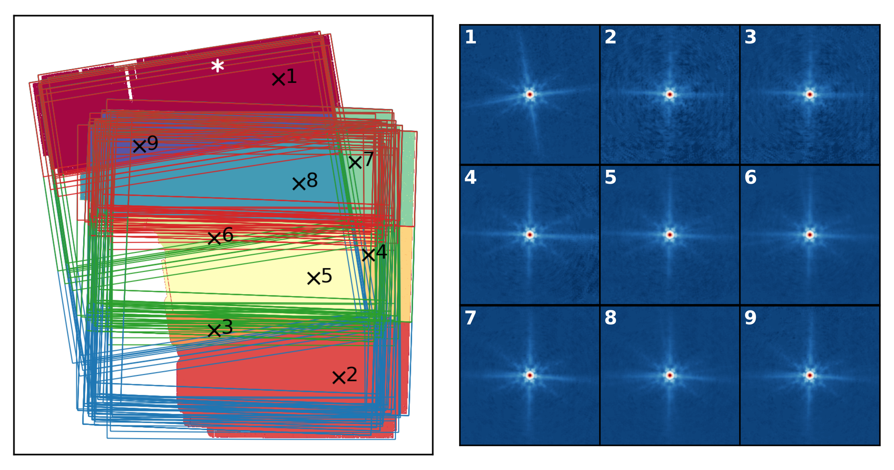

$\newcommand{\ensuremath}{}$
$\newcommand{\xspace}{}$
$\newcommand{\object}[1]{\texttt{#1}}$
$\newcommand{\farcs}{{.}''}$
$\newcommand{\farcm}{{.}'}$
$\newcommand{\arcsec}{''}$
$\newcommand{\arcmin}{'}$
$\newcommand{\ion}[2]{#1#2}$
$\newcommand{\textsc}[1]{\textrm{#1}}$
$\newcommand{\hl}[1]{\textrm{#1}}$
$\newcommand{\footnote}[1]{}$
$\newcommand{\vdag}{(v)^\dagger}$
$\newcommand$
$\newcommand$
$\newcommand{\sectionautorefname}{\S}$
$\newcommand{\subsectionautorefname}{\S}$
$\newcommand{\subsubsectionautorefname}{\S}$
$\newcommand{\figureautorefname}{Fig.}$

# MIDIS: JWST/MIRI reveals the Stellar Structure of ALMA-selected Galaxies in the Hubble--UDF at Cosmic Noon

<mark>Appeared on: 2023-09-01</mark> -  _19 pages, 10 figures, 1 table, submitted to ApJ_

L. A. Boogaard, et al. -- incl., <mark>F. Walter</mark>, <mark>S. Bosman</mark>

**Abstract:** We present deep James Webb Space Telescope (JWST)/MIRI F560W  observations of a flux-limited, ALMA-selected sample of 28 galaxies  at $z=0.5$ -- $3.6$ in the Hubble Ultra Deep Field (HUDF).  The data  from the MIRI Deep Imaging Survey (MIDIS) reveal the stellar  structure of the HUDF galaxies at rest-wavelengths of $\lambda>1$ $\micron$ for the first time.  We revise the stellar  mass estimates using new JWST photometry and find good agreement  with pre-JWST analysis; the few discrepancies can be explained by  blending issues in the earlier lower-resolution Spitzer data.  At $z\sim2.5$ , the resolved rest-frame near-infrared (1.6 $\micron$ )  structure of the galaxies is significantly more smooth and centrally  concentrated than seen by HST at rest-frame 450 nm (F160W), with  effective radii of $\Remiri=1$ --5 kpc and Sérsic indices mostly  close to an exponential (disk-like) profile ( $n\approx1$ ), up to $n\approx5$ (excluding AGN).  We find an average size ratio of $\Remiri/\Rehst\approx0.7$ that decreases with stellar mass. The  stellar structure of the ALMA-selected galaxies is indistinguishable  from a HUDF reference sample of galaxies with comparable MIRI flux  density.  We supplement our analysis with custom-made,  position-dependent, empirical PSF models for the F560W  observations. The results imply that an older and smoother stellar  structure is in place in massive gas-rich, star-forming galaxies at  Cosmic Noon, despite a more clumpy rest-frame optical appearance,  placing additional constraints on galaxy formation simulations.  As  a next step, matched-resolution, resolved ALMA observations will be  crucial to further link the mass- and light-weighted galaxy  structures to the dusty interstellar medium.

**Figure 3. -** MIRI/F560W, NIRCam/F182M, HST/F814W (RGB) cutouts of the
    flux-limited ALMA/ASPECS sample in the MIRI Deep Imaging Survey
    footprint.  The cutouts are ordered by decreasing redshifts and
    are $4$\arcsec$\times4$\arcsec$$, except the last four galaxies at
    $z<1$, which are $8$\arcsec$\times8$\arcsec$$(as indicated by the
    scalebars). See \autoref{tab:sources} for more information on the
    source properties. (*fig:cutouts*)

**Figure 5. -** ALMA galaxies in context of the galaxy population in the Hubble Ultra Deep Field covered by both MIDIS and ASPECS.  The panels show the MIRI/F560W flux density (_left_), effective radius (_center_) and Sérsic index (_right_) as a function of redshift.  The black box in the left panel denotes the HUDF reference sample of galaxies with a flux density in F560W $\geq 1.0$$\mu$Jy, shown in the other panels.
   (*fig:refsample-z-vs-mag*)

**Figure 8. -** Model of the MIRI/F560 PSF variation over the MIDIS field.  For each of the 96 exposures, the red, green and blue areas in the left panel indicate where the three different stacked PSFs are applicable and the white star marks the location of the star in the image (see \autoref{fig:psf-model}).  The background color map shows the 9 unique areas where the pipeline-processed PSF, which is created by inserting the different PSF model in each exposure at the marked coordinates, is effective. The right panels show a $16$\farcs$5\times16$\farcs$5$ cutout of the pipeline-processed PSFs at the 9 locations.
     (*fig:psf-insert*)

