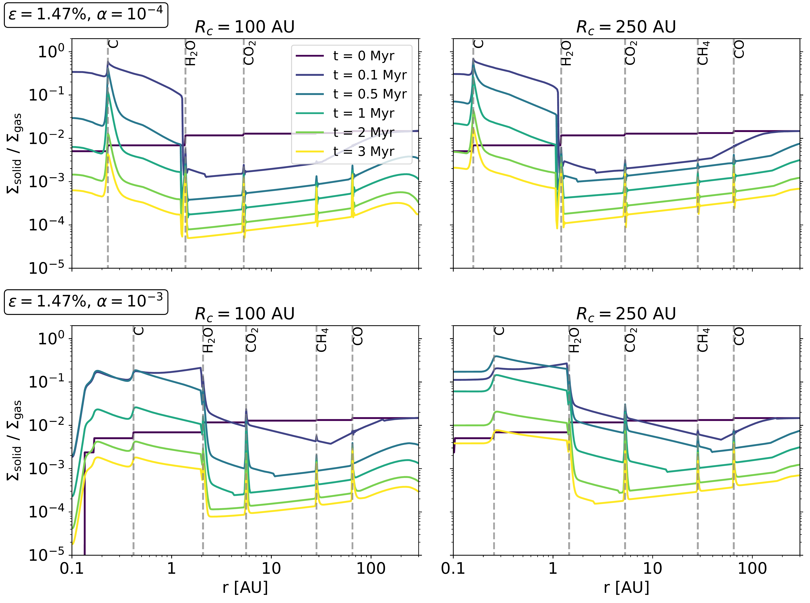
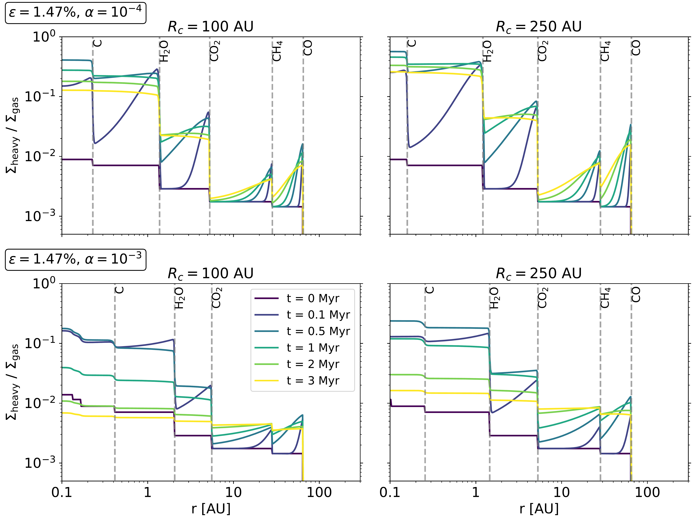
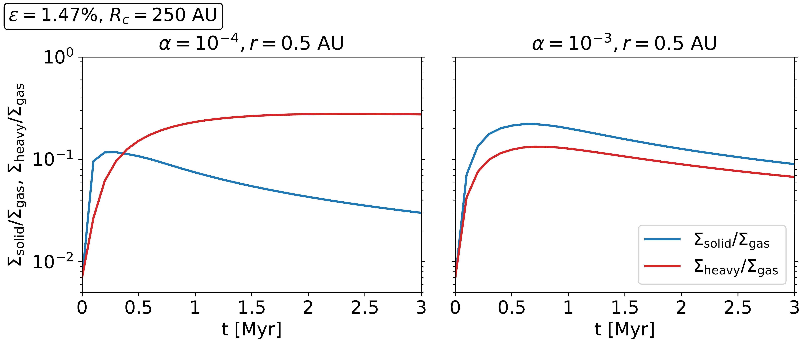

$\newcommand{\ensuremath}{}$
$\newcommand{\xspace}{}$
$\newcommand{\object}[1]{\texttt{#1}}$
$\newcommand{\farcs}{{.}''}$
$\newcommand{\farcm}{{.}'}$
$\newcommand{\arcsec}{''}$
$\newcommand{\arcmin}{'}$
$\newcommand{\ion}[2]{#1#2}$
$\newcommand{\textsc}[1]{\textrm{#1}}$
$\newcommand{\hl}[1]{\textrm{#1}}$
$\newcommand{\footnote}[1]{}$

# Enriching inner discs and giant planets with heavy elements

<mark>Appeared on: 2023-09-04</mark> -  _Accepted by A&A, 10 pages, 9 figures_

B. Bitsch, <mark>J. Mah</mark>

**Abstract:** Giant exoplanets seem to have on average a much larger heavy element content than the solar system giants. Past attempts to explain these heavy element contents include collisions between planets, accretion of volatile rich gas and accretion of gas enriched in micro-metre sized solids. However, these different theories individually could not explain the heavy element content of giants and the volatile to refractory ratios in atmospheres of giant planets at the same time. Here we want to combine the approaches of gas accretion enhanced with vapor and small micro-meter sized dust grains within one model. To this end, we present detailed models of inward drifting and evaporating pebbles and how these influence the dust-to-gas ratio and the heavy element content of the disc. As pebbles drift inwards, the volatile component evaporates and enriches the disc. At the same time, the smaller silicate core of the pebble continues to move inwards. As the silicate pebbles are presumably smaller than the ice grains, they drift slower, leading to a pile-up of material interior to the water ice line, increasing the dust-to-gas ratio in this region. Under the assumption that these small dust grains follow the motion of the gas even through the pressure bumps generated by the gaps of planets, gas accreting giants can accrete large fractions of small solids in addition to the volatile vapor. We find that the effectiveness of the solid enrichment requires a large disc radius to maintain the pebble flux for a long time and a large viscosity that reduces the size and inward drift of the small dust grains. However, this process depends crucially on the debated size difference of the pebbles interior and exterior of the water ice line. On the other hand, the volatile component released by the inward drifting pebbles can lead to a large enrichment with heavy element vapor, independently of a size difference of pebbles interior and exterior to the water ice line. Our model stresses the importance of the disc's radius and viscosity on the enrichment of dust and vapor. Consequently we show how our model could explain the heavy element content of the majority of giant planets by using combined estimates of dust and vapor enrichment.

**Figure 3. -** Time evolution of the dust-to-gas ratio in protoplanetary discs with $\alpha = 10^{-4}$(top) and $\alpha=10^{-3}$(bottom) and disc radii of $R_{\rm c}=100$ AU (left) and $R_{\rm c}=250$ AU (right). The vertical lines mark the evaporation fronts of the different chemical species, where inward drifting pebbles evaporate and recondense, leading to pile-ups in the solid density.
    (*fig:dtg*)

**Figure 4. -** Time evolution of the heavy element content in the gas phase in protoplanetary discs with $\alpha = 10^{-4}$(top) and $\alpha=10^{-3}$(bottom) and disc radii of $R_{\rm c}=100$AU (left) and $R_{\rm c}=250$AU (right). The vertical lines mark the evaporation fronts of the different chemical species, where inward drifting pebbles evaporate, leading to increases in the heavy element content of the gas phase.
    (*fig:heavy*)

**Figure 5. -** Time evolution integration of the heavy element content of the gas phase at 0.5 AU either from the solids (see Fig. \ref{fig:dtg}) or the vapor (see Fig. \ref{fig:heavy}) for discs with $R_{\rm c}=250$ AU and $\alpha=10^{-4}$(left) and $\alpha=10^{-3}$(right).
    (*fig:integral*)

