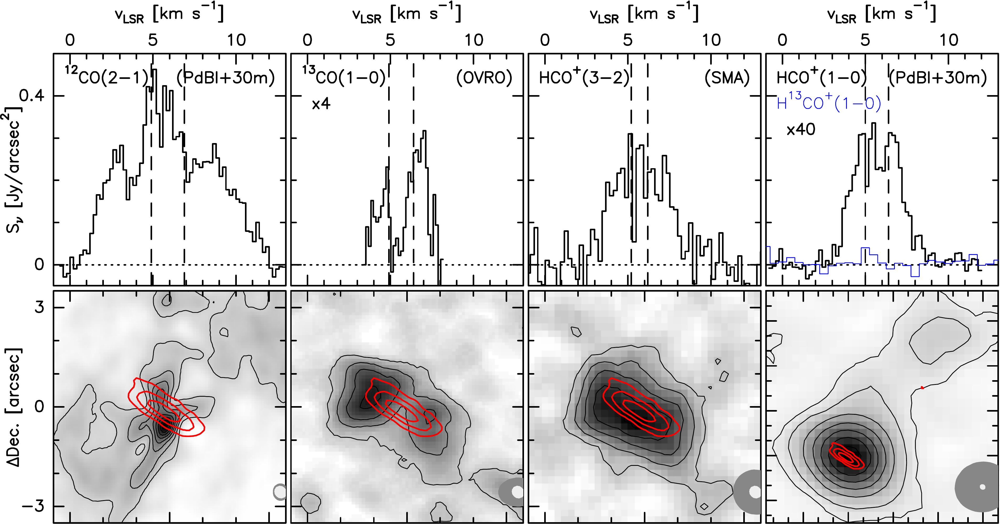
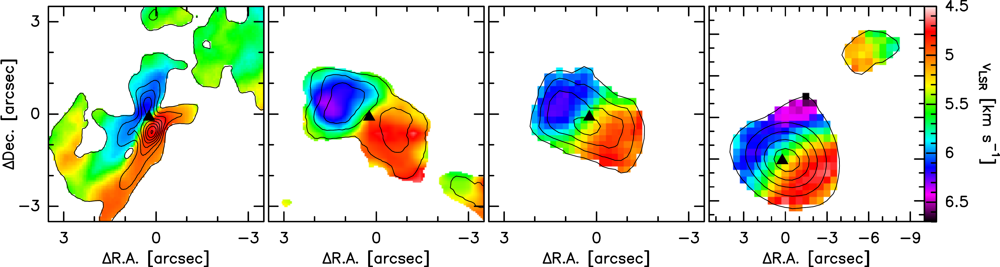
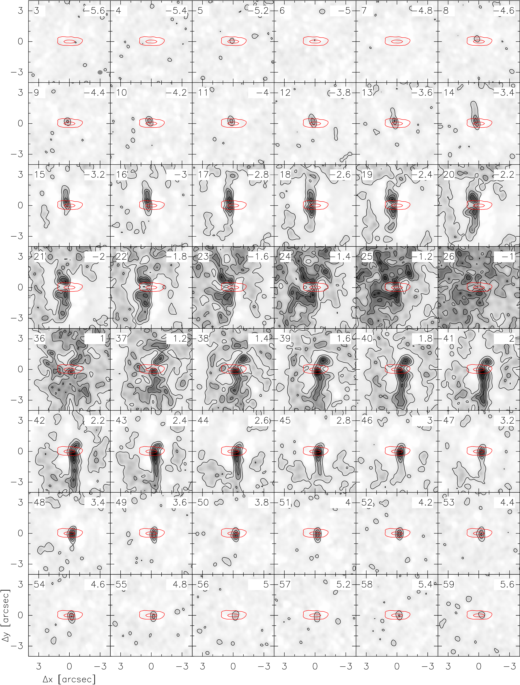
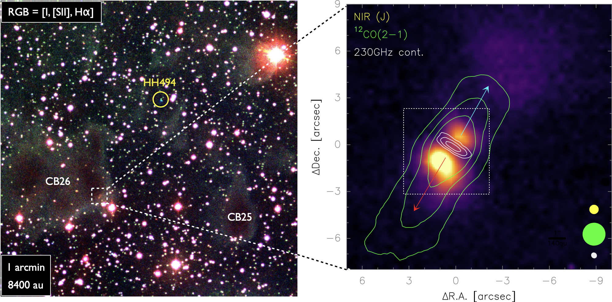

$\newcommand{\ensuremath}{}$
$\newcommand{\xspace}{}$
$\newcommand{\object}[1]{\texttt{#1}}$
$\newcommand{\farcs}{{.}''}$
$\newcommand{\farcm}{{.}'}$
$\newcommand{\arcsec}{''}$
$\newcommand{\arcmin}{'}$
$\newcommand{\ion}[2]{#1#2}$
$\newcommand{\textsc}[1]{\textrm{#1}}$
$\newcommand{\hl}[1]{\textrm{#1}}$
$\newcommand{\footnote}[1]{}$
$\newcommand{\micron}{\upmum}$
$\newcommand{\msol}{\mbox{M_\odot}}$
$\newcommand{\mjup}{\mbox{M_{\rm Jup}}}$
$\newcommand{\rsol}{\mbox{R_\odot}}$
$\newcommand{\lsol}{\mbox{L_\odot}}$
$\newcommand{\point}{\cdot}$
$\newcommand$
$\newcommand$
$\newcommand$
$\newcommand{\HII}{H {\small{II}} }$
$\newcommand{\accrate}{M_\sun{\rm yr}^{-1}}$
$\newcommand{\mjyb}{{\rm mJy beam}^{-1}}$
$\newcommand{\mjyp}{{\rm mJy pixel}^{-1}}$
$\newcommand{\mujyb}{{\rm{\mu}Jy beam}^{-1}}$
$\newcommand{\mujyp}{{\rm{\mu}Jy pixel}^{-1}}$
$\newcommand{\Mjysr}{{\rm MJy sr}^{-1}}$
$\newcommand{\Mjyb}{{\rm MJy beam}^{-1}}$
$\newcommand{\cmcub}{cm^{-3}}$
$\newcommand{\jyb}{{\rm Jy beam}^{-1}}$
$\newcommand{\mjybkms}{{\rm mJy beam}^{-1}{\rm km s}^{-1}}$
$\newcommand{\jybkms}{{\rm Jy beam}^{-1}{\rm km s}^{-1}}$
$\newcommand{\dotsec}{\rlap.{"}}$
$\newcommand{\dotmin}{\rlap.{'}}$
$\newcommand{\dotdeg}{\rlap.{^\circ}}$
$\newcommand{\dd}{  {\rm d}}$
$\newcommand{\env}{{\rm env}}$
$\newcommand{\disk}{{\rm disk}}$
$\newcommand{\rcyl}{r_{\rm cyl}}$
$\newcommand{\teff}{T_{\rm eff}}$
$\newcommand{\K}{\rm K}$
$\newcommand{\nm}{  \rm nm}$
$\newcommand{\mm}{  \rm mm}$
$\newcommand{\cm}{  \rm cm}$
$\newcommand{\mum}{  \rm \mu m}$
$\newcommand{\msun}{M_\odot}$
$\newcommand{\lsun}{L_\odot}$
$\newcommand{\rsun}{R_\odot}$
$\newcommand{\au}{\rm au}$
$\newcommand{\Jy}{\rm Jy}$
$\newcommand{\beam}{\rm beam}$
$\newcommand{\asp}{\mbox{.\!\!^{\prime\prime}}}$
$\newcommand{\grd}{\mbox{^{\circ}}}$
$\newcommand{\nthp}{\mbox{N_2H^+}}$
$\newcommand{\htdp}{\mbox{H_2D^+}}$
$\newcommand{\ntdp}{\mbox{N_2D^+}}$
$\newcommand{\nht}{\mbox{NH_3}}$
$\newcommand{\hcop}{\mbox{HCO^+}}$
$\newcommand{\htcop}{\mbox{H^{13}CO^+}}$
$\newcommand{\kmspc}{\mbox{km s^{-1} pc^{-1}}}$
$\newcommand{\kms}{\mbox{km s^{-1}}}$
$\newcommand{\htp}{\mbox{H_3^+}}$
$\newcommand{\Ka}{\mbox{K_{\rm a}}}$
$\newcommand{\rl}[1]{{\leavevmode\color{magenta} #1}}$
$\newcommand{\zcp}[1]{{\leavevmode\color{cyan} #1}}$

# A resolved rotating disk wind from a young T Tauri star in the Bok globule CB 26      $\thanks{Based on observations carried out with the IRAM Plateau de Bure Interferometer (PdBI, now NOEMA), the Owens Valley millimeter-wave array (OVRO), and the Submillimeter Array (SMA).}$

<mark>Appeared on: 2023-09-06</mark> -  _Accepted by A&A, 25 pages, 19 figures_

<mark>R. Launhardt</mark>, et al. -- incl., <mark>D. Semenov</mark>

**Abstract:** The disk-outflow connection plays a key role in extracting excess angular momentum from a forming protostar. Although indications of jet rotation have been reported for a few objects, observational constraints of outflow rotation are still very scarce. We have previously reported the discovery of a small collimated molecular outflow from the  edge-on T Tauri star -- disk system in the Bok globule CB 26 that shows a peculiar velocity pattern, reminiscent of an outflow that corotates with the Keplerian disk. However, we could not ultimately exclude possible alternative explanations for the origin of the observed velocity field. We report new, high angular resolution millimeter-interferometric observations of CB 26 with the aim of revealing the morphology and kinematics of the outflow at the disk -- outflow interface to unambiguously discriminate between the possible alternative explanations for the observed peculiar velocity pattern. The IRAM PdBI array and the 30 m telescope were used to observe HCO $^{+}$ (1--0) and H $^{13}$ CO $^{+}$ (1--0) at 3.3 mm and $\mbox{$^{12}$CO(2--1)}$ at 1.3 mm in three configurations plus zerospacing, resulting in spectral line maps with angular resolutions of 3 $\farcs$ 5 and 0 $\farcs$ 5, respectively. The SMA was used to observe the HCO $^{+}$ (3--2) line at 1.1 mm with an angular resolution of 1 $\farcs$ 35. Additional earlier observations of $^{13}$ CO(1--0) at 2.7 mm with an angular resolution of 1 $\farcs$ 0, obtained with OVRO, are also used for the analysis. Using a physical model of the disk, which was derived from the dust continuum emission, we employed chemo-dynamical modeling combined with line radiative transfer calculations to constrain kinematic parameters of the system and to construct a model of the CO emission from the disk that allowed us to separate the emission of the disk from that of the outflow. Our observations confirm the disk-wind nature of the rotating molecular outflow from $\mbox{CB 26 - YSO 1}$ . The new high-resolution data reveal an X-shaped morphology of the CO emission close to the disk, and vertical streaks extending from the disk surface with a small half-opening angle of $\approx$ 7◦, which can be traced out to vertical heights of $\approx$ 500 au. We interpret this emission as the combination of the disk atmosphere and a well-collimated disk wind, of which we mainly see the outer walls of the outflow cone. The decomposition of this emission into a contribution from the disk atmosphere and the disk wind allowed us to trace the disk wind down to vertical heights of $\approx$ 40 au, where it is launched from the surface of the flared disk at radii of $R_{\rm L}\approx$ 20 -- 45 au.The disk wind is rotating with the same orientation and speed as the Keplerian disk and the velocity structure of the cone walls along the flow is consistent with angular momentum conservation.The observed CO outflow has a total gas mass of $\approx10^{-3}$ $\msol$ , a dynamical age of $\mbox{$\tau_{\rm dyn}\approx740$ yr}$ , and a total momentum flux of $\dot{P}_{\rm CO}\approx 1.0\times10^{-5}$ $\msol$ $\kms$ yr $^{-1}$ , which is nearly three orders of magnitude larger than the maximum thrust that can be provided by the luminosity of the central star. We conclude that photoevaporation cannot be the main driving mechanism for this outflow, but it must be predominantly a magnetohydrodynamic (MHD) disk wind. It is thus far the best-resolved rotating disk wind observed to be launched from a circumstellar disk in Keplerian rotation around a low-mass young stellar object (YSO), albeit also the one with the largest launch radius. It confirms the observed trend that disk winds from Class I YSOs with transitional disks have much larger launch radii than jets ejected from Class 0 protostars.

**Figure 5. -** 
Line spectra of CB 26, integrated over $\approx$1.5 beams around the disk center (top row), integrated intensity maps (middle row), and mean velocity fields (1$^{\rm st}$ moment maps, bottom row). From left to right:  
$^{12}$CO (2--1) (0.5 to 4.8 and 7.0 to 12.0 $\kms$),
$^{13}$CO (1--0) (3.4 to 4.9 and 6.2 to 7.7 $\kms$),
HCO$^+$(3--2) (1 to 10 $\kms$), and
HCO$^+$(1--0) and H$^{13}$CO$^+$(1--0) in blue (2.0 to 5.0 and 6.3 to 9.0 $\kms$).
Dashed vertical lines in the spectra (top) indicate the velocity range within which the spectra are most strongly affected by resolved-out emission and self-absorption from the extended envelope (see Figs. \ref{fig_chanmap_12co_obs} through \ref{fig_chanmap_hco10}). Total intensity contours in the maps start at 3 $\sigma$. Overlaid as red contours in the middle row at 2.5, 7.5, and 15 mJy/beam is the 230 GHz dust continuum emission from the disk. Synthesized FWHM beam sizes are shown as gray ellipses in the lower right corners (dark gray: line, light gray: continuum). The bottom panels show the respective 1$^{\rm st}$ moment maps with contours of the total intensity overlaid. A black triangle marks the location of the central star (and center of the disk). We note that, except for HCO$^+$(3--2), the envelope-dominated central velocity channels were masked out before the moment maps where generated. (*fig_intmaps1*)

**Figure 7. -** $^{12}$CO (2--1) channel maps of CB 26, obtained with PdBI in 2005 and 2009, rotated counterclockwise by $32◦$.
Contour levels start at 15 mJy/beam (2 $\sigma$ r.m.s., see Table \ref{tab-obs}).
Red contours mark the 1.2 mm dust continuum emission from the disk (3 and 15 mJy/beam.
The reference position is $\alpha_{2000} = 04^h59^m50.74^s$,
                          $\delta_{2000} = 52^{\circ}04^{\prime}43.80^{\prime\prime}$.
The $^{12}$CO synthesized beam size is indicated as the gray ellipse in the lower right
corner of the first channel map. The channel number and mean $\Delta v = v_{\rm LSR}-5.95$(in $\kms$) are indicated in the top left and right corners of the maps, respectively.
Maps in the central velocity channels between $\Delta v\approx\pm1.2$\kms are corrupted by
resolved-out emission and self-absorption from the extended envelope.
 (*fig_chanmap_12co_obs*)

**Figure 4. -** 
 Overview of the CB 26 region. The left panel shows a wide-field optical "true-color" image, which is based on H$\alpha$(blue), [SII](green), and I--band (red) images  ([Stecklum, Launhardt and Fischer 2004]()) . The globules CB 25 and CB 26 as well as Herbig-Haro object HH 494 are marked in the image. The zoomed-in right panel shows a NIR J-band image of the bipolar reflection nebula (color, 0$\asp$6 resolution), overlaid with contours of the 1.3 mm dust continuum emission from the disk (white contours at 3, 7.5, and 15 mJy/beam). Green contours show the integrated $^{12}$CO(2--1) emission (0.5 to 12 $\kms$) from the bipolar molecular outflow as presented in [Launhardt, Pavlyuchenkov and Gueth (2009)](). The red and blue arrows indicate the large-scale outflow orientation. Beam sizes are shown in respective colors in the lower right corner. The white dashed square marks the image section shown in Fig. \ref{fig:contim}. The reference position is  $04^h59^m50.74^s, 52^{\circ}04^{\prime}43.80^{\prime\prime}$(J2000).
 (*fig-overview*)

