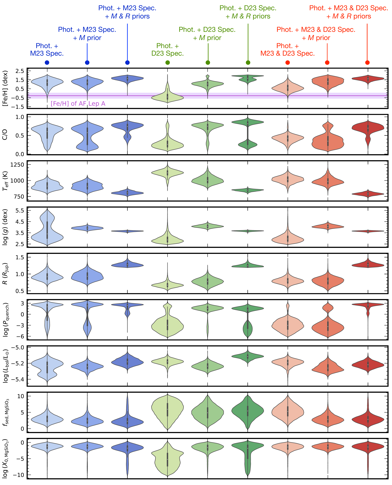
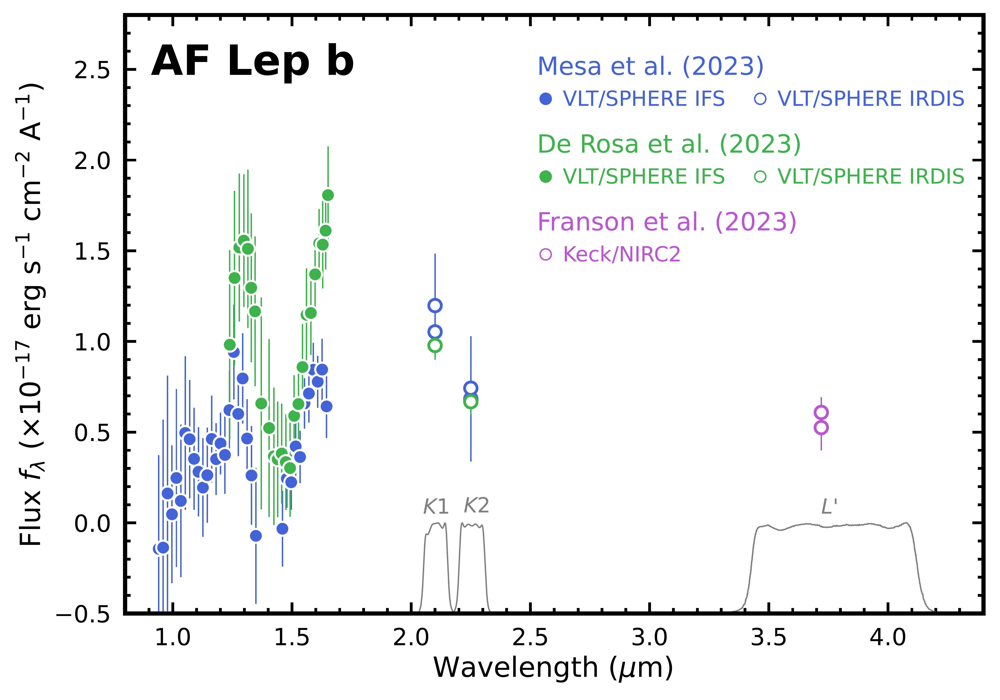

$\newcommand{\ensuremath}{}$
$\newcommand{\xspace}{}$
$\newcommand{\object}[1]{\texttt{#1}}$
$\newcommand{\farcs}{{.}''}$
$\newcommand{\farcm}{{.}'}$
$\newcommand{\arcsec}{''}$
$\newcommand{\arcmin}{'}$
$\newcommand{\ion}[2]{#1#2}$
$\newcommand{\textsc}[1]{\textrm{#1}}$
$\newcommand{\hl}[1]{\textrm{#1}}$
$\newcommand{\footnote}[1]{}$
$\newcommand$
$\newcommand{\vdag}{(v)^\dagger}$
$\newcommand$
$\newcommand$
$\newcommand$
$\newcommand$
$\newcommand$
$\newcommand{\dotdeg}{\rlap{.}^\circ}$
$\newcommand{\dotarcsec}{\rlap{.}"}$
$\newcommand{\thefigure}{\arabic{figure}}$
$\newcommand{\thefigure}{\arabic{figure}}$

# ELemental abundances of Planets and brown dwarfs Imaged around Stars (ELPIS): I. Potential Metal Enrichment of the Exoplanet AF Lep b and a Novel Retrieval Approach for Cloudy Self-luminous Atmospheres

<mark>Appeared on: 2023-09-07</mark> -  _AJ, in press. Main text: Pages 1-32, Figures 1-15, Tables 1-6. All figures and tables after References belong to the Appendix (Pages 32-58, Figures 16-20, Table 7). For supplementary materials, please refer to the Zenodo repository this https URL_

Z. Z. (张周健), et al. -- incl., <mark>P. Mollière</mark>

**Abstract:** AF Lep A+b is a remarkable planetary system hosting a gas-giant planet that has the lowest dynamical mass among directly imaged exoplanets. We present an in-depth analysis of the atmospheric composition of the star and planet to probe the planet's formation pathway. Based on new high-resolution spectroscopy of AF Lep A, we measure a uniform set of stellar parameters and elemental abundances (e.g., [ Fe/H ] $=-0.27 \pm 0.31$ dex). The planet's dynamical mass ( $2.8^{+0.6}_{-0.5}$ M $_{\rm Jup}$ ) and orbit are also refined using published radial velocities, relative astrometry, and absolute astrometry. We use \texttt{petitRADTRANS} to perform chemically-consistent atmospheric retrievals for AF Lep b. The radiative-convective equilibrium temperature profiles are incorporated as parameterized priors on the planet's thermal structure, leading to a robust characterization for cloudy self-luminous atmospheres. This novel approach is enabled by constraining the temperature-pressure profiles via the temperature gradient $(d\ln{T}/d\ln{P})$ , a departure from previous studies that solely modeled the temperature. Through multiple retrievals performed on different portions of the $0.9-4.2$  $\mu$ m spectrophotometry, along with different priors on the planet's mass and radius, we infer that AF Lep b likely possesses a metal-enriched atmosphere ( [ Fe/H ] $>1.0$ dex). AF Lep b's potential metal enrichment may be due to planetesimal accretion, giant impacts, and/or core erosion. The first process coincides with the debris disk in the system, which could be dynamically excited by AF Lep b and lead to planetesimal bombardment. Our analysis also determines $T_{\rm eff} \approx 800$ K, $\log{(g)} \approx 3.7$ dex, and the presence of silicate clouds and dis-equilibrium chemistry in the atmosphere. Straddling the L/T transition, AF Lep b is thus far the coldest exoplanet with suggested evidence of silicate clouds.

**Figure 25. -** Violin plot for the posteriors of several key physical and chemical parameters derived from all the nine retrieval runs (Section \ref{sec:retrieval}). The left three columns (blue) correspond to the retrievals on the $K1/K2/L'$ photometry and the \cite{2023AandA...672A..93M} spectrum (Section \ref{subsec:phot_m23spec}). The middle three columns (green) correspond to the retrievals on the $K1/K2/L'$ photometry and the \cite{2023AandA...672A..94D} spectrum (Section \ref{subsec:phot_d23spec}). The right three columns (red) correspond to the retrievals on the $K1/K2/L'$ photometry and both \cite{2023AandA...672A..93M} and \cite{2023AandA...672A..94D} spectra. Plots with darker blue/green/red colors suggest the addition of narrower and constrained priors on $M$(slightly darker) or both $M$ and $R$(much darker). The measured [Fe/H] of the host star AF Lep A ($-0.27 \pm 0.31$ dex; Section \ref{sec:host_param_abund}) is shown as the purple shade in the top panel.  (*fig:violin_key*)

**Figure 1. -** Spectrophotometry of AF Lep b from \citeauthor{2023AandA...672A..93M}(\citeyear{2023AandA...672A..93M}; blue), \citeauthor{2023AandA...672A..94D}(\citeyear{2023AandA...672A..94D}; green), and \citeauthor{2023ApJ...950L..19F}(\citeyear{2023ApJ...950L..19F}; purple). Photometry is converted from magnitudes into fluxes (unless reported in the literature) based on zero points provided by \cite{2017AJ....154..218N}. Response curves of $K1/K2/L'$ bands (grey) are obtained from the VLT/SPHERE and Keck/NIRC2 websites.  (*fig:specphot*)

**Figure 23. -** Results of the retrieval analysis on $K1/K2/L'$ photometry and both \cite{2023AandA...672A..93M} and \cite{2023AandA...672A..94D} spectra of AF Lep b (Section \ref{subsec:phot_d23spec}), with the same format as Figure \ref{fig:results_m23}. (*fig:results_m23d23*)

