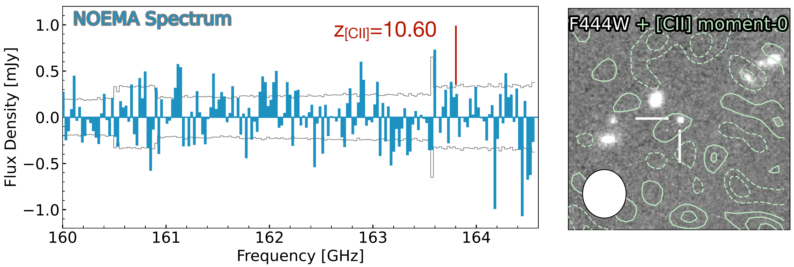
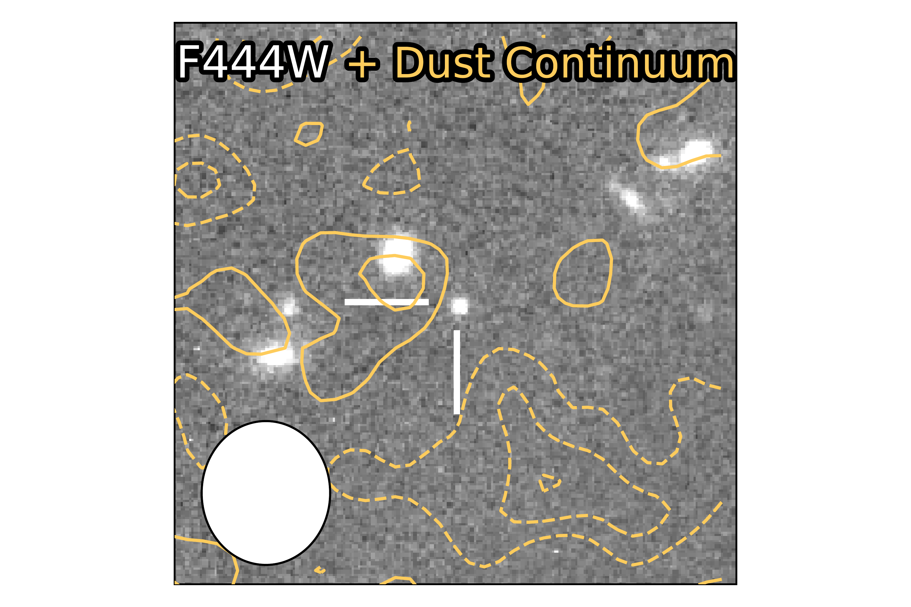
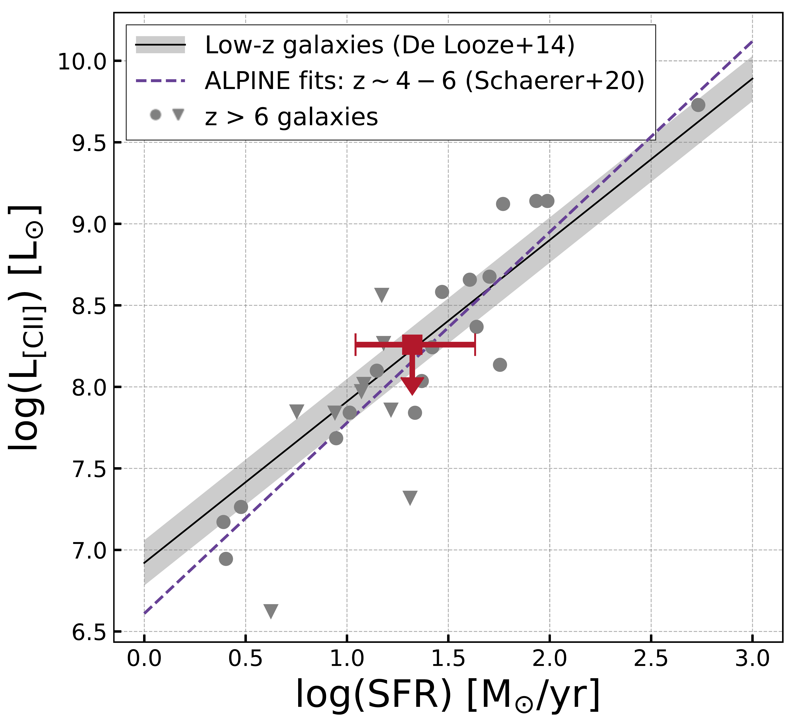

$\newcommand{\ensuremath}{}$
$\newcommand{\xspace}{}$
$\newcommand{\object}[1]{\texttt{#1}}$
$\newcommand{\farcs}{{.}''}$
$\newcommand{\farcm}{{.}'}$
$\newcommand{\arcsec}{''}$
$\newcommand{\arcmin}{'}$
$\newcommand{\ion}[2]{#1#2}$
$\newcommand{\textsc}[1]{\textrm{#1}}$
$\newcommand{\hl}[1]{\textrm{#1}}$
$\newcommand{\footnote}[1]{}$
$\newcommand{\red}[1]{\textcolor{red}{#1}}$
$\newcommand{\magenta}[1]{\textcolor{magenta}{#1}}$
$\newcommand{\arraystretch}{1.3}$
$\newcommand{\thebibliography}{\DeclareRobustCommand{\VAN}[3]{##3}\VANthebibliography}$
$\newcommand{\lfir}{L_{\rm FIR}}$
$\newcommand{\lfuv}{L_{\rm FUV}}$
$\newcommand{\lcii}{L_{\rm[CII]}}$
$\newcommand{\luv}{L_{\rm UV}}$
$\newcommand{\lir}{L_{\rm IR}}$
$\newcommand{\lsol}{L_{\odot}}$
$\newcommand{\lya}{Ly\alpha}$
$\newcommand{\sfrlya}{SFR_{Ly\alpha}}$
$\newcommand{\sfrha}{SFR_{H\alpha}}$
$\newcommand{\sfruv}{SFR_{UV}}$
$\newcommand{\sfrir}{SFR_{IR}}$
$\newcommand{\sfrtot}{SFR_{TOT}}$
$\newcommand{\msolyr}{M_{\odot}~yr^{-1}}$
$\newcommand{\micron}{\mum}$
$\newcommand{\hyperz}{{\em Hyperz}}$
$\newcommand{\myr}{M_{\odot}~yr^{-1}}$
$\newcommand{\msunyr}{M_{\odot}~yr^{-1}}$
$\newcommand{\lsun}{L_{\odot}}$
$\newcommand{\msun}{M_{\odot}}$
$\newcommand{\zphot}{\ifmmode z_{\rm phot}\elsez_{\rm phot}\fi}$
$\newcommand{\sskip}{\vskip 3truept \noindent}$
$\newcommand{\Oiii}{[O {\sc iii}]}$
$\newcommand{\Neiii}{[Ne {\sc iii}]}$
$\newcommand{\Oii}{[O {\sc ii}]}$
$\newcommand{\Cii}{[C {\sc ii}]}$
$\newcommand{\Nii}{[N {\sc ii}]}$
$\newcommand{\Oi}{[O {\sc i}]}$
$\newcommand{\ltsima}{\buildrel<\over\sim}$
$\newcommand{\la}{\lower.5ex\hbox{\ltsima}~}$
$\newcommand{\gtsima}{\buildrel>\over\sim}$
$\newcommand{\ga}{\lower.5ex\hbox{\gtsima}~}$
$\newcommand{\}{deg}$

# NOEMA observations of GN-z11: Constraining Neutral Interstellar Medium and Dust Formation in the Heart of Cosmic Reionization at $z=10.6$

<mark>Appeared on: 2023-09-07</mark> -  _submitted to MNRAS, 7 pages, 4 figures, 1 table_

Y. Fudamoto, et al. -- incl., <mark>F. Walter</mark>

**Abstract:** We present results of dust continuum and $\Cii$ $ 158 {\rm \mu m}$ emission line observations of a remarkably UV-luminous ( $M_{\rm UV}=-21.6$ ) galaxy at $z=10.603$ : GN-z11.Using the Northern Extended Millimeter Array (NOEMA),  observations have been carried out over multiple observing cycles. We achieved a high sensitivity resulting in a $\lambda_{\rm rest}=160 {\rm \mu m}$ continuum $1 \sigma$ sensitivity of $13.0 \rm{\mu Jy/beam}$ and a $\Cii$ emission line $1 \sigma$ sensitivity of $31 \rm{mJy/beam km/s}$ using $50 \rm{km/s}$ binning with a $\sim 2 {\rm arcsec}$ synthesized beam.Neither dust continuum nor $\Cii$ $ 158 {\rm \mu m}$ line emission are detected at the expected frequency of $\nu_{\rm[CII]} = 163.791 \rm{GHz}$ and the sky location of GN-z11.The upper limits show that GN-z11 is neither luminous in $\lir$ nor $L_{\rm[CII]}$ , with a dust mass $3 \sigma$ limit of ${\rm log}(M_{\rm dust}/{\rm M_{\odot}}) < 6.5-6.9$ and with a $\Cii$ based molecular gas mass $3 \sigma$ limit of ${\rm log}(M_{\rm mol,[CII]}/{\rm M_{\odot}}) < 9.3$ .Together with radiative transfer calculations, we also investigated the possible cause of the dust poor nature of the GN-z11 showed by the blue color in the UV continuum of GN-z11 ( $\beta_{\rm UV}=-2.4$ ), and found that $\gtrsim3\times$ deeper observations are crucial to study dust production at very high-redshift.Nevertheless, our observations show the crucial role of deep mm/submm observations of very high redshift galaxies to constrain multiple phases in the interstellar medium.

**Figure 4. -** ** Left Panel: ** The NOEMA spectrum of GN-z11 with $50 \mathrm{km/s}$ binning. The gray solid line shows the RMS of each channel. The NOEMA observation covers $\Cii$$ 158 \rm{\mu m}$ emission line of GN-z11 at the observed frequency of $\nu_{\rm obs}=163.84 {\rm GHz}$ with the $z_{\rm spec}=10.60$(Red line). From the data cube and extracted spectrum, we do not find any signal of the $\Cii$ emission line.
    ** Right panel:**$8^{\prime\prime}\times8^{\prime\prime}$ cutout of JWST F444W image (background) and $\Cii$ emission line moment-0 map (contours) of GN-z11. Contours show 1, 2, 3$\sigma$ and dashed contours show -3, -2, -1$\sigma$. The moment-0 map of the data cube is made by integrating over the $150 \rm{km/s}$ of the $\Cii$ emission line frequency. RMS of the image is $29 {\rm mJy km/s}$, providing a $3 \sigma$ upper limit of $\Cii$ luminosity $<1.7\times10^{8} {\rm L_{\odot}}$.
     (*fig:c2*)

**Figure 1. -** $8^{\prime\prime}\times8^{\prime\prime}$ cutout of the JWST F444W image obtained by the FRESCO JWST survey (background;  ([ and Oesch 2023](https://ui.adsabs.harvard.edu/abs/2023arXiv230402026O)) ) and dust continuum (orange contours) of GN-z11: Solid contours show 1, 2$ \sigma$ and dashed contours show -3, -2, -1$\sigma$ where $1 \sigma=13.0 \mathrm{\mu Jy/beam}$. The white ellipse in the lower left corner shows the synthesized beam FWHM of the combined dust continuum image ($2.1^{\prime\prime}\times1.8^{\prime\prime}$).
     (*fig:continuum*)

**Figure 2. -** Star formation rate versus $\Cii$ emission line luminosity of GN-z11. Previous observations of $z>6$ are also plotted with gray points ( ([ and Harikane 2020](https://ui.adsabs.harvard.edu/abs/2020ApJ...896...93H)) ;  ([ and Fudamoto 2023](https://ui.adsabs.harvard.edu/abs/2023arXiv230307513F)) ;  ([ and Schouws 2022](https://ui.adsabs.harvard.edu/abs/2022arXiv220204080S))  and references therein). Downward triangles show $3 \sigma$ upper limit in case of non-detections. Lines show previously obtained relations for low- and high-redshift galaxies (solid:  ([ and Schaerer 2020](https://ui.adsabs.harvard.edu/abs/2020A&A...643A...3S)) ).
    For the SFR of GN-z11, we adopted the SED fitting results of $21^{+22}_{-10} {\rm M_{\odot} yr^{-1}}$ from [ and Tacchella (2023)](https://ui.adsabs.harvard.edu/abs/2023arXiv230207234T). (*fig:C2SFR*)

