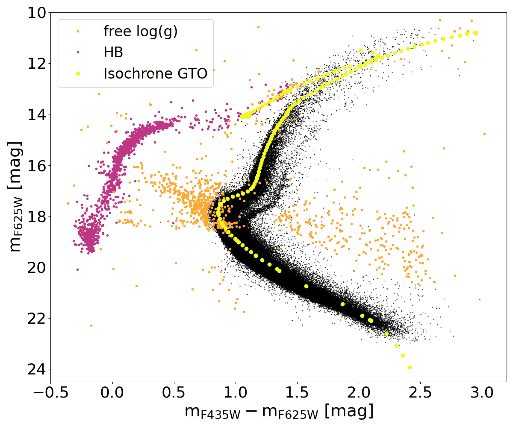
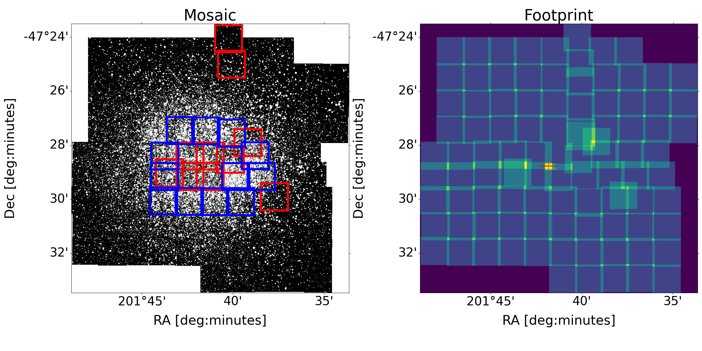
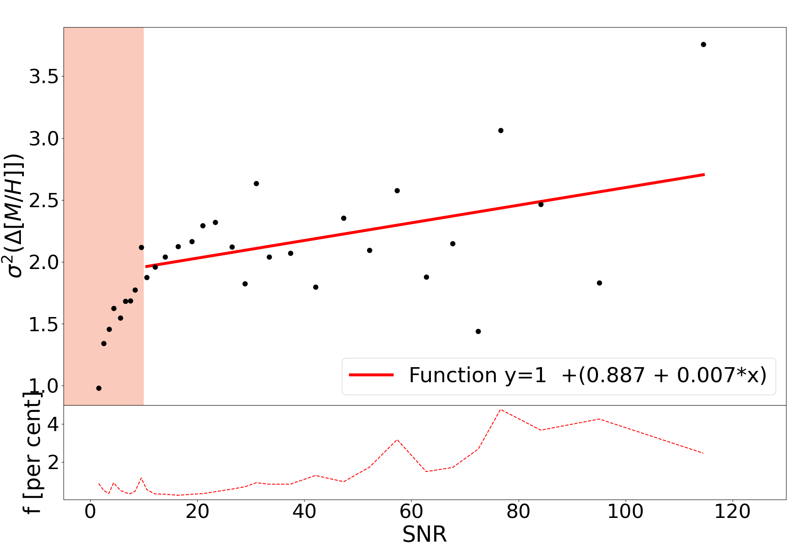
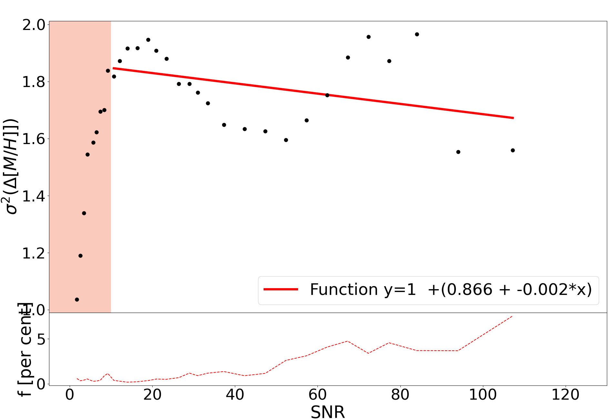

$\newcommand{\ensuremath}{}$
$\newcommand{\xspace}{}$
$\newcommand{\object}[1]{\texttt{#1}}$
$\newcommand{\farcs}{{.}''}$
$\newcommand{\farcm}{{.}'}$
$\newcommand{\arcsec}{''}$
$\newcommand{\arcmin}{'}$
$\newcommand{\ion}[2]{#1#2}$
$\newcommand{\textsc}[1]{\textrm{#1}}$
$\newcommand{\hl}[1]{\textrm{#1}}$
$\newcommand{\footnote}[1]{}$
$\newcommand$
$\newcommand$
$\newcommand{\sectionautorefname}{Section}$
$\newcommand{\subsectionautorefname}{Section}$
$\newcommand{\subsubsectionautorefname}{Section}$
$\newcommand{\figureautorefname}{Fig.}$

# oMEGACat I: MUSE spectroscopy of 300,000 stars within the half-light radius of $\omega$ Centauri

<mark>Appeared on: 2023-09-07</mark> -  _27 pages, 18 figures, 3 tables, accepted for publication in ApJ, the catalog will be available in the online material of the published article_

M. S. Nitschai, et al. -- incl., <mark>N. Neumayer</mark>, <mark>C. Clontz</mark>, <mark>M. Häberle</mark>, <mark>A. Feldmeier-Krause</mark>

**Abstract:** Omega Centauri ( $\omega$ Cen) is the most massive globular cluster of the Milky Way and has been the focus of many studies that reveal the complexity of its stellar populations and kinematics. However, most previous studies have used photometric and spectroscopic datasets with limited spatial or magnitude coverage, while we aim to investigate it having full spatial coverage out to its half-light radius and stars ranging from the main sequence to the tip of the red giant branch. This is the first paper in a new survey of $\omega$ Cen that combines uniform imaging and spectroscopic data out to its half-light radius to study its stellar populations, kinematics, and formation history. In this paper, we present an unprecedented MUSE spectroscopic dataset combining 87 new MUSE pointings with previous observations collected from guaranteed time observations. We extract spectra of more than 300,000 stars reaching more than two magnitudes below the main sequence turn-off. We use these spectra to derive metallicity and line-of-sight velocity measurements and determine robust uncertainties on these quantities using repeat measurements. Applying quality cuts we achieve signal-to-noise ratios of 16.47/73.51 and mean metallicity errors of 0.174/0.031 dex for the main sequence stars ( $\SI{18}{\mag}$ $\rm < mag_{F625W}<$ $\SI{22}{\mag}$ ) and red giant branch stars ( $\SI{16}{\mag}$ $<\rm  mag_{F625W}<$ $\SI{10}{\mag}$ ), respectively. We correct the metallicities for atomic diffusion and identify foreground stars. This massive spectroscopic dataset will enable future studies that will transform our understanding of $\omega$ Cen, allowing us to investigate the stellar populations, ages, and kinematics in great detail.

**Figure 2. -** **CMD of GO stars.** CMD of the stars in the GO dataset. The black dots show the stars with fixed log(g) in our spexxy fit while the orange points have free log(g) and the purple are the HB stars which are disregarded in the current analysis. The yellow points indicate the position of the isochrone used to infer the log(g).  (*fig:CMD spexxy*)

**Figure 12. -** **Image of $\omega$ Cen and footprint of the MUSE pointings.** On the left is a grayscale image created from the combined GO and GTO MUSE WFM data. Overlaid blue colored squares indicate the GO AO pointings, red squares the WFM GTO data, while the region without squares is where the non-AO GO WFM pointings lie. On the right is the footprint of the individual pointings showing the overlap of the data. At the center of the right-hand Figure, the NFM data are within the yellow region at the center of the image, indicated with a red cross.
 (*fig:data*)

**Figure 15. -** **Error analysis correction.** Top panels: The x-axis is the SNR and the y-axis is the $\sigma^2$ of the $\Delta[M/H]$ for the GO data on the left and the GTO data on the right. The red line is the best-fitting first-order polynomial, the black dots are our data values, and the light red shaded area is the region below an SNR of 10, which we exclude from the analysis. Bottom panels: The x-axis is the SNR and the maximum percentage of counts one star has in each bin. The red dashed line shows the maximum number of measurements each star can have, which is clearly always below 10 \% of the total number of measurements in each bin, making sure the statistics in each bin are not the result of only one star. (*fig:error SN*)

