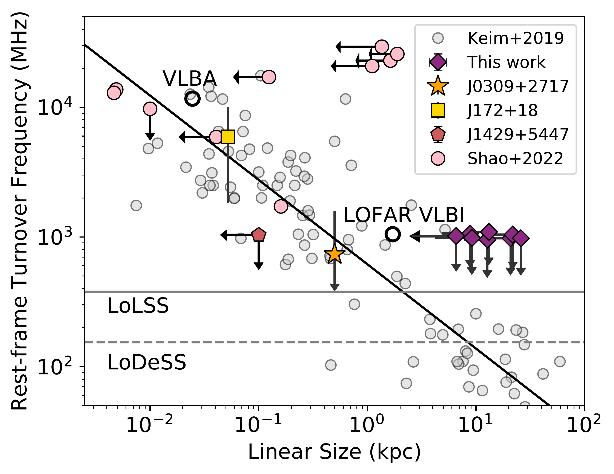
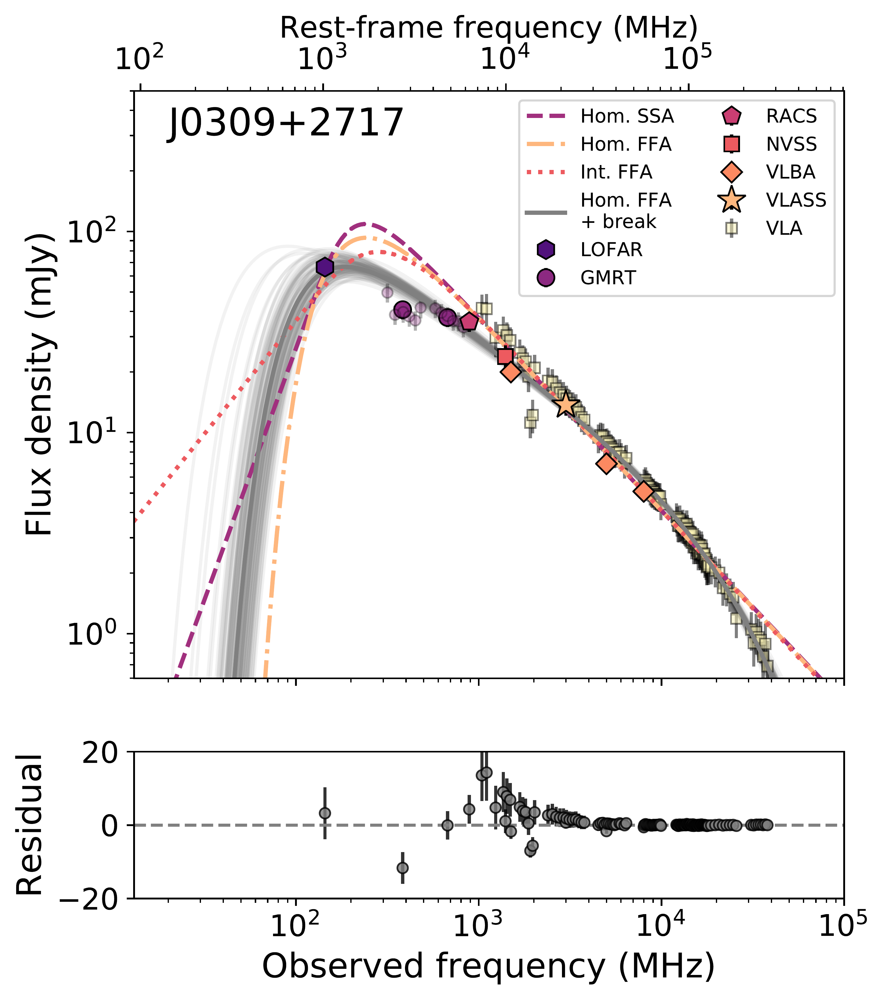
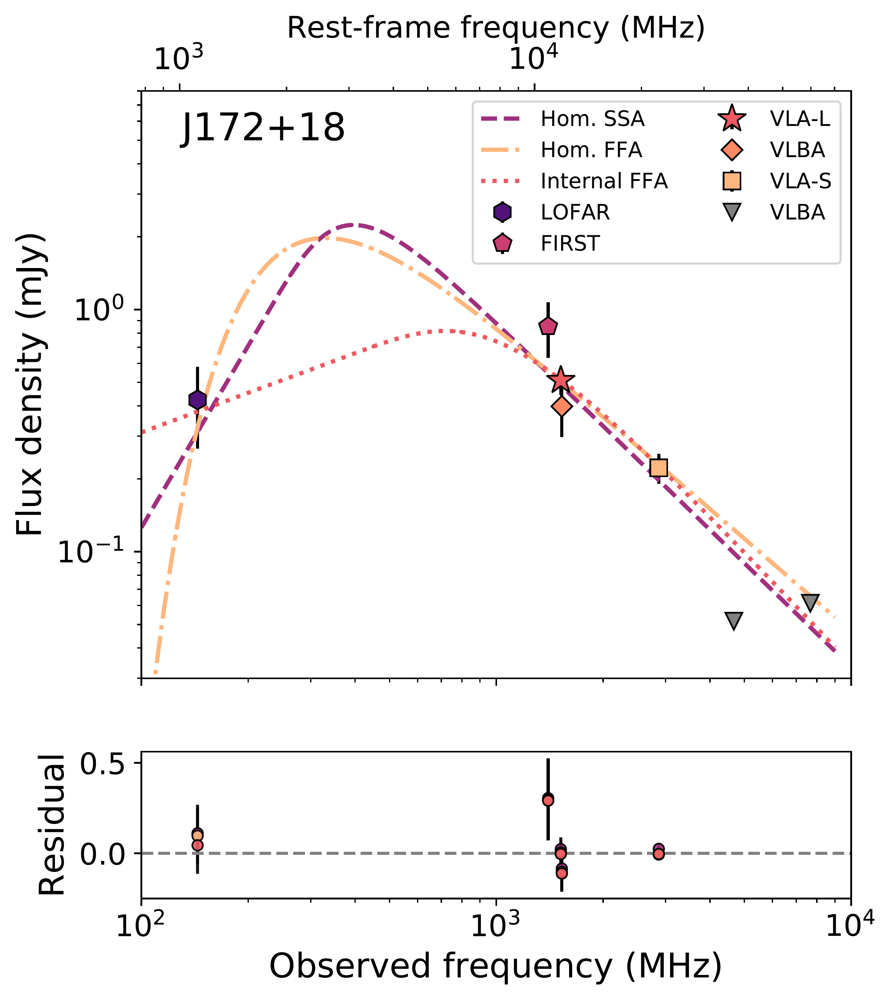
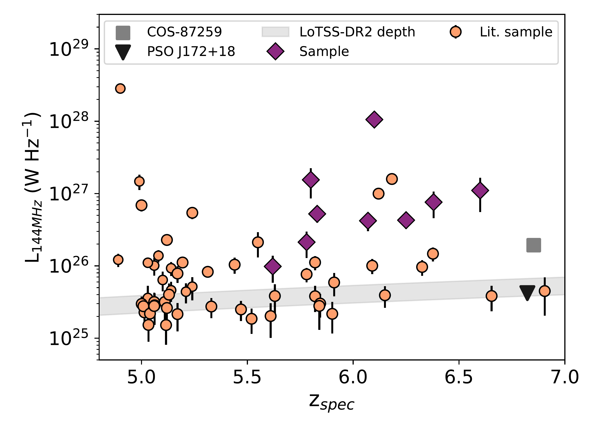

$\newcommand{\ensuremath}{}$
$\newcommand{\xspace}{}$
$\newcommand{\object}[1]{\texttt{#1}}$
$\newcommand{\farcs}{{.}''}$
$\newcommand{\farcm}{{.}'}$
$\newcommand{\arcsec}{''}$
$\newcommand{\arcmin}{'}$
$\newcommand{\ion}[2]{#1#2}$
$\newcommand{\textsc}[1]{\textrm{#1}}$
$\newcommand{\hl}[1]{\textrm{#1}}$
$\newcommand{\footnote}[1]{}$
$\newcommand{\RNum}[1]{\uppercase\expandafter{\romannumeral #1\relax}}$
$\newcommand{\arraystretch}{2.0}$

# No strong radio absorption detected in the low-frequency spectra of radio-loud quasars at $z>5.6$

<mark>Appeared on: 2023-09-11</mark> -  _15 pages, 7 figures, accepted for publication in A&A_

A. J. Gloudemans, et al. -- incl., <mark>S. Belladitta</mark>

**Abstract:** We present the low-frequency radio spectra of 9 high-redshift quasars at $5.6 \leq z \leq 6.6$ using the Giant Metre Radio Telescope band-3, -4, and -5 observations ( $\sim$ 300-1200 MHz), archival Low Frequency Array (LOFAR; 144 MHz), and Very Large Array (VLA; 1.4 and 3 GHz) data. Five of the quasars in our sample have been discovered recently, representing some of the highest redshift radio bright quasars known at low-frequencies. We model their radio spectra to study their radio emission mechanism and age of the radio jets by constraining the spectral turnover caused by synchrotron self-absorption (SSA) or free-free absorption (FFA). Besides J0309+2717, a blazar at $z=6.1$ , our quasars show no sign of a spectral flattening between 144 MHz and a few GHz, indicating there is no strong SSA or FFA absorption in the observed frequency range. However, we find a wide range of spectral indices between $-1.6$ and $0.05$ , including the discovery of 3 potential ultra-steep spectrum quasars. Using further archival VLBA data, we confirm that the radio SED of the blazar J0309+2717 likely turns over at a rest-frame frequency of 0.6-2.3 GHz (90-330 MHz observed frame), with a high-frequency break indicative of radiative ageing of the electron population in the radio lobes. Ultra-low frequency data below 50 MHz are necessary to constrain the absorption mechanism for J0309+2717 and the turnover frequencies for the other high- $z$ quasars in our sample.A relation between linear radio jet size and turnover frequency has been established at low redshifts. If this relation were to hold at high redshifts, the limits on the turnover frequency of our sample suggest the radio jet sizes must be more extended than the typical sizes observed in other radio-bright quasars at similar redshift. To confirm this deep radio follow-up observations with high spatial resolution are required.

**Figure 3. -** Linear sizes versus rest-frame turnover frequency for the quasars in our sample, J172+18, and the 10 high-$z$ quasars from [Shao, Wagg and Wang (2022)](). The grey points show low-redshift ($z\approx0.1$-2) peaked spectrum sources from [Keim, Callingham and Röttgering (2019)](), which follow a tight relation given by the black solid line (see  ([Keim, Callingham and Röttgering 2019]()) ). Apart from J0309+2717, we have only upper limits on the linear sizes of the quasars in our sample and their turnover frequencies. Five of the quasars from [Shao, Wagg and Wang (2022)]() have been observed at mas resolution with the VLBA and three of them have size measurements, which seem to follow the low-$z$ relation. The solid and dashed grey lines show the frequencies of the LoLSS and LoDeSS survey, respectively, and the black open circles the resolution of the LOFAR VLBI and VLBA at 150 MHz and 1.6 GHz (observed frame). (*fig:linear_sizes*)

**Figure 5. -**  Radio spectra of J0309+2717 (left) and J172+18 (right) including reported literature radio flux density measurements. Left: The GMRT subband flux densities of the band 3 and 4 observations are shown in light purple. The VLBA and VLA measurements have been provided by [Spingola, Dallacasa and Belladitta (2020)](). The dashed, dash-dotted and dotted line show the best fitting homogeneous SSA, homogeneous FFA, and internal FFA models, respectively. The homogeneous FFA with a break due to an ageing electron population (grey line) gives the best fit to the spectrum with a reduced $\chi^2$ of 0.6 and $\Delta$BIC $>6$ compared to all other models. Randomly selected MCMC fits are shown in light grey to visualize the uncertainty in the model fit with the parameters given in Tab. \ref{tab:curve_parameters}. The bottom plot shows the residual of the homogeneous FFA model with a break. Right: The VLA-L and -S observations have been conducted by [Bañados, Mazzucchelli and Momjian (2021)]() and the VLBA observations by [Momjian, et. al (2021)](). Upper limits are given for the LOFAR at 144 MHz and the VLBA observations at 4.67 and 7.67 GHz. Due to a limited number of data points between 150 MHz and 1 GHz the absorption models remain unconstrained. However, we can conclude that the spectrum likely peaks between 0.25-1.3 GHz (rest-frame 2-10 GHz), meaning it can be classified as a GPS source. Again the residuals are shown in the bottom panel.  (*fig:radio_curves*)

**Figure 1. -** Radio luminosities at 144 MHz versus spectroscopic redshift of our selected sample and other known LOFAR detected quasars compiled by [Gloudemans, Duncan and Röttgering (2021)](), [Gloudemans, Duncan and Saxena (2022)](). Our sample probes some of the brightest and highest redshift radio-loud quasars currently known at low frequencies. The heavily obscured AGN COS-87259 is currently the highest redshift radio-loud quasar known and has been detected by LOFAR  ([Endsley, Stark and Bouwens 2022](), [Endsley, Stark and Lyu 2022]()) . The two radio-loud quasars around $z\sim6.1$(J1427+3312 and J1429+5447) have not been included in our sample because their radio spectra have already been studied by [Shao, Wagg and Wang (2020)]() and [Shao, Wagg and Wang (2022)](), with J1427+3312 showing a turnover around 1.7 GHz rest-frame.  (*fig:radio_lum*)

