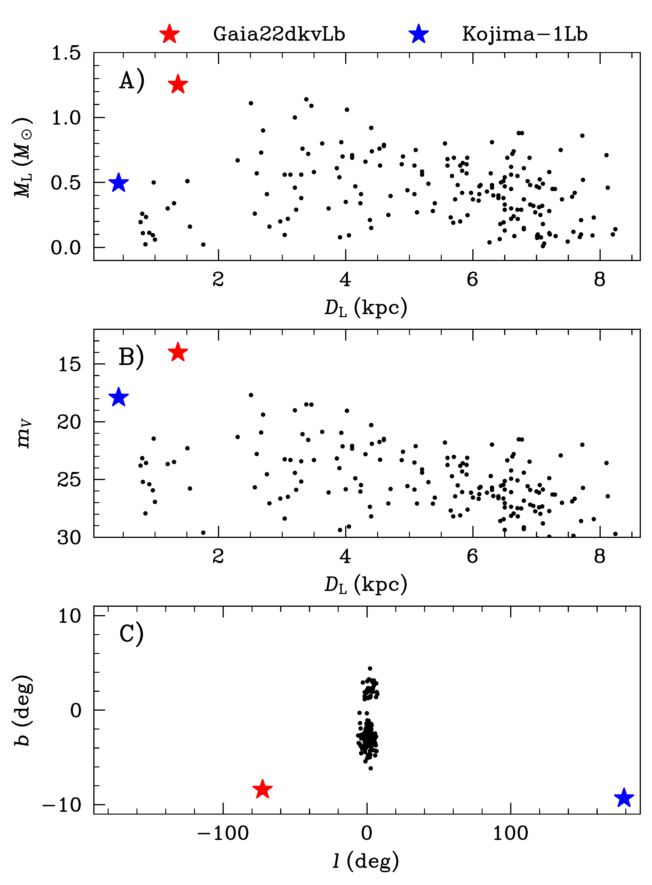
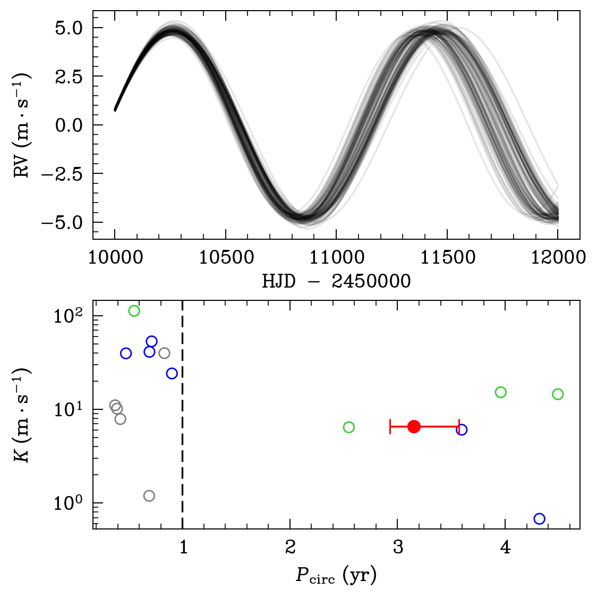
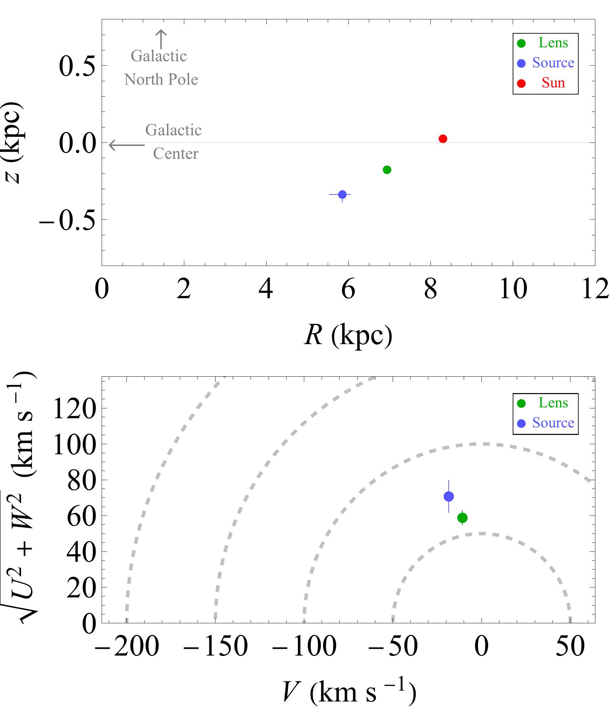

$\newcommand{\ensuremath}{}$
$\newcommand{\xspace}{}$
$\newcommand{\object}[1]{\texttt{#1}}$
$\newcommand{\farcs}{{.}''}$
$\newcommand{\farcm}{{.}'}$
$\newcommand{\arcsec}{''}$
$\newcommand{\arcmin}{'}$
$\newcommand{\ion}[2]{#1#2}$
$\newcommand{\textsc}[1]{\textrm{#1}}$
$\newcommand{\hl}[1]{\textrm{#1}}$
$\newcommand{\footnote}[1]{}$
$\newcommand$
$\newcommand{\bdv}[1]{\mbox{\boldmath#1}}$
$\newcommand{\au}{{\rm AU}}$
$\newcommand{\sinc}{{\rm sinc}}$
$\newcommand{\kms}{{\rm km} {\rm s}^{-1}}$
$\newcommand{\masyr}{{\rm mas} {\rm yr}^{-1}}$
$\newcommand{\kpc}{{\rm kpc}}$
$\newcommand{\mas}{{\rm mas}}$
$\newcommand{\sat}{{\rm sat}}$
$\newcommand{\muas}{\mu{\rm as}}$
$\newcommand{\var}{{\rm var}}$
$\newcommand{\pc}{{\rm pc}}$
$\newcommand{\orb}{{\rm orb}}$
$\newcommand{\obs}{{\rm obs}}$
$\newcommand{\max}{{\rm max}}$
$\newcommand{\min}{{\rm min}}$
$\newcommand{\rel}{{\rm rel}}$
$\newcommand{\ast}{{\rm ast}}$
$\newcommand{\eff}{{\rm eff}}$
$\newcommand{\rot}{{\rm rot}}$
$\newcommand{\lsr}{{\rm lsr}}$
$\newcommand{\hel}{{\rm hel}}$
$\newcommand{\geo}{{\rm geo}}$
$\newcommand{\B}{{\rm B}}$
$\newcommand{\Sc}{{\rm S}}$
$\newcommand{\L}{{\rm L}}$
$\newcommand{\E}{{\rm E}}$
$\newcommand{\bpi}{{\bdv\pi}}$
$\newcommand{\bmu}{{\bdv\mu}}$
$\newcommand{\balpha}{{\bdv\alpha}}$
$\newcommand{\bgamma}{{\bdv\gamma}}$
$\newcommand{\bDelta}{{\bdv\Delta}}$
$\newcommand{\btheta}{{\bdv\theta}}$
$\newcommand{\bphi}{{\bdv\phi}}$
$\newcommand{\bp}{{\bf p}}$
$\newcommand{\bv}{{\bf v}}$
$\newcommand{\bu}{{\bf u}}$
$\newcommand{\naive}{{\rm naive}}$
$\newcommand{\revise}{\bf}$
$\newcommand{\revisec}{\color{red}}$
$\newcommand{\rowmac}{#1}$

# Gaia22dkvLb: A Microlensing Planet Potentially Accessible to Radial-Velocity Characterization

<mark>Appeared on: 2023-09-11</mark> - 

Z. Wu, et al. -- incl., <mark>K. El-Badry</mark>, <mark>A. Gould</mark>

**Abstract:** We report discovering an exoplanet from following up a microlensing event alerted by Gaia. The event Gaia22dkv is toward a nearby disk source at $\sim 2.5$ kpc rather than the traditional bulge microlensing fields. Our primary analysis yields a Jovian planet with $M_{\rm p} = 0.50 \pm 0.05 M_{\rm J}$ at a projected orbital separation $r_{\perp} = 1.63\pm0.17$ AU. The host is a turnoff star with mass $1.24\pm{0.06} M_\odot$ and distance of $1.35\pm0.09$ kpc, and at $r'\approx14$ , it is far brighter than any previously discovered microlensing planet host, opening up the opportunity of testing the microlensing model with radial velocity (RV) observations.RV data can be used to measure the planet's orbital period and eccentricity, and they also enable searching for inner planets of the microlensing cold Jupiter, as expected from the "inner-outer correlation" inferred from $_ Kepler_$ and RV discoveries.Furthermore, we show that Gaia astrometric microlensing will not only allow precise measurements of its angular Einstein radius $\theta_{\rm E}$ , but also directly measure the microlens parallax vector and unambiguously break a geometric light-curve degeneracy, leading to definitive characterization of the lens system.

**Figure 6. -** Host properties of microlensing planets. We use the parameters of the default models (modeldef=1) in the microlensing planet catalog of the NASA Exoplanet Archive for all discoveries in the bulge field (black dots). The host properties of Kojima-1Lb (blue star) are from [Zang, Dong and Gould (2020)](), and those of Gaia22dkvLb are based on the globally best fit UPS$-$3.4$(u_0+)$ in this work. Panel A): Host  mass ($M_$\L$$) vs. distance ($D_$\L$$). Panel B):  Host brightness in $V$ band ($m_V$) vs. distance ($D_$\L$$). For the systems in the bulge field, we make crude $V$-band brightness estimates by assuming the lens star is a main-sequence star with stellar mass $M_$\L$$ at $D_$\L$$. We use the isochrone at a stellar age of $5$ Gyr from the Dartmouth Stellar Evolution Database   ([Dotter and Chaboyer 2008]())  to estimate the stellar luminosities. Then we apply the extinction corrections using the near-infrared extinction maps by [Gonzalez, Rejkuba and Zoccali (2012)]() and convert it to $A_V$ with the relationship in [Cardelli, Clayton and Mathis (1989)](). Panel C): The Galactic longitude ($l$) vs. latitude ($b$) distribution.
 (*fig:hosts*)

**Figure 3. -** The upper panel displays the predicted radial velocity curves based on the orbital parameters of the best fit. The black lines represent the MCMC sample with $\Delta \chi^2 < 1$. The lower panel displays the RV semi amplitude $K$ and circular orbital period $P_{\rm circ}$ for all solutions. The best-fit solution is shown as a red filled circle with error bar, which is the only physically reasonable solution under the assumption that the blend is the lens and circular planetary orbital motion. Other solutions are shown as the color-coded open circles in red, yellow, green, blue, grey represents other solutions with $\Delta\chi^2 < 1, 4, 9, 16, 25$ compared with best fit, respectively. One year period is indicated as dashed line.
 (*fig:RV_curve*)

**Figure 4. -** Galactic kinematics of the lens (green dot with error bar) and the source (blue dot with error bar) based on the best-fit solution.
Upper: the Galactocentric distance $R$ and height $z$ with respect to the Galactic plane positions (the red dot represents the Sun at $z_{\odot}$$=$ 25 pc;  ([ and Brooks 2008]()) ).
Lower:  the Toomre diagram. Dashed curves indicate constant peculiar velocities = 50, 100, 150, and 200 $\mathrm{km s^{-1}}$.
 (*fig:gala*)

