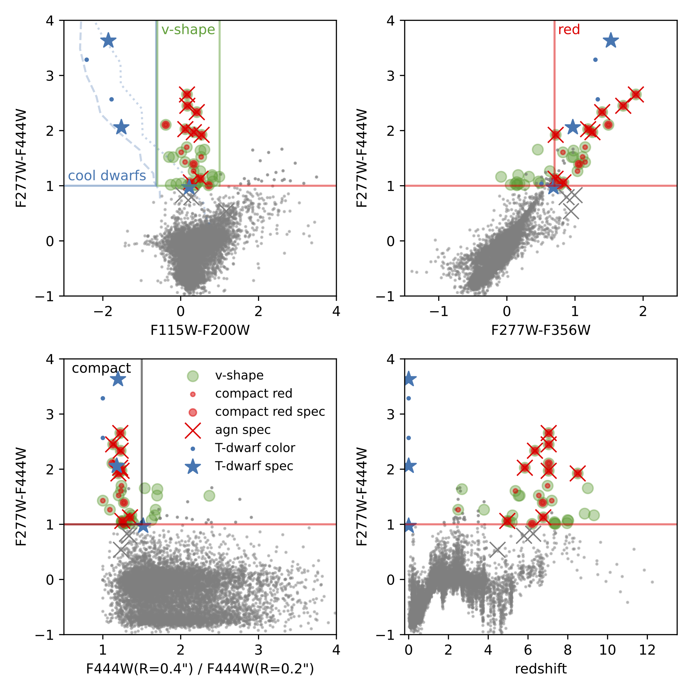
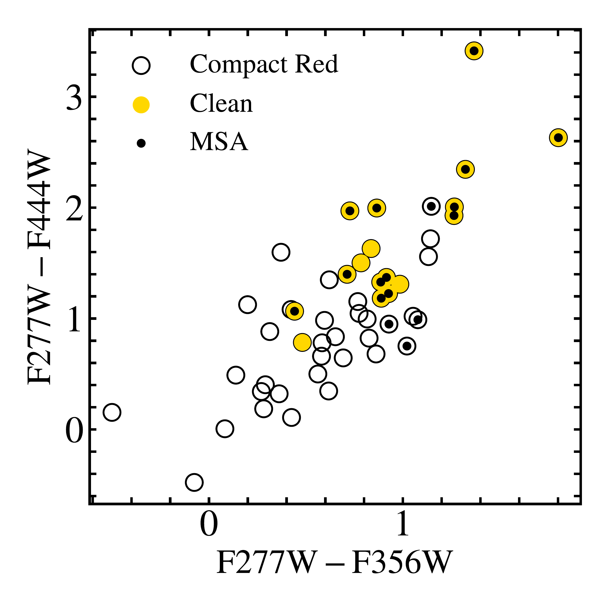
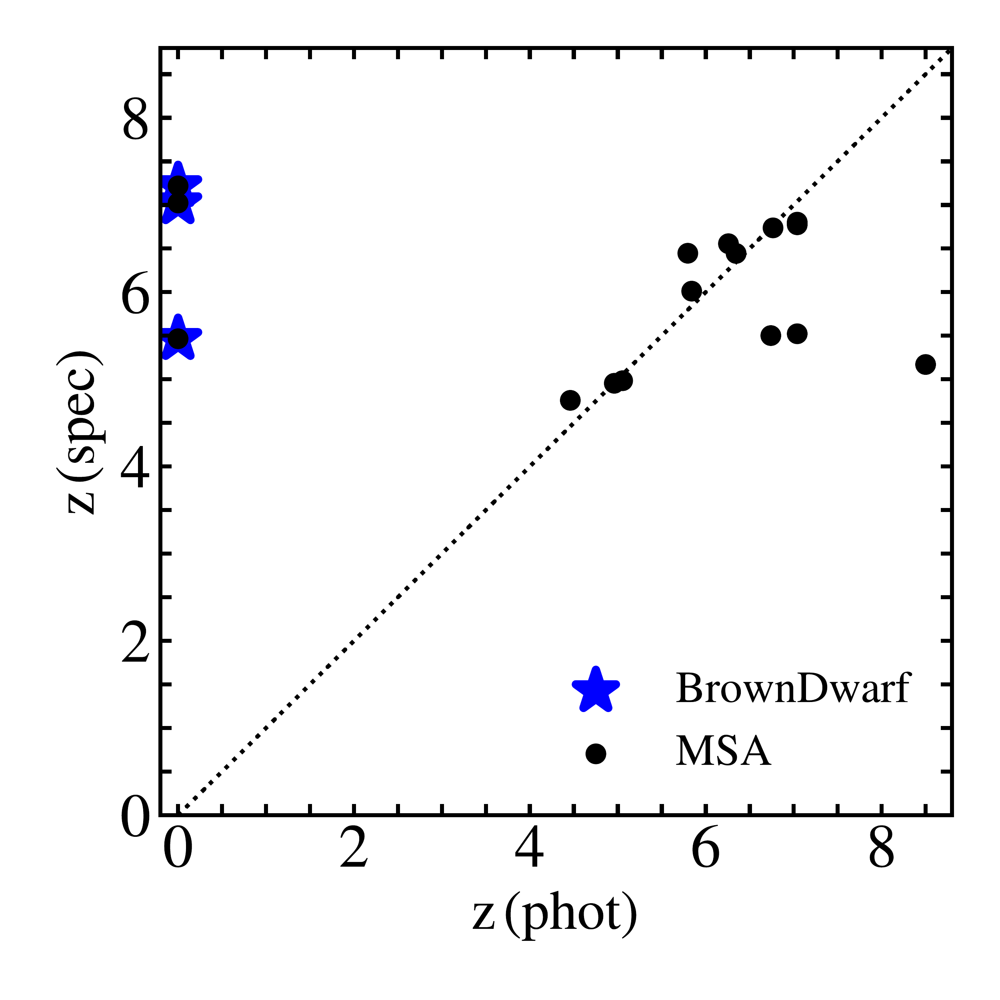
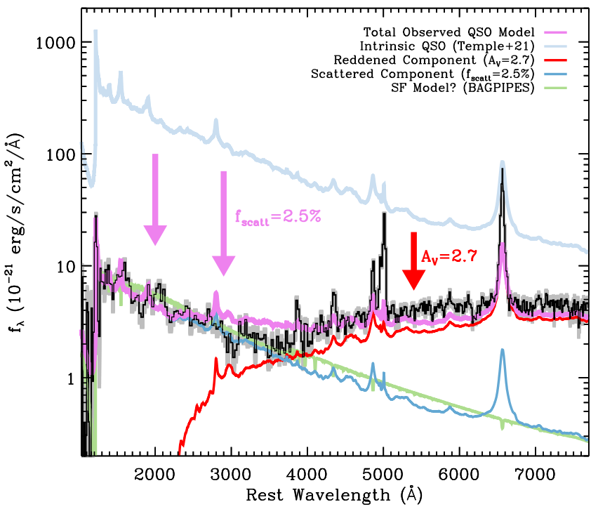

$\newcommand{\ensuremath}{}$
$\newcommand{\xspace}{}$
$\newcommand{\object}[1]{\texttt{#1}}$
$\newcommand{\farcs}{{.}''}$
$\newcommand{\farcm}{{.}'}$
$\newcommand{\arcsec}{''}$
$\newcommand{\arcmin}{'}$
$\newcommand{\ion}[2]{#1#2}$
$\newcommand{\textsc}[1]{\textrm{#1}}$
$\newcommand{\hl}[1]{\textrm{#1}}$
$\newcommand{\footnote}[1]{}$
$\newcommand{\url}[1]{\href{#1}{#1}}$
$\newcommand{\dodoi}[1]{doi:~\href{http://doi.org/#1}{\nolinkurl{#1}}}$
$\newcommand{\doeprint}[1]{\href{http://ascl.net/#1}{\nolinkurl{http://ascl.net/#1}}}$
$\newcommand{\doarXiv}[1]{\href{https://arxiv.org/abs/#1}{\nolinkurl{https://arxiv.org/abs/#1}}}$
$\newcommand{\angstrom}{\text{\normalfontÅ}}$
$\newcommand{\deltare}{\mathrm{\Delta log(r_e)}}$
$\newcommand{\oiii}{[\ion{O}{3}]}$
$\newcommand{\nii}{[\ion{N}{2}]}$
$\newcommand{\nev}{[\ion{Ne}{5}]}$
$\newcommand{\msun}{M_{\odot}}$
$\newcommand{\sersic}{Sérsic}$
$\newcommand{\mkgroup}{M_{\rm K,  group}}$
$\newcommand{\mstar}{M_*}$
$\newcommand{\mbh}{M_{\rm BH}}$
$\newcommand{\lbol}{L_{\rm bol}}$
$\newcommand{\jwst}{\ensuremath{JWST}}$
$\newcommand{\ivo}[1]{\textcolor{violet}{#1}}$
$\newcommand{\catnr}{50,000}$
$\newcommand{\bronzenr}{40}$
$\newcommand{\silvernr}{26}$
$\newcommand{\goldnr}{17}$
$\newcommand{\sourcenum}{17}$
$\newcommand{\}{natexlab}$

# UNCOVER spectroscopy confirms a surprising ubiquity of AGN in red galaxies at $z>5$

<mark>Appeared on: 2023-09-13</mark> -  _23 pages, 9 figures, 5 tables, submitted to ApJ_

J. E. Greene, et al. -- incl., <mark>A. d. Graaff</mark>

**Abstract:** $\jwst$ is revealing a new population of dust-reddened broad-line active galactic nuclei (AGN) at redshifts $z\gtrsim5$ . Here we present deep NIRSpec/Prism spectroscopy from the Cycle 1 Treasury program UNCOVER of 17 AGN candidates selected to be compact, with red continua in the rest-frame optical but with blue slopes in the UV. From NIRCam photometry alone, they could have been dominated by dusty star formation or AGN. Here we show that the majority of the compact red sources in UNCOVER are dust-reddened AGN: 60 \% show definitive evidence for broad-line H $\alpha$ with FWHM $>2000$ km/s, for 20 \% current data are inconclusive, and $20\%$ are brown dwarf stars. We propose an updated photometric criterion to select red $z>5$ AGN that excludes brown dwarfs and is expected to yield $>80\%$ AGN. Remarkably, among all $z_{\rm phot}>5$ galaxies with F277W $-$ F444W $>1$ in UNCOVER at least $33\%$ are AGN regardless of compactness, climbing to at least $80$ \% AGN for sources with F277W $-$ F444W $>1.6$ .The confirmed AGN have black hole masses of $10^7-10^9$  $\msun$ . While their UV-luminosities ( $-16>M_{\rm UV}>-20$ AB mag) are low compared to UV-selected AGN at these epochs, consistent with percent-level scattered AGN light or low levels of unobscured star formation, the inferred bolometric luminosities are typical of $10^7-10^9$  $\msun$ black holes radiating at $\sim 10-40\%$ of Eddington. The number densities are surprisingly high at $\sim10^{-5}$ Mpc $^{-3}$ mag $^{-1}$ , 100 times more common than the faintest UV-selected quasars, while accounting for $\sim1\%$ of the UV-selected galaxies. While their UV-faintness suggest they may not contribute strongly to reionization, their ubiquity poses challenges to models of black hole growth.

**Figure 5. -** AGN in the context of high-redshift red galaxies. The grey points are the UNCOVER catalog for F444W$>27.7$ mag and F444W S/N$>14$. Top left: NIRCam F115W$-$F200W versus F277W$-$F444W bi-color selection identifies  galaxies like those in \citet{Labbe:2023} that have blue rest-frame UV continuum and red rest-frame optical continuum ("v-shape" SED). The AGN candidate sample of \citet{Labbe:2023uncover} is a subset of that ($\sim50\%$), selected to also have red optical sloped continuum via a cut in two adjacent filters (top right, and compact size (bottom left), using a ratio of aperture fluxes as a proxy for size. Brown dwarf star contaminants generally have bluer F115W$-$F200W than galaxies and can therefore be isolated. Overplot are synthetic color tracks from the LOWZ brown dwarf atmosphere models \citep{2021ApJ...915..120M} for T$_{\rm eff}$$\leq$ 1600 K and solar [M/H] = 0 and $-1.5$. The $v-shape$ criterion alone is very effective at selecting for $z>5$ galaxies. A selection including the compact + red criterion is efficient at selecting red AGN.
 (*fig:newsample*)

**Figure 2. -** Left: The primary color-color selection used to select the compact red sources. We show the full sample of 40 compact red sources (open circles), the 17 clean targets (yellow) and the spectroscopically targeted sources (black dots are those observed with the MSA). Comparison of the photometric redshifts measured from the NIRCam photometry using custom templates from L23, as compared with the spectroscopic redshifts. The brown dwarfs are indicated with stars.
 (*fig:target*)

**Figure 6. -** We illustrate our preferred model for the particular red and UV slopes seen in our objects using MSAID4286. The intrinsic AGN continuum (red) is highly reddened. Thus, the UV component cannot be explained by the primary AGN continuum. Here, we explore the possibility that the UV comes from scattered light, at 2.5\% of the intrinsic UV (shown schematically in light blue). For illustration, we show here the \citet{Temple:2021} template. However, we achieve even better fits when we use the observed UV slope as the intrinsic power-law AGN shape. We also overplot a stellar-population fit to the UV-side of the spectrum with \texttt{Bagpipes}\citep{Carnall:2018, Carnall:2019}, again to illustrate that with moderate star-formation rates of a few solar masses per year, and $A_V \sim 0.6$ mag, it is possible to fit the UV continuum slope with star light as well.
 (*fig:uvfit*)

