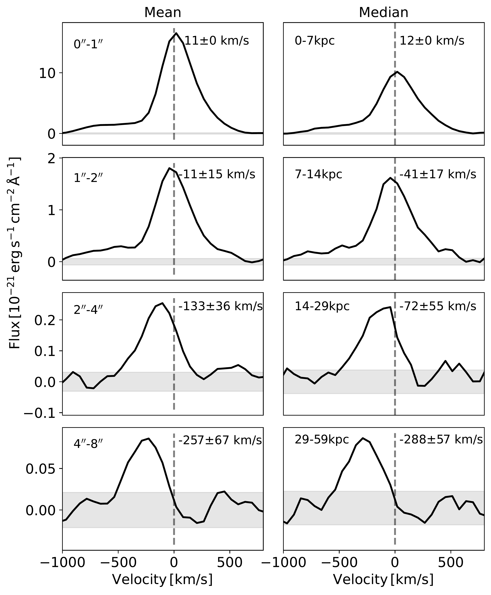
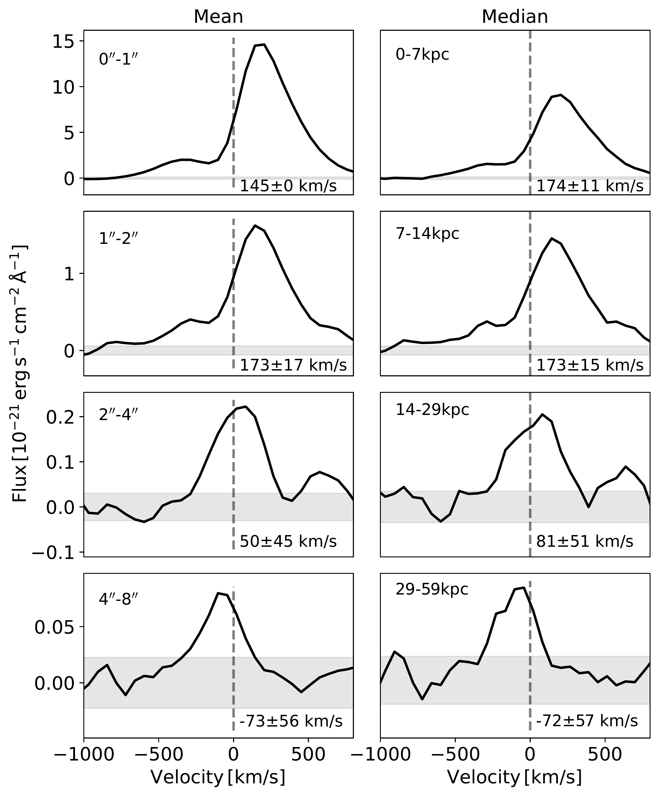
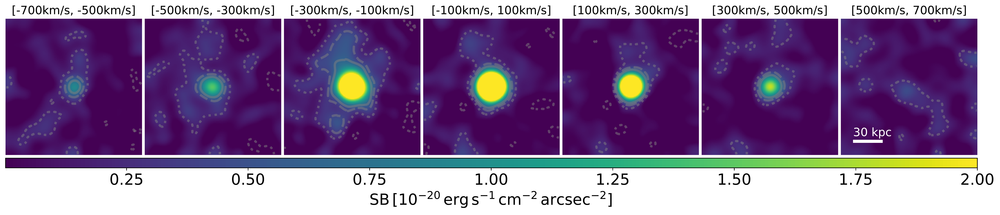

$\newcommand{\ensuremath}{}$
$\newcommand{\xspace}{}$
$\newcommand{\object}[1]{\texttt{#1}}$
$\newcommand{\farcs}{{.}''}$
$\newcommand{\farcm}{{.}'}$
$\newcommand{\arcsec}{''}$
$\newcommand{\arcmin}{'}$
$\newcommand{\ion}[2]{#1#2}$
$\newcommand{\textsc}[1]{\textrm{#1}}$
$\newcommand{\hl}[1]{\textrm{#1}}$
$\newcommand{\footnote}[1]{}$
$\newcommand{\lya}{Ly\alpha}$
$\newcommand{\hi}{H~{\small I}}$
$\newcommand{\mgi}{Mg~{\small I}}$
$\newcommand{\mgii}{Mg~{\small II}}$
$\newcommand{\mgiia}{\mgii~\lambda2796}$
$\newcommand{\mgiib}{\mgii~\lambda2803}$
$\newcommand{\mgiiab}{\mgii~\lambda\lambda2796,2803}$
$\newcommand{\civ}{C~{\small IV}}$
$\newcommand{\heii}{He~{\small II}}$
$\newcommand{\ciii}{C~{\small III}]}$
$\newcommand{\oii}{[O~{\small II}]}$

# Spatially-resolved Spectroscopic Analysis of $\lya$ Haloes

<mark>Appeared on: 2023-09-13</mark> -  _Submitted to A&A Letters_

Y. Guo, et al. -- incl., <mark>L. Boogaard</mark>

**Abstract:** Deep MUSE observations have unveiled pervasive $\lya$ haloes (LAHs) surrounding high-redshift star-forming galaxies. However, the origin of the extended $\lya$ emission is still a subject of debate.We analyse the average spatial extent and spectral variation of the circumgalactic LAHs by stacking a sample of 155 $\lya$ emitters (LAEs) at redshift $3<z<4$ in the MUSE Extremely Deep Field (MXDF).With respect to the $\lya$ red peak of the target LAE, the $\lya$ line peak becomes increasingly more blueshifted out to a projected distance of at least 60 kpc, where the velocity offset is $\approx$ 250 km/s.This signal is observed in both the mean and median stacks, and is thus a generic property of the LAE sample with typical $\lya$ luminosity $\mathrm{\approx 10^{41.1} erg s^{-1}}$ .We discuss multiple scenarios to explain the blueshift of the circumgalactic $\lya$ line.The most plausible one is a combination of outflows and inflows. In the inner region of the LAH, the $\lya$ photons are produced by the central star formation and then scattered within outflows. At larger radii, the infalling cool gas shapes the observed $\lya$ blueshift.

**Figure 1. -** $\lya$ line profiles at different distances from the central galaxy.
The spectra in the left and right columns are derived from the mean- and median-stacked datacubes.
Different rows show different radial bins ranging from 1" (7 kpc) to 8" (59 kpc).
The vertical dashed lines denote the peak of the central $\lya$ line. The horizontal grey shaded regions show the 1$\sigma$ error range.
 (*fig_Lya_profile*)

**Figure 2. -** 
As Figure \ref{fig_Lya_profile}, except that here all the mini-datacubes are re-aligned by the estimated $z_{sys}$ instead of $z_{Ly\alpha}$.
 (*fig_Lya_profile_zsys*)

**Figure 3. -** Surface brightness maps of the median-stacked $\lya$ emission.
Each panel shows the $\lya$ pseudo-NB in a velocity interval of 200 km/s. The zero point corresponds to the peak of the $\lya$ line.
The NBs have been smoothed using a Gaussian kernel of width of $2.3"$.
The grey contours correspond to $\lya$ significance levels of 2, 4 and 6 $\sigma$(dotted, dashed and solid, respectively).
 (*fig_Lya_NBs*)

