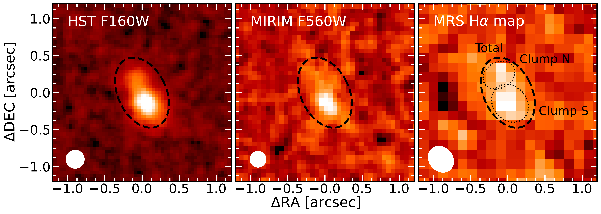
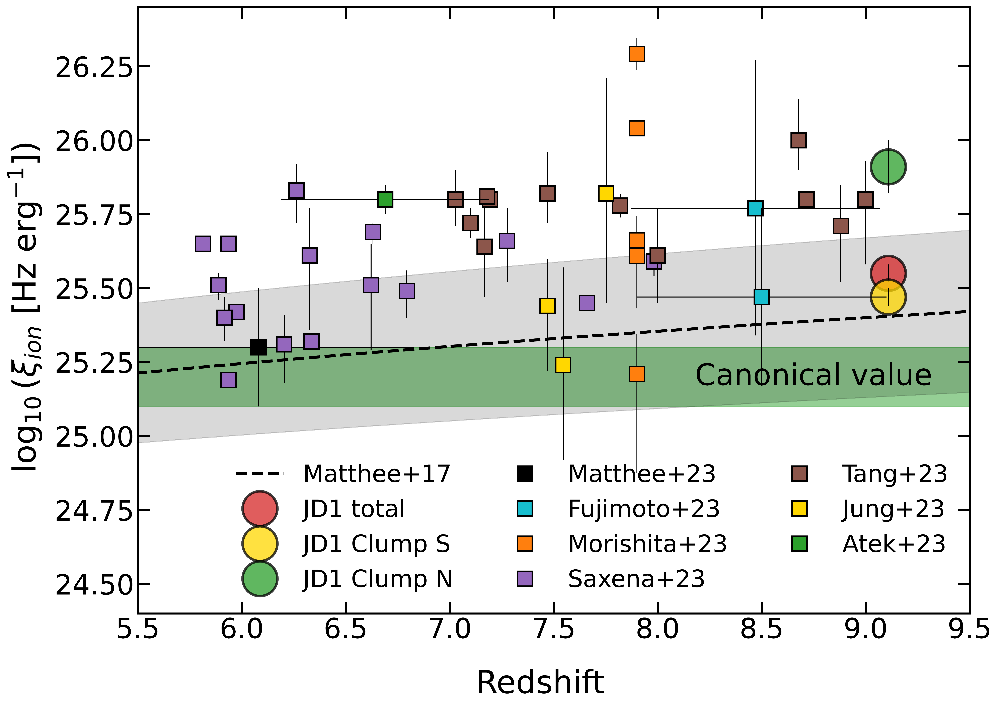
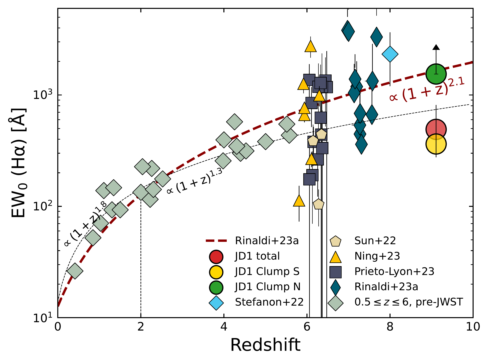

$\newcommand{\ensuremath}{}$
$\newcommand{\xspace}{}$
$\newcommand{\object}[1]{\texttt{#1}}$
$\newcommand{\farcs}{{.}''}$
$\newcommand{\farcm}{{.}'}$
$\newcommand{\arcsec}{''}$
$\newcommand{\arcmin}{'}$
$\newcommand{\ion}[2]{#1#2}$
$\newcommand{\textsc}[1]{\textrm{#1}}$
$\newcommand{\hl}[1]{\textrm{#1}}$
$\newcommand{\footnote}[1]{}$
$\newcommand{\arcs}{\arcsec\xspace}$
$\newcommand{\CII}{[\ion{C}{II}]158\mum}$
$\newcommand{\oddpm}[2]{\raisebox{0.5ex}{\tiny\substack{+#1 \-#2}}}$

# Spatially-resolved H$\alpha$ and ionizing photon production efficiency in the lensed galaxy MACS1149-JD1 at a redshift of 9.11

<mark>Appeared on: 2023-09-13</mark> -  _11 pages, 6 figures, submitted to A&A_

J. Álvarez-Márquez, et al. -- incl., <mark>S. Bosman</mark>, <mark>L. Boogaard</mark>, <mark>F. Walter</mark>

**Abstract:** We present MIRI/JWST medium resolution spectroscopy (MRS) and imaging (MIRIM) of the lensed galaxy MACS1149-JD1 at a redshift of $z$ = 9.1092 $\pm$ 0.0002, when the Universe was about 530 Myr old. We detect, for the first time, spatially-resolved H $\alpha$ emission in a galaxy at redshift above 9. The structure of the H $\alpha$ emitting gas consists of two clumps, S and N, carrying about $60\%$ and $40\%$ of the total flux, respectively. The total H $\alpha$ luminosity implies an instantaneous star formation rate in the range of 3.2 $\pm$ 0.3 and 5.3 $\pm$ 0.4 $M_{\odot}$ yr $^{-1}$ for sub-solar and solar metallicities. The ionizing photon production efficiency, $\log(\zeta_\mathrm{ion})$ , shows a spatially-resolved structure with values of 25.55 $\pm$ 0.03, 25.47 $\pm$ 0.03, and 25.91 $\pm$ 0.09 Hz erg $^{-1}$ for the integrated galaxy, and clumps S and N, respectively. The H $\alpha$ rest-frame equivalent width, EW $_{0}$ (H $\alpha$ ), is 491 $^{+334}_{-128}$ $Å$ for the integrated galaxy, but presents extreme values of 363 $^{+187}_{-87}Å$ and $\geq$ 1543 $Å$ for clumps S and N, respectively. The spatially-resolved ionizing photon production efficiency is within the range of values measured in galaxies at redshift above six, and well above the canonical value (25.2 $\pm$ 0.1 Hz erg $^{-1}$ ). The EW $_{0}$ (H $\alpha$ ) is a factor 3-4 lower than the predicted value at $z$ = 9.11 based on the extrapolation of the evolution of the EW $_{0}$ (H $\alpha$ ) with redshifts, $\propto$ (1+z) $^{2.1}$ , including galaxies detected with JWST. The extreme difference of EW $_{0}$ (H $\alpha$ ) for Clumps S and N indicates the presence of a recent (few Myr old) burst in clump N and a star formation over a larger period of time (e.g. 100 $-$ 200 Myr) in clump S, placing the initial formation of MACS1149-JD1 at a $z$ $\sim$ 11-12. The different ages of the stellar population place MACS1149-JD1 and clumps N and S at different locations in the log( $\zeta_\mathrm{ion}$ ) to EW $_{0}$ (H $\alpha$ ) plane and above the main relation defined from intermediate and high redshift (z=3-7) galaxies detected with JWST. Finally, clump S and N show very different H $\alpha$ kinematics with velocity dispersions of 56 $\pm$ 4 km s $^{-1}$ and 113 $\pm$ 33 km s $^{-1}$ , likely indicating the presence of outflows or increased turbulence in the clump N. The dynamical mass $M_\mathrm{dyn}$ = (2.4 $\pm$ 0.5) $\times$ 10 $^{9}$ $M_{\odot}$ , obtained from the size of the integrated H $\alpha$ ionized nebulae and its velocity dispersion, is within the range previously measured with the spatially-resolved [ OIII ] 88 $\mu$ m line.

**Figure 5. -** Images of MACS1149-JD1 presenting the observed stellar and ionized gas structure. From left to right: archival HST WFPC3/F160W from Hubble Advanced Product Multi-Visit Mosaic (HAP-MVM) program, MIRIM F560W image and MRS H$\alpha$ line map. The H$\alpha$ line map is generated by integrating H$\alpha$ line emission in the velocity range, -150 < $v$[km s$^{-1}$] < 150. The origin of the image corresponds to (RA [deg], DEC [deg]) of (177.389945, +22.412722). The black dashed ellipse indicates the aperture used to perform the MIRIM F560W photometry and the MRS 1D spectral extraction. Dotted black ellipses identify the H$\alpha$ emitting regions named as clump N and S, and spatially coincident with the two emitting regions in the HST F160W image. White area represents the spatial resolution (PSF FWHM) of each observation. MACS1149-JD1 shows an elongated structure due to the lens magnification of cluster MACS J11491+2223 \citep{Zheng+12}.  (*fig:HaLineMap*)

**Figure 1. -** Ionizing photon production efficiency as a function of redshift. MACS1149-JD1 is represented by circles, where we distinguish between the values of the integrated galaxy (red), and the spatially-resolved clumps N (green) and S (yellow). Squares: galaxies spectroscopically identified at $z$$\gtrsim$ 6 with JWST \citep{Fujimoto+23,Jung+23,Morishita+23,Saxena+23,Matthee+23,Tang+23,Atek+23}. Green area: canonical value for the ionizing photon efficiency \citep{Robertson+13}. Black line and gray area: variation of the photon efficiency with redshift and its uncertainty \citep{Matthee+17}. (*fig:photon-z*)

**Figure 2. -** Evolution of the rest-frame equivalent width of H$\alpha$ as a function of redshift. MACS1149-JD1 is represented by circles, where we distinguish between the values of the integrated galaxy (red), and the spatially-resolved clumps N (green) and S (yellow). Additional data includes samples detected with JWST at redshifts of around 6 \citep{Sun+22,Ning+23,Prieto-Lyon+23} and 7$-$8 \citep{Rinaldi+23}, as well as pre-JWST galaxies at redshifts 0.5 to 8. The pre-JWST value at redshift 8 corresponds to the median stacking of a sample of 102 Lyman-break galaxies \citep{Stefanon+22}. The dashed, dark red line represents the best fit to all data points, including the MIDIS sources, and described by a single law EW$_{0}$(H$\alpha$) $\propto$(1+$z$)$^{2.1}$ by \cite{Rinaldi+23}. The dotted broken line represents previous fits with pre-JWST data up to a redshift of six \citep{Faisst+16}.
       (*fig:EW*)

