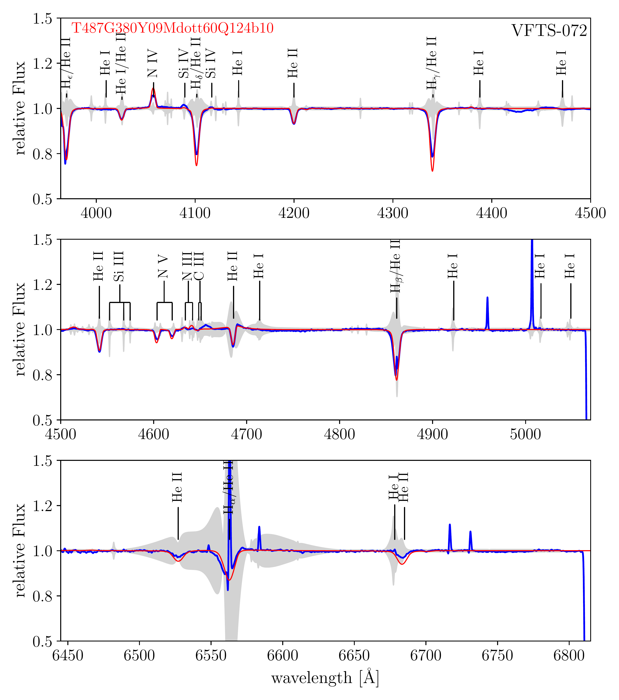
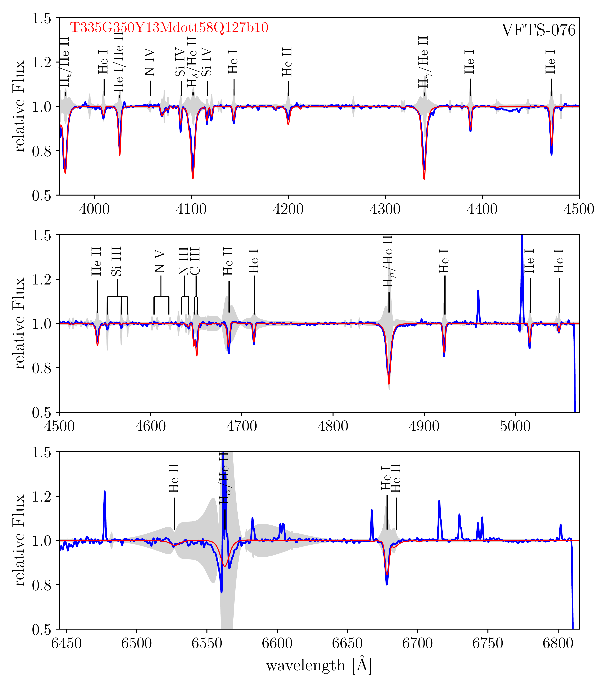
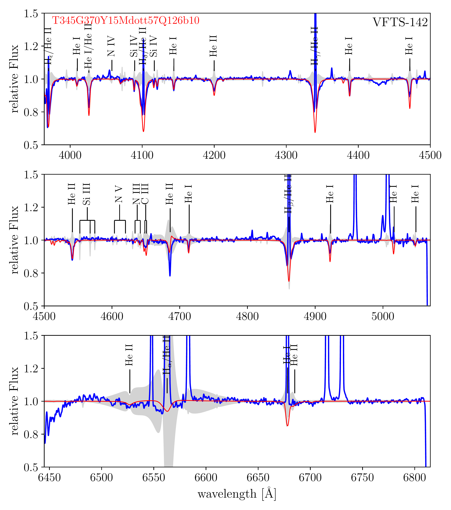
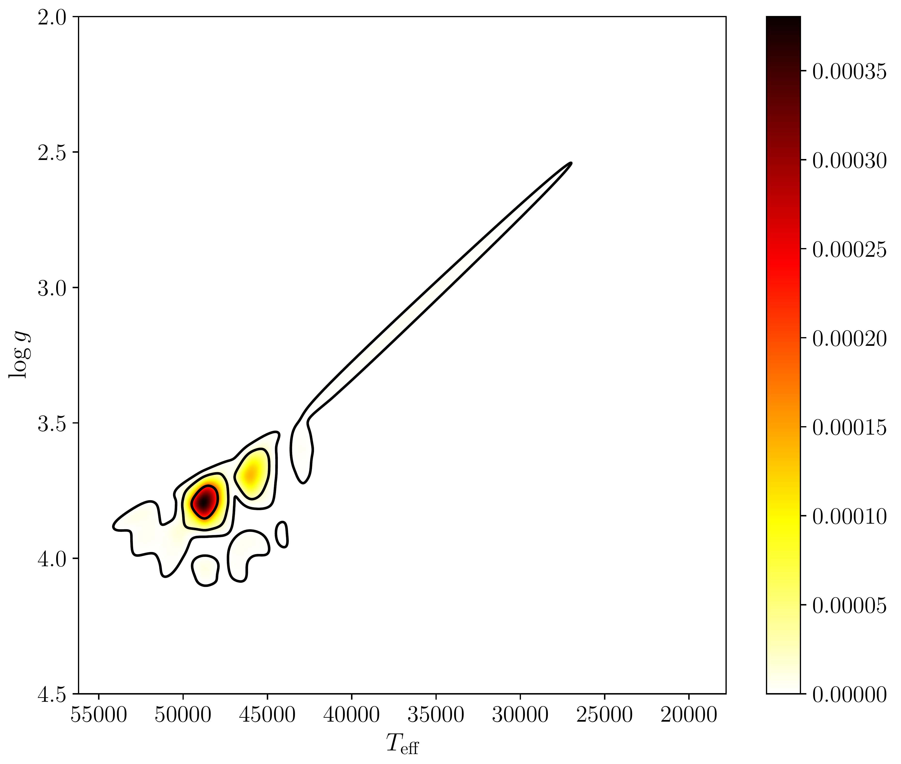
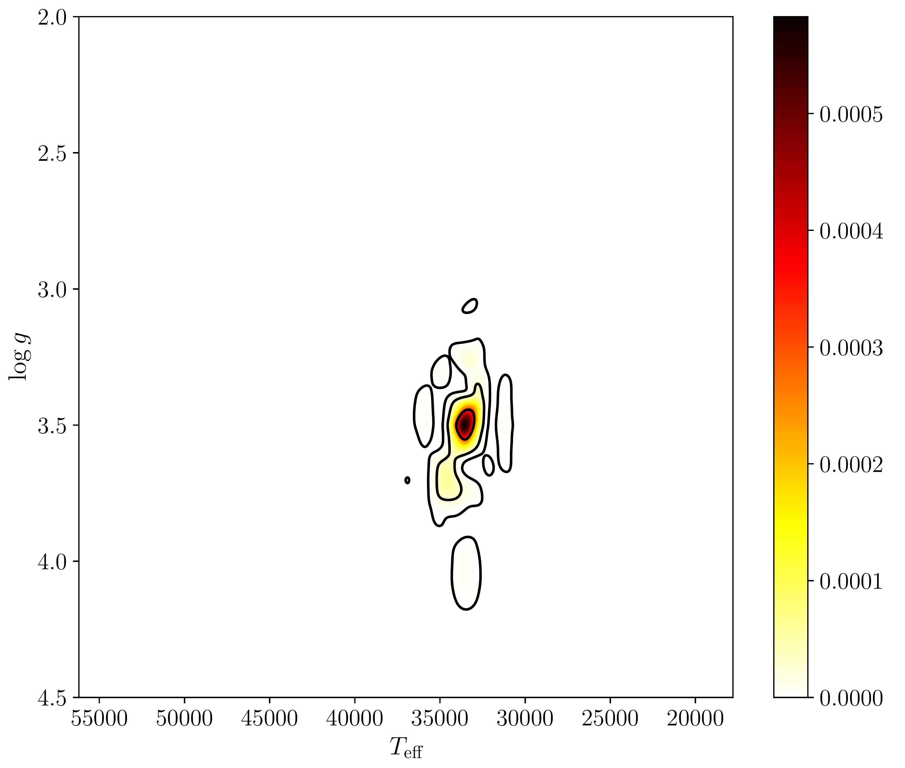

$\newcommand{\ensuremath}{}$
$\newcommand{\xspace}{}$
$\newcommand{\object}[1]{\texttt{#1}}$
$\newcommand{\farcs}{{.}''}$
$\newcommand{\farcm}{{.}'}$
$\newcommand{\arcsec}{''}$
$\newcommand{\arcmin}{'}$
$\newcommand{\ion}[2]{#1#2}$
$\newcommand{\textsc}[1]{\textrm{#1}}$
$\newcommand{\hl}[1]{\textrm{#1}}$
$\newcommand{\footnote}[1]{}$
$\newcommand{\thebibliography}{\DeclareRobustCommand{\VAN}[3]{##3}\VANthebibliography}$

# Spectroscopic analysis of hot, massive stars in large spectroscopic surveys with de-idealised models

<mark>Appeared on: 2023-09-14</mark> -  _Submitted to MNRAS, 21 pages, 9 figures_

J. M. Bestenlehner, et al. -- incl., <mark>M. Bergemann</mark>

**Abstract:** Upcoming large-scale spectroscopic surveys with e.g. WEAVE and 4MOST will provide thousands of spectra of massive stars, which need to be analysed in an efficient and homogeneous way. Usually, studies of massive stars are limited to samples of a few hundred objects which pushes current spectroscopic analysis tools to their limits because visual inspection is necessary to verify the spectroscopic fit. Often uncertainties are only estimated rather than derived and prior information cannot be incorporated without a Bayesian approach. In addition, uncertainties of stellar atmospheres and radiative transfer codes are not considered as a result of simplified, inaccurate or incomplete/missing physics or, in short, idealised physical models.Here, we address the question of "How to compare an idealised model of complex objects to real data?" with an empirical Bayesian approach and maximum a $_ posterior_$ approximations. We focus on application to large scale optical spectroscopic studies of complex astrophysical objects like stars. More specifically, we test and verify our methodology on samples of OB stars in 30 Doradus region of the Large Magellanic Clouds using a grid of FASTWIND model atmospheres.Our spectroscopic model de-idealisation analysis pipeline takes advantage of the statistics that large samples provide by determining the model error to account for the idealised stellar atmosphere models, which are included into the error budget. The pipeline performs well over a wide parameter space and derives robust stellar parameters with representative uncertainties.

**Figure 9. -** Left, spectroscopic fit of an fast rotating early O2 V-III(n)((f*)) star VFTS-072 and, right, a late O9.2 III star VFTS-076 (right). Blue solid line is the observation, red solid line the synthetic spectrum and the grey shaded area is the square-root of the diagonal elements of the model-error uncertainty-matrix calculated by the pipeline. (*f:vfts_ex*)

**Figure 5. -** VFTS 142: moderate nebular contamination. Blue solid line is the observation, red solid line the synthetic spectrum
and the grey shaded area is the square-root of the diagonal elements of the covariant-matrix calculated by the pipeline. Effective temperature is well reproduce while the surface gravity is 0.2 to 0.3 dex too low. (*af:142*)

**Figure 8. -** Probability heat map of surface gravity vs. effective temperature for VFTS-072 (left) and VFTS-076 (right). Contours indicate 2D standard-deviational ellipse confidence-intervals of 39.4\%, 86.5\% and 98.9\%\citep[e.g.][]{2015PLoSO..1018537W}. Spectroscopic fits of those stars are shown in Fig. \ref{f:vfts_ex}. (*f:conf*)

