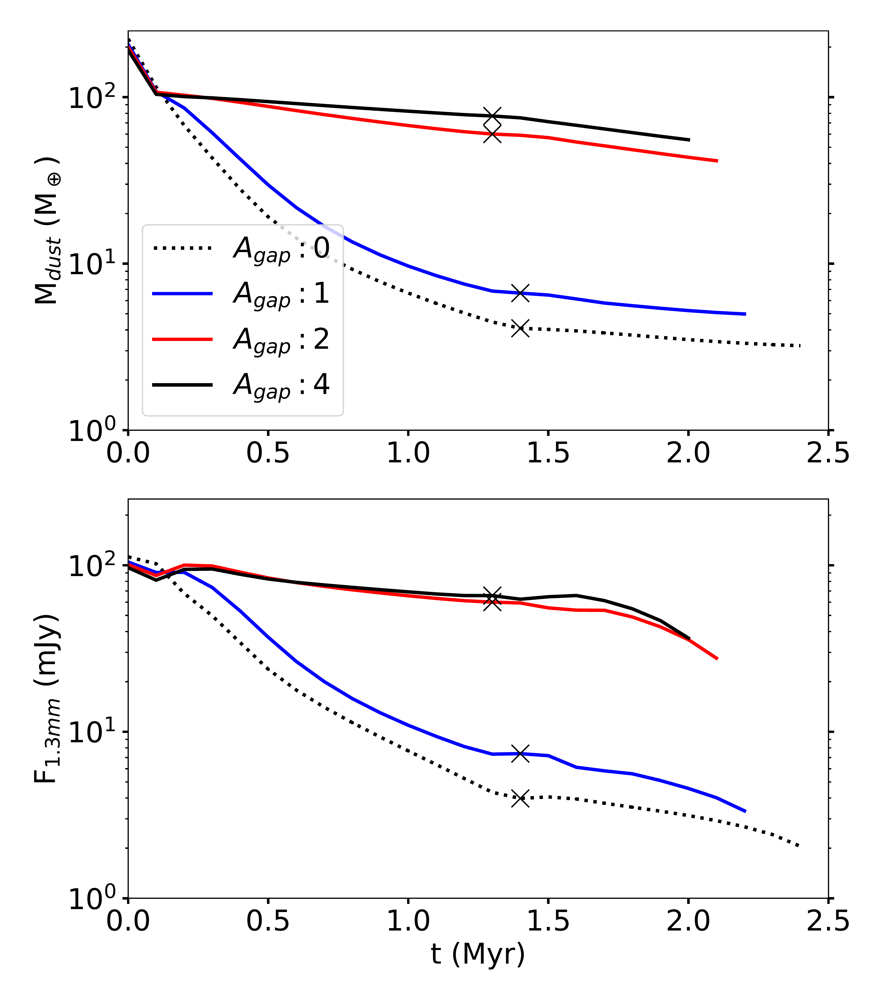
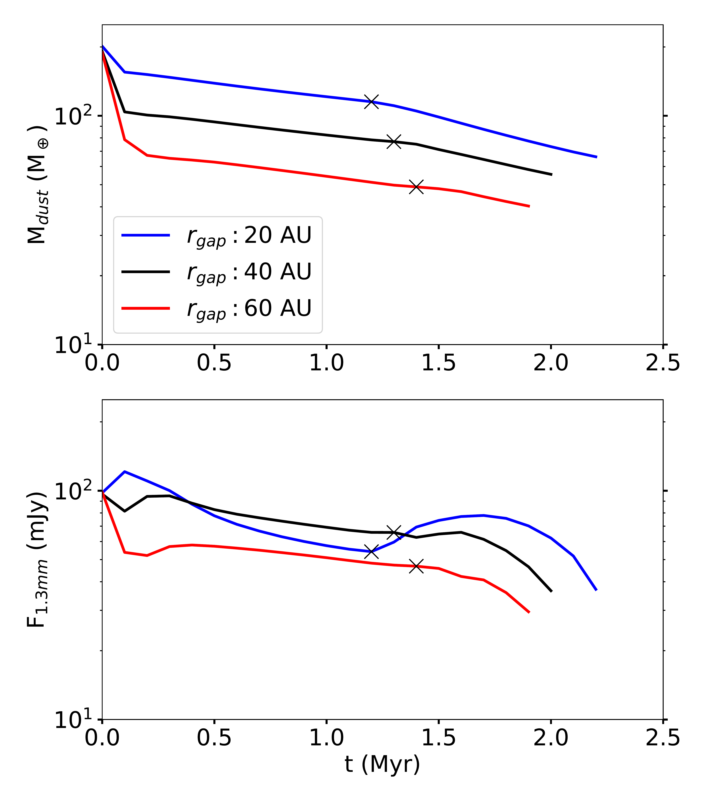
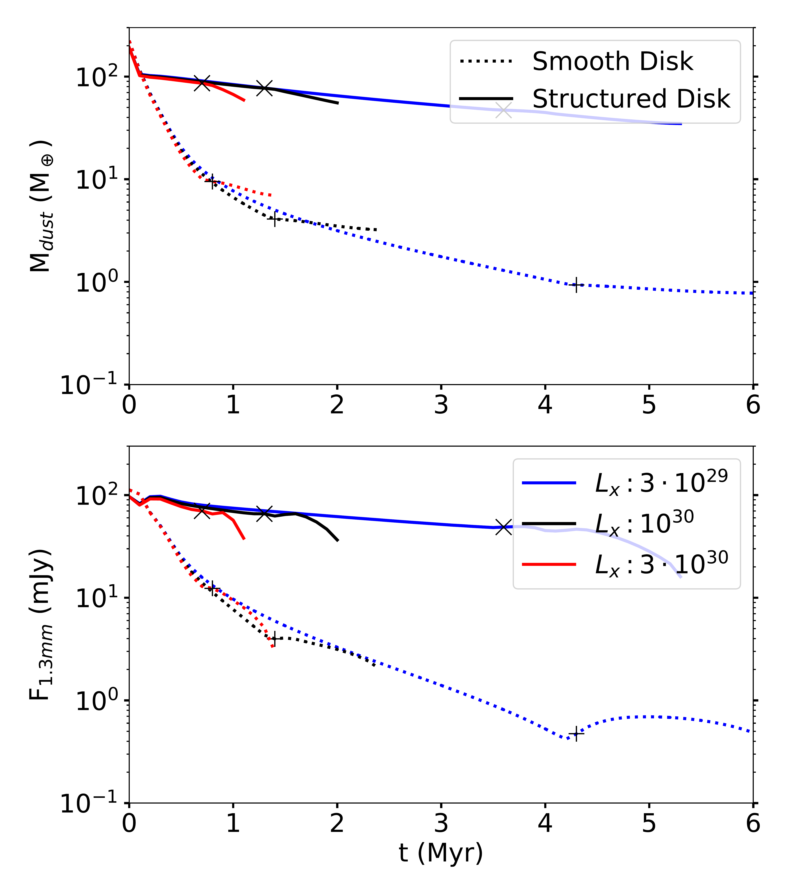

$\newcommand{\ensuremath}{}$
$\newcommand{\xspace}{}$
$\newcommand{\object}[1]{\texttt{#1}}$
$\newcommand{\farcs}{{.}''}$
$\newcommand{\farcm}{{.}'}$
$\newcommand{\arcsec}{''}$
$\newcommand{\arcmin}{'}$
$\newcommand{\ion}[2]{#1#2}$
$\newcommand{\textsc}[1]{\textrm{#1}}$
$\newcommand{\hl}[1]{\textrm{#1}}$
$\newcommand{\footnote}[1]{}$
$\newcommand{\revision}[1]{#1}$
$\newcommand{\revisionStrike}[1]{\sout{\textcolor{red}{#1}}}$
$\newcommand{\vdag}{(v)^\dagger}$
$\newcommand$
$\newcommand{\St}{\ensuremath{\mathrm{St}}\xspace}$
$\newcommand$
$\newcommand$
$\newcommand$
$\newcommand$
$\newcommand$
$\newcommand$
$\newcommand$
$\newcommand{\matias}[1]{\textcolor{blue}{\textbf{Matias:} #1}}$
$\newcommand{\paola}[1]{\textcolor{pink}{\textbf{Paola:} #1}}$
$\newcommand{\til}[1]{\textcolor{red}{\textbf{Til:} #1}}$
$\newcommand{\barbara}[1]{\textcolor{red}{\textbf{Barbara:} #1}}$
$\newcommand{\sean}[1]{\textcolor{teal}{\textbf{Sean:} #1}}$
$\newcommand{\ana}[1]{\textcolor{teal}{\textbf{Ana:} #1}}$
$\newcommand{\sebastian}[1]{\textcolor{purple}{\textbf{Sebastian:} #1}}$
$\newcommand{\raphael}[1]{\textcolor{purple}{\textbf{Raphael:} #1}}$
$\newcommand{\giovanni}[1]{\textcolor{purple}{\textbf{Giovanni:} #1}}$
$\newcommand{\chapterautorefname}{Chapter}$
$\newcommand{\sectionautorefname}{Section}$
$\newcommand{\subsectionautorefname}{Section}$
$\newcommand{\subsubsectionautorefname}{Section}$
$\newcommand{\figureautorefname}{Figure}$

# Millimeter emission in photoevaporating disks is determined by early substructures

<mark>Appeared on: 2023-09-19</mark> -  _Accepted for publication in A&A_

<mark>M. Gárate</mark>, et al.

**Abstract:** Photoevaporation and dust-trapping are individually considered to be important mechanisms in the evolution and morphology of protoplanetary disks. However, it is not yet clear what kind of observational features are expected when both processes operate simultaneously. We studied how the presence (or absence) of early substructures, such as the gaps caused by planets, affects the evolution of the dust distribution and flux in the millimeter continuum of disks that are undergoing photoevaporative dispersal. We also tested if the predicted properties resemble those observed in the population of transition disks. We used the numerical code \texttt{Dustpy} to simulate disk evolution considering gas accretion, dust growth, dust-trapping at substructures, and mass loss due to X-ray and EUV (XEUV) photoevaporation and dust entrainment. Then, we compared how the dust mass and millimeter flux evolve for different disk models. We find that, during photoevaporative dispersal, disks with primordial substructures retain more dust and are brighter in the millimeter continuum than disks without early substructures, regardless of the photoevaporative cavity size.   Once the photoevaporative cavity opens, the estimated fluxes for the disk models that are initially structured are comparable to those found in the bright transition disk population ( $F_\textrm{mm} > 30  \textrm{mJy}$ ), while the disk models that are initially smooth have fluxes comparable to the transition disks from the faint population ( $F_\textrm{mm} < 30  \textrm{mJy}$ ), suggesting a link between each model and population. Our models indicate that the efficiency of the dust trapping determines the millimeter flux of the disk, while the gas loss due to photoevaporation controls the formation and expansion of a cavity, decoupling the mechanisms responsible for each feature.   In consequence, even a planet with a mass comparable to Saturn could trap enough dust to reproduce the millimeter emission of a bright transition disk, while its cavity size is independently driven by photoevaporative dispersal.

**Figure 9. -** Same as \autoref{Fig_LxParameter}, but for structured disks with different gap amplitudes, with a fixed location at $r_\textrm{gap}=\SI{40}{AU}$ and X-ray luminosity of $L_x = \SI{e30}{erg  s^{-1}}$. Notice that the axis scales are different from \autoref{Fig_LxParameter}.
  (*Fig_AgapParameter*)

**Figure 10. -** Same as \autoref{Fig_LxParameter}, but for structured disks with different gap locations, with a fixed amplitude of $A_\textrm{gap}=4$ and X-ray luminosity of $L_x = \SI{e30}{erg  s^{-1}}$.
 Notice that the y-axis scale is different from \autoref{Fig_AgapParameter}.
  (*Fig_RgapParameter*)

**Figure 8. -** Evolution of the dust mass (_top_) and disk flux at $\lambda = \SI{1.3}{mm}$(_bottom_, assuming a distance of \SI{140}{pc}), for different X-ray luminosities $L_x$, with the black line corresponding to the fiducial value.
 The markers indicate the moment when photoevaporation opens a cavity in the inner disk (\sgquote{+} for the smooth disk, \sgquote{x} for the structured disk).
  (*Fig_LxParameter*)

