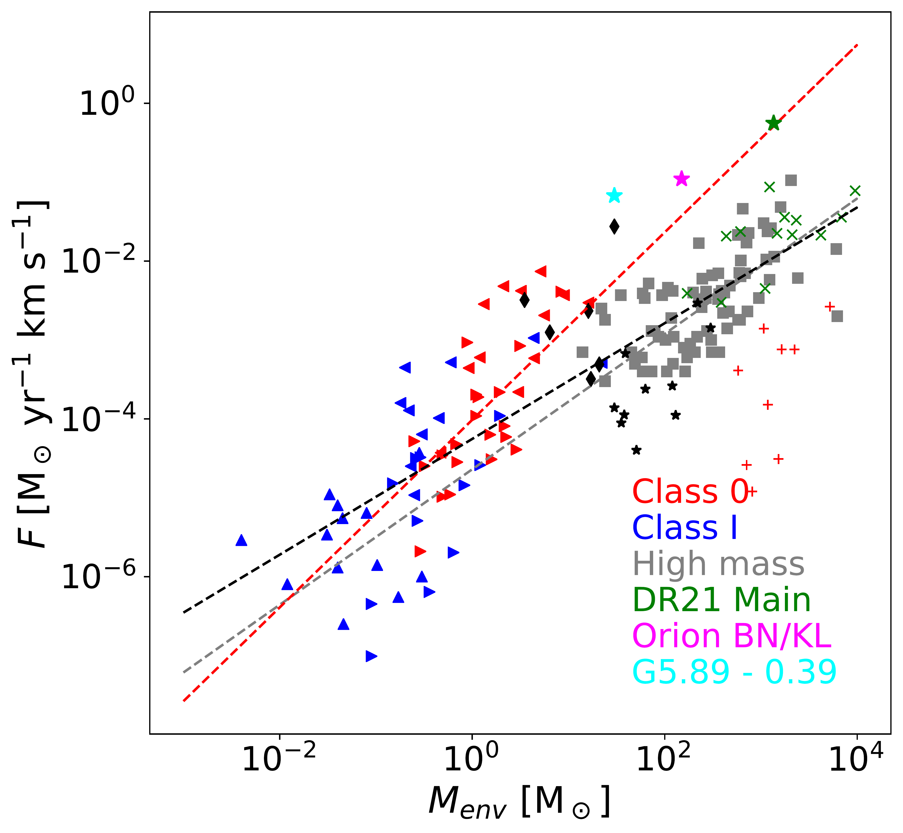
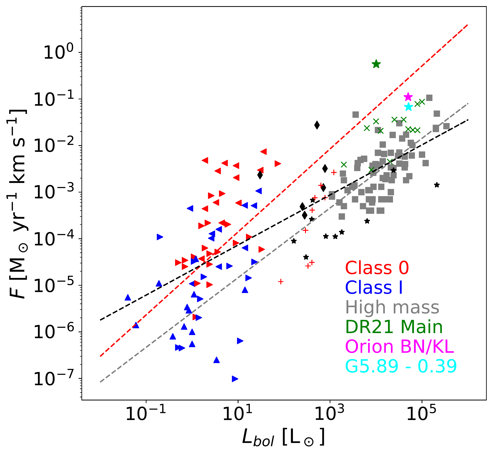
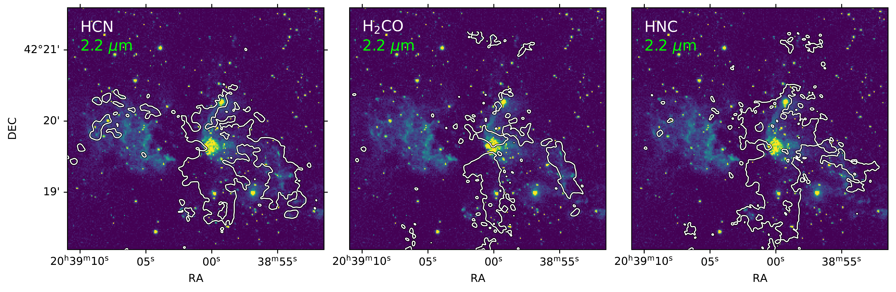
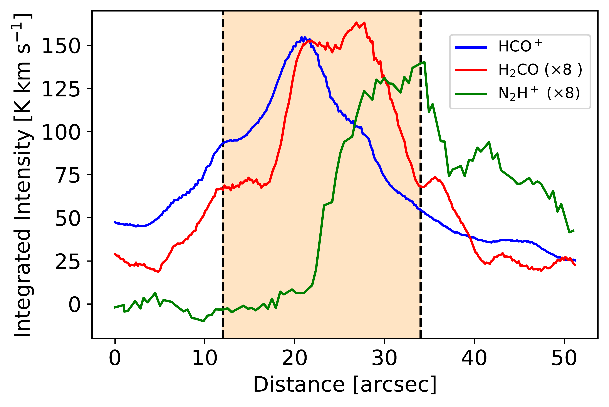

$\newcommand{\ensuremath}{}$
$\newcommand{\xspace}{}$
$\newcommand{\object}[1]{\texttt{#1}}$
$\newcommand{\farcs}{{.}''}$
$\newcommand{\farcm}{{.}'}$
$\newcommand{\arcsec}{''}$
$\newcommand{\arcmin}{'}$
$\newcommand{\ion}[2]{#1#2}$
$\newcommand{\textsc}[1]{\textrm{#1}}$
$\newcommand{\hl}[1]{\textrm{#1}}$
$\newcommand{\footnote}[1]{}$
$\newcommand{\arraystretch}{1.5}$

# The Cygnus Allscale Survey of Chemistry and Dynamical Environments: CASCADE. II. A detailed kinematic analysis of the DR21 Main outflow

<mark>Appeared on: 2023-09-19</mark> -  _26 pages, 37 figures. Accepted for publication in A&A_

I. M. Skretas, et al. -- incl., <mark>H. Beuther</mark>, <mark>S. Li</mark>

**Abstract:** Molecular outflows are believed to be a key ingredient in the process of star formation. The molecular outflow associated with DR21 Main in Cygnus-X is one of the most extreme, in mass and size, molecular outflows in the Milky Way. The outflow is suggested to belong to a rare class of explosive outflows which are formed by the disintegration of protostellar systems. We aim to explore the morphology, kinematics,and energetics of the DR21 Main outflow, and compare thoseproperties to confirmed explosive outflows to unravel theunderlying driving mechanism behind DR21. Line and continuum emission are studied at a wavelength of 3.6 mm with IRAM 30 m and NOEMA telescopes as part of the Cygnus Allscale Survey of Chemistry and Dynamical Environments (CASCADE) program. The spectra include ( $J= 1-0$ ) transitions of HCO $^+$ , HCN, HNC, $N_2$ H $^+$ , $H_2$ CO, CCH (among others) tracing different temperature and density regimes of the outflowing gas at high-velocity resolution ( $\sim$ 0.8 km s $^{-1}$ ). The map encompasses the entire DR21 Main outflow and covers all spatial scales down to a resolution of  3 $\arcsec$ ( $\sim$ 0.02 pc). Integrated intensity maps of the HCO $^+$ emission reveal a strongly collimated bipolar outflow with significant overlap of the blue- and red-shifted emission. The opening angles of both outflow lobes decrease with velocity, from $\sim80$ to 20 $^{\circ}$ for the velocity range from 5 to 45 km s $^{-1}$ relative to the source velocity. No evidence is found for the presence of elongated, $\lq\lq$ filament-like $"$ structures expected in explosive outflows.$N_2$ H $^+$ emission near the western outflow lobe reveals the presence of a dense molecular structure which appears to be interacting with the DR21 Main outflow. The overall morphology as well as the detailed kinematics of the DR21 Main outflow is more consistent with that of a typical bipolar outflow instead of an explosive counterpart.

**Figure 15. -**  Outflow force over the envelope mass of the driving source for various protostellar sources. Right facing triangles represent low-mass sources from \citet{Mottram2017}, left facing triangles mark sources taken from \citet{Yildiz2015} and upwards are from \citet{vdm2013} while in blue are the Class I sources and in red the Class 0. Black diamonds mark intermediate mass sources \citep{vankempen2009}, grey squares mark high mass sources from \citet{Maud2015}, green \lq\lq$\times$" mark high mass sources from \citet{Beuther2002} and black stars mark high mass sources in Cygnus \citep{Skretas2022}. The red crosses mark a sample of high-mass 70$\mu$m dark sources \citep{Shanghuo2020}. The Cyan star marks G5.89-0.39, the magenta one marks Orion KL and the green one represents the DR21 Main outflow. The dashed, black line shows the best fit to the outflow force - envelope mass correlation for all sources, while red and grey show the best fits for the low- and high-mass sources respectively. (*fig:forcemass*)

**Figure 16. -** _UKIRT_/WFCAM continuum image of the DR21 Main region at 2.2 $\mu$m and the line emission in key gas tracers observed as part of CASCADE. White contours mark the 5$\sigma$ HCN (left), $H_2$CO (middle) and HNC (right) emission. (*fig:appcontours1*)

**Figure 7. -** Average integrated intensities of HCO$^+$(in blue), $H_2$CO (in red), and $N_2$H$^+$(in green) across the interaction region in the western lobe of DR21. Intensities are integrated from $-$70 to 70, $-$20 to 20 and $-$20 to 10 km s$^{-1}$ for HCO$^+$, $H_2$CO and $N_2$H$^+$, respectively. The x-axis shows the distance in arcseconds, covering the extent of the relevant region where the outflow interacts with a dense structure (marked also in Fig. \ref{fig:interactioncontours}). The orange rectangle shows the area actively affected by the interaction. The intensities for $H_2$CO and $N_2$H$^+$ are scaled up by a factor of 8 in order for their distributions to be more easily comparable. (*fig:intens_across_line*)

