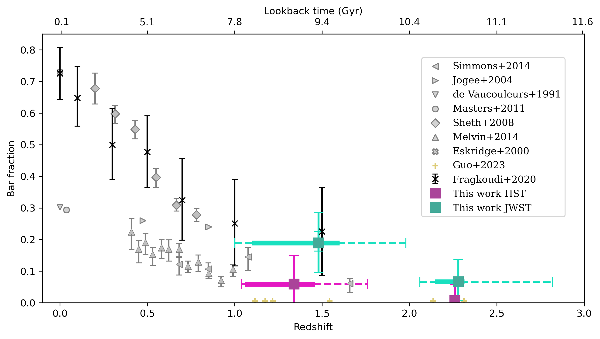
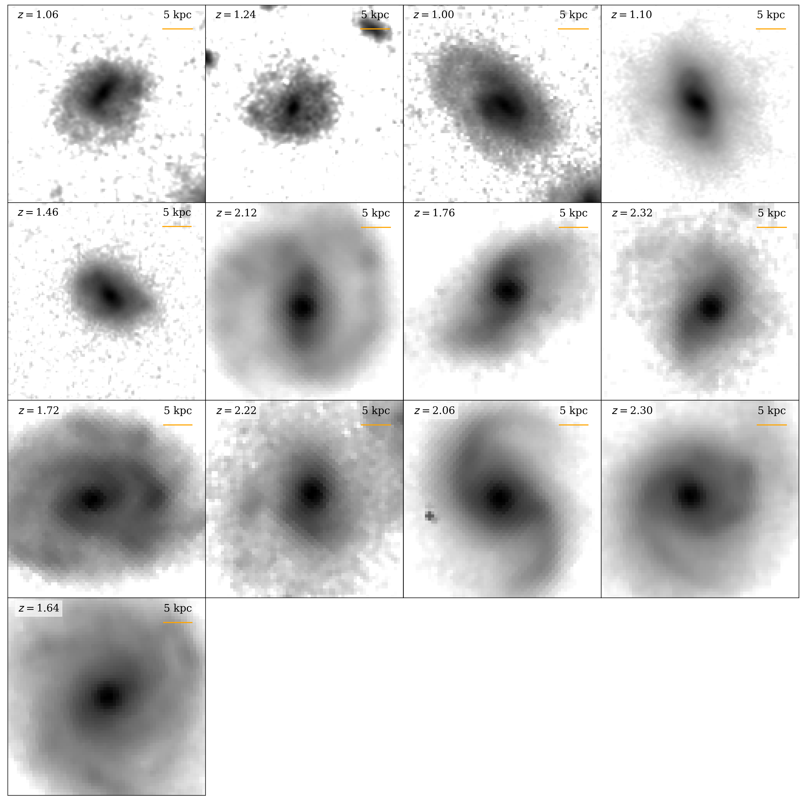
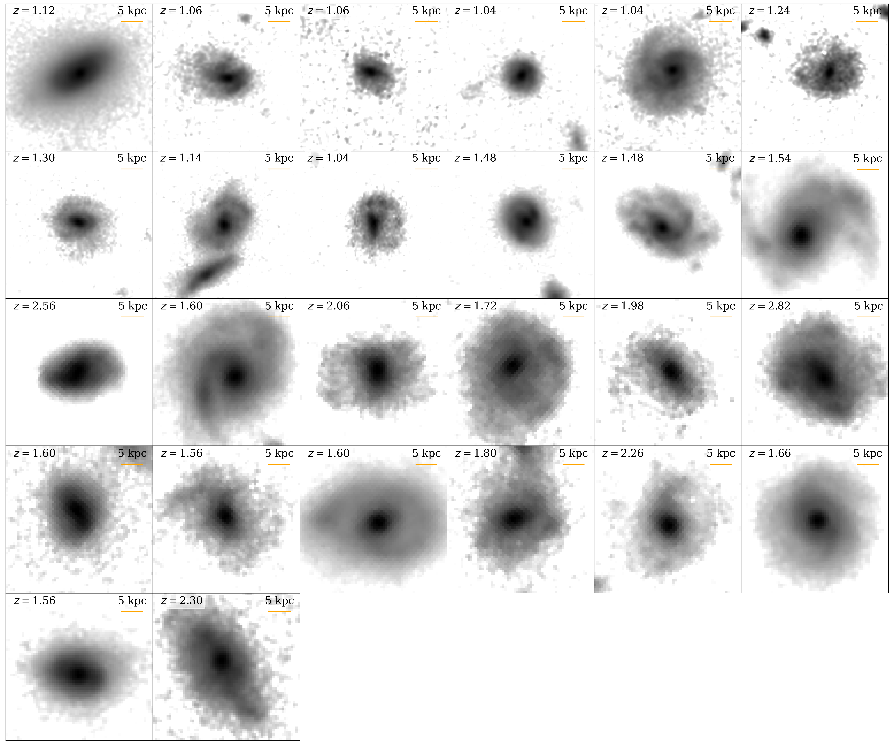

$\newcommand{\ensuremath}{}$
$\newcommand{\xspace}{}$
$\newcommand{\object}[1]{\texttt{#1}}$
$\newcommand{\farcs}{{.}''}$
$\newcommand{\farcm}{{.}'}$
$\newcommand{\arcsec}{''}$
$\newcommand{\arcmin}{'}$
$\newcommand{\ion}[2]{#1#2}$
$\newcommand{\textsc}[1]{\textrm{#1}}$
$\newcommand{\hl}[1]{\textrm{#1}}$
$\newcommand{\footnote}[1]{}$
$\newcommand{\thebibliography}{\DeclareRobustCommand{\VAN}[3]{##3}\VANthebibliography}$

# A JWST investigation into the bar fraction at redshifts $1 \leq z \leq 3$

<mark>Appeared on: 2023-09-20</mark> -  _Submitted to MNRAS. 15 pages, 10 figures. Figure 7 summarises the main results_

Z. A. L. Conte, et al. -- incl., <mark>J. Neumann</mark>

**Abstract:** The presence of a stellar bar in a disc galaxy indicates that the galaxy hosts a dynamically settled disc and that bar-driven processes are taking place in shaping the evolution of the galaxy. Studying the cosmic evolution of the bar fraction in disc galaxies is therefore essential to understand galaxy evolution in general. Previous studies have found, using the Hubble Space Telescope (HST), that the bar fraction significantly declines from the local Universe to redshifts near one. Using the first four pointings from the James Webb Space Telescope (JWST) Cosmic Evolution Early Release Science Survey (CEERS) and the initial public observations for the Public Release Imaging for Extragalactic Research (PRIMER), we extend the studies on the bar fraction in disc galaxies to redshifts $1 \leq z \leq 3$ , i.e., for the first time beyond redshift two. We only use galaxies that are also present in the Cosmic Assembly Near-IR Deep Extragalactic Legacy Survey (CANDELS) on the Extended Groth Strip (EGS) and Ultra Deep Survey (UDS) HST observations. An optimised sample of 768 close-to-face-on galaxies is visually classified to find the fraction of bars in disc galaxies in two redshift bins: $1 \leq z \leq 2$ and $2 < z \leq 3$ . The bar fraction decreases from $\sim 18.9^{+ 9.7}_{- 9.4}$ per cent to $\sim 6.6^{+ 7.1}_{- 5.9}$ per cent (from the lower to the higher redshift bin), but is $\sim 3 - 4$ times greater than the bar fraction found in previous studies using bluer HST filters. Our results show that bar-driven evolution commences at early cosmic times and that dynamically settled discs are already present at a lookback time of $\sim 11$ Gyrs.

**Figure 10. -** Evolution of the fraction of stellar bars in disc galaxies with redshift in the context of other bar assessment work using HST. The fractions of barred disc galaxies found in JWST NIRCam images are shown as green squares, and the fractions of barred disc galaxies found in this study in HST WFC3 images are shown as purple squares. The bar fraction was found for two redshift bins, $1 \leq z \leq 2$ and $2 < z \leq 3$, where the marker indicates the median redshift of the barred galaxies. All bar fraction errors indicate the sum in quadrature of the systematic and 1$\sigma$ Bayesian binomial confidence interval \citep[][statistical error only in dark colours]{Cameron_2011}  . A dashed line indicates the redshift range of barred galaxies. A thick solid line indicates the redshift range of the quartiles 25\%-75\% of the distribution of barred galaxies. At low redshifts, \citet[][down-pointing triangle]{Vaucouleurs_1991}   and \citet[][circle]{Masters_2011}   found strong bars in a third of disc galaxies, while \citet[][cross]{Eskridge_2000}   found strong and weak bars in over two-thirds of disc galaxies. \citet[][left-pointing triangles]{Simmons_2014}  , \citet[][diamonds]{Sheth_2008}   and \citet[][up-pointing triangles]{Melvin_2014}   found a decreasing trend of the bar fraction for higher redshifts. \citet[][right-pointing triangles]{Jogee_2004}   found a minimal decline in the bar fraction at higher redshifts. The six barred galaxies found in \citet[][pluses]{Guo_2023}   are shown in yellow at the bottom of the plot. Finally, the bar fractions, as found in the Auriga cosmological simulations in \citet[][exes]{Fragkoudi_2020}   are shown in black. (*Fig: bar_frac*)

**Figure 2. -** Rest-frame NIR logarithmic images of strongly barred galaxies using the JWST NIRCam F444W filter between the redshifts $1 \leq z \leq 3$. The redshift of the galaxy is noted in the upper left corner of each image. A 5 kpc scale is given in the upper right corner of each image \citep[calculated using][]{Wright_2006}  . (*Fig: strong*)

**Figure 3. -** Rest-frame NIR logarithmic images of weakly barred galaxies using the JWST NIRCam F444W filter between the redshifts $1 \leq z \leq 3$. The redshift of the galaxy is noted in the upper left corner of each image. A 5 kpc scale is given in the upper right corner of each image \citep[calculated using][]{Wright_2006}  . (*Fig: weak*)

