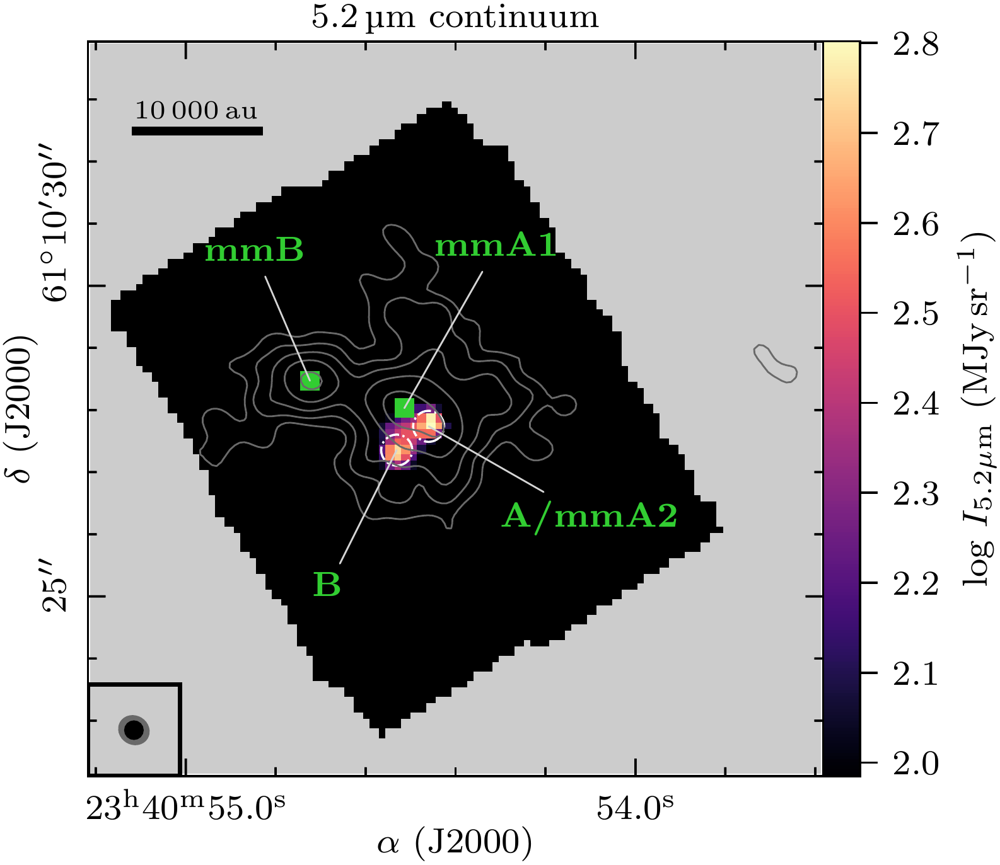
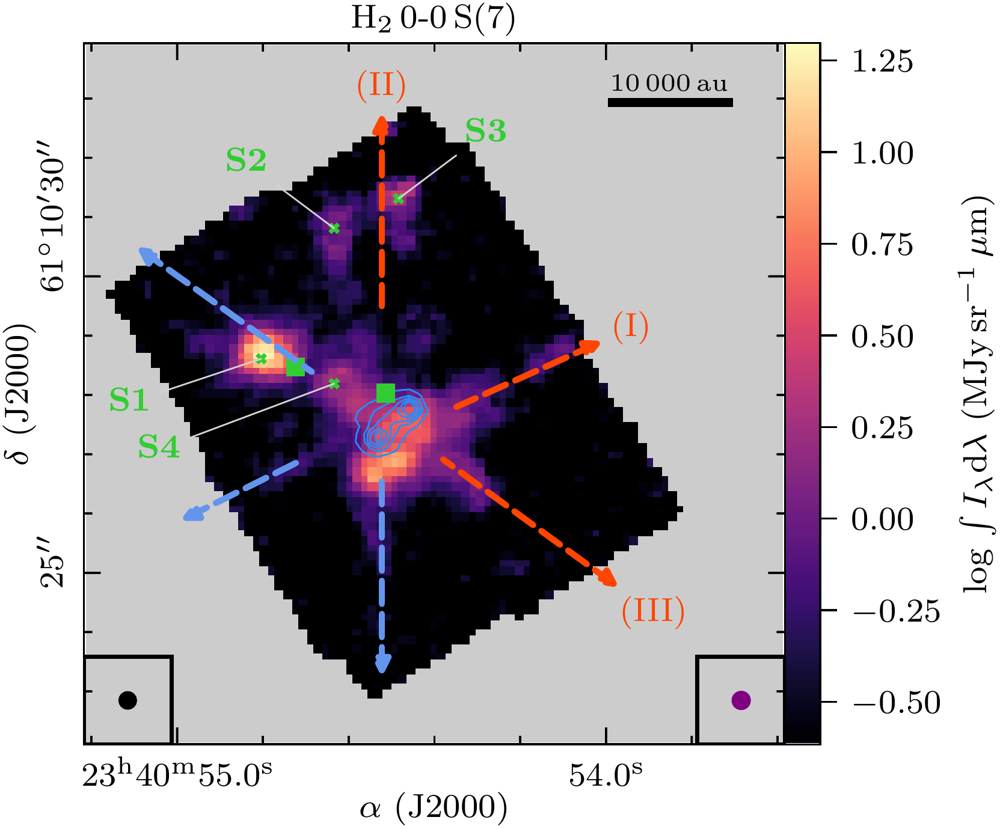
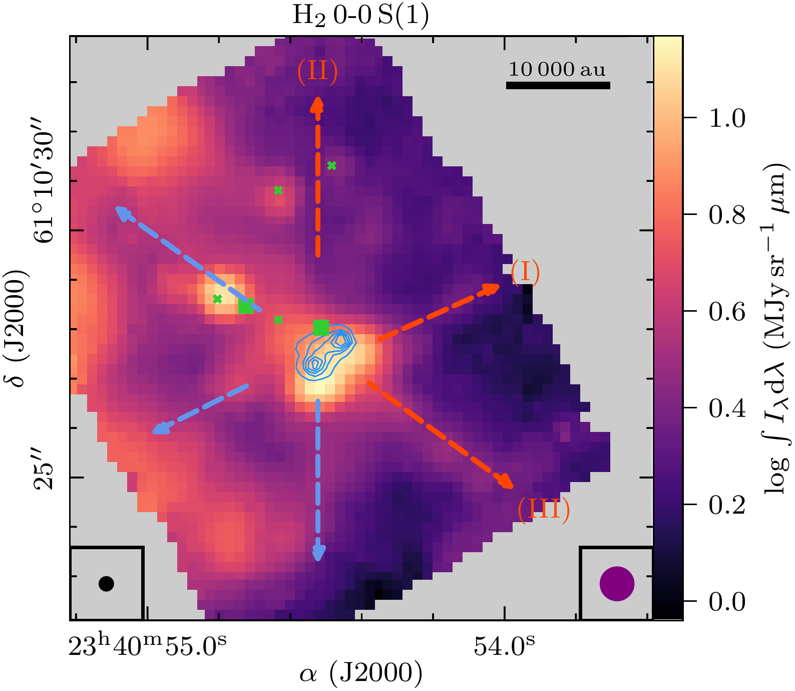
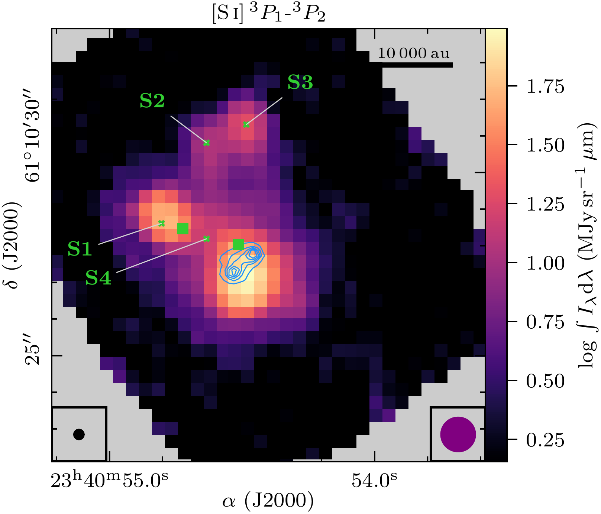
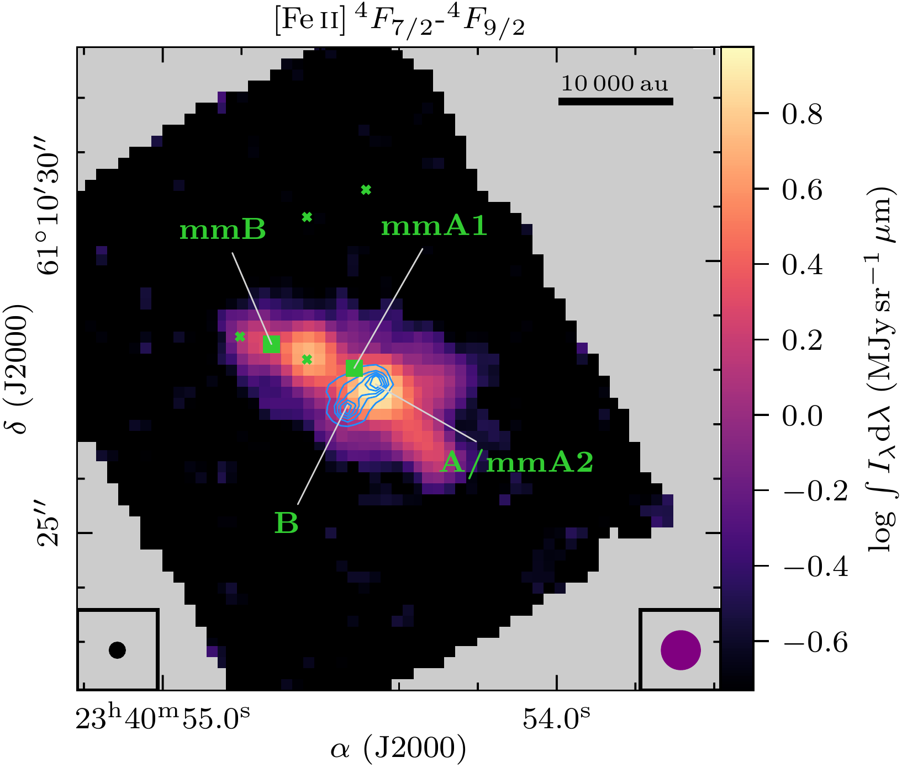
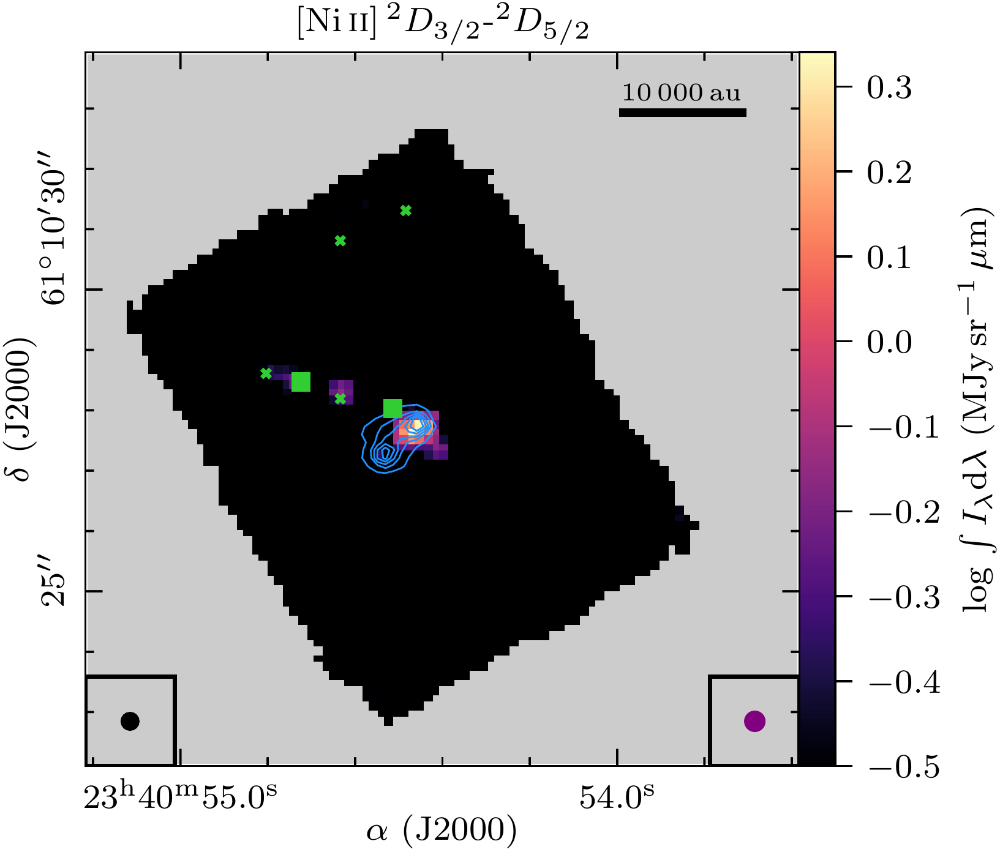
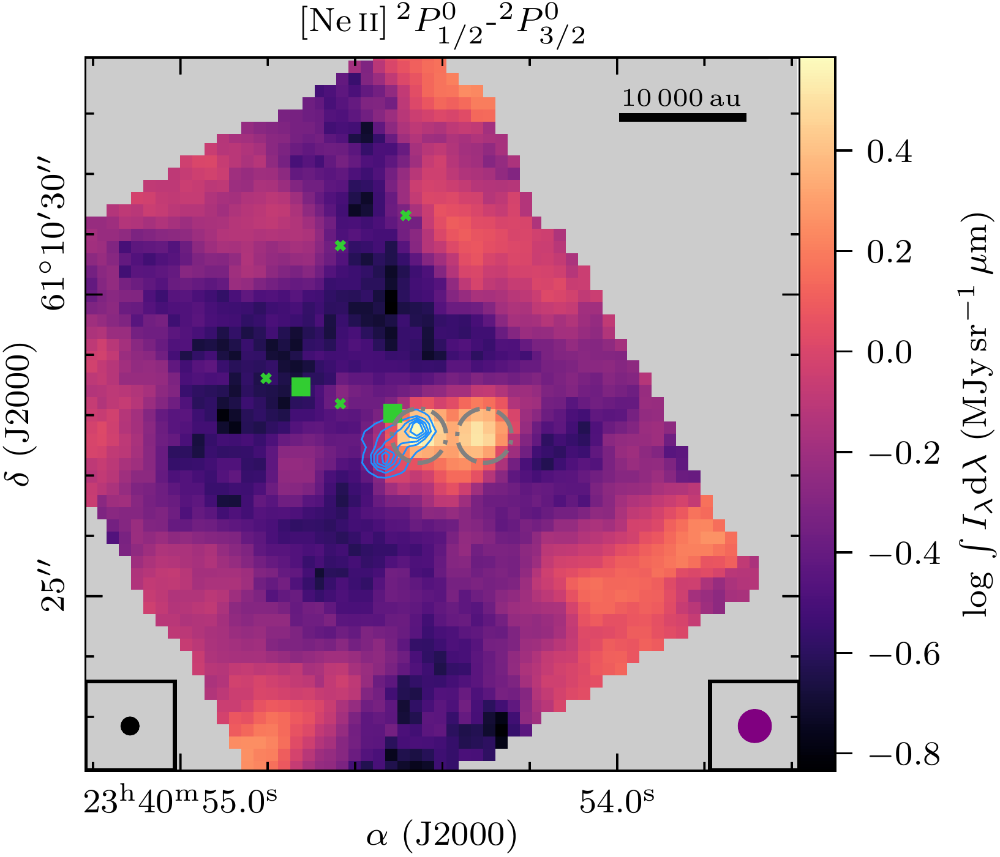
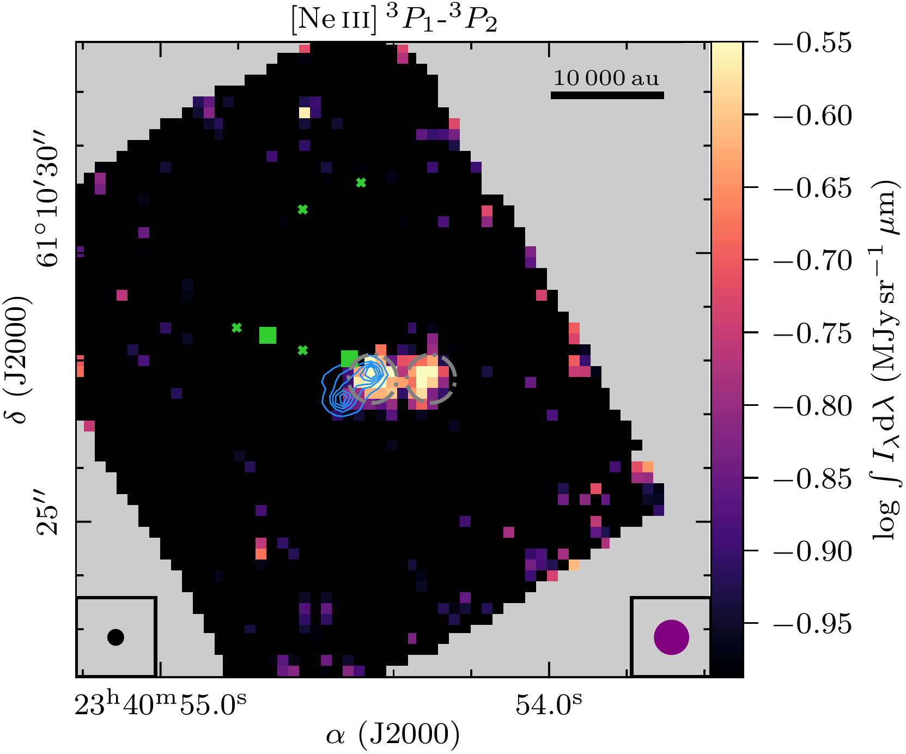
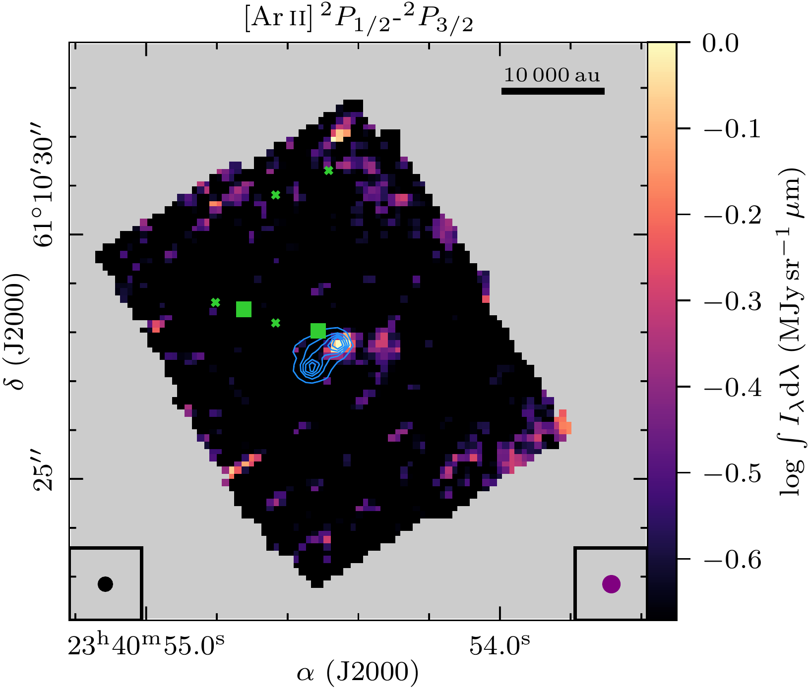
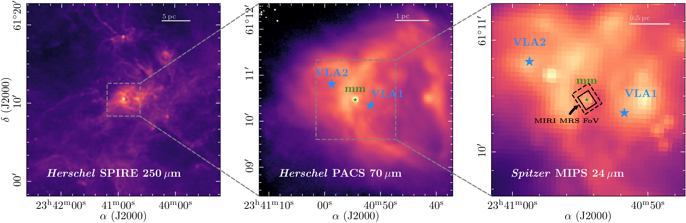

$\newcommand{\ensuremath}{}$
$\newcommand{\xspace}{}$
$\newcommand{\object}[1]{\texttt{#1}}$
$\newcommand{\farcs}{{.}''}$
$\newcommand{\farcm}{{.}'}$
$\newcommand{\arcsec}{''}$
$\newcommand{\arcmin}{'}$
$\newcommand{\ion}[2]{#1#2}$
$\newcommand{\textsc}[1]{\textrm{#1}}$
$\newcommand{\hl}[1]{\textrm{#1}}$
$\newcommand{\footnote}[1]{}$
$\newcommand{\arraystretch}{1.2}$

# JOYS: Disentangling the warm and cold material in the high-mass IRAS 23385+6053 cluster

<mark>Appeared on: 2023-09-20</mark> -  _15 pages, 7 figures, accepted for publication in A&A_

C. Gieser, et al. -- incl., <mark>H. Beuther</mark>, <mark>G. Perotti</mark>

**Abstract:** High-mass star formation occurs in a clustered mode where fragmentation is observed from an early stage onward. Young protostars can now be studied in great detail with the recently launched _James Webb Space Telescope_ (JWST). We study and compare the warm ( $>$ 100 K) and cold ( $<$ 100 K) material toward the high-mass star-forming region IRAS 23385+6053 (IRAS 23385 hereafter) combining high angular resolution observations in the mid-infrared (MIR) with the JWST Observations of Young protoStars (JOYS) project and with the NOrthern Extended Millimeter Array (NOEMA) at mm wavelengths at angular resolutions of $\approx$ 0 $\farcs$ 2-1 $\farcs$ 0. The spatial morphology of atomic and molecular species is investigated by line integrated intensity maps. The temperature and column density of different gas components is estimated using H $_{2}$ transitions (warm and hot component) and a series of CH $_{3}$ CN transitions as well as 3 mm continuum emission (cold component). Toward the central dense core in IRAS 23385 the material consists of relatively cold gas and dust ( $\approx$ 50 K), while multiple outflows create heated and/or shocked H $_{2}$ and show enhanced temperatures ( $\approx$ 400 K) along the outflow structures. An energetic outflow with enhanced emission knots of $[$ Fe ${\sc ii}$ $]$ and $[$ Ni ${\sc ii}$ $]$ hints at $J$ -type shocks, while two other outflows have enhanced emission of only H $_{2}$ and $[$ S ${\sc i}$ $]$ caused by $C$ -type shocks. The latter two outflows are also more prominent in molecular line emission at mm wavelengths (e.g., SiO, SO, H $_{2}$ CO, and CH $_{3}$ OH). Even higher angular resolution data are needed to unambiguously identify the outflow driving sources given the clustered nature of IRAS 23385. While most of the forbidden fine structure transitions are blueshifted, $[$ Ne ${\sc ii}$ $]$ and $[$ Ne ${\sc iii}$ $]$ peak at the source velocity toward the MIR source A/mmA2 suggesting that the emission is originating from closer to the protostar. The warm and cold gas traced by MIR and mm observations, respectively, are strongly linked in IRAS 23385. The outflows traced by MIR H $_{2}$ lines have molecular counterparts in the mm regime. Despite the presence of multiple powerful outflows that cause dense and hot shocks, a cold dense envelope still allows star formation to further proceed. To study and fully understand the spatially resolved MIR-properties, a representative sample of low- and high-mass protostars has to be probed by JWST.

**Figure 5. -** MIR Continuum (_left_) and H$_{2}$ 0-0 S(7) line emission (_right_) for IRAS 23385. In the left panel, the JWST/MIRI 5.2 $\upmu$m continuum with emission $> 5\sigma_{\mathrm{cont,5}\upmu\mathrm{m}}$ is presented in color. Grey contours show the NOEMA 1 mm continuum with contour levels at 5, 10, 20, 40, 80$\times \sigma_\mathrm{cont,1mm}$. The dash-dotted white circles show the aperture in which the 5.2 $\upmu$m flux density $F_{5.2\upmu\mathrm{m}}$ was derived (Table \ref{tab:sources}). In the bottom left corner, the JWST/MIRI 5.2 $\upmu$m and NOEMA 1 mm angular resolution is indicated in black and grey, respectively. The mm (mmA1 and mmB, marked by green squares) and MIR (A/mmA2 and B) continuum sources are labeled in green. In the right panel, the line integrated intensity of the H$_{2}$ 0-0 S(7) line with $S$/$N > 5$ is presented in color. The JWST/MIRI 5.2 $\upmu$m continuum as shown in the left panel is presented as blue contours with contour levels at 5, 10, 15, 20, 25$\times \sigma_{\mathrm{cont,5}\upmu\mathrm{m}}$. The angular resolution of the 5.2 $\upmu$m continuum and H$_{2}$ 0-0 S(7) line data is indicated in the bottom left and right, respectively. Several shock spots evident in the MIRI MRS line emission are marked by green crosses and labeled in green (Sect. \ref{sec:line}). The red and blue arrows indicate three bipolar outflows, labeled I, II, and III \citep[as presented in][]{Beuther2023}. In both panels, the black bar indicates a spatial scale of 10 000 au at the assumed source distance of 4.9 kpc. (*fig:continuum*)

**Figure 6. -** Integrated intensity maps of atomic and molecular lines detected with JWST/MIRI MRS. In color, the line integrated intensity is shown in a log-scale. The JWST/MIRI 5.2 $\upmu$m continuum is presented as blue contours with contour levels at 5, 10, 15, 20, 25$\times \sigma_{\mathrm{cont,5}\upmu\mathrm{m}}$. The two mm sources are indicated by green squares and several shock positions are highlighted by green crosses. In the bottom left and right corners, the angular resolution of the JWST/MIRI continuum and line data, respectively, is shown. In the top left panel, the bipolar outflows are indicated by red and blue dashed arrows. The shock locations (Sect. \ref{sec:line}) and continuum sources are labeled in the top right and center left panel, respectively. In the $[$Ne {\sc ii}$]$ and $[$Ne {\sc iii}$]$ panels, the dash-dotted grey circles show the aperture (0$\farcs$9) in which the flux density was derived (Sect. \ref{sec:discussion}). (*fig:line*)

**Figure 4. -** Multi-wavelength overview of IRAS 23385. In color, the _Herschel_ 250 $\upmu$m (_left_), _Herschel_ 70 $\upmu$m (_center_), and _Spitzer_ 24 $\upmu$m (_right_) emission are shown in log-scale. The grey dashed squares show the field-of-view of the following panel. In the center and right panels, the green star, labeled as "mm", marks the 1 mm continuum peak position (Fig. \ref{fig:continuum}). The blue stars, labeled as "VLA1" and "VLA2", show the position of the two nearby UCH{\sc ii} regions  ([Molinari, et. al 2002]()) . The black rectangles in the right panel indicate the JWST/MIRI MRS field-of-view of the 4-pointing mosaic in ch1A (solid) and ch4C (dashed). (*fig:overview*)

