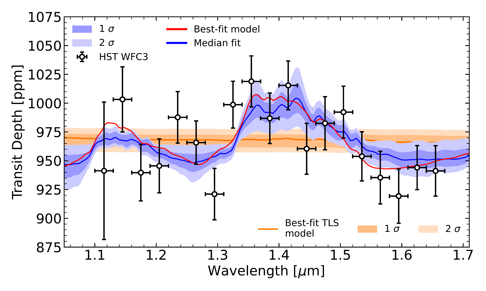
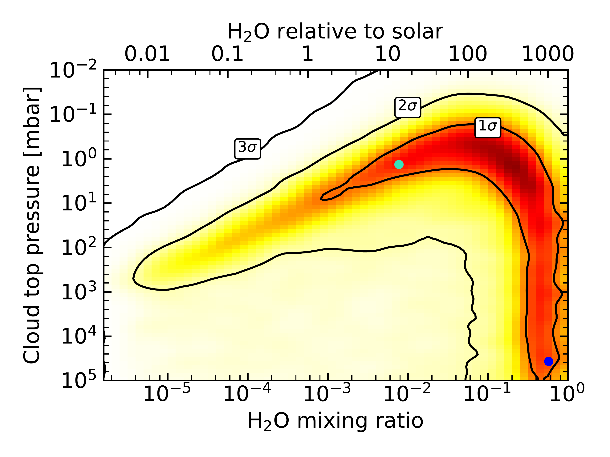
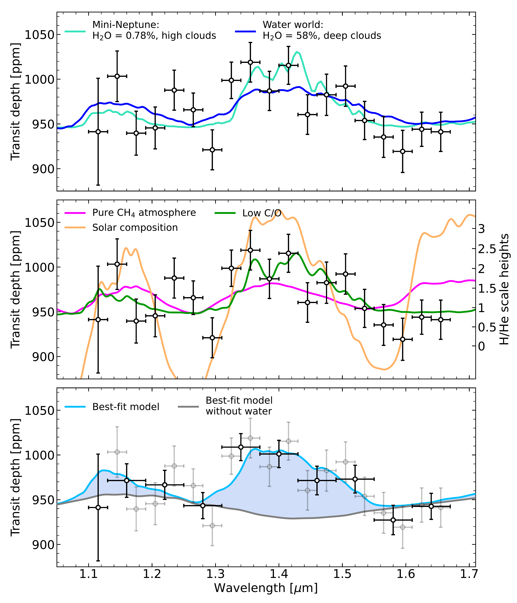

$\newcommand{\ensuremath}{}$
$\newcommand{\xspace}{}$
$\newcommand{\object}[1]{\texttt{#1}}$
$\newcommand{\farcs}{{.}''}$
$\newcommand{\farcm}{{.}'}$
$\newcommand{\arcsec}{''}$
$\newcommand{\arcmin}{'}$
$\newcommand{\ion}[2]{#1#2}$
$\newcommand{\textsc}[1]{\textrm{#1}}$
$\newcommand{\hl}[1]{\textrm{#1}}$
$\newcommand{\footnote}[1]{}$
$\newcommand{\vdag}{(v)^\dagger}$
$\newcommand$
$\newcommand$

# $\large{Water absorption in the transmission spectrum of the water-world candidate GJ 9827 d}$

<mark>Appeared on: 2023-09-21</mark> -  _Published in ApJL, 11 pages, 6 figures_

P.-A. Roy, et al. -- incl., <mark>L. Kreidberg</mark>, <mark>T. Mikal-Evans</mark>

**Abstract:** Recent work on the characterization of small exoplanets has allowed us to accumulate growing evidence that the sub-Neptunes with radii greater than $\sim2.5 R_\oplus$ often host $H_2$ /He-dominated atmospheres both from measurements of their low bulk densities and direct detections of their low mean-molecular-mass atmospheres.However, the smaller sub-Neptunes in the 1.5-2.2 R $_\oplus$ size regime are much less understood, and often have bulk densities that can be explained either by the $H_2$ /He-rich scenario, or by a volatile-dominated composition known as the "water world" scenario.Here, we report the detection of water vapor in the transmission spectrum of the $1.96\pm0.08$ R $_\oplus$ sub-Neptune GJ 9827 d obtained with the Hubble Space Telescope.We observed 11 HST/WFC3 transits of GJ 9827 d and find an absorption feature at 1.4 $\mu$ m in its transit spectrum, which is best explained (at 3.39 $\sigma$ ) by the presence of water in GJ 9827 d's atmosphere. We further show that this feature cannot be caused by unnoculted star spots during the transits by combining an analysis of the K2 photometry and transit light-source effect retrievals. We reveal that the water absorption feature can be similarly well explained by a small amount of water vapor in a cloudy $H_2$ /He atmosphere, or by a water vapor envelope on GJ 9827 d.Given that recent studies have inferred an important mass-loss rate ( $>0.5 $ M $_\oplus$ /Gyr) for GJ 9827 d making it unlikely to retain a H-dominated envelope, our findings highlight GJ 9827 d as a promising water world candidate that could host a volatile-dominated atmosphere. This water detection also makes GJ 9827 d the smallest exoplanet with an atmospheric molecular detection to date.

**Figure 4. -** Water detection in the transmission spectrum of GJ 9827 d. **Left:** Transmission spectrum of GJ 9827 d (black points) shown with our model transmission spectra constraints from the nested sampling atmosphere retrieval (blue) and from the photometry-informed "transit light-source effect" retrieval (orange). The dark blue and light blue shaded regions show the 1$\sigma$ and 2$\sigma$ Bayesian credible intervals  from the atmosphere retrieval respectively. The atmospheric median transmission model is shown in blue and the best-fitting model is shown in red. The best-fitting TLS model is shown in orange along with the 1$\sigma$ and 2$\sigma$ Bayesian credible intervals in light orange. **Right:** Joint constraints on the cloud-top pressure versus the water mixing ratio derived from our Scarlet well-mixed retrieval. The colored shading describes the normalized probability density as a function of the water mixing ratio (assuming uniform vertical profiles) of the atmosphere, and of the cloud-top pressure. The black contours highlight the 1, 2 and 3$\sigma$ Bayesian credible regions. The water abundance relative to a solar composition atmosphere is shown on the top axis. The posterior probability distribution allows for multiple atmospheric scenarios ranging from $H_2$/He envelopes with small amounts of water to water-dominated envelopes. The blue points identify two representative samples of these two scenarios which are displayed in Figure \ref{fig:spectrum_forward}. (*fig:spectrum_retrieval*)

**Figure 2. -** All 10 HST/WFC3 broadband light-curve fits of the transits of GJ 9827 d. **Left:** Systematics-corrected and normalized broadband light curves for the 10 transits of GJ 9827 d (data points). Each visit is centered around the fitted transit time for that visit. The best-fitting transit model is also shown as the grey line. **Right:** Residuals of the broadband light-curve fits shown on the left. (*fig:wlc*)

**Figure 6. -** HST/WFC3 transmission spectrum of GJ 9827 d (data points) along with SCARLET forward atmosphere models (colored lines). **Top:** Two samples from our well-mixed retrieval analysis (Figure \ref{fig:spectrum_retrieval}) are shown, representing the mini-Neptune scenario with a cloudy $H_2$/He atmosphere composed of $\sim$1\% water (pale blue) and a water world scenario with a water-rich atmosphere (dark blue). **Middle:** A secondary atmosphere model for a pure methane envelope is also shown (red) in order to highlight the methane absorption features. Chemically consistent models (still assuming a uniform temperature profile) are shown for a cloud-free, solar composition case (solar metallicity, solar C/O; orange) and for a cloudy case with C/O=0.1  and a 100 $\times$ solar metallicity (green). The observed spectrum is inconsistent with cloud-free low-metallicity scenarios and prefers water absorption features to methane absorption features, mainly around 1.2 and 1.65 $\mu$m. The strength of the features in the spectrum is also displayed in units of H/He scale heights (right axis). **Bottom:** The best-fit model from the retrieval analysis is shown (pale blue), along with the transmission spectrum of the same model once the water opacity is turned off (grey). The contribution of water opacity to the spectral signatures is highlighted in blue. We also present a binned version of the transmission spectrum where points are binned together by pair with the exception of the blue-most channel. (*fig:spectrum_forward*)

