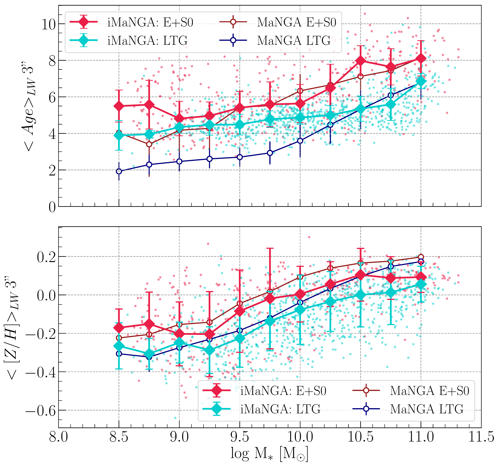
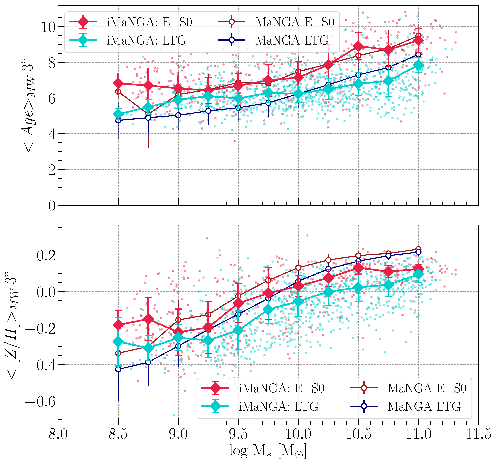

$\newcommand{\ensuremath}{}$
$\newcommand{\xspace}{}$
$\newcommand{\object}[1]{\texttt{#1}}$
$\newcommand{\farcs}{{.}''}$
$\newcommand{\farcm}{{.}'}$
$\newcommand{\arcsec}{''}$
$\newcommand{\arcmin}{'}$
$\newcommand{\ion}[2]{#1#2}$
$\newcommand{\textsc}[1]{\textrm{#1}}$
$\newcommand{\hl}[1]{\textrm{#1}}$
$\newcommand{\footnote}[1]{}$
$\newcommand{\thebibliography}{\DeclareRobustCommand{\VAN}[3]{##3}\VANthebibliography}$

# iMaNGA: mock MaNGA galaxies based on IllustrisTNG and MaStar SSPs. - III. Stellar metallicity drivers in MaNGA and TNG50

<mark>Appeared on: 2023-09-26</mark> - 

L. Nanni, et al. -- incl., <mark>J. Neumann</mark>

**Abstract:** The iMaNGA project uses a forward-modelling approach to compare the predictions of cosmological simulations with observations from SDSS-IV/MaNGA. We investigate the dependency of age and metallicity radial gradients on galaxy morphology, stellar mass, stellar surface mass density ( $\Sigma_*$ ), and environment. The key of our analysis is that observational biases affecting the interpretation of MaNGA data are emulated in the theoretical iMaNGA sample. The simulations reproduce the observed global stellar population scaling relations with positive correlations between galaxy mass and age/metallicity quite well and also produce younger stellar populations in late-type in agreement with observations. We do find interesting discrepancies, though, that can inform the physics and further development of the simulations. Ages of spiral galaxies and low-mass ellipticals are overestimated by about 2-4 Gyr. Radial metallicity gradients are steeper in iMaNGA than in MaNGA, a discrepancy most prominent in spiral and lenticular galaxies. Also, the observed steepening of metallicity gradients with increasing galaxy mass is not well matched by the simulations. We find that the theoretical radial profiles of surface mass density $\Sigma_*$ are steeper than in observations except for the most massive galaxies. In both MaNGA and iMaNGA [ Z/H ] correlates with $\Sigma_*$ , however, the simulations systematically predict lower [ Z/H ] by almost a factor of 2 at any $\Sigma_*$ . Most interestingly, for galaxies with stellar mass $\log M_*\leq 10.80 M_\odot$ the MaNGA data reveal a $* positive correlation*$ between galaxy radius and [ Z/H ] at fixed $\Sigma_*$ , which is not recovered in iMaNGA. Finally, the dependence on environmental density is negligible in both the theoretical iMaNGA and the observed MaNGA data.

**Figure 9. -** Radial metallicity profiles, dividing the iMaNGA and MaNGA sample in stellar mass (columns) and morphology (rows) bins; see Table \ref{tab:mass}. [Z/H] is recovered with FIREFLY for both samples in the same manner. In each panel, we show the median [Z/H] in 0.1 R$_{\rm eff}$ width bins for iMaNGA (pink diamonds) and MaNGA (orange circles), considering all spaxels up to 2.5 $R_{\rm eff}$. The error bars represent the standard error on the median, see Eq. \ref{eq:standarderroronthemedian}. Linear regressions are presented up to 2.5 R$_{\rm reff}$, computed on data up to 1.5 R$_{\rm reff}$(solid violet line for iMaNGA, orange dashed lines for MaNGA).  Gradients are reported in the top-left corner of each panel for both catalogues. In the background of each panel, we show the distribution of the galaxies in the iMaNGA sample, calculated with a Gaussian kernel density estimator. (*fig:zr*)

**Figure 8. -** The global stellar mass-age (top panels) and -metallicity relation (bottom panels) separated by morphology, for the MaNGA and iMaNGA samples. The left panels show light-weighted quantities, and the right panels show mass-weighted ones. Age and metallicity are averaged within a central area of 3$"$ diameter. The scatter points display each galaxy in the iMaNGA sample and the line plot shows the median age and metallicity across mass bins of 0.25 dex width, for the iMaNGA (solid diamonds) and MaNGA (empty circles) galaxies. The E+S0 galaxies are represented in red, while the LTGs are represented in blue. The error bars illustrate the standard deviation. (*fig:MZR*)

**Figure 11. -** $\Sigma_*$-radius trends in the MaNGA and iMaNGA sample, in the morphology-stellar mass plane (see Table \ref{tab:mass}). $\Sigma_*$ is computed from the stellar mass recovered with FIREFLY and considering the inclination from the T-morphology for both samples, using the FIREFLY VAC dataset (see N22VAC) for the MaNGA galaxies. In each panel, we show the median  $\Sigma_*$  in 0.1 R$_{\rm eff}$ width bins, for iMaNGA (pink diamonds) and MaNGA (orange circles) galaxies, up to 2.5 $R_{\rm eff}$. The error bars represent the standard error on the median, see Eq. \ref{eq:standarderroronthemedian}. The linear regressions to the data up to 1.5 R$_{\rm reff}$ are presented (solid violet line for iMaNGA, orange dotted lines for MaNGA). The gradients are reported on the top left corner of each panel for both iMaNGA and the MaNGA galaxies. In the background of each panel, we show the distribution of the galaxies in the iMaNGA sample, calculated with a Gaussian kernel density estimator. (*fig:sbr*)

