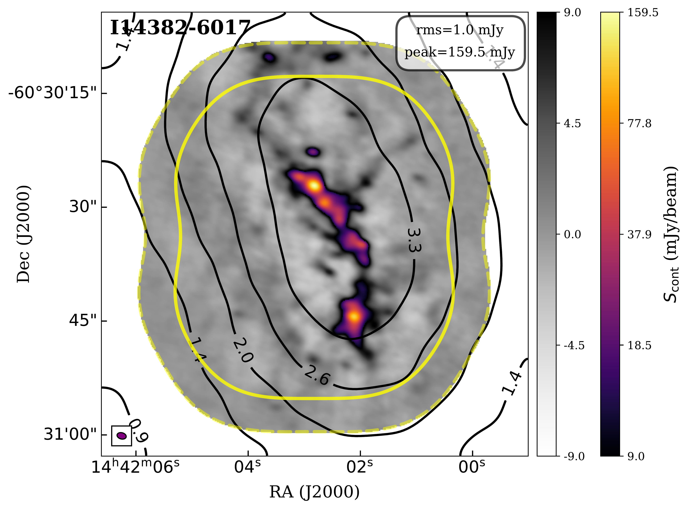
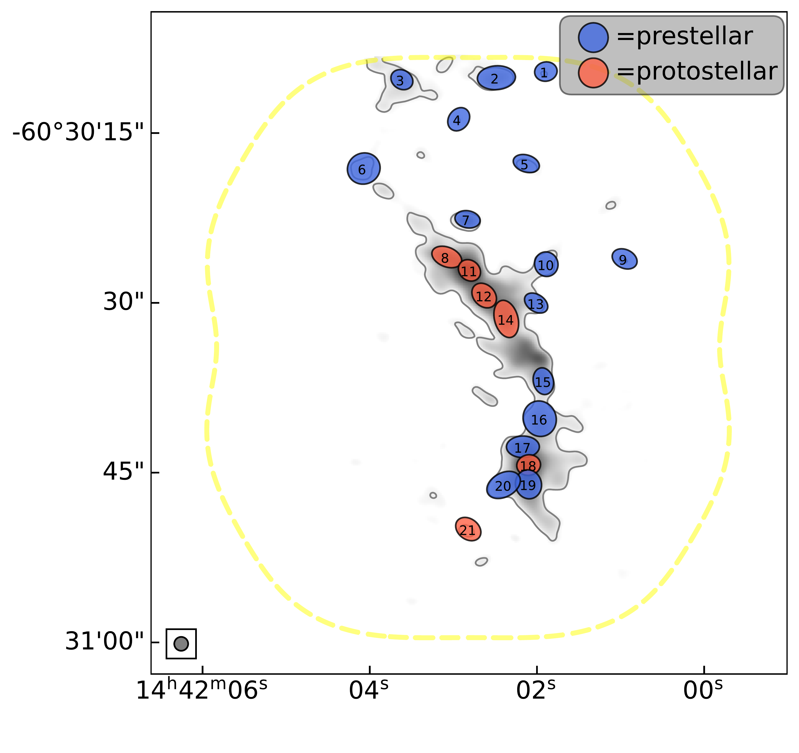
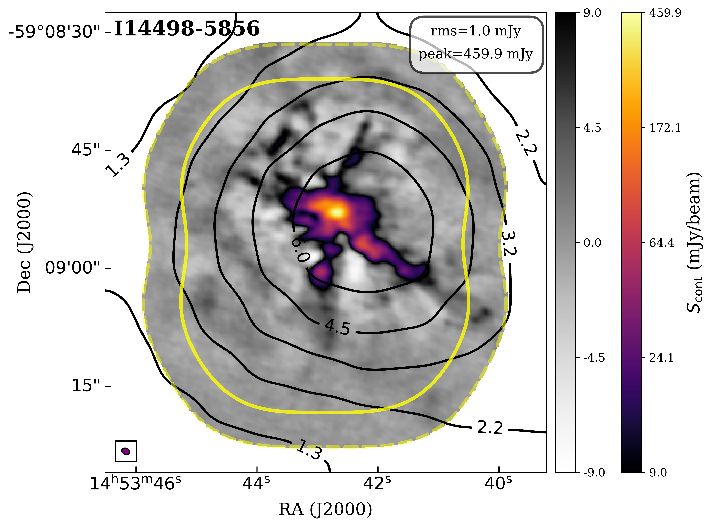
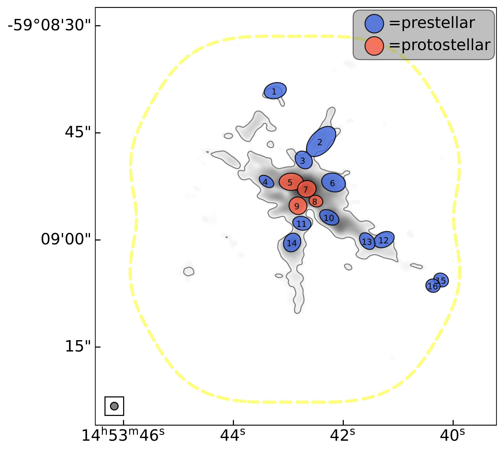

, and the ASHES Pilot  ([Sanhueza, Contreras and Wu 2019]())  samples are presented in blue, green, and gray colors, respectively. The mean spatial resolution of both the ASSEMBLE and the ASHES surveys are $\sim0.02$ pc, shown with orange shadow. Lower: the 1000 Monte Carlo runs of the probability density distribution of core separation for the ASSEMBLE (blue lines) and the ASHES (gray lines), respectively, considering the Gaussian-like uncertainty of clump distance. The Mann-Whitney U test is performed on each of the sets of core separation distributions, and the distribution of the p-value is shown in the top right. The p-values are much lower than 0.01, showing that two samples share a significantly different distribution of core separation.  (*fig:separation*)

**Figure 7. -** The ALMA 870 $\mu$m dust continuum emission without primary beam correction as well as extracted cores for two ASSEMBLE clumps (I14382-6017 and I14498-5856). The ALMA mosaicked primary beam responses of 0.5 and 0.2 are outlined by yellow solid and dashed lines respectively. Only the primary beam response of 0.2 is shown on the right panel. The beam size of each continuum image is shown in the bottom left corner. _Left_: the background color map shows the ALMA 870 $\mu$m emission with two colorbars, the first one (grayscale) showing -9 to +9 times the rms noise on a linear scale, then a second one (color-scheme) showing the range +9 times the rms noise to the peak value of the image in an arcsinh stretch. The rms noise and peak intensity are given on the top right. The black contours are from the ATLASGAL 870 $\mu$m continuum emission, with power-law levels that start at $5\sigma$ and end at $I_\mathrm{peak}$, increasing in steps following the power law $f(n)=3\times n^p + 2$ where $n=1,2,3,...N$ and $p$ is determined from $D=3\times N^p+2$($D=I_\mathrm{peak}/\sigma$: the dynamic range; $N=8$: the number of contour levels). The values of each contour level are labeled with a unit of $\jybeam$. _Right_: the background gray-scale map shows the arcsinh-stretch part in the left panel, outlined by the $5\sigma$ contour. The ALMA continuum emission map is smoothed to a circular beam with a size equal to the major axis of the original beam. The cores extracted by $\getsf$ algorithm are presented by red / blue ellipses, as well as black IDs, with numbers in order from North to South. The red and blue ones represent protostellar and prestellar cores defined in Section \ref{result:coreclass}.  (*fig:continuum*)

